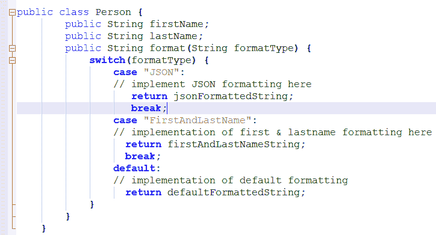
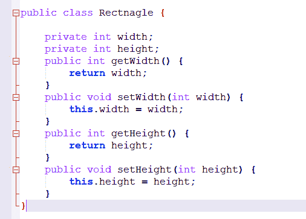
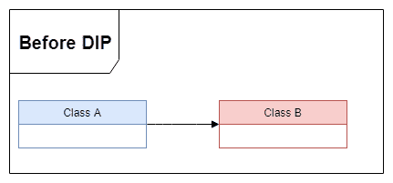
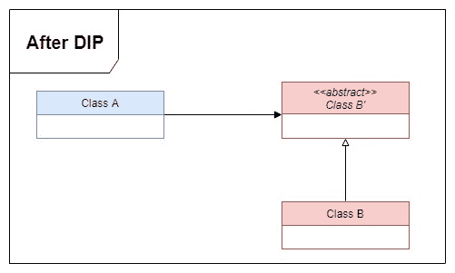
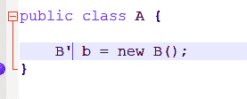

# 固体原理对低耦合高内聚模式的贡献

> 原文：<https://blog.devgenius.io/contribution-of-solid-principle-to-low-coupling-and-high-cohesion-pattern-973c33574572?source=collection_archive---------1----------------------->

在本阅读材料中，我们将探讨 S.O.L.I.D 原则，并给出每个原则的具体示例，以及它们与实现高内聚低耦合设计的关系。

# 简史和简介

坚实的原则是可以采纳的，但它们只是一套指导方针；这意味着达成坚实的原则并不能保证你有一个无 bug 且有魅力的工作软件，因为原则不是事实也不是规则，事实上它们是对常见问题和困难的常见实践和解决方案。

低耦合高内聚最早是在 1960 年作为结构化编程而非面向对象编程的设计指南被推荐和引入的；当时，它们被认为是交付有效的可维护软件的构建模块，应用它们的目的是在某个时间点实现可扩展性。这些原则已经证明了它们可以应用于任何技术和编程范例，比如面向对象编程(OOP)和面向方面编程(AOP)。

SOLID 是由罗伯特·马丁定义的一组指导方针，他就是众所周知的鲍勃大叔。一般而言，SOLID 应用于软件工程中，以确保多组件系统中的关注点分离(SoC ),这反过来意味着系统组件之间存在低耦合高内聚准则。基本上，使用它们的目的是确保以下几点，

1.  减少维护工作量。
2.  将变更的复杂性和成本降至最低。
3.  增强可用性和可扩展性。
4.  提高应用程序的可测试性和代码可读性。

## 那么什么是内聚和耦合呢？

**耦合度**可以被定义为一个类与其他类的链接/依赖程度的度量。鉴于，**内聚力**是对组成系统的元素与其提供的服务以及彼此之间的关联程度的度量。本文的其余部分将简要说明我们如何通过 SOLID 实现高内聚低耦合设计

## 单一责任原则

这也可以称为 SRP，它仅仅意味着修改一个类的原因不应该超过一个，也就是说，每个类最多应该有一个职责。因此，在任何情况下，如果你有几个理由更新一个类，那么这个类应该被分成几个类，每个类负责一个功能。此外，整个职责和功能应该封装在该类中。

这可以通过从 person 中取出 format 函数并引入 PersonFormatter 类来解决，该类负责格式化 Person 类型的对象。因此，这两个类现在是**解耦的**，如果其中任何一个类发生任何更新，另一个类都不会受到影响。

## o-开-闭原理

它首先由 Bertrand Meyer 博士在 1988 年定义，并建议软件实体应该被设计成对扩展开放的**；**意味着，一个行为可以被更新或添加新的行为，同时通过继承而不改变实体的代码，**关闭，**意味着**对任何修改关闭**。这样我们就可以保证我们的类可以采取一种新的行为，而不需要做任何改变。这里值得注意的是*装饰器*和*观察者*是可以应用来实现这一原则的两种设计模式。

这一原则背后的动机是，更新类来添加一个新的行为会破坏类的主要职责，所以如果我们通过扩展实体来添加新的更新会比改变实体更好。我们可以通过使用抽象和多态来实现这一点。因此，行为更新可以通过引入新的具体类或重写方法来完成。这将增强我们软件实体的可重用性和可扩展性。

通过遵循 OCP，模块之间将没有紧密的联系，实体之间的关系和依赖性是最小的，因为我们只扩展了已经创建的模块，因此我们实现了一个**低耦合设计**，其中灵活性和可维护性是高的。除此之外，我们保留了 SRP，因为添加新的职责将扩展已经存在的行为，因此，将会有更少的代码更改，更少的单元测试中断和回归被避免。

## l-利斯科夫替代原理

这是由 Barabara Liskov 在 1987 年提出的，他指出在 OO 中，我们可以用它们的超类(父类)替换每个子类，而不会破坏应用程序的行为。通过确保派生类在不改变其行为的情况下扩展基类，该准则被认为是对 OCP 的补充。

这种情况的一个例子是**矩形**类，

接下来，我们要定义**正方形**，它也是一个有四个直角但四条边相等的形状。显然，**正方形**是一个**矩形**，所以我们可以简单地将矩形作为超类，将正方形作为子类，并编写以下代码行

现在假设我们的应用程序中有一个单元测试，它已经被定义为通过检查图形的宽度和高度来检查矩形形状，并确保它们不相等。问题是，如果我们把上面定义的正方形换掉，会不会失效？答案是肯定的，因为正方形的宽度和高度是相等的，因此这种层次/继承打破了 LSP 规则。

LSP 也可以简单地用下面的话来解释，一个开发者应该能够用它的超类替换任何对象，而不破坏他的应用程序的正确性。因此，LSP 允许我们使用扩展超类的任何实例，而不需要知道被替换对象的行为以及它如何提供服务，从而有助于**松散耦合**。

## I——界面分离原则

这表明客户端不应该依赖于它从来没有使用过的接口，也就是说永远不要实现你不使用的接口。这是通过尽可能地保持系统实体的焦点并最小化它们之间的依赖性来实施**低耦合高内聚**设计，对吧！

违规的一个例子是**工人**接口，它有 **takeBreak()** 方法，如果实现该接口的对象是 **PartTimer 呢？然后我们被迫实现一个那些对象从未使用过的接口。**

设计者可以通过将 fat 接口分解成最小的聚焦**内聚**接口来实现 ISP，其中每个接口都旨在实现单一责任，从而也实现 SRP 指南。如果一个类实现了几个接口是可以的，但是设计者必须注意不要在这里破坏 SRP。在这里实施 ISP 和 SRP 将允许您的团队很容易地预测变化，并且可以将您的应用程序变成可维护的应用程序。

## d-依赖倒置原理

DIP 有两个主要原则，

1.  高级实体不应该依赖于低级实体，事实上它们都应该依赖于抽象
2.  抽象不应该依赖于细节，而细节应该依赖于抽象。

查看上面的陈述，我们可以发现 DIP 建议**将高层组件从低层组件中分离出来，并在它们之间插入一个抽象层。此外，它建议反转依赖关系；抽象类不应该基于细节来写，但是细节应该基于抽象来写。**

因此，如果 A 类依赖于 B，如下图所示，DPI 建议如下:

1.  引入一个名为 B '的抽象(超类)
2.  建立依赖于抽象的类 A(类 B’)
3.  引入一个扩展类 B '的类 B，并使类 A 引用它，如下图所示

一般来说，在编程和开发中，每当一个模块需要一些其他的依赖关系/实体时，该模块就创建对该依赖关系的直接引用。因此，这两个实体现在高度耦合。使用 DIP，我们可以通过让依赖模块为我们提供一个钩子来打破这种联系，然后管理依赖关系的外部组件会将所需的依赖关系引用注入到依赖模块中。因此，DIP 只需通过外部模块按需改变依赖关系，即可提供**低耦合**。这里值得注意的是，*工厂方法*和*抽象工厂*都与专门的框架一起使用——称为像 Spring 这样的控制器容器的反转——来帮助传递 DI 原则。

# 结论

综上所述，我们可以得出结论，关键是要避免**耦合**。如果我们通过打破紧密耦合来开始修复设计，我们将隐式地把我们的代码变成更好的、可维护的和健壮的代码。遵循 5 个坚实的原则是第一步，努力坚持这些原则会让我们的目标变得容易实现。

坚实并不是软件工程中唯一要遵循的原则，有许多有用且易于采用的指导原则，我们所需要做的就是**在匆忙编码之前开始思考设计。**