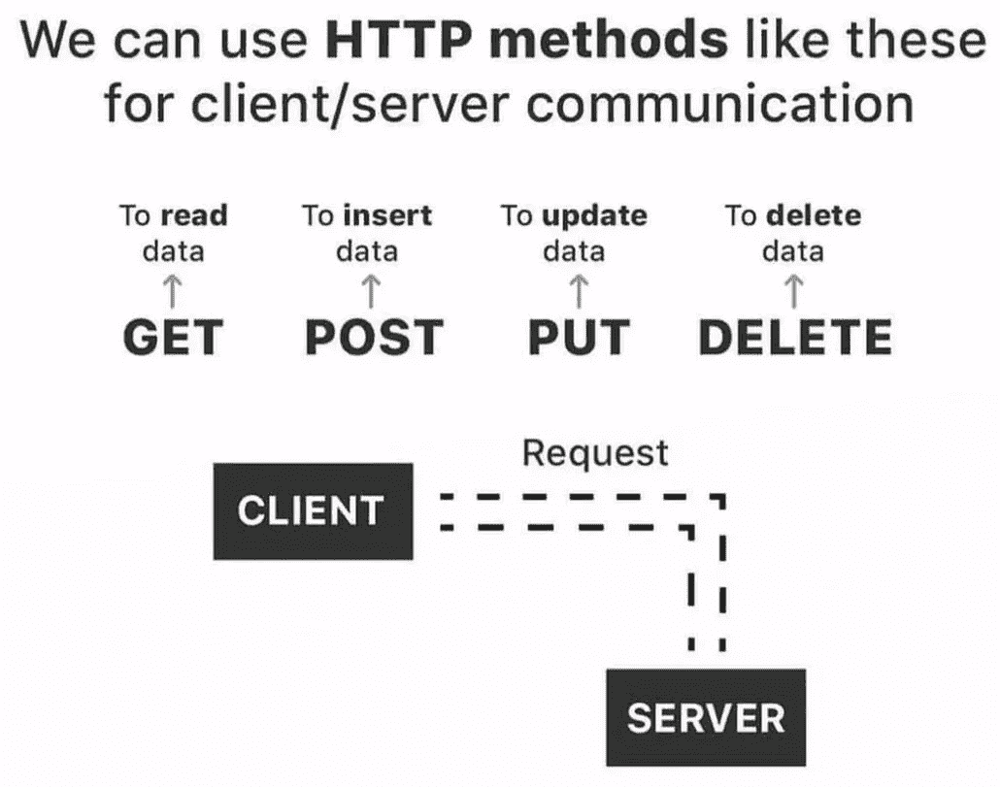

# Spring boot 中的控制器注释

> 原文：<https://blog.devgenius.io/controller-annotation-in-spring-boot-b0ad1b81270?source=collection_archive---------2----------------------->


# 介绍

要使用 spring boot 框架，你需要使用一些注释，而这个注释就是 Spring boot 的强大之处。

本文是关于 spring boot 框架的系列文章的一部分。

在这一系列中，我将解释许多 spring-boot 注释和使用 spring boot 的技术，在这一系列之后，您将了解与 spring boot 相关的其他技术，如进行配置等。

我们去看看 spring boot 中的请求注释。

# 请求注释

要从客户端向服务器端发送请求，您需要一个 URL 路径和方法来处理这个请求。spring boot 提供了许多注释来处理它。

我们需要创建我们的方法，但所有这些方法都在同一个类中，这个类被称为**控制器**，如果你知道 **MVC** 架构，你一定知道控制器在 **MVC 中意味着什么，**如果你不知道什么 **MVC** 架构，我向你发誓，当完成这个系列时，你也会知道 **MVC** 架构。

现在我将通过 **Java Intellij idea** 创建一个类，这个类叫做`**Foo**`。

```
public class Foo{

}
```

上面的类是一个简单的 Java 类**，它没有任何方法，在本文的最后，这个类将处理多种类型的 HTTP 请求**。

要将这个类从简单的 java 类转换成控制器类，我们需要使用 **@RestController** 注释。

**@RestController** :

`**@RestController**`是控制器的专用版本。它包括@Controller 和`**@ResponseBody**`注释，因此简化了控制器的实现:

`**@RestController**`将处理 API，但是控制器将作为前端处理视图。

主要区别在那里，`**@RestController**`不需要用`**@ResponseBody**`，而`**@Controller**`会用`**@ResponseBody**`。

要在`**Foo**`类中应用这个注释，我们只需要把它放在类定义之上，就像下面的代码。

```
@RestController
public class Foo{

}
```

有时我们需要为这个控制器上的所有请求定义一个主路径。我们可以在这里使用一个名为`**@RequestMapping**`的新注释来完成这项工作。

# @RequestMapping

当您想要定义到达特定**控制器**的所有请求的主路径时，使用`**@RequestMapping**`。 **@RequestMapping** 将一个参数作为字符串，如下例所示。该参数是到达该控制器的任何请求的报头。

```
@RequestMapping("main-path")
```

要在`**Foo**`类控制器中应用 **@RequestMapping** 注释，只需将 **@RequestMapping** 放下 **@Controller** 或 **@RestController** ，如以下代码片段所示。

```
@RestController
@RequestMapping("main-path")
public class Foo{

}
```

我们有许多类型的 HTTP 请求，在本文中，我将解释流行的四种类型的 HTTP 请求。



*   **得到**
*   **帖子**
*   **放**
*   **删除**

更多细节请看 https://developer.mozilla.org/en-US/docs/Web/HTTP/Methods 的链接。

我现在将从 GET 请求开始。

# 春季启动中的 HTTP 请求

*   **获取请求**

当你想在不改变数据的情况下从应用程序中获取数据时，你可以使用 Get request，要在 Spring boot 中使用 Get Request，你必须使用`**@GetRrequest**`作为注释。

`**@GetRequest**`取零或一个参数，是怎么回事？

我们可以用不同的方式编写 Get 请求，请看下面的代码片段。

```
@GetMapping // first way
@GetMapping("your-path")// second way 
@GetMapping("your-path/second-way") // third way
​
```

好，现在我们如何在任何方法中应用`**@GetRequest**`。

```
@RestController
@RequestMapping("main-path")
public class Foo{
    public String getData(){
        return "get data";
    }
}
```

实际上，上面的方法是一个控制器，但不处理任何请求，为什么？？

因为`getData()`方法是一个简单的 java 方法，返回一个字符串值，是一个正确的方法，但是不处理请求，因为我们没有定义任何注释来处理请求。

请看下面的代码片段，看看我们如何激活这个方法来处理请求。

```
@RestController
@RequestMapping("main-path")
public class Foo{
    @GetMapping
    public String getData(){
        return "get data";
    }
}
```

这个方法现在可以处理任何请求，但是我们如何访问它。

我们可以使用任何客户端应用程序来测试 API，如 **Postman** 、 **Curl terminal**

在本文中，我将使用 Curl 终端浏览器。

当通过该命令发送请求时，`**curl http://localhost:8080/main-path**`将看到带有值`get data`的响应。

get request 在开发人员社区中的普遍使用，对于数据库，如果您想要选择表并返回值，或者选择特定表中的特定列并返回值，您可以使用 get request 来完成任务。

使用`**@PathVariable:**`

`**@PathVariable**`可以启用从一个 URL 路径变量从客户端取一个数据到服务器端。

实际上，我们可以在任何 HTTP 请求中使用这个注释，来过滤关于特定需求或其他内容数据。

我们如何使用它？看看下面的代码片段，再看看名为`getDataByPathVariable`的方法，你会发现不同之处，以及我们如何使用`**@PathVariable**`注释。

```
@RestController
@RequestMapping("main-path")
public class Foo{
    @GetMapping
    public String getData(){
        return "get data";
    }
    @GetMapping("getbyPathVariable/{var}")
    public getDataByPathVariable(@PathVariable Long var){
        return "get data by var ".concat(var.toString);
    }
}
```

从上面的片段代码可以看到，我用了`**@GetMapping**`并传递了参数，这个参数有变量路径`**{var}**`。

URL 路径中的`**{var}**`实际上有一个来自客户端的值，这个值将传递给`getDataByPathVariable`中的参数，以便可以在服务器端使用。

现在我们如何从客户端访问这个方法呢？如果使用下面的命令来发送请求，来自最后一个请求的响应将不得不`get data by var 15`。

`**`curl** [**http://localhost:8080/main-path/getbyPathVariable/15**](http://localhost:8080/main-path/getbyPathVariable/15)`

*   **发布请求**

实际上，如果我们需要插入数据，比如在数据库中添加一个新条目，我们可以使用 Post 请求。spring-boot 为处理 **POST 请求**提供了一个注释，就像 **GET 请求**一样，很容易使用。

在下一段代码中，我将编写一个处理 **POST 请求**的方法。但是我们有了一个新的注释，它将与 **POST 请求** `**@RequestBody**`一起使用。

要将数据插入数据库，我们需要将数据放入数据库，使用`**@RequestBody**`将数据作为 **JSON** 从客户端传递到服务器端。

```
@RestController
@RequestMapping("main-path")
public class Foo{
    @PostMapping
    public String saveData(@RequestBody String value){
      return "value"; 
    }
}
```

在上面的代码片段中，我们有一个名为`**saveData**`的方法，这个方法将从客户端向服务器端发送 Post 请求。

`**saveData**`有一个参数有一个`**@RequestBody**`从客户端获取数据并对其进行处理。

当从终端执行以下命令时，您可以看到 post 请求的响应，就像 body 请求一样。

`**`curl -X POST http://localhost:8080/main-path -H "Content-Type: text/html;" -d "myvalue"**`

*   **上传请求**

PUT 请求类似于 POST 请求，但它是在数据库中存在数据并且我们需要更新它时使用的。

spring-boot 为处理 PUT 请求提供了一个注释，和上面的请求一样，它很容易使用。

像 **POST 请求**一样，有时我们需要从客户端向服务器端发送数据，在这种情况下，我们需要使用`**@RequestBody**`。

看看下面的代码，它代表了 Spring Boot 的 PUT 请求。

```
@RestController
@RequestMapping("main-path")
public class Foo{
    @PutMapping
    public String updateData(@RequsetParam Integer distance,@RequestBody String value){
        if(distance<10) {
            return "the data is updated new value is".concate(value);
        }
        else {
            return "cannot update value";
        }
    }
}
```

代码是一个类似的`**saveData**`方法，但是我们在这里做了一些改变。

我将请求注释从`**@PostMapping**`改为`**@PutMapping**`，因为这个方法只支持 **PUT 请求**。

另外，我更改了方法名。

我添加了一个新的注释叫做`**@RequsetParam**`

什么是`**@RequsetParam**`标注？

Spring-boot 提供了通过 URL 路径发送值的注释。

当从您的终端执行以下命令时，您可以根据发送的参数看到对 **PUT 请求**的响应。

`**curl -X PUT http://localhost:8080/main-path?value=9 -H "Content-Type: text/html;" -d "myvalue"**`

*   **删除请求**

如果我们需要从数据库中删除一些东西，我们需要使用**删除请求**。这是**删除请求**的常见用法。

每个项目都需要删除数据，基于此每个 spring-boot 项目都会使用**删除请求**。

以下代码表示 Spring-boot 中的**删除请求**。

```
@RestController
@RequestMapping("main-path")
public class Foo{
    @DeleteMapping(/{id})
    public String deleteData(@PathVariable Long id){
      return "the data deleted"; 
    }
}
```

从上面的代码中，你可以看到我们如何在 spring boot 中使用**删除请求**，我们使用`**@PathVariable**`删除特定的数据。

*   **全码**:

```
@RestController
@RequestMapping("main-path")
public class Foo{

    @GetMapping
    public String getData(){
        return "get data";
    }
    @GetMapping("getbyPathVariable/{var}")
    public getDataByPathVariable(@PathVariable Long var){
        return "get data by var ".concat(var.toString);
    }

    @PostMapping
    public String saveData(@RequestBody String value){
      return "value"; 
    }

    @PutMapping
    public String updateData(@RequsetParam Integer distance,@RequestBody String value){
        if(distance<10) {
            return "the data is updated new value is".concate(value);
        }
        else {
            return "cannot update value";
        }
    }

    @DeleteMapping(/{id})
    public String deleteData(@PathVariable Long id){
      return "the data deleted"; 
    }
}
```

# 结论:

每个后端开发人员都会在 spring-boot 中使用 Rest API，这篇文章解释了 RestController 和其他要在其中使用的注释，对于制作 web 应用程序，您需要使用 Rest API，因为在每个平台上运行，如移动或 web 前端，没有任何问题。我想现在我完成了从休息控制器作为基础知识。但是我将在下一篇文章中解释状态代码，因为知道它以及哪个好的状态将随您的响应返回是非常重要的。

> ***别忘了，多读读 RestController，因为我涵盖了关于它的基础知识。***
> 
> ***别忘了在文章上拍手，每篇文章上可以拍手 50 次。***

# 参考:

[https://www . bael dung . com/spring-controller-vs-rest controller](https://www.baeldung.com/spring-controller-vs-restcontroller)