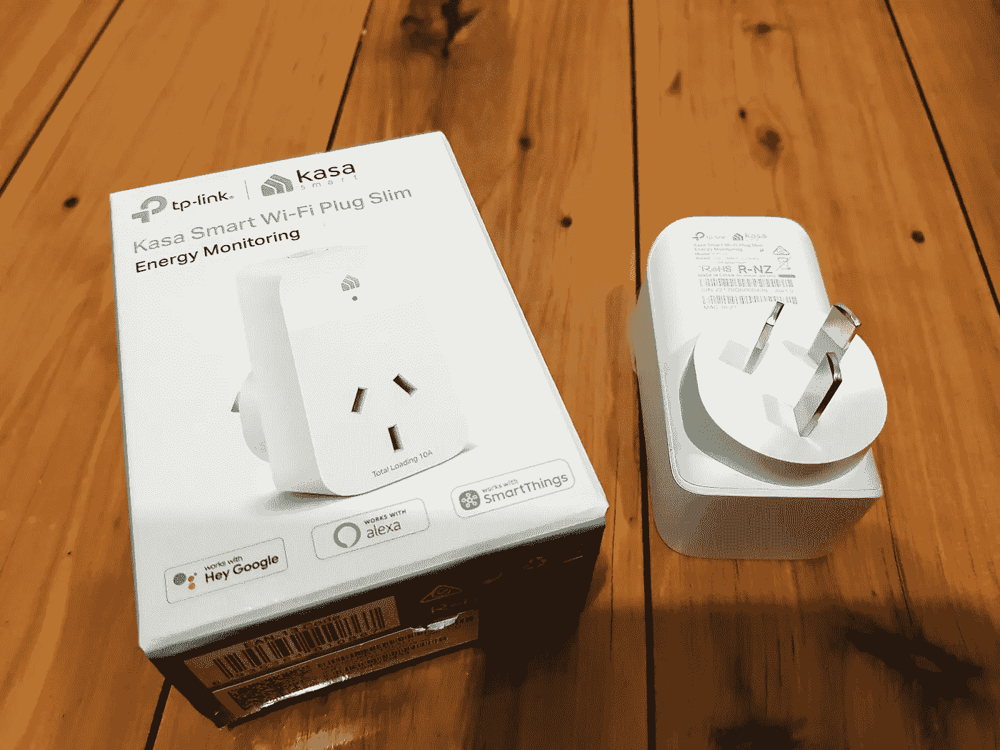
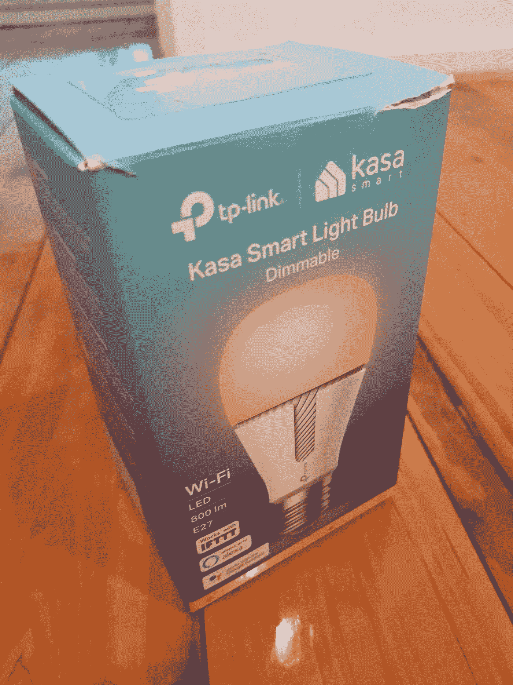

# 用 Python 控制家居灯和电器

> 原文：<https://blog.devgenius.io/controlling-home-lights-and-appliances-with-python-c411eb019724?source=collection_archive---------2----------------------->

你们大多数人听说过或使用过谷歌助手或亚马逊 Alexa 提供的家庭自动化。用手机或语音命令控制设备非常方便。作为一名软件开发人员，我想从自己的应用程序中使用 API 来控制灯光和电器。

TpLink Kasa Wifi 插头和灯泡可让您以最少的投资实现这一目标，并且易于安装。我将使用以下两种设备:

[带电源监控的 Kasa WiFi 插头 KP115】在 Bunnings、JB HiFi 等店售价 29 澳元](https://www.bunnings.com.au/tp-link-kasa-kp115-smart-plug-with-energy-monitoring_p0247164)



Kasa KP115 WiFi 插头

KL110B 智能灯泡(在“好人”以 14 澳元的价格出售)



Tp-Link Kasa WiFi 智能灯泡(KL110B)

与其他设备相比，这些设备不需要单独的集线器设备，并使用 2.4GHz 频段直接连接到您的 WiFi 路由器。

为了控制和获取设备状态，我将使用 [python-kasa](https://github.com/python-kasa/python-kasa) 库。可以使用 pip 进行安装:

```
pip install python-kasa
```

首先，我们需要找出存在哪些设备。要显示本地网络上的所有 Kasa 设备及其 IP 地址，请使用:

```
from kasa import Discover, SmartBulb, SmartPlugdevices = await Discover.discover()
for addr, dev in devices.items():
   await dev.update()
   print(f”{addr} >> {dev}”)**192.168.1.21 >> <DeviceType.Plug model KP115(AU) at 192.168.1.21 (Aquarium), is_on: False - dev specific: {'LED state': True, 'On since': None}>
192.168.1.23 >> <DeviceType.Bulb model KL110B(UN) at 192.168.1.23 (Standup light), is_on: False - dev specific: {'Brightness': 100, 'Is dimmable': True}>
...**
```

在 IP 地址 192.168.1.21 上，我有 KP115 插头。它可以打开和关闭。除此之外，该型号还具有能源监控功能，因此您可以监控设备每天或每月的耗电量。

让我们通过使用 IP 地址作为构造函数参数来连接到 plug:

```
plug = SmartPlug(“192.168.1.21”)
```

要获取设备名称和交换机状态:

```
# check if plug is on
await plug.update()
print(f”Alias: {plug.alias}”)
print(f”is_on: {plug.is_on}”)**Alias: Aquarium
is_on: False**
```

要打开它:

```
await plug.turn_on()
```

现在设备已打开，状态已更新:

```
await plug.update()
plug.is_on**True**
```

要获取能源监控和 WiFi 信号数据:

```
print(f”Power {plug.emeter_realtime.power} W”)
print(f”Voltage {plug.emeter_realtime.voltage} V”)
print(f”Current {plug.emeter_realtime.current} A”)
print(f”Power consumed today: {plug.emeter_today} kW”) 
print(f”Power consumed this month: {plug.emeter_this_month} kW”)print(f”Wifi signal strength RSSI: {plug.rssi}”)**Power 23.281 W
Voltage 242.363 V
Current 0.17 A
Power consumed today: 0.058 kW
Power consumed this month: 1.183 kW
Wifi signal strength RSSI: -37**
```

使用 mine 灯泡，除了开关之外，您还可以控制亮度:

```
await bulb.update()
await bulb.set_brightness(50)
await bulb.update()
bulb.brightness**50**
```

其他灯泡型号可以使用 *set_color_temp()* 、 *set_hsv()* 方法改变颜色和温度。

# 这个 API 怎么用？

这取决于你的想象力，但我发现一些有用的东西可能是:

*   当你在耳机上听重金属音乐时，闪烁的灯光让你知道有电话进来
*   在家办公时收到即将召开的在线工作会议通知
*   当你所有的单元测试都通过了，就去煮一杯咖啡
*   找到家中最耗电的设备，并以条形图的形式显示结果
*   使用 RGB 智能灯泡，为你的整个家增添色彩缤纷的闪烁圣诞灯
*   使用 Brain neuro connector API，根据您的心情改变房间灯光😊

# 我为什么喜欢卡萨？

*   易于设置
*   没有用户名和密码，开发者 API 密钥和其他复杂的配置。您所需要的只是与 Kasa 设备在同一个本地网络上。
*   API 调用直接发送到设备，因此响应时间非常快
*   不需要叫电工来安装设备。把它插在插座上就行了
*   插头较窄，因此您可以将两个智能插头并排插入澳大利亚双电源插座

# 澳大利亚市场上的其他品牌智能设备

我在测试和研究澳大利亚的其他智能开关品牌。宜家。

**图雅设备**(如**并网**和**强光**)通过 API 控制相当复杂。你需要在一个网站上注册成为开发者，并获得一个 API 访问密钥。API 本身理解起来也相当复杂。API 命令被发送到区域数据中心(对于澳大利亚，数据中心位于欧洲(！)，不知什么原因)。他们把它和奥地利混淆了吗？也许吧。Python 库 [TinyTuya](https://pypi.org/project/tinytuya/) 可用于控制图雅设备。市场上有很多图雅设备，尤其是在海外，所以我希望他们的 API 更容易使用。

**IKEA tr DFRI**灯泡和无线开关非常好，价格合理，但它们使用 [Zigbee 协议](https://en.wikipedia.org/wiki/Zigbee)，所以你需要购买一个 Zigbee 网关来控制这些设备。