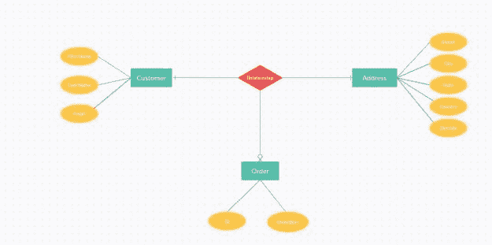
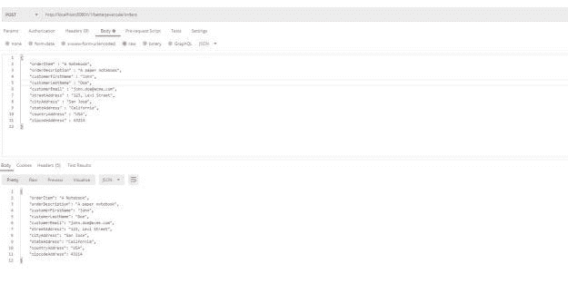

# 使用模型映射器将实体转换为 DTO

> 原文：<https://blog.devgenius.io/conversion-of-entity-to-dto-using-modelmapper-21f2ca8a0ff7?source=collection_archive---------0----------------------->

在这篇文章中，我将展示如何使用模型映射库实现**实体到 DTO 的转换。我们将为`orders`创建一个简单的 REST API，同时展示实体到 DTO 的转换，反之亦然。**

# 理解企业架构

在大多数企业架构中，您将拥有 REST APIs。这些 API 的消费者发送一个请求，服务器用一个响应来响应。请求到响应的转换发生在 API 之后。您执行业务逻辑并修改这些对象。

传统上，该体系结构有三层。Web 层、业务层和数据库层。

因此，数据库层中的对象将与 web 层中的相同对象完全不同。数据库层中的数据库实体包含 web 层中不需要的某些字段。更重要的是，来自 web 层的任何对象都应该是用户友好的。用户不必猜测他们在处理什么。应该是不言自明的。当我展示它的实现时，这一点会更清楚。

# 实体和 DTO 之间的层分离

数据传输对象(DTO)是从一层移动到另一层的对象。这些对象更加用户友好，只包含最需要的字段。

另一方面，数据库实体表示数据库表。许多自动生成的字段可能不需要用户知道。然而，它们是数据库实体的一部分。在 DTO，我们忽略这些领域。由于这些字段是自动生成的，我们的数据库层代码可以处理这些。

但是当对象从 web 层移动到数据库层时，需要对其进行转换，以便该层使用。在下一节中，我将展示如何使用 ModelMapper 库实现从实体到 DTO 的转换。

# 使用模型映射程序将实体映射到 DTO

模型映射器库提供了一种将实体对象转换为 DTO 的简单方法，反之亦然。

在这个演示中，我有一个客户订购商品的场景。创建该项目的订单。我们保存订单详情、客户详情和客户地址。

为了能够在我们的应用程序中使用这个库，添加如下依赖项:

```
implementation 'org.modelmapper:modelmapper:2.3.0'
```

此外，如果我们想要使用模型映射器库函数，我们将添加一个 bean，如下所示:

```
@Bean public ModelMapper modelMapper() 
{ 
  return new ModelMapper(); 
}
```

之前，我说过客户可以订购。因此，我们将通过一个 REST API 来实现这一点，该 API 将创建订单详细信息、客户详细信息。

# 畴层

在这个架构中，我们有客户在特定地址订购的订单。

在数据库实体图中，它将如下所示:



一个客户可以订购多个项目，所以多个订单。多个订单可以发送到一个地址。

我们的域对象将如下所示，从顺序开始:

```
package com.betterjavacode.modelmapperdemo.models;

import javax.persistence.*;
import java.io.Serializable;

@Entity(name = "Order")
@Table(name = "orders")
public class Order implements Serializable
{
    private static final long serialVersionUID = 7385741327704693623L;

    public Order()
    {

    }

    @Id
    @GeneratedValue(strategy = GenerationType.IDENTITY)
    @Column(name = "id", nullable = false)
    private long id;

    @Column(name ="order_item")
    private String orderItem;

    @Column(name = "description")
    private String description;

    @ManyToOne
    @JoinColumn(name = "customer_id")
    private Customer customer;

    @ManyToOne
    @JoinColumn(name = "address_id")
    private Address address;

    // Getters and setters omitted for demo purposes

}
```

地址是:

```
package com.betterjavacode.modelmapperdemo.models;

import javax.persistence.*;
import java.io.Serializable;
import java.util.ArrayList;
import java.util.List;

@Entity(name = "Address")
@Table(name = "address")
public class Address implements Serializable
{
    private static final long serialVersionUID = -439961851267007148L;

    public Address()
    {

    }

    @Id
    @GeneratedValue(strategy = GenerationType.IDENTITY)
    @Column(name = "id", nullable = false)
    private long id;

    @Column
    private String street;

    @Column
    private String city;

    @Column
    private String state;

    @Column
    private String country;

    @Column
    private int zipcode;

    @OneToMany(cascade = CascadeType.ALL, orphanRemoval = true)
    private List orderList = new ArrayList<>();

}
```

客户将:

```
package com.betterjavacode.modelmapperdemo.models;

import javax.persistence.*;
import java.io.Serializable;
import java.util.ArrayList;
import java.util.List;

@Entity(name = "Customer")
@Table(name = "customer")
public class Customer implements Serializable
{
    private static final long serialVersionUID = -2205735699915701334L;

    public Customer()
    {

    }

    @Id
    @GeneratedValue(strategy = GenerationType.IDENTITY)
    @Column(name = "id", nullable = false)
    private long id;

    @Column(name = "first_name")
    private String firstName;

    @Column(name = "last_name")
    private String lastName;

    @Column
    private String email;

    @OneToMany(cascade = CascadeType.ALL, orphanRemoval = true)
    private List orderList = new ArrayList<>();

}
```

这三个对象 order、customer 和 address 代表我们的数据库实体和数据库层的一部分。对于存储库来说，持久性的其余部分很简单。

# Web 层

Web 层主要关注我们为 API 创建的控制器。这些控制器负责接收来自客户端的请求。此外，我们将通过 API 公开的对象将是 DTO 对象。`Order`的 DTO 对象看起来如下:

```
package com.betterjavacode.modelmapperdemo.dtos;

public class OrderDTO
{
    String orderItem;
    String orderDescription;
    String customerFirstName;
    String customerLastName;
    String customerEmail;
    String streetAddress;
    String cityAddress;
    String stateAddress;
    String countryAddress;
    int zipcodeAddress;

   // Getters and Setters omitted for demo

}
```

这个 DTO 对象包括来自订单、客户和地址的字段。我们的 API 将在 POST 请求中接收该对象，我们将使用 ModelMapper 库将该 DTO 对象转换为实体对象，然后将该实体对象传递给我们的`Service`类进行进一步处理。

`OrderController`将如下:

```
package com.betterjavacode.modelmapperdemo.controllers;

import com.betterjavacode.modelmapperdemo.dtos.OrderDTO;
import com.betterjavacode.modelmapperdemo.models.Order;
import com.betterjavacode.modelmapperdemo.service.IOrderService;
import org.modelmapper.ModelMapper;
import org.slf4j.Logger;
import org.slf4j.LoggerFactory;
import org.springframework.beans.factory.annotation.Autowired;
import org.springframework.web.bind.annotation.*;

import java.util.ArrayList;
import java.util.List;

@RestController
@RequestMapping("/v1/betterjavacode/orders")
public class OrderController
{
    private static final Logger LOGGER = LoggerFactory.getLogger(OrderController.class);

    @Autowired
    private IOrderService orderService;

    @Autowired
    private ModelMapper modelMapper;

    @PostMapping
    public OrderDTO createOrder(@RequestBody OrderDTO orderDTO)
    {
        Order order = convertToEntity(orderDTO);
        Order orderCreated = orderService.createOrder(order);

        return convertToDTO(orderCreated);
    }

    @GetMapping("/{customerId}")
    public List getAllOrders(@PathVariable("customerId") long customerId)
    {
        List orderList = orderService.getAllOrdersForCustomer(customerId);
        List orderDTOs = new ArrayList<>();
        for(Order order : orderList)
        {
            orderDTOs.add(convertToDTO(order));
        }
        return orderDTOs;
    }

    private Order convertToEntity (OrderDTO orderDTO)
    {
        LOGGER.info("DTO Object = {} ", orderDTO);

        Order order = modelMapper.map(orderDTO, Order.class);

        return order;
    }

    private OrderDTO convertToDTO (Order order)
    {
        OrderDTO orderDTO = modelMapper.map(order, OrderDTO.class);
        return orderDTO;
    }
}
```

我们有一个 POST API 来创建订单，还有一个 GET API 来为客户检索订单。

# 模型映射器库

在我们的控制器中，我们使用`ModelMapper` bean 将 DTO 对象转换为实体，将实体对象转换为 DTO。

ModelMapper 库实际上是如何实现的呢？

当映射器调用 map 方法时，它会分析源和目标类型，以确定要匹配的属性。它使用匹配的策略和配置来映射这些属性。一旦映射了属性，它将映射数据。

因此，如果我们看看我们的 DTO 类，我们有类似于`customerFirstName`、`customerLastName`的属性匹配到`Customer`实体对象，而类似于`streetAddress`、`cityAddress`的属性将匹配到`Address`对象的属性。

如果您选择这样做，模型映射器还提供了一种显式映射属性的方法。

```
modelMapper.typeMap(Order.class, OrderDTO.class).addMappings(mapper -> { mapper.map(src -> src.getBillingAddress().getStreet(), Destination::setBillingStreet); mapper.map(src -> src.getBillingAddress().getCity(), Destination::setBillingCity); });
```

该库提供三种类型的匹配策略:

1.  **标准** —在该策略中，库智能地将源属性与目标属性进行匹配。该策略是默认配置的。所有目标属性名标记必须匹配。
2.  **松散** —源和目标的属性匹配松散。如果源对象和目标对象的属性层次不相似，那么松散的策略可以起作用。最后一个目标属性名必须匹配所有标记。
3.  **严格** —源属性应该与目标属性严格匹配。令牌以严格的顺序匹配。这一战略不允许有任何含糊之处。

# 使用模型映射程序将实体转换为 DTO 的完整演示

我们已经展示了 REST 控制器和域对象。现在，我将展示我们如何通过传递一个 DTO 对象到 POST API 来使用 postman 调用这个 REST API。

我们将为客户订购的商品创建一个订单。



在请求中，我传递了一个包含订单、客户和地址信息的 DTO 对象。

在我们的服务层，我们处理转换后的实体对象，验证业务规则并保存这些信息以创建订单。

# 避免技术债务

理解 DTO 和实体对象的概念是很重要的。什么时候用什么样的对象可以帮你避免技术债。从个人经验来看，我见过很多初级开发人员犯在 web 层使用实体对象的错误。根据您的应用，这可能会增加系统的复杂性。

# 结论

在这篇文章中，我展示了如何使用 modelmapper 库将实体转换为 DTO。你可以在这里下载模型映射器库。这个演示的代码可以在我的 [GitLab 仓库](https://github.com/yogsma/betterjavacode)中找到。如果你喜欢这篇文章，考虑在这里订阅我的博客。

*原载于 2021 年 4 月 3 日 https://betterjavacode.com**[*。*](https://betterjavacode.com/spring-boot/conversion-of-entity-to-dto-using-modelmapper)*