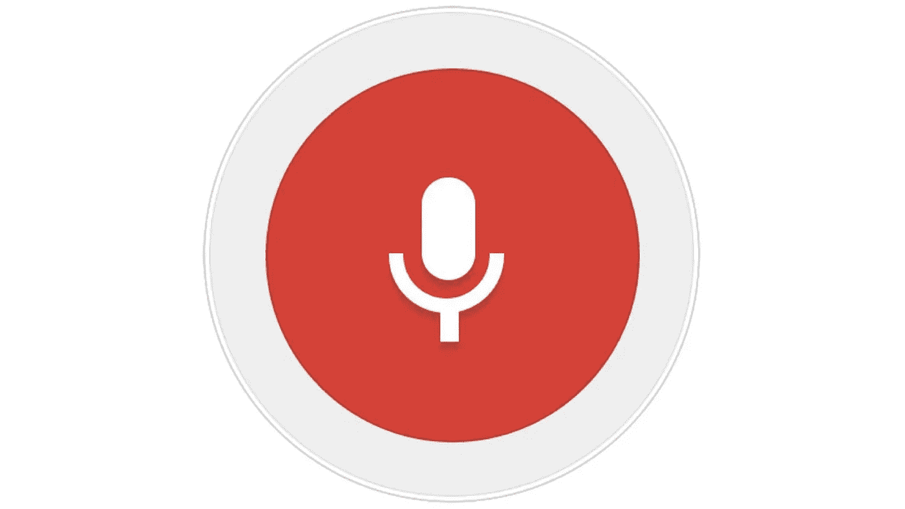

# 使用 Web Speech API 通过 JavaScript 将文本转换为语音

> 原文：<https://blog.devgenius.io/convert-text-to-speech-with-javascript-using-the-web-speech-api-97bc2a9df75d?source=collection_archive---------5----------------------->

## 如何用几行 JavaScript 轻松地将文本转换成语音。



如果您还没有听说过 Web Speech API，现在是了解更多信息并看看您可以用它来做什么的好时机。在本文中，我将向您展示如何开始使用它。

Web Speech API 是一个本地 API，可以用来在应用程序中将文本转换成语音。现在几乎每个主流浏览器都支持该 API，这意味着我们可以开始使用该 API，而不是依赖于 polyfills 和变通方法。

使用 Web Speech API 对于写博客或在 Web 应用程序上发表文章非常有用。一个很好的例子是这个网站，medium.com。每篇文章都由文本组成，这意味着我们实际上可以通过一点 JavaScript 让浏览器为我们大声朗读文本。让我们深入研究一下。

# 使用 JavaScript 进行文本到语音转换

在我们开始之前，我们需要有一个网页。对于这个基本示例，我们将创建一个简单的 HTML 文件:

```
<!DOCTYPE html>
  <html>

  <head>
    <title>Text to Speech</title>
    <meta charset="UTF-8" />
  </head>

  <body>
    <div id="app"></div>

    <script src="**src/index.js**">
    </script>
  </body>
</html>
```

现在在/src 文件夹中创建 Javascript 文件——将文件命名为 **index.js** 。

现在，要在屏幕上显示一些内容，我们将从简单的开始，只需在屏幕上添加一个简单的文本:

```
***document***.getElementById("app").innerHTML = `
  <h1>Check this out!</h1>
  <div>
   This is my text
  </div>
 `;
```

现在，如果您打开 index.html 文件，您应该会看到标题和文本。
到目前为止，一切顺利。现在让我们进入更有趣的部分——我们现在将使用包含一些文本的变量替换硬编码的文本。

```
const text =
  "If you can hear this, you are experiencing text that is spoken by a computer with code. Cool, right?";***document***.getElementById("app").innerHTML = `
  <h1>Check this out!</h1>
  <div>
   **${text}**
  </div>
 `;
```

现在，让我们进一步深入，看看我们如何使用语音 API…

```
const text =
  "If you can hear this, you are experiencing text that is spoken by a computer with code. Cool, right?";

const speakNow = () => {
  // Check if Speech Synthesis supported
  if ("speechSynthesis" in ***window***) {
    const msg = new ***SpeechSynthesisUtterance***();
    msg.text = text;
    ***window***.speechSynthesis.speak(msg);
  } else {
    // Speech Synthesis Not Supported
    alert("Sorry, your browser doesn't support text to speech!");
  }
};

***document***.getElementById("app").innerHTML = `
  <h1>Check this out!</h1>
  <div>
   ${text}
  </div>
 `;

speakNow();
```

如果您运行上面的代码，文本变量现在应该会被大声朗读出来。看，这很简单，对吧？我们甚至可以扩展这个例子来使用不同的声音和语言。

```
const text =
  "If you can hear this, you are experiencing text that is spoken by a computer with code. Cool, right?";**const speech = *window*.speechSynthesis;**

const speakNow = () => {
  // Check if Speech Synthesis is supported
  if ("speechSynthesis" in ***window***) {
    const msg = new ***SpeechSynthesisUtterance***(); **const voices = speech.getVoices();
    msg.voice = voices[1]; 
    msg.lang = 'en-US';** msg.text = text;
    *window*.speechSynthesis.speak(msg);
  } else {
    // Speech Synthesis Not Supported
    alert("Sorry, your browser doesn't support text to speech!");
  }
};

***document***.getElementById("app").innerHTML = `
  <h1>Check this out!</h1>
  <div>
   ${text}
  </div>
 `;

speakNow();
```

用粗体标记的是你可以用来获得不同声音和语言的附加代码。事实上，关于声音，有超过 20 种不同类型的声音和口音可以使用——查看这里的文档:

[](https://developer.mozilla.org/en-US/docs/Web/API/SpeechSynthesisUtterance/voice) [## speechsynthesisatinterance . voice-Web API | MDN

### SpeechSynthesisUtterance 接口的属性获取并设置将用于朗读的声音…

developer.mozilla.org](https://developer.mozilla.org/en-US/docs/Web/API/SpeechSynthesisUtterance/voice) 

除了控制声音和语言，你还可以控制音调、速率和音量。您甚至可以通过实现暂停和恢复等功能来控制语音。在使用 Web Speech API 时，这为您提供了很大的灵活性。

就是这样。在短短几行 JavaScript 代码中，您已经实现了可以在应用程序中使用的这个超级棒的特性。如果你想看它的运行，请查看我的 CodeSandbox:

感谢阅读，我希望你喜欢这篇文章，如果是的话，请点击按钮或订阅来支持我。

*附言:首先，你应该在收件箱里收到我的帖子。* [***做到这里*** *！*](https://nickychristensen.medium.com/subscribe)

*其次，如果你自己喜欢体验媒介，可以考虑通过注册会员* *来支持我和其他成千上万的作家* [***。***](https://nickychristensen.medium.com/membership)****【5】****每月只需花费 5 美元，它极大地支持了我们这些作家，你也有机会用你的写作赚钱。通过这个链接* *报名* [***，你就直接用你的一部分费用支持我，不会多花你多少钱。如果你这样做了，万分感谢。***](https://nickychristensen.medium.com/membership)*

*[](https://javascript.plainenglish.io/how-to-conditionally-add-properties-to-an-object-with-javascript-in-2-minutes-7cce88b316b4) [## 如何在 2 分钟内用 JavaScript 有条件地向对象添加属性

### 您是否曾经遇到过想要有条件地给对象添加属性的情况？有几种方法可以…

javascript.plainenglish.io](https://javascript.plainenglish.io/how-to-conditionally-add-properties-to-an-object-with-javascript-in-2-minutes-7cce88b316b4) [](https://javascript.plainenglish.io/10-tips-for-frontend-developers-9c0dfc705b88) [## 前端开发人员的 10 个有用提示

### 通过这些技巧成为更好的前端开发人员。

javascript.plainenglish.io](https://javascript.plainenglish.io/10-tips-for-frontend-developers-9c0dfc705b88) [](https://javascript.plainenglish.io/how-to-become-a-great-developer-it-requires-more-than-being-able-to-write-code-d1f9e856f2dc) [## 如何成为一名优秀的开发人员——这需要的不仅仅是会写代码

### 成为一名优秀的开发人员不仅仅是写干净、好的代码！

javascript.plainenglish.io](https://javascript.plainenglish.io/how-to-become-a-great-developer-it-requires-more-than-being-able-to-write-code-d1f9e856f2dc) 

*如果你想找个时间和我聊聊，可以关注我的*[*Twitter*](https://twitter.com/nickycdk)*|*[*LinkedIn*](https://www.linkedin.com/in/dknickychristensen/)，*或者直接访问我的* [*网站*](https://nickychristensen.dk/) *。*

*更多内容看* [***说白了就是***](https://plainenglish.io/) *。报名参加我们的* [***免费周报***](http://newsletter.plainenglish.io/) *。关注我们关于*[***Twitter***](https://twitter.com/inPlainEngHQ)*和*[***LinkedIn***](https://www.linkedin.com/company/inplainenglish/)*。加入我们的* [***社区不和谐***](https://discord.gg/GtDtUAvyhW) *。**