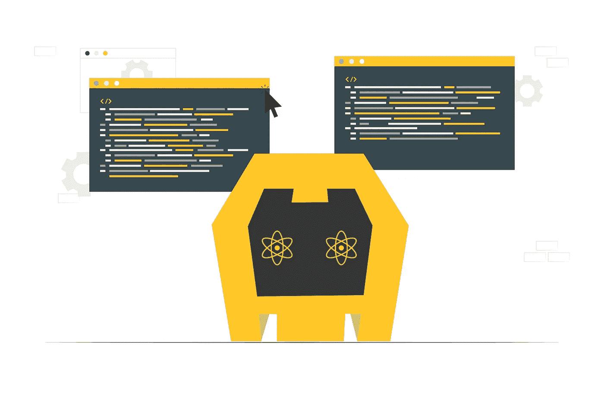
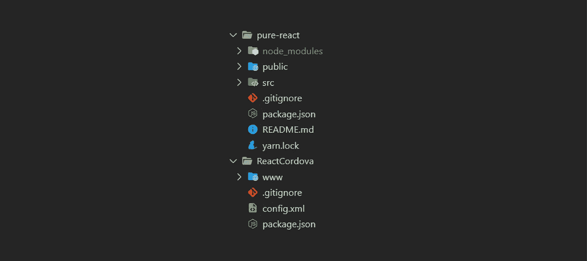
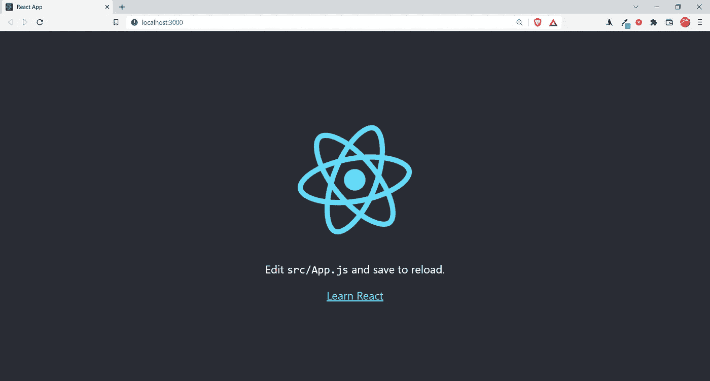
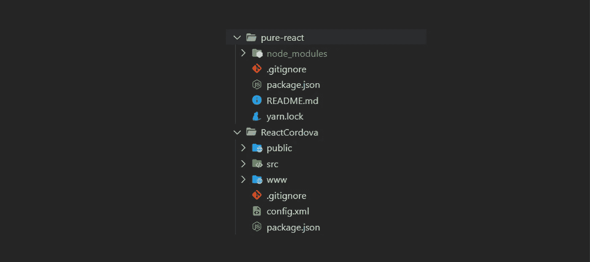
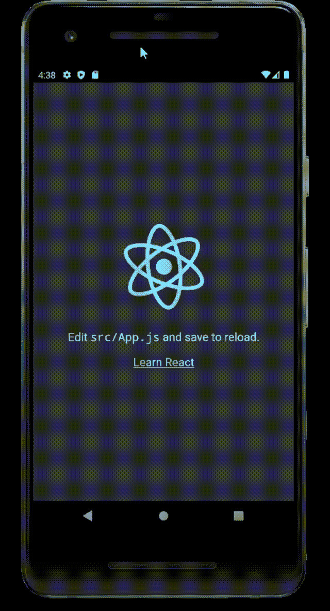

# 使用 Cordova 将 React 应用程序转换为 Andriod/iOS 应用程序

> 原文：<https://blog.devgenius.io/convert-your-react-application-to-an-andriod-ios-app-using-cordova-87646729c2b7?source=collection_archive---------0----------------------->



这里，我不是在谈论 React 原生应用程序。如果你有一个 React web 应用程序，并且你想用最少的努力在 App store 或 Google play store 中列出你的应用程序，那么这个故事就是为你准备的。请记住，react web 应用程序的响应能力非常重要，因此如果 web 应用程序在较小的设备上运行良好，那么将其转换为移动应用程序是有意义的。

虽然将 react 应用程序转换成移动应用程序的过程看起来势不可挡，但是相信我，这是非常简单的。

首先，我们将创建两个不同的应用程序。第一个是 Cordova 应用程序，另一个是 React 应用程序。然后我们将合并这两个应用程序。

Apache Cordova 基本上是 HTML 和 JavaScript 的包装器，允许 web 开发人员为各种平台构建本地应用程序。

我们开始吧。

安装科尔多瓦

```
npm install cordova -g
```

创建 React 应用程序

```
npx create-react-app pure-react
```

或者

```
yarn create react-app pure-react
```

创建 Cordova 应用程序

```
cordova create ReactCordova
```



这应该是一个文件夹中两个项目的结构。

我们现在应该测试 react 应用程序。

```
$ cd pure-react
$ npm start
```

现在如果我们访问 url [http://localhost:3000。](http://localhost:3000.)我们应该看到 react 测试页面。



所有设置完成后，我们将手动合并这两个项目。

首先，我们需要从 **pure-react/package.json** 中复制*脚本*、*依赖关系*和 *browserList、*，并将其粘贴到**react Cordova/package . JSON**中。

结果文件**react Cordova/package . JSON**应该是这样的。

我们应该将 **pure-react/public/** 和 **pure-react/src** 文件夹移动到 **ReactCordova/** 文件夹中。

现在项目结构应该是这样的。



由于我们在**react Cordova/package . JSON**中有了新的依赖项，我们将把它们安装在我们的项目中。

```
$ cd ReactCordova/
$ npm i
```

如果我们再次逃跑

```
$ npm start
```

我们应该看到 react 测试页面，但是这次是从 Cordova 应用程序项目内部。这是因为我们迁移了 Cordova 应用程序文件夹中运行 react 应用程序所需的最少资源。

现在，让我们给<头>内的 **public/index.html** 添加一些 meta 标签。

```
<meta http-equiv="Content-Security-Policy" content="default-src 'self' data: gap: https://ssl.gstatic.com 'unsafe-eval' 'unsafe-inline'; style-src 'self' 'unsafe-inline'; media-src *; img-src 'self' data: content:;"><meta name="format-detection" content="telephone=no"><meta name="msapplication-tap-highlight" content="no"><meta name="viewport" content="initial-scale=1, width=device-width, viewport-fit=cover">
```

然后我们需要在我们的 **public/index.html** 文件中注入 **cordova.js** 脚本。

在 **public/index.html** 中的 *< /body >* 标签前添加以下几行。

```
<script src="cordova.js" type="text/javascript"></script>
```

我们需要确保在文档中加载 Cordova 脚本之后加载 React DOM。所以用下面的方法编辑 **src/index.js** 文件。我们将创建一个函数 *renderReactDom* 并在一个监听器上调用它，即 *deviceready* 被触发。

下一步，我们将改变 JavaScript 和 CSS 文件的绝对路径。为此，您只需要在 **package.json** 中添加下面一行。

```
"homepage": "./"
```

现在，JSX 和 ES6 中的代码库不能直接在 Cordova 应用程序中使用。因此，React 应用程序需要为生产使用而构建和打包，这将由 Cordova 应用程序使用。

我们需要在构建 Cordova 应用程序之前构建 React 应用程序。为此，在标签 *<小部件>* 下的 **config.xml** 文件中添加以下行。

```
<hook type="before_prepare" src="scripts/prebuild.js"/>
```

因为，prebuild.js 是一个自定义脚本，它将执行 React 应用程序的构建。我们需要将这个脚本添加到项目中。创建一个**脚本**文件夹，并添加以下文件。

另外，安装 **prebuild.js** 脚本的依赖项。

```
$ npm i rimraf
```

一切就绪，我们准备在 Android 模拟器中运行 react 应用程序。

在终端中运行以下命令，在 Android 模拟器中启动 Cordova 应用程序。在执行以下命令之前，请确保模拟器已经启动并正在运行。

```
$ cordova platform add android
$ cordova run android
```

就是这样。您现在运行的 React 是由 Cordova 创建的 android 应用程序。



*感谢阅读。*

订阅我的时事通讯，获取我所有的更新。[【https://neelratan-93840.medium.com/subscribe】T21](https://neelratan-93840.medium.com/subscribe)