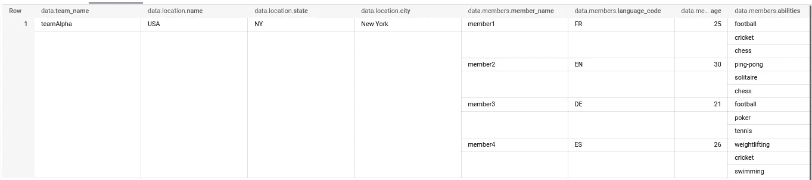
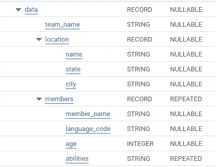

# 将 JSON 转换为 BigQuery 数组和结构

> 原文：<https://blog.devgenius.io/converting-json-to-bigquery-array-and-struct-6e39c220ac06?source=collection_archive---------1----------------------->

2022 年早些时候，BigQuery 引入了对 [JSON 数据类型](https://cloud.google.com/bigquery/docs/reference/standard-sql/json-data)的本地支持。以前，人们必须将 JSON 数据存储在一个字符串列中。鉴于这种格式允许的广泛采用和灵活性，这种新的发展为许多有趣的用例打开了大门。

现在，在选择使用 JSON 数据类型存储数据还是使用 BigQuery 中常见的数组和结构数据类型存储数据时，需要考虑哪些权衡？我最近偶然看到[一篇比较这些方法的博客文章](https://www.letmesqlthatforyou.com/2020/05/json-vs-structs-vs-columns-in-bigquery.html)。

我的观点是，如果您愿意放弃一点 JSON 的灵活性，并且不害怕使用嵌套数据，这可能是一个有趣的选择。在存储和查询成本节约以及轻松访问和浏览存储的数据方面，都有价值可寻。同样，这可能会因用户的使用情形、数据形状和大小而有很大差异。

在这篇短文中，我们将做一个实际的练习，将包含 JSON 的 string / JSON 数据类型转换成经典的 BigQuery 结构:数组和结构。

我们要改变这种情况:

变成这样:



为此，我们需要:

*   使用 JSON_VALUE 和 JSON_EXTRACT 数组提取数据(使用 UNNEST)
*   为每个 JSON 对象创建一个 STRUCT，为每个 JSON 数组创建一个 ARRAY，从外向内进行
*   嵌套数据，模仿源并适当地别名化
*   将属性转换为适当的 BigQuery 数据类型

注意上面的内容，当从另一个数组( ***members*** )内部的结构的属性中提取一个数组成员( ***能力*** )时，我们使用未嵌套的成员作为 JSON_VALUE 函数的输入

```
FROM UNNEST(JSON_EXTRACT_ARRAY(jsondata, "$.members")) AS member
```

```
 FROM UNNEST(JSON_EXTRACT_ARRAY(member, '$.abilities')) AS ability
```

如果我们将结果保存到一个表中，该模式将如下所示:



在适当的条件下——源中没有模式漂移、卷足够大以至于不值得争论、多个嵌套属性和数组、用户经过与嵌套数据交互的培训——这种结构对于存储和查询来说会更有效，同时还允许更好地发现数据。为了理解数据的形状，不需要再研究 JSON 模式，简单地看一下上面的模式就足够了。

感谢阅读！