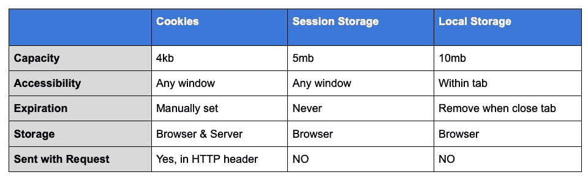
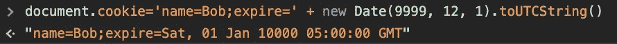
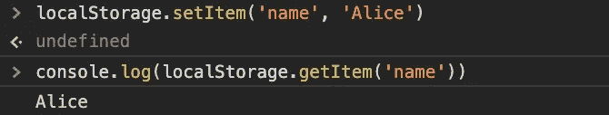
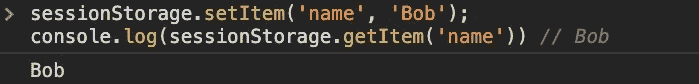
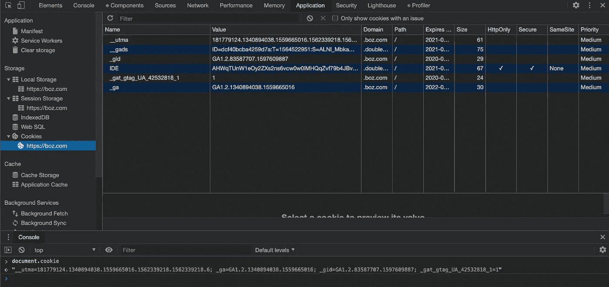

# Cookies 与会话存储和本地存储

> 原文：<https://blog.devgenius.io/cookies-vs-session-storage-vs-local-storage-ae38a4be0e53?source=collection_archive---------14----------------------->

作为一名前端工程师，web 应用存储的机制对我们来说并不陌生，但是在日常操作中，并没有那么频繁的被调用。在本文中，我们将讨论 Cookies、本地存储、会话存储，阐明它们的定义，并探索如何准确地称呼它们。

# 定义

Web 应用存储比较

还有一点要提的是，Cookies 同时支持 **HTML4** 和 **HTML5** ，其他只支持 **HTML5** 。实际上，这并不重要。

# 怎么打电话

## 饼干

Cookies 放在*文档*全局对象中。尽管它将被解析为键值样式的对象，但是没有友好的 API 来作为对象进行读/写。开发人员需要手动编写字符串。

## 会话存储和本地存储

两者都支持简单的读/写接口，但是类似于 JSON，但是键和值都必须是字符串。

局部存储器

会话存储

# 如何调试

最简单的方法是:

1.  打开浏览器(如 Chrome)
2.  打开开发人员控制台
3.  单击“应用程序”选项卡。在右栏中，您将看到浏览器中所有存储信息的结构化视图

在 Chrome 中调试