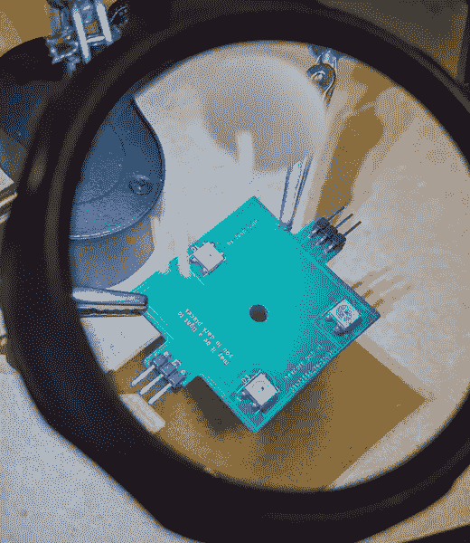
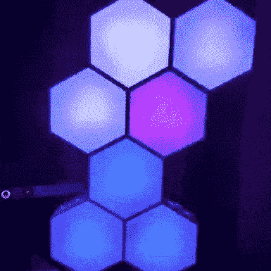

# 协调可寻址 LED 光效

> 原文：<https://blog.devgenius.io/coordinating-addressable-led-light-effects-5a521c6097bd?source=collection_archive---------9----------------------->

具有三个可寻址 LED 灯的电路

本文探讨了如何创建一个系统来设计和应用颜色主题和过渡效果到一大串 WS2812b (NeoPixel)灯。

所涵盖的范围只是如何编排 NeoPixel 风格灯光的一个想法(相对于完整的库)。因此，您将找不到任何完整的源代码来查看。不过，你可以在这里查看我自己的 LED 项目[作为参考。](https://github.com/SharpCoder/hexagon2/)

# 问题是

如果你有一束可寻址的光，比如一串 NeoPixels，挑战总是变成如何让它看起来漂亮。有很多指南介绍了如何制作横跨整条发带的彩虹效果。但是，让我们更进一步，探索可以为我们的灯光秀增加多样性的其他维度。尺寸，例如:

*   颜色主题
*   过渡时间
*   颜色是如何分布在发丝上的

让我们创建一个系统，允许我们用独特的和可执行的颜色方案来定义独特的和令人兴奋的效果。

# 系统概况

在我的主题系统中有两个主要的类:

*   **着色器** —颜色主题，表示为渐变。
*   **效果**——对每个像素如何使用颜色主题的定义。

在这个设计的早期迭代中，我将*效果*和*着色器*作为一个单元。很明显，将两者分开更有意义。灯光如何闪烁和变化真的与底下是什么颜色无关。让它们成为两个独立的实体，你会得到更多的变化。

最终，我们需要一种简单的方法来表达颜色主题，并且——单独地——一种简单的方法来表达主题中的颜色如何随时间变化。让我们更详细地研究这些类。

# 着色器类

Shader 类表示颜色的渐变。通过利用流行的[构建器模式](https://en.wikipedia.org/wiki/Builder_pattern)，我们可以很容易地创建非常复杂和令人回味的颜色系统。这里有一些*伪代码*来演示一个这样的着色器。

关于如何将颜色链接在一起以创建渐变的伪代码。

由此产生的渐变，我称之为**复古未来派**，在实践中非常棒，看起来是这样的:

使用*仅仅*这个渐变的概念，我们可以表达许多不同的主题。例如，在我最近的一个项目中，我用这种方法创造了一些不同的颜色组合，包括:

*   神秘博士
*   R2D2
*   农历新年
*   万圣节前夕
*   口袋妖怪
*   情人节
*   海盗

渐变是一种非常强大的机制，如果你选择正确的颜色，它们可以唤起怀旧和情感。(要查看我的个人着色器的完整列表，请查看此文件)。

# 使用着色器类

一旦我们定义了创建这些渐变的机制，我们需要支持的唯一真正的方法是基于时间从渐变中提取颜色的能力。数学上，这将使用**线性插值**来实现。

简单着色器的接口示例。

通过定义一个`get_color`方法，我们可以在任何特定的时间点从我们的任何渐变中提取任何谨慎的颜色。线性插值的工作原理是采用一个`start`、`end`、`elapsed`和`duration`变量，并返回`start`和`end`之间的一个离散点。插值颜色是什么意思？

让我们探索一个完整的实现来理解如何与多段渐变交互。有些方面没有显示出来，比如链表结构的内部工作方式。但是 r，g，b 数学是重要的部分。

概括地说，内插颜色简单地意味着你取开始的红色值和结束的红色值，并使用内插，在这两点之间选择一个数字。对绿色做同样的操作，对蓝色再做一次。结果呢？一个 RGB 值，表示两点之间的平滑中间色。

现在我们有了返回颜色的机制，是时候考虑如何使用这个颜色了。

# 效果类

让我们考虑一些简单的过渡效应。最基本的实现是让所有可寻址的灯呈现相同的颜色。选择的特定颜色将来自着色器中描述的渐变。随着时间的推移，我们将跨越梯度，并相应地更新我们的颜色。

让我们增加一些变化。如果我们让每个 LED 根据其位置延迟启动会怎么样？

我们随机延迟怎么样？

我们分离出来的这个变量就是**效应**的定义。我们正在扩展时间本身，修改特定节点的偏移，并控制该节点在渐变中移动的速度。实际上，只有一个变量是你绝对需要跟踪的:*起始偏移量*。我说的抵消是什么意思？把它想成是梯度中循环开始的点。

# 初始化序列

每个 LED 将以*上下文*对象的形式维护自身的状态，该对象由一些只读字段和一些读写字段组成。如果你有一串 50 个发光二极管，你将有 50 个上下文对象。每个节点一个。以下是我决定跟踪的每个 LED 的属性示例。

描述有助于跟踪系列中每个 LED 的属性的结构。

**特殊考虑**:对于嵌入式系统来说，这不是很有效。但是有很多方法可以节省空间和压缩它。例如，考虑使用 u64 的单个数组来定义偏移量，然后在循环中为`node_id`和`total_nodes`使用变量。

您可能需要考虑添加许多其他属性。以下是我的一些想法，为我们以后提出的算法增加更多的变化:

*   寄存器—您可以跟踪每个节点的单个变量，以便稍后在效果中使用。
*   环境——也许你想利用环境温度、音量等等。
*   方向——也许这个节点应该反向穿过渐变
*   Max _ Time 也许这个节点应该只穿过渐变的某个百分比

一旦我们有了每个节点的信息容器，就该编写一些初始化序列了。我发现在定义新效果时有用的一般契约是这样的:

单个效果的界面。

每个效果将定义一个初始化方法，该方法接受一个上下文并返回一个填充了所有读写字段的新上下文。在我的例子中，只有 1 个读写字段: **offset。如果你喜欢，可能会有更多。下面是我写的一些真实世界的例子:**

我在自己的项目中使用的一系列独特的效果。

我们可以更进一步，再次利用构建器模式。让所有的效果都一样`struct`，至少在 rust 中，会让创建可迭代的效果更容易。

使用生成器模式创建效果的示例。

# 使用效果类

如果你保持事情如上简单，魔术发生一次，当发光二极管被初始化，然后永远休眠。这里有一些伪代码演示了这可能是如何实现的。

如何一起使用效果和着色器的示例。

总结一下这段代码在做什么:我们有效地获取了一个活动的**着色器、**一个活动的**效果、**和一系列**上下文** 对象。对于每个上下文对象，根据效果初始化它。

最后，我们遍历每个上下文对象，使用它的*偏移量*来计算我们在渐变中的位置，并将这个计算传递给着色器上定义的`get_color`方法。

通过这种方式，我们利用由效果建立的*偏移*值，并使用它来增加着色器输入。

# 数学

所有这些概念都可以用 [*线性插值*](https://en.wikipedia.org/wiki/Linear_interpolation) 专门实现。网上有很多介绍如何实现*线性插值*的指南。维基百科有一些很棒的伪代码来帮助传达这个想法。下面是我的方法，写在 **rust** 里。

一个无符号整数插值的简单实现，用 rust 写的。

# 示范

这在实践中是什么样子的？看，我的六边形墙项目的一部分。这是利用*分组*效果。

我的可寻址 LED 照明项目的一部分。

# 结论

总结:我们已经建立了一些关于如何创建一个通用系统来定义颜色主题和驱动它们的效果的主要概念。通过利用这种技术，你只需要几个不同的效果和几个着色器来创建丰富多彩的效果，这肯定会给旁观者留下深刻印象。