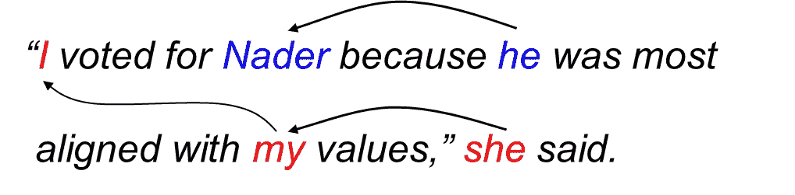
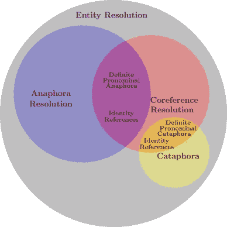

# 共指消解[NLP，Python]

> 原文：<https://blog.devgenius.io/coreference-resolution-nlp-python-584c2ec50f5d?source=collection_archive---------3----------------------->



来源:https://nlp.stanford.edu/projects/coref.shtml

共指消解的任务是找出所有指称的表达，如—(他、我、那个、这个……或任何主语或名词)所指的是哪个实体(指称物，如任何人、事物、主语等)...)

**某些类型的证明人**

*   **回指** — acc。在维基百科中→ **"** *回指是一个表达式的使用，其解释具体取决于另一个(先行)表达式* **"** 或者当所指表达式(回指)指向后 **"** 时，你可以说 **"**

> *例子:- **音乐太吵了，以至于**T21 无法欣赏*****
> 
> ***it** →这里指的是**音乐，**这里的“it”出现在句子中“The music”之后。*

*   ***下指**——据说正好是前指的反义词→***使用一个依赖于后置表达式***的表达式，或者当所指表达式指向前方**时，你可以说*******

> ********例句:**他**到家时，**约翰**就去睡觉了。********
> 
> ********何**是指**约翰，**句中“他”在“约翰”之前。******

******分裂先行词这是一种回指表达，代词(2)指代不止一个先行词(1)。******

************************

******资料来源:ScienceDirect.com******

******我们将关注**共指解析**——它的任务是确定是否有两个或更多的提及*共指(意思是它们是指同一个实体……)*******

******一个共指表达只有在它的解释依赖于文本中的前一个表达(即它的先行词)时才是回指******

> ******命名提及代替代词的例子:-
> 1。**国际商业机器**向亚马逊寻求专利赔偿；IBM 之前曾起诉过其他公司。你可以看到 IBM 指的是国际商用机器公司。这些类型参考也在那里..******
> 
> ********2。巴拉克·奥巴马**前往…**奥巴马**……
> 所以我们可以看到“奥巴马”和“巴拉克·奥巴马”指的是同一个人。******

******因此，共指消解包括两个任务(尽管它们通常是联合执行的):(1)识别提及，以及(2)将它们聚类成共指链/话语实体******

******让我们看另一个例子******

> ******Megabucks Banking 的首席财务官维多利亚·陈(Victoria Chen)在 38 岁成为公司总裁后，薪酬跃升至 230 万美元。众所周知，她是从竞争对手变成百万富翁的******

******让我们把上面的例子组合起来:******

1.  ******维多利亚·陈，她，38 岁，她******
2.  ******银行，公司，巨款******
3.  ******她的工资******
4.  ******Lotsabucks******

******一个在文本中只有一次提及的实体(比如 Lotsabucks 和她的工资)被称为**单身**。******

## ******应用:******

*   ******文本摘要******
*   ******机器翻译******
*   ******信息提取******
*   ******聊天机器人/问答系统******

> ******让我们举一个问答引擎的真实例子:-******

********提供给 QnA 引擎的内容**→
*小约瑟夫·罗比内特·拜登* **。**是美国政治家，美国第 46 任、现任总统。作为民主党成员，他在 2009 年至 2017 年期间担任巴拉克·奥巴马的第 47 任副总统，并在 1973 年至 2009 年期间代表特拉华州参加美国参议院。******

********现在如果我们问问题**→“2009 年至 2017 年谁担任第 47 任副总统？”******

******在 QnA 引擎**中，如果没有参考分辨率**，它会给出→**he**但这不是我们想要的答案，对吗？我们在这里知道“**何**”指的是**约瑟夫·罗比内特·拜登。**我们想要他的名字作为正确答案..？这就是共指消解的用武之地。它让我们知道，他是指约瑟夫罗比内特拜登，以便我们工作的东西，并取代“他”或任何其他提及，在幕后。以便我们得到适当的答案。******

# ******履行******

## ******spaCy-hugging face(neural oref)共指消解******

******NeuralCoref 是 spaCy 2.1+的管道扩展，它使用神经网络标注和解析共指聚类。NeuralCoref 是生产就绪的，集成在 spaCy 的 NLP 管道中，并可扩展到新的训练数据集。******

******除了`coref_clusters`、`coref_resolved`之外，你还可以在 github [这里](https://github.com/huggingface/neuralcoref)查看更多属性。******

*******要训练神经共指模型你可以在这里查看博客* [。](https://medium.com/huggingface/how-to-train-a-neural-coreference-model-neuralcoref-2-7bb30c1abdfe)******

## ******Allennlp 共指消解******

******`pip install allennlp
pip install allennlp-models`******

******如果你注意到上面的输出集群形成的是[0 到 3 和 26 到 26]和[34 到 34 和 56 到 56]这些是给令牌的索引。请看下面，这些是什么******

```
******print(prediction['document'])******
```

******输出:******

```
******[**'Joseph', 'Robinette', 'Biden', 'Jr.'**, 'is', 'an', 'American', 'politician', 'who', 'is', 'the', '46th', 'andcurrent', 'president', 'of', 'the', 'United', 'States', '.', 'A', 'member', 'of', 'the', 'Democratic', 'Party', ',', **'he'**, 'served', 'as', 'the', '47th', 'vice', 'president', 'from', **'2009'**, 'to', '2017', 'under', 'Barack', 'Obama', 'andrepresented', 'Delaware', 'in', 'the', 'United', 'States', 'Senate', 'from', '1973', 'to', **'2009'**, '.']******
```

******如果你注意到代表`Joseph Robinette Biden Jr.` (0，1，2，3)的索引 0–3 和索引 26 ( `‘he’`)这是一个集群。另一个是`2009`本身，所以我们可以忽略它。******

******阅读[博客](https://towardsdatascience.com/how-to-make-an-effective-coreference-resolution-model-55875d2b5f19)关于如何建立有效的共指消解模型。
它还解释了 **Allennlp 似乎比 Huggingface neural corf**找到了更多的聚类，并且 hugging face 在检测下指时存在一些问题，Allennlp 在句子中检测下指，但它在聚类中用它的第一次提及替换，因为它认为第一次提及是它的头。在这篇解释优美的博客[中，玛莎](https://medium.com/@m.maslankowska)解释了如何克服这个问题并做出一些改进。你可以在这里查看博客[](https://towardsdatascience.com/how-to-make-an-effective-coreference-resolution-model-55875d2b5f19)**，在这里查看代码[](https://github.com/NeuroSYS-pl/coreference-resolution/blob/main/improvements_to_allennlp_cr.ipynb)**……这些经过改进的库仍然会给我们很好但并不完美的结果。关于如何制作更好的共指消解模型的研究仍在继续。**********