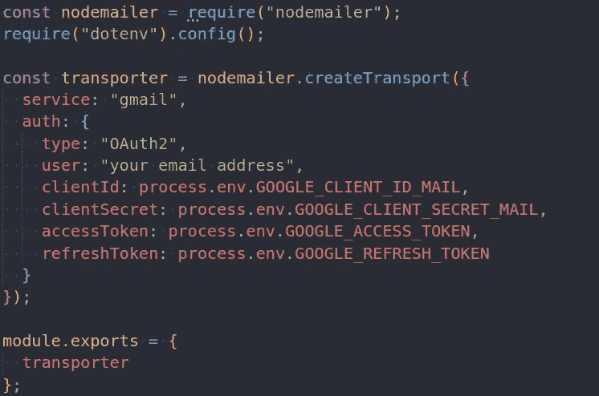
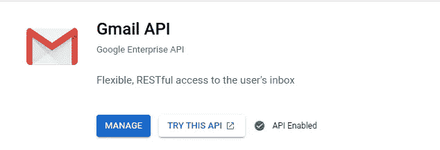
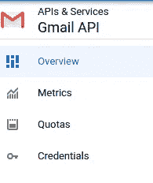
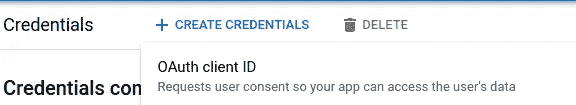
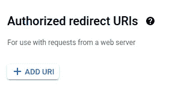
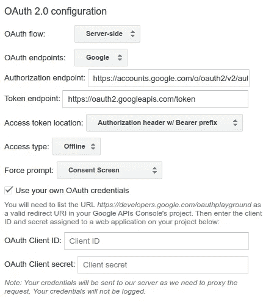
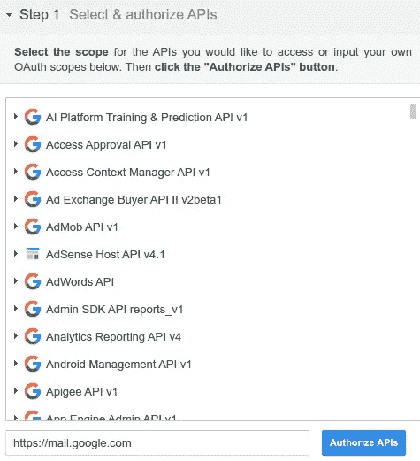
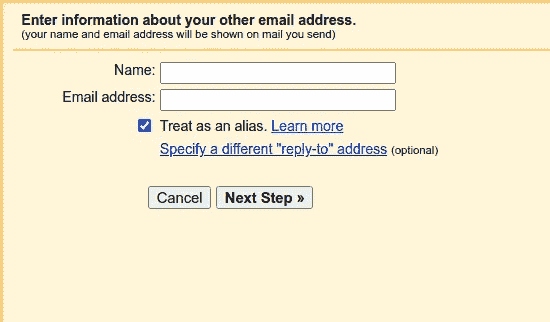
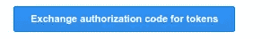

# 为电子邮件服务设置节点邮件程序的终极方法

> 原文：<https://blog.devgenius.io/correct-way-in-setting-up-nodemailer-for-email-service-946f6bfd73e8?source=collection_archive---------9----------------------->

网上有很多关于设置 nodemailer 的教程，但是有些设置只适用于开发环境，而不适用于生产环境。因此，下面是为生产环境设置 nodemailer 的正确方法:

# **为节点邮件程序设置传送器:**

为了使用 nodemailer 发送电子邮件，您必须首先创建一个 transporter，所以在我的例子中，我在一个单独的文件中创建了 transporter 常量，然后每当我想发送电子邮件时就反复使用它。

在 transporter 中有几个重要的东西，用来获取 **clientId** 、 **clientSecret、accessToken、**和 **refreshToken 的凭证。**

# 获取 clientId 和 clientSecret

并且为了获得 **clientId** 和 **clientSecret** ，可以去 Google cloud 控制台。

下面是一个简化版本:

1.  在谷歌云控制台中创建新应用。
2.  将 **Gmail API** 添加到您的应用程序中，然后点击管理

3.之后，点击右侧的“信用”。

4.然后在创建凭据下，单击 OAuth 客户端 Id

5.填写 OAuth 凭证的信息，然后在

点击添加 https://developers.google.com/oauthplayground，然后输入

6.最后会出现一个弹出窗口，显示 **clientId** 和 **clientSecret。**

# 获取秘密令牌和访问令牌

第一次访问，[https://developers.google.com/oauthplayground/](https://developers.google.com/oauthplayground/)

首先点击右上角的设置，

打勾使用您自己的 OAuth 凭证，您将从 google cloud 控制台获得该凭证。

对于步骤 1，您可以键入[https://mail.google.com](https://mail.google.com)并点击授权 API

* **高级概念:**

对于像 noreply@something.com 这样的企业邮箱，如果你有主域名，你可以很容易地设置邮箱子域。但是，如果您正在使用客户的个人电子邮件地址为客户开发电子邮件功能，并且您无权访问他们的电子邮件地址凭据，您可以创建一个备用 Gmail 帐户，专门用于从您的应用程序发送电子邮件，并且您可以使用 Gmail 中的**以**身份发送电子邮件功能。

下面是我的意思的一个简化版本:你使用 A 的电子邮件帐户的目的只是向客户发送电子邮件，这意味着你不会将该电子邮件用于你的业务目的。我们的业务电子邮件是电子邮件 B，但我们在这里想做的是，我们使用电子邮件 A 发送电子邮件，但客户看到的显示电子邮件将来自电子邮件 B。

你可以在 Gmail >账户设置和导入中找到它，然后你会看到发送电子邮件部分。您可以在那里添加备选电子邮件地址。

**如何设置:**

1.  在您单击“发送电子邮件为”部分中的“添加另一个电子邮件地址”后，将会出现一个弹出窗口。

对于名称部分，您可以输入您希望在发送电子邮件时显示的名称，而电子邮件地址部分是您希望客户端看到的另一封电子邮件的电子邮件地址。

2.之后，它将发送一封验证电子邮件到您将显示为的电子邮件，然后您只需输入发送的验证码，该过程就完成了。

3.最后一步是，你可以设置你想要发送的电子邮件为默认。

现在回到如何设置 nodemailer 凭证，在您拥有授权 API 并使用您将使用的 google 帐户登录之后

在第二步中，点击下面的按钮，它将显示传输器的**访问令牌**和**秘密令牌**，记住还要检查自动刷新令牌。

现在，为传输器设置凭证的工作已经完成。

之后，您可以通过导入传输器发送电子邮件，然后使用 send email 功能。请查看关于如何使用 nodemailer 发送电子邮件的文档。

但是整体设置已经完成。请注意，在一些教程视频中，您可能会看到他们使用电子邮件帐户和密码作为 transporter 中的凭据。但是根据我的经验，这在生产模式下是行不通的。所以最好用 accessToken 和 secretToken 代替。

最后，感谢您到目前为止阅读本文，我希望这将有助于您很好地设置 nodemailer。这个设置为我带来了几个 youtube 视频和发现，但上面设置的参考可以在这个 youtube 链接中找到:

我在使用 nodemailer 时遇到的另一个挑战是电子邮件模板的使用。我将在另一篇电子邮件文章中讨论这个问题。但目前就这些了，希望对你的发展之旅有所帮助。