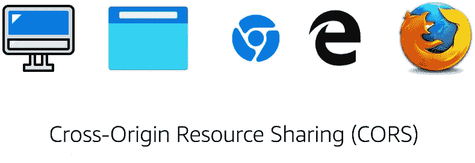
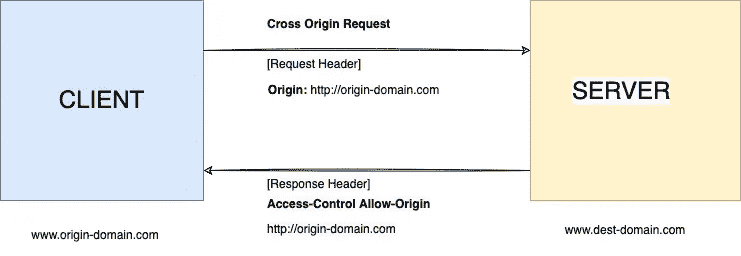
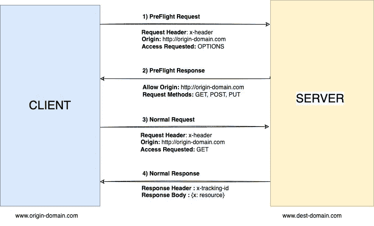

# CORS——101

> 原文：<https://blog.devgenius.io/cors-101-72b462396deb?source=collection_archive---------11----------------------->

这篇博客是我们从零开始讨论 101 个概念的系列文章的一部分，读者的入门知识有限。这篇文章属于 ***中级*** 系列，因为它涉及对 **CORS(跨源资源共享)**的理解——主要由浏览器使用，以允许资产/资源访问某些白名单域，以及来自同一域的调用。生产中不正确的 CORS 配置通常是跨域攻击的潜在目标。

101 系列中的一些早期博客如下:

[**断路器 101**](/circuit-breaker-pattern-101-be2d7fdb656) [**优先级队列 101**](/priority-queues-101-40eb4f6f5ee9)[**API 101**](/api-101-773ec501b485) [**异步通信 101**](/async-communication-101-b04d5c95333a)[**数据库 101**](/database-101-13d593ec4078)

****

# **什么是 CORS？**

**CORS 是一种安全协议，允许来自其他域的异步调用访问受 [**同源策略**](https://developer.mozilla.org/en-US/docs/Web/Security/Same-origin_policy) 限制的资源。用户会话中的 [**浏览器 cookie**](https://en.wikipedia.org/wiki/HTTP_cookie)由敏感的客户信息组成，这些信息可能被用来进行恶意攻击，因此需要一个定义良好的 CORS 策略是 UI 应用程序的一个关键要素。不建议使用允许来自 ***通配符域(*)*** 的呼叫的 CORS 策略，因此过滤和白名单方法始终是处理来自多个域的呼叫的安全方式。**

# **如何确定原产地？**

**Origin 是发出原始请求的 URL，表示服务器或主机名。 ***请求头，URL 路径，查询参数*** 不构成源信息的一部分。可以根据 ***端口号、主机名和 http/https 方案来区分来源。*****

**对于起源，*[***【http://mywebsite.com/path/example.html】***](https://mywebsite.com/path/example.html)，以下分别视为不同的起源***

## *****不同的端口*****

***[http://mywebsite.com:81/path/example.htmlT21](http://mywebsite.com:81/path/example.html)。***

## *****不同的 HTTPS 方案*****

***[*https://mywebsite.com/path/example.html*](https://mywebsite.com/path/example.html)。***

## *****不同的服务器名称*****

***[*https://api。mywebsite.com/path/example.html*](https://api.%20mywebsite.com/path/example.html)。***

# ***CORS 工作流程***

***根据原始请求中的元素，现代浏览器以不同的方式处理 CORS。具有客户报头的请求具有额外的飞行前检查，但是对于简单的请求，来源在单个客户端-服务器交换中被列入白名单。***

## ***简单的请求***

***遵循以下规则的请求被分类为简单请求-***

*   *****GET** ， **POST** 和 **HEAD** 是 **HTTP** 方法。***
*   *****内容类型**是 ***应用程序/x-www-form-urlencoded、多部分/表单-数据、文本/普通*** 中的一种***
*   ***请求中不允许有自定义标头***

******

***在对简单请求的跨源调用的服务器响应中设置了以下标头***

*   ***[**访问-控制-允许-起源**](http://www.w3.org/TR/2012/WD-cors-20120403/#access-control-allow-origin-response-header) (必填)***
*   ***[**访问-控制-允许-凭证**](http://www.w3.org/TR/2012/WD-cors-20120403/#access-control-allow-credentials-response-header) (可选)***
*   ***[**访问-控制-暴露-标题**](http://www.w3.org/TR/2012/WD-cors-20120403/#access-control-expose-headers-response-header) (可选)***

## ***飞行前请求***

***具有比简单请求中预期的更多参数的请求需要以选项调用的形式进行额外的服务器验证。**选项**用于从交叉源获取未来请求所需的所有有效响应头。***

***下图是 ajax 调用发生的整体交换的简化版本***

******

***在服务器对飞行前请求的跨原点调用的响应中设置了以下标题***

*   *****访问控制允许来源**(必填)***
*   *****访问控制允许方法**(必填)***
*   *****Access-Control-Allow-Headers**(如果使用自定义标题，则为必填项)***
*   *****访问控制允许凭证**(可选)***
*   *****访问-控制-暴露-标题**(可选)***
*   *****访问控制最大年龄**(可选)***

# ***CORS 普通支票***

***CORS 实施中的一些边缘情况经常表现为常见的可利用攻击，如下所示***

*   ***来自内部或本地环境的调用使用 **NULL** 作为其原点设置。建议不要将标题**的 **NULL** 列入白名单。*****
*   ***为了处理来自内部网络中多个域的请求，一个**通配符(*)** 经常被替换为服务器的快捷方式。对于生产中的外部域，应该避免这种情况***

# ***摘要***

***我们讨论了**跨来源资源来源的基础知识，**一种可以利用 XSS(跨站点脚本)的常见安全范例， [**十大 OWASP**](https://owasp.org/www-project-top-ten/) 攻击。实施 CORS 检查可以在整个架构的不同层实施，如 **L7 代理层**或者后端服务器可以用于将来自可信来源的流量列入白名单。在本系列未来的高级博客中，我们可以使用一个实际的客户示例来讨论一些服务器端函数/库。***

****如需反馈，请留言至****Amit[dot]894[at]Gmail[dot]com****或联系*[*https://about.me/amit_raj*](https://about.me/amit_raj)*的任何链接。****