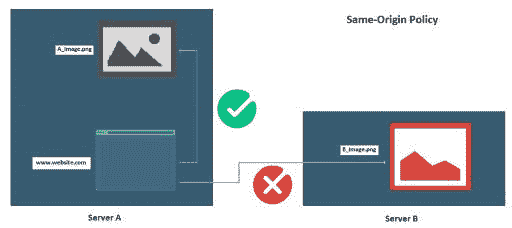
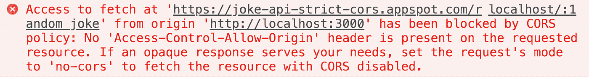

# 克-奥二氏分级量表

> 原文：<https://blog.devgenius.io/cors-34e947046600?source=collection_archive---------4----------------------->

## 它是什么，你需要知道什么



## 重要术语

*来源*由协议、主机和 URL 描述。

相同的起源:

```
http://example.com/app1/index.html
http://example.com/app2/index.html 
```

不同的原产地方案:

```
http://example.com/app1
https://example.com/app2
```

不同的原始主机:

```
http://example.com
http://www.example.com
http://myapp.example.com
```

不同的始发港:

```
http://example.com
http://example.com:8080
```

*CORS*——跨来源资源共享允许共享来自外部来源的数据，如果允许的话。

*SOP* -同源策略只允许来源是相同的方案/协议、主机和端口号的内容共享。

AJAX -异步 JavaScript 和 XML 是发生在客户端的请求，web 应用程序可以在不干扰加载内容或行为的情况下发送和接收数据。

## 什么先出现

在互联网的初期，1995 年采用的第一个协议是网景公司的同源策略。SOP 至今仍被用作一种安全特性，以帮助保护站点免受未经身份验证的会话的攻击。例如，用户登录了他们的银行帐户，离开了页面，但没有注销。该用户访问一个在后台运行 Javascript 代码的恶意网站。使用 SOP，该网站将无法从银行网站上获得任何信息。如果没有使用 SOP，Javascript 代码可以获得用户的银行信息、交易列表，甚至创建新的交易。

当网站开始变大时，SOP 就成了问题。为了帮助 SOP 变得更加动态，比如数据污点、document.domain 属性、JSONP、WebSockets 和其他一些。这是 CORS 到达现场的地方。

## 2004

马特·奥什利、布拉德·波特和迈克尔·博德尔提出了跨产地支持。他们正在开发 VoiceXML，这是一种计算机和人类语音交互媒体和对话。他们需要能够在浏览器之间共享媒体。CORS 的第一份工作草案于 2006 年提交，但最终在 2014 年被推荐。Cors 是 JSONP 的现代替代品。JSONP 只允许 HTTP GET 请求，没有很好地处理错误，并且不太安全。

## 使用 CORS

当用户访问一个网页时，该页面会进行跨原点提取。假设向 API 发出一个获取请求。浏览器将尝试发送一个 GET 请求，该请求带有一个额外的包含为父页面提供服务的域的源 HTTP 头。服务器可能会以两种方式之一做出响应。

1.允许来自原点的请求数据和报头访问控制允许原点请求。这可能是一张百搭牌

```
Access-Control-Allow-Origin: *
```

这实质上使内容完全公开，每个人都可以使用，包括任何站点上服务器站点的代码。这方面的一个例子是谷歌字体。

```
Access-Control-Allow-Origin: http://example.com
```

第二个例子意味着只有这个源的网站可以访问这些数据。使请求数据更加私密。

2.如果页面不允许跨来源请求，或者没有声明 Access-Control-Allow-Origin，将会返回一个 CORS 错误，并带有如下承诺:



## 避开 CORS 错误

解决 CORS 误差有三种不同的方法。

1.  添加 chrome 扩展

最快的解决方法是添加一个名为 [Moesif Origin & CORS 改变者](https://chrome.google.com/webstore/detail/moesif-origin-cors-change/digfbfaphojjndkpccljibejjbppifbc?hl=en-US)的 chrome 扩展。这里的问题是，这只对开发有好处，但只能在你的 chrome 浏览器中工作。如果你正在寻找一个快速的方法来看看你是否能得到数据，这绝对是一个好的选择。虽然从长远来看，你会想寻找一个不同的选择。

2.使用代理

代理是充当浏览器和端点服务器之间网关的服务器。有一个名为 [cors-anywhere](https://github.com/Rob--W/cors-anywhere/#documentation) 的开源代理服务器，它将 cors 报头添加到请求中。它使用起来非常简单，你甚至可以用源代码创建自己的 Heroku 应用程序。你所需要做的就是在你发送请求的 URL 前面加上 https://cors-anywhere.herokuapp.com/的 T4。

```
https://cors-anywhere.herokuapp.com/{add source url here}
```

好的一面是，这适用于应用程序中的开发和生产，不需要做任何更改。一个缺点是 Heroku 应用程序可能会有一点延迟响应。

3.构建您自己的代理

Google 有很好的文档介绍如何将代理脚本添加到多种编码语言中。

# 结论

CORS 错误可能会令人沮丧，但当你理解它们来自哪里，并且它们允许我们作为开发者共享数据和发展互联网时，它们就不会那么令人沮丧了。想象一下，如果我们仍然使用 SOP，并且不得不用我们通常导入的所有代码来构建网站。想象一下互联网会有多慢。我自己知道，了解技术来源的根源有助于我理解它的用处，并对正在发生的事情有所了解。希望 CORS 对你来说更有意义。如果有另一种解决 CORS 问题的方法，我很想听听。感谢阅读！