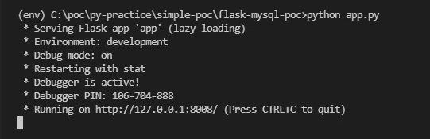
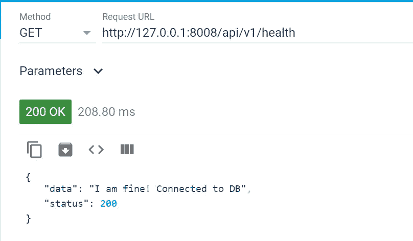
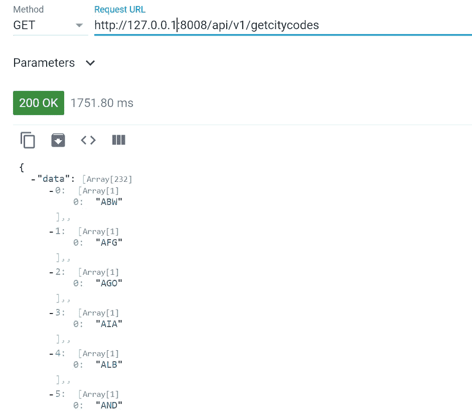
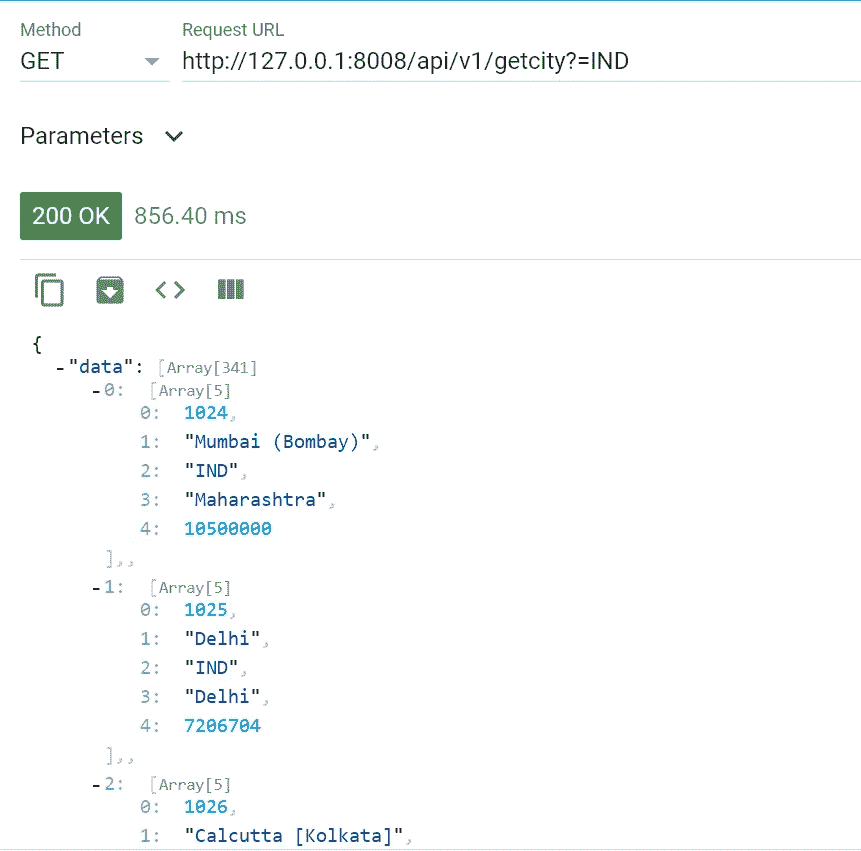
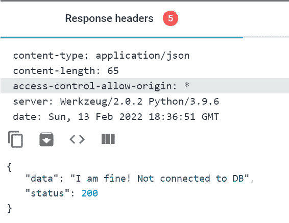
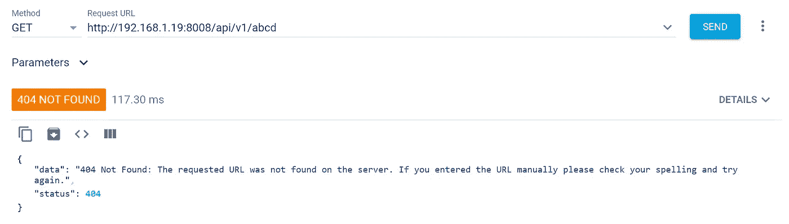
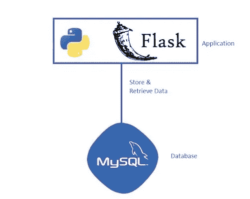

# Flask-MySQL |后端 REST API

> 原文：<https://blog.devgenius.io/cors-a621802feb49?source=collection_archive---------4----------------------->

下面的例子将展示一种连接到 *MySQL* 数据库的简单方法，使用 *Flask* 获取数据。在这个例子中，我们将使用 3.9 版本的 *Python* 。如果您的工作站中尚未安装 *Python* ，请安装它。

# **数据库**

在 *MySQL 数据库*中，我们有一些用于练习目的的默认数据库，其中我们在本例中使用的是*‘world’*数据库。

# 后端

我们将为我们的后端服务使用*Flask*Python*的 web 框架。以下是要遵循的步骤:*

**第一步:**首先创建虚拟环境

使用虚拟环境总是一个好的实践。为我们的后端创建一个项目文件夹(例如: *flask-api-practice* )，并在该文件夹中为我们的项目创建一个 *Python* 的虚拟环境。

> ***注意:*** *如果你没有安装* virtualenv *包，那么你必须先安装那个:*

```
C:\flask-api-practice>pip install virtualenv
```

成功安装[*virtualenv*](https://pypi.org/project/virtualenv/)*包后，我们就要创建我们的虚拟环境了。下面的命令在项目文件夹中创建虚拟环境*‘env’*:*

```
*C:\flask-api-practice>python -m venv env*
```

***第二步:**激活虚拟环境*

```
*C:\flask-api-practice>.\env\Script\activate*
```

***第三步:**安装其他需要的 *Python* 库，如 [*Flask*](https://pypi.org/project/Flask/) ， *PyMySql & Flask-Cors。我们需要*[*PyMySql*](https://pypi.org/project/PyMySQL/)*来连接 MySql 数据库，并且需要*[*Flask-Cors*](https://pypi.org/project/Flask-Cors/1.10.3/)*来处理 API 调用中的 Cors 问题。**

*安装*砂箱*:*

```
*(env) C:\flask-api-practice>pip install Flask*
```

*安装 *PyMySQL* :*

```
*(env) C:\flask-api-practice>pip install pymysql*
```

*安装*砂箱座*:*

```
*(env) C:\flask-api-practice>pip install Flask-Cors*
```

*步骤 4: 现在是创建项目结构的时候了。与 *Flask* 中的 *Django* 不同，实际上没有这种特定的目录结构，但是我们可以根据需要在项目中遵循一些最佳实践。在这里，我们将遵循下面的文件结构，这是一些小项目的好。*

```
*\flask-api-practice\
             ---\env\           *<- Our virtual environment*
             ---\app.py
             ---\config.py
             ---\db.py
             ---\settings.json*
```

*让我们逐个创建这些文件。首先创建一个项目的设置文件。这个文件是一个 *json* 文件，我遵循的是将开发和生产环境的所有公共和数据库配置保存在这个 *json* 文件中，该文件将在运行时加载到我的项目配置中。*

***settings . JSON***

```
*{
    "config": {
        "common": {
            "HOST": "127.0.0.1",
            "PORT": 8008,
            "VERSION": "v1",
            "URL_PREFIX": "api",
            "DEFAULT_DEBUG": true,
            "THREADS_PER_PAGE": 2,
            "CSRF_ENABLED": true,
            "CSRF_SESSION_KEY": ""
        },
        "env": {
            "production": {
                "ENV": "production",
                "DEBUG": false,
                "DEVELOPMENT": false,
                "DATABASE_CONNECTION_OPTIONS": {
                    "DATABASE": "",
                    "DB_HOST": "",
                    "DB_PORT": "",
                    "DB_USER": "",
                    "DB_PASSWD": "",
                    "DB_NAME": "",
                    "CONNECT_TIMEOUT": 5,
                    "SECRET_KEY" : ""
                }
            },
            "development": {
                "ENV": "development",
                "DEBUG": true,
                "DEVELOPMENT": true,
                "DATABASE_CONNECTION_OPTIONS": {
                    "DATABASE": "MySQL",
                    "DB_HOST": "127.0.0.1",
                    "DB_PORT": 3306,
                    "DB_USER": "xxxxxxxxxx",
                    "DB_PASSWD": "xxxxxxxxxx",
                    "DB_NAME": "world",                    
                    "CONNECT_TIMEOUT": 5,
                    "SECRET_KEY" : "abcdefghijklmnopqrstuvwxyz"
                }
            }
        }
    }
}*
```

***第五步:**创建一个 ***config.py*** 文件*

```
*import os
import json

SETTINGS_FILE_NAME = 'settings.json'
CONF_DICT = {}

def load_configuration_from_json(_json_filepath = SETTINGS_FILE_NAME):
    """Load the configuration from the settings.json file"""
    global CONF_DICT
    try:
        with open(_json_filepath) as conf_file:
            CONF_DICT = json.load(conf_file)['config']

    except Exception as e:
        raise Exception(f'Failed to load {_json_filepath} due to: {e}')

class Config(object):
    """Common generic configurations"""
    ## Define the application directory
    BASE_DIR = os.path.abspath(os.path.dirname(__file__))

    ## Load configuration details from settings.json file
    load_configuration_from_json(os.path.join(BASE_DIR, SETTINGS_FILE_NAME))

    ## HOST & PORT
    HOST = CONF_DICT['common']['HOST']
    PORT = CONF_DICT['common']['PORT']

    ## Version
    VERSION = CONF_DICT['common']['VERSION']

    ## URL Prefix
    URL_PREFIX = CONF_DICT['common']['URL_PREFIX']

    ## Statement for enabling the development environment
    DEBUG = CONF_DICT['common']['DEFAULT_DEBUG']

    ## Application threads
    THREADS_PER_PAGE = CONF_DICT['common']['THREADS_PER_PAGE']

    ## Enable protection against *Cross-site Request Forgery (CSRF)*
    CSRF_ENABLED = CONF_DICT['common']['CSRF_ENABLED']
    CSRF_SESSION_KEY = CONF_DICT['common']['CSRF_SESSION_KEY']

class ProductionConfig(Config):
    '''
    Configuration specific to production environment
    '''
    ENV = CONF_DICT['env']['production']['ENV']
    DEBUG = CONF_DICT['env']['production']['DEBUG']
    DEVELOPMENT = CONF_DICT['env']['production']['DEVELOPMENT']
    CONNECT_TIMEOUT = CONF_DICT['env']['development']['DATABASE_CONNECTION_OPTIONS']['CONNECT_TIMEOUT']

class DevelopmentConfig(Config):
    '''
    Configuration specific to development environment
    '''
    ENV = CONF_DICT['env']['development']['ENV']
    DEBUG = CONF_DICT['env']['development']['DEBUG']
    DEVELOPMENT = CONF_DICT['env']['development']['DEVELOPMENT']
    DB_HOST = CONF_DICT['env']['development']['DATABASE_CONNECTION_OPTIONS']['DB_HOST']
    DB_PORT = CONF_DICT['env']['development']['DATABASE_CONNECTION_OPTIONS']['DB_PORT']
    DB_USER = CONF_DICT['env']['development']['DATABASE_CONNECTION_OPTIONS']['DB_USER']
    DB_PASSWD = CONF_DICT['env']['development']['DATABASE_CONNECTION_OPTIONS']['DB_PASSWD']
    DB_NAME = CONF_DICT['env']['development']['DATABASE_CONNECTION_OPTIONS']['DB_NAME']
    CONNECT_TIMEOUT = CONF_DICT['env']['development']['DATABASE_CONNECTION_OPTIONS']['CONNECT_TIMEOUT']*
```

***第六步:**创建 ***db.py*** 。这个文件包含一个使用 pymysql 库连接到 MySQL 数据库并执行 DB 操作的类。*

```
*import pymysql

class Database:
    """Database connection class."""

    def __init__(self, config):
        self.__host = config.DB_HOST
        self.__username = config.DB_USER
        self.__password = config.DB_PASSWD
        self.__port = int(config.DB_PORT)
        self.__dbname = config.DB_NAME
        self.__connect_timeout = config.CONNECT_TIMEOUT
        self.__conn = None
        self.__open_connection()

    def __del__(self):
        self.close_connection()

    def __open_connection(self):
        """Connect to MySQL Database."""
        try:
            if self.__conn is None:
                self.__conn = pymysql.connect(
                    host = self.__host,
                    port = self.__port,
                    user = self.__username,
                    passwd = self.__password,
                    db = self.__dbname,
                    connect_timeout = self.__connect_timeout
                )
        except pymysql.MySQLError as sqle:
            raise pymysql.MySQLError(f'Failed to connect to the database due to: {sqle}')
        except Exception as e:
            raise Exception(f'An exception occured due to: {e}')

    @property
    def db_connection_status(self):
        """Returns the connection status"""
        return True if self.__conn is not None else False

    def close_connection(self):
        """Close the DB connection."""
        try:
            if self.__conn is not None:
                self.__conn.close()
                self.__conn = None
        except Exception as e:
            raise Exception(f'Failed to close the database connection due to: {e}')

    def run_query(self, query):
        """Execute SQL query."""
        try:
            if not query or not isinstance(query, str):
                raise Exception()

            if not self.__conn:
                self.__open_connection()

            with self.__conn.cursor() as cursor:
                cursor.execute(query)
                if 'SELECT' in query.upper():
                    result = cursor.fetchall()
                else:
                    self.__conn.commit()
                    result = f"{cursor.rowcount} row(s) affected."
                cursor.close()

                return result
        except pymysql.MySQLError as sqle:
            raise pymysql.MySQLError(f'Failed to execute query due to: {sqle}')
        except Exception as e:
            raise Exception(f'An exception occured due to: {e}')*
```

***步骤 7:** 创建 ***app.py.*** 这将是我们项目的启动脚本，它实例化了 *db.py* 中定义的*数据库*类，并利用了 ***config.py*** 中的 *DevelopmentConfig* 类。你可以看到我定义的三条路线。*

***/health** :这只是为了检查我们的后端是否有响应。*

***/getcity？country =***<code>*:获取给定国家的城市(参数- > country code)*

***/getcitycodes** :获取城市代码列表*

```
*import os
import pymysql
from http import HTTPStatus
from flask_cors import CORS
from flask import Flask, redirect, request, jsonify, url_for, abort
from db import Database
from config import DevelopmentConfig as devconf

host = os.environ.get('FLASK_SERVER_HOST', devconf.HOST)
port = os.environ.get('FLASK_SERVER_PORT', devconf.PORT)
version = str(devconf.VERSION).lower()
url_prefix = str(devconf.URL_PREFIX).lower()
route_prefix = f"/{url_prefix}/{version}"

def create_app():
    app = Flask(__name__)
    cors = CORS(app, resources={f"{route_prefix}/*": {"origins": "*"}})
    app.config.from_object(devconf)
    return app

def get_response_msg(data, status_code):
    message = {
        'status': status_code,
        'data': data if data else 'No records found'
    }
    response_msg = jsonify(message)
    response_msg.status_code = status_code
    return response_msg

app = create_app()
wsgi_app = app.wsgi_app
db = Database(devconf)

## ==============================================[ Routes - Start ]

## /api/v1/getcity?country=IND
@app.route(f"{route_prefix}/getcity", methods=['GET'])
def getdata():
    try:
        countrycode = request.args.get('country', default='IND', type=str)
        query = f"SELECT * FROM world.city WHERE COUNTRYCODE='{countrycode.upper()}'"
        records = db.run_query(query=query)
        response = get_response_msg(records, HTTPStatus.OK)
        db.close_connection()
        return response
    except pymysql.MySQLError as sqle:
        abort(HTTPStatus.INTERNAL_SERVER_ERROR, description=str(sqle))
    except Exception as e:
        abort(HTTPStatus.BAD_REQUEST, description=str(e))

## /api/v1/getcitycodes
@app.route(f"{route_prefix}/getcitycodes", methods=['GET'])
def getcitycodes():
    try:
        query = f"SELECT distinct(COUNTRYCODE) FROM world.city"
        records = db.run_query(query=query)
        response = get_response_msg(records,  HTTPStatus.OK)
        db.close_connection()
        return response
    except pymysql.MySQLError as sqle:
        abort(HTTPStatus.INTERNAL_SERVER_ERROR, description=str(sqle))
    except Exception as e:
        abort(HTTPStatus.BAD_REQUEST, description=str(e))

## /api/v1/health
@app.route(f"{route_prefix}/health", methods=['GET'])
def health():
    try:
        db_status = "Connected to DB" if db.db_connection_status else "Not connected to DB"
        response = get_response_msg("I am fine! " + db_status, HTTPStatus.OK)       
        return response
    except pymysql.MySQLError as sqle:
        abort(HTTPStatus.INTERNAL_SERVER_ERROR, description=str(sqle))
    except Exception as e:
        abort(HTTPStatus.BAD_REQUEST, description=str(e))

## /
@app.route('/', methods=['GET'])
def home():
    return redirect(url_for('health'))

## =================================================[ Routes - End ]

## ================================[ Error Handler Defined - Start ]
## HTTP 404 error handler
@app.errorhandler(HTTPStatus.NOT_FOUND)
def page_not_found(e):    
    return get_response_msg(data=str(e), status_code=HTTPStatus.NOT_FOUND)

## HTTP 400 error handler
@app.errorhandler(HTTPStatus.BAD_REQUEST)
def bad_request(e):
    return get_response_msg(str(e), HTTPStatus.BAD_REQUEST)

## HTTP 500 error handler
@app.errorhandler(HTTPStatus.INTERNAL_SERVER_ERROR)
def internal_server_error(e):
    return get_response_msg(str(e), HTTPStatus.INTERNAL_SERVER_ERROR)
## ==================================[ Error Handler Defined - End ] if __name__ == '__main__':
    ## Launch the application 
    app.run(host=host, port=port)*
```

*我们的项目现在已经准备好运行 *Flask* app。*

```
*python app.py* 
```

*开发服务器将在我们的机器上启动，我们可以在任何 API 测试器中测试我们的 API。*

**

*flask 开发服务器在端口 8008 上运行于 127.0.0.1*

*我用过[高级 REST 客户端](https://chrome.google.com/webstore/detail/advanced-rest-client/hgmloofddffdnphfgcellkdfbfbjeloo) Chrome 的扩展。*

*下面是我们测试三个 API 的方法:*

**

*API/健康*

**

*API /getcitycodes*

**

*API /getcity？=*city code>**

**

*通过 CORS 添加的 access-control-allow-origin 标头属性*

**

*测试 404 页未找到错误处理程序*

**