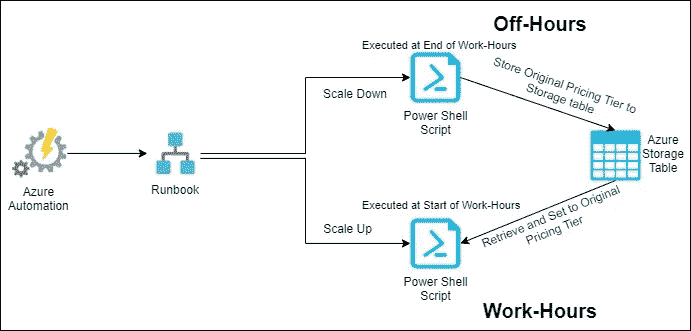

# Azure 应用服务计划的成本优化

> 原文：<https://blog.devgenius.io/cost-optimization-on-azure-app-service-plan-38fcd574522d?source=collection_archive---------1----------------------->

继新冠肺炎·疫情之后，世界上大多数公司都在削减成本。因此，在这个时候，如果我们能够减少公司的 Azure 支出，这将是巨大的增值。我尝试了下面列出的方法，这些方法每月将我们的非生产环境 azure 成本降低 40%,而且影响最小。它不需要在管道中做任何改变，这些方法的实现会非常快。

优化 Azure 成本

> **处理影响 Azure 成本的未使用和不必要的资源。**

随着我们不断创建新的应用程序，我们的环境也在增长，我们确实用一个 azure 资源替换了另一个。我们通常不会删除旧的，因为我们可能需要恢复我们的更改。我们在订阅中确定了那些我们不确定其用途的资源。有些资源总是被使用，有时被使用，但从未被使用过。我们确定了那些可以删除而不会影响业务、开发和测试活动的内容。这包括删除跨环境不使用的 *Windows* *应用服务环境*、*应用服务计划、应用洞察、部署槽*。在删除之前，我们有团队成员的多次审查，以确保它不会导致任何问题。

> 2.**应用服务计划的垂直扩展。**

应用服务计划的垂直扩展是指需要手动执行的几个步骤，这些步骤需要扩展或缩减资源。在缩减过程中，所有资源都将其当前层和大小保存到 Azure 存储表中。这允许向上扩展脚本知道一旦执行后将资源设置回什么。此扩展操作仅在非生产环境的应用服务计划上实施。*不建议在生产环境中安装。*如果您的开发或 QA 环境类似于生产环境，那么您将为没有相同的 100%正常运行时间要求的环境支付额外费用。因此，您可以在下班时间缩小基本或共享计划中的应用，并在工作时间再次扩大。如果有任何正在进行的开发/测试活动，应用服务计划也可以作为例外添加。它也可以在 Azure automation account 中作为运行手册进行安排，这样它将每天运行两次。

> 3.**应用服务计划的横向扩展:**

根据应用程序类型，所有非生产应用程序服务计划都扩展到一个实例中。如果需要，可以轻松扩展到任意数量。在一天结束时运行的 PowerShell 作业，用于将计数更新为 1，即使在工作时间有任何部署也是如此。

> **4。应用整合:**

如果可能，多个应用服务将整合到一个应用服务计划中。在这种情况下，应用服务需要有多个实例或更高的 SKU。目前，我们使用 power shell 在不影响任何管道的情况下实现了这一点。

> **5。减少应用洞察中的数据摄取:**

由于负载平衡器的监控，很少有 Azure 日志分析会接收大量数据。它包括异常日志记录、远程依赖性、消息日志记录、事件日志记录、请求日志记录和指标。

> **6。减少应用洞察中的数据采样。**

默认摄取数据采样设置为保留收到的所有数据，但您可以随时更改数据采样。