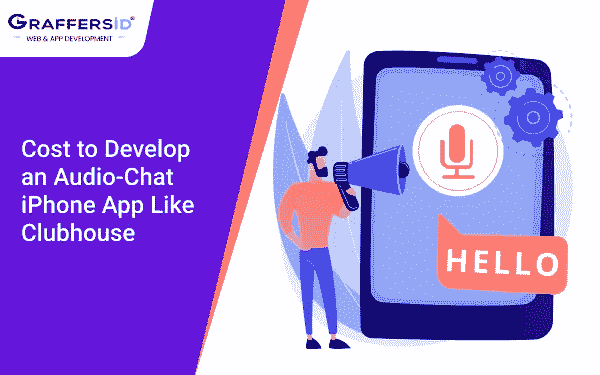
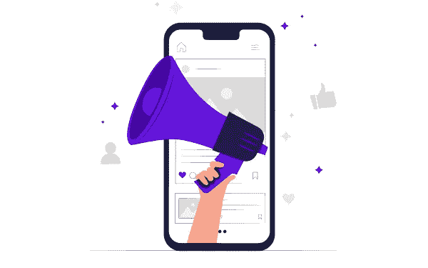
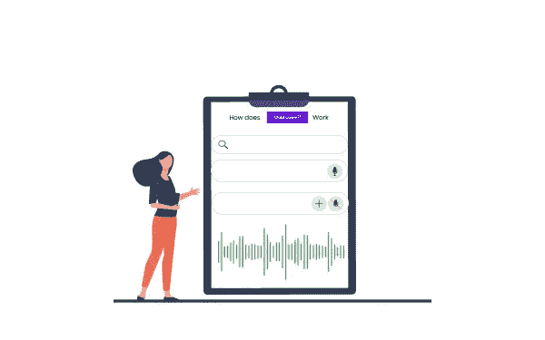
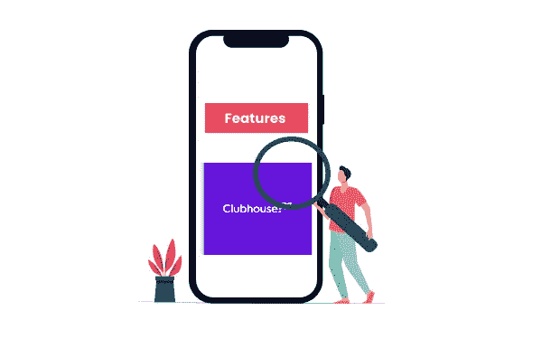
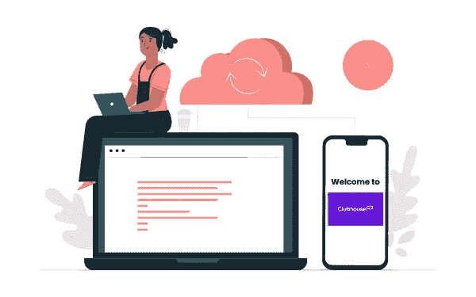
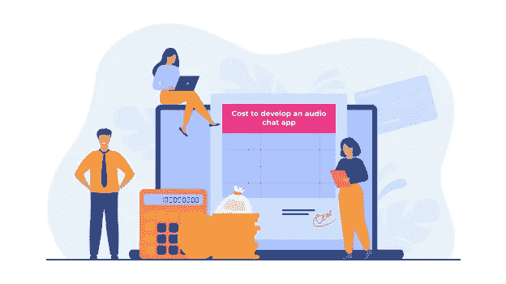
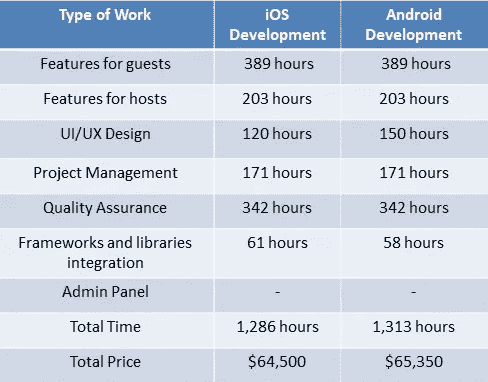

# 开发像 Clubhouse 这样的音频聊天 iPhone 应用程序的成本

> 原文：<https://blog.devgenius.io/cost-to-develop-an-audio-chat-iphone-app-like-clubhouse-967600d84f92?source=collection_archive---------10----------------------->

因此，你可能已经听说了一个新的社交媒体平台:clubhouse app，并开始感觉自己被排除在俱乐部之外。在这篇博客中，我们已经涵盖了关于 clubhouse 应用程序的每一分钟的细节，因为它不同于其他社交媒体平台。我们解释了什么是 clubhouse 应用程序，如何**开发像 Clubhouse** 这样的应用程序，以及估计的开发成本。

所以让我们开始吧

**目录**

**1。什么是会所 App？
2。会所是如何运作的？
3。会所 App 的常用功能
4。如何开发一个类似 Clubhouse 的音频聊天 app？
5。开发类似 Clubhouse 的 app 的步骤:**

*   **进行详细的市场调查**
*   **确定你的目标受众**
*   **构建用户友好且直观的设计**
*   **雇佣专门的开发人员**
*   **打造 MVP**
*   **发起营销活动**
*   **收集反馈**

**6。开发像 Clubhouse
7 这样的应用程序的成本。开发像 Clubhouse 这样的应用程序的估计成本**

# 什么是会所 App？

2020 年 4 月，硅谷企业家保罗·戴维森(Paul Davison)和前谷歌员工罗汉·塞思(Rohan Seth)开发并推出了一款名为 clubhouse 的音频聊天应用。最近它获得了大量的关注，因为一些名人和知名人士喜欢这个游戏，凯文·哈特开始使用这个社交媒体平台。这是部分对讲无线电，部分电话会议。

当我们想到社交媒体平台时，如何评估它们是我们首先想到的问题。所以评估很重要，因为目前，俱乐部应用程序是一个只有邀请才能使用的社交媒体平台。要访问音频聊天俱乐部应用程序，您实际上需要已经在使用该平台的用户发出邀请。我们建议您从 Apple store 下载该应用程序，因为它仅适用于 iOS，如果您没有邀请，请保留您的用户名。就像在社交媒体平台上一样，你的用户名给了你一个独一无二的身份。

> **阅读也:** [**创建一个类似 Airbnb**](https://graffersid.com/detailed-guide-to-create-an-app-like-airbnb/) 的 App

# 会所是如何运作的？

如你所知，Clubhouse 是一个音频聊天社交媒体平台，这意味着你不能分享图片和视频。这是一个社交媒体平台，人们可以通过创建一个房间来虚拟会面，以主持、倾听，在某些情况下，加入应用程序社区内的对话。如果您已经保留了您的用户名并收到了会员的邀请，您就可以加入聊天室，也可以创建自己的房间。俱乐部应用程序上创建的每个聊天室都有主持人、发言人和听众。房间的主持人可以控制谁给予发言特权，尽管听众可以在聊天中“举手”如果他们想发言。

# 俱乐部会所应用程序的常见功能:

# 入职

下载完 Clubhouse 应用程序后，您需要保留您的用户名和个人资料图片。当您登录后，您可以开始加入您选择的任何房间并开始收听。

# 饲料

当您打开 clubhouse 应用程序中的 feed 部分时，您会看到您可能感兴趣的房间列表。您可以加入并在房间中查看加入的成员。

# 用户配置文件

创建用户个人资料时，只需要您的姓名、个人资料图片和简短描述。在俱乐部会所不需要详细的自我介绍。当您加入任何房间时，其他成员都可以看到您的用户资料。

# 俱乐部

俱乐部是由成员围绕主题创建的团体。他们类似于脸书集团。你可以加入他们，因为他们把有相同兴趣的人联系在一起。

# 搜索

搜索框允许用户搜索感兴趣的话题和人物。

# 即将为您呈现

任何已经创建/安排了房间、俱乐部、讨论等活动的成员都将出现在即将到来的中。用户可以选择在选定的事件发生时得到提醒。

> **阅读还:** [**创建你的第一个 iPhone 应用**](https://graffersid.com/how-to-create-an-app-for-the-iphone/)

# 活动

在“活动”选项卡中，您可以访问您帐户的历史活动。您可以查看关注您的会员、新会员以及俱乐部会所中正在进行的活动。类似于 Instagram。

# 通知

当您不使用 clubhouse 应用程序时，这是一个有用的功能。推送通知功能向用户通知事件，例如开始新房间或新成员加入房间。

# 如何开发一个类似 Clubhouse 的音频聊天 app？

因此，你有一个像 clubhouse 这样的头脑风暴应用程序的想法，你想开发一个应用程序市场的差异，那么你已经在正确的地方着陆了。作为一家获奖公司，我们已经开发了几个成功的应用程序。你也可以遵循这些简单的步骤，将你对 clubhouse 这样的社交媒体应用的想法变成现实。

**下面是开发类似 Clubhouse 的 app 的几个步骤:**

# 1.进行详细的市场调查

一旦你对 Clubhouse 这样的移动应用有了独特的想法，并决定执行它，你应该做的第一件事就是进行详细的市场调查。为了你的应用成功，这是必要的，因为几个社交媒体应用已经出现在应用商店。

你可以从分析竞争对手的社交媒体应用开始，分析他们为用户提供的功能和服务。比较你提供了哪些独特的功能，你可以将哪些功能集成到你的社交媒体应用程序中，以便在竞争中保持领先。其次，开始查看用户在 app store 上的评论。当人们分享他们对移动应用的看法和体验并对其进行评价时，它们也有利于创建更具吸引力的社交媒体应用。

# 2.确定你的目标受众

你的应用程序的成功取决于你如何更好地了解目标受众。为了更好地了解目标受众，你需要安全的信息，如人口统计数据，如(年龄组，性别，国家)，应用程序潜在用户的偏好和问题。你可以从分析中收集这些信息。你需要

在最初阶段，你的家庭成员、朋友会成为你社交媒体应用的用户。你可以从他们期望你的移动应用有哪些改进开始。当您有足够多的活跃用户时，您可以开始创建焦点小组，用户可以在其中分享他们的经验。用户有价值的信息可以帮助你改进你的移动应用。您可以安排与您的用户进行电话访谈，以发现他们的问题、期望并努力解决它们。

你应该关注用户评论和评级，而不是关注应用商店的下载量。了解你的用户需求可以让你的开发更容易，开发出更好的最终产品。你应该花时间去寻找更多的潜在用户。

# 3.注重用户友好和直观的设计

在移动应用程序中，吸引人的直观设计在吸引用户方面起着至关重要的作用。如果你的应用程序出现崩溃、错误，用户很难浏览应用程序，你就是在允许用户转向竞争对手的应用程序。你需要考虑用户体验来设计你的移动应用。

为了留住用户，吸引人的视觉外观是不够的。你需要了解他们的期望，以及他们希望你的移动应用程序有哪些改进。

考虑已经在使用语音聊天应用程序的不同类型的用户。如果你的移动应用的主要受众是有影响力的人，你必须包含一些功能来轻松制作内容并与他们的追随者联系。与此同时，你要确保这个应用对关注者同样直观，这些关注者可能是年轻人。

开发具有平衡的视觉外观、特性和功能的应用程序可能是一项艰巨的任务。如果你有设计技能，那么你可以自己设计。或者你可以聘请专门的用户界面 UX 设计师。专家可以帮助您开发一款引人入胜、以用户为中心的移动应用。

> **阅读还:** [**雇佣敬业开发者的好处**](https://graffersid-sidharth.medium.com/what-are-the-benefits-of-hiring-dedicated-developers-in-india-db77e324090e)

# 4.雇佣专门的开发人员

一旦你完成了用户界面 UX 设计和你的移动应用功能列表，下一步就是为你的移动应用雇佣熟练的专家开发者。雇佣开发人员取决于开发项目的预算。如果你的预算很低，你可以雇佣远程开发人员或者自由开发人员。你可以在 freelancer、Upwork、Toptal、Fiver 等网站上找到它们。

你有开发移动应用程序的预算，你可以雇佣一家在岸或离岸的应用程序开发公司。如果你想雇用一个陆上公司，你可以在当地搜索他们或咨询你的朋友与他们有任何联系。在美国、英国或欧洲雇佣一家开发公司，每小时可能要花费你 150 到 200 美元。如果你想雇佣离岸开发者，你可以选择像印度、斯里兰卡这样的国家。他们有经验丰富和熟练的开发人员。从印度雇佣开发人员每小时可能要花费你 50 到 80 美元。

作为应用程序开发人员，我们从业务分析、制定技术规范、估计开发成本和规划项目开始开发流程。在每一个阶段，你都可以像 Clubhouse 一样追踪自己手机 app 的进度。

# 5.构建一个 MVP 模型

当你开始开发你的应用程序时，你应该有一个长长的愿望清单，上面有集成到语音聊天应用程序中的功能。在初始阶段，创建一个具备所有功能的移动应用程序是不可能的。开发一个全功能的应用程序可能会花费你很高的成本，并增加发布和上市的时间。我们建议，首先，建立并发布一个 MVP(最小可行产品),并在市场中测试核心理念。如果你的用户喜欢你的应用程序功能，那么你可以推出一个功能齐全的应用程序。这些将节省你的时间、精力和金钱。

在你开始开发一个 MVP app 之前，我们先来了解一下什么是最小可行产品。一个 MVP 是一个由基本特性和功能组成的工作应用。能够增强用户体验且不影响 MVP 应用功能的特性。首先启动一个 MVP 模型可以让你和开发团队确定影响应用功能和市场吸引力的核心问题。你有足够的时间采取预防措施，并在你的最终产品中避免它们。

# 6.营销产品并收集用户反馈

在你的移动应用程序在 app store 上发布之前，你有一些用户很乐意使用你的社交媒体应用程序，比如 Clubhouse。战略营销可以为你提供更好的结果。为了扩大您的营销范围，您可以联系社交媒体影响者来试用您的应用程序并分享他们的经验。你可以接触受欢迎的出版物，这样可以吸引更多潜在的新用户。

在你的 MVP 应用发布后，你应该不断地回顾你的用户的反馈。努力找出潜在的问题，并确定你的应用程序符合用户的期望。

不要完全依赖分析，你可以安排与你的潜在用户进行面谈，了解他们对体验的宝贵反馈，并确定他们的期望。他们希望您的移动应用程序具备哪些新特性和功能。通过反馈，您可以确定在下一个版本中需要改进的地方。

# 开发像 Clubhouse 这样的音频聊天 iPhone 应用程序的成本

几个因素构成了像 Clubhouse 这样的移动应用的开发成本。共同因素包括。

*   移动应用程序设计
*   功能集
*   机构所在地
*   团队规模

为了开发像 club house 这样的应用程序，我们建议采取与他们相同的路线——首先创建并发布社交媒体应用程序的测试版，然后再发布真正的全功能应用程序。这样，你就可以在开发一个全功能的 app 之前，衡量用户的兴趣。您可以调整最终产品的特性和功能。

我们的开发团队总是建议创业者首先为他们的移动应用程序创建一个功能列表。基于特性，很容易讨论技术和资源方面。这有助于估计应用程序开发的总体成本。

> [想开发一个类似 Clubhouse 的 App？立即获取报价](https://graffersid.com/contact-us/)

# 开发像 Clubhouse 这样的应用程序的估计成本:

对于一个在美国有基本功能开发人员的应用程序，欧洲可能平均每小时花费 150 美元，开发一个像 Clubhouse 这样的社交媒体应用程序的成本大约是 20 万美元。根据您想要包含的功能和技术，这一成本会有所增加。

如果你打算在印度雇佣一家离岸开发公司，我们建议你应该选择混合应用，即 iOS 和 Android 平台的混合应用。对于一个具有基本功能的应用程序，印度等离岸国家的开发者可能平均每小时花费你 50-80 美元。开发像 Clubhouse 这样的社交媒体应用程序的成本大约为 8 万美元。

要及时开发一个像 Clubhouse 这样令人惊叹的社交媒体应用，你需要雇佣一个开发团队。雇佣开发团队的成本也包含在核心应用程序开发成本中。

*   1 名项目经理
*   1-2 名 iOS 开发人员
*   1 名用户界面/UX 设计师
*   1-2 名 Android 开发人员
*   1 后端开发人员
*   2 名质量保证专家

为这两个平台开发一款手机应用，每个平台都有自己的设计和功能，这需要时间。建立一个社交媒体应用程序需要多长时间，因为 Clubhouse 取决于您团队的成员数量？。因此，开发人员越多，你就能越快地发布和营销你的社交媒体应用，比如 Clubhouse。

*原载于 2021 年 3 月 17 日*[*【https://graffersid.com】*](https://graffersid.com/develop-an-app-like-clubhouse/)*。*