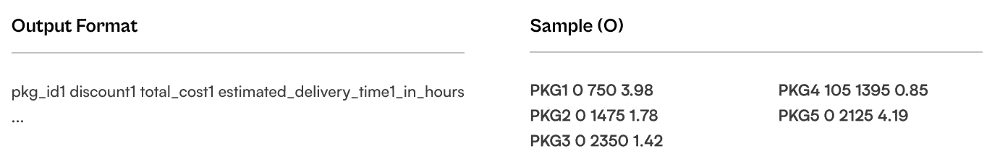
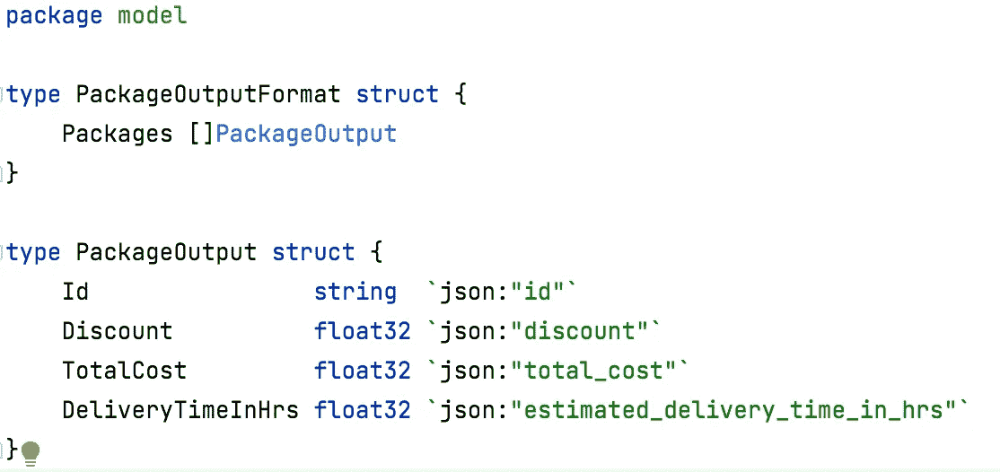

# Golang 快递服务有限公司

> 原文：<https://blog.devgenius.io/courier-service-lld-in-golang-cdf881a28b03?source=collection_archive---------6----------------------->

计划是设计一个命令行应用程序，以估计包裹成本和估计交付时间。

# 需求#1:估计包成本

> 功能需求

计划是根据给定的以下内容来估计软件包的成本:

1.  包裹重量。
2.  包裹递送的距离。
3.  报价代码选择。

> 出价标准


> 样本输入和输出



> 说明


# 需求#2:交付时间估计

> 功能需求

计划是根据以下给定条件估计递送包裹所需的时间:

1.  包裹重量。
2.  包裹递送的距离。
3.  装运交付标准。

> 交付标准


> 说明


# 解决办法

> 模型



> 成本估算服务

```
package service

import "github.com/hiteshpattanayak-tw/courier_service/internal/app/model"

type CostEstimation struct{}

func ProvideCostEstimationService() CostEstimation {
   return CostEstimation{}
}

func (ce CostEstimation) CalculateAllPackagesCost(input model.PackageInputFormat) model.PackageOutputFormat {
   output := model.PackageOutputFormat{}
   packageTracker := make(map[string]bool)

   for _, pkg := range input.Packages {
      if offerApplied, ok := packageTracker[pkg.Id]; ok || offerApplied {
         continue
      }

      validity, discountPercent := pkg.IsOfferValid()
      packageTracker[pkg.Id] = validity
      cost, discount := pkg.GetCost(input.BaseDeliveryCost, discountPercent)

      pkgOut := model.PackageOutput{
         Id:        pkg.Id,
         Discount:  discount,
         TotalCost: cost,
      }

      output.Packages = append(output.Packages, pkgOut)
   }

   return output
}
```

> 成本估算服务:测试

```
package service_test

import (
   "github.com/hiteshpattanayak-tw/courier_service/internal/app/model"
   "github.com/hiteshpattanayak-tw/courier_service/internal/app/service"
   "github.com/stretchr/testify/assert"
   "testing"
)

func TestCostEstimation_CalculateAllPackagesCost(t *testing.T) {
   ceSvc := service.ProvideCostEstimationService()

   packages := []model.Package{
      {
         Id:           "PKG1",
         Weight:       145,
         DistanceInKm: 105,
         OfferCode:    "OFR003",
      },
      {
         Id:           "PKG2",
         Weight:       190,
         DistanceInKm: 150,
         OfferCode:    "OFR001",
      },
      {
         Id:           "PKG3",
         Weight:       240,
         DistanceInKm: 55,
         OfferCode:    "OFR002",
      },
      {
         Id:           "PKG4",
         Weight:       240,
         DistanceInKm: 45,
         OfferCode:    "OFR002",
      },
      {
         Id:           "PKG1",
         Weight:       145,
         DistanceInKm: 105,
         OfferCode:    "OFR002",
      },
   }

   input := model.PackageInputFormat{
      BaseDeliveryCost: 100,
      NoOfPackages:     4,
      Packages:         packages,
   }

   expected := model.PackageOutputFormat{Packages: []model.PackageOutput{
      {
         Id:        "PKG1",
         Discount:  103.75,
         TotalCost: 1971.25,
      },
      {
         Id:        "PKG2",
         Discount:  275,
         TotalCost: 2475,
      },
      {
         Id:        "PKG3",
         Discount:  194.25,
         TotalCost: 2580.75,
      },
      {
         Id:        "PKG4",
         Discount:  0,
         TotalCost: 2725,
      },
   }}
   actual := ceSvc.CalculateAllPackagesCost(input)

   assert.Equal(t, expected, actual)
}
```

> 套餐选择服务

基本上，该服务使用“组合和递归策略”来选择包。

```
package service

import "github.com/hiteshpattanayak-tw/courier_service/internal/app/model"

type PackageSelectionService struct{}

func ProvidePackageSelectionService() PackageSelectionService {
   return PackageSelectionService{}
}

func (ps PackageSelectionService) SelectPackages(pkgs []model.Package, limit float32) []model.Package {
   if len(pkgs) == 0 {
      return nil
   }

   if len(pkgs) == 1 {
      return pkgs
   }

   ps.SortPackages(pkgs)

   allCombinations := make([][]model.Package, 0)
   combinations := make([]model.Package, 0)

   copyPkgs := make([]model.Package, len(pkgs))
   copy(copyPkgs, pkgs)

   ps.getAllPkgCombinations(copyPkgs, &allCombinations, combinations, 0, limit)

   return ps.getPkgsWithHighestNumberAndHighestWeight(allCombinations)
}

func (ps PackageSelectionService) SortPackages(pkgs []model.Package) {
   for i := 0; i < len(pkgs); i++ {
      maxWeightPkg := i

      for j := i + 1; j < len(pkgs); j++ {
         if pkgs[maxWeightPkg].Weight < pkgs[j].Weight {
            maxWeightPkg = j
         }
      }

      pkgs[i], pkgs[maxWeightPkg] = pkgs[maxWeightPkg], pkgs[i]
   }

   for i := 0; i < len(pkgs)-1; i++ {
      if pkgs[i].Weight == pkgs[i+1].Weight && pkgs[i].DistanceInKm > pkgs[i+1].DistanceInKm {
         pkgs[i], pkgs[i+1] = pkgs[i+1], pkgs[i]
      }
   }
}

func (ps PackageSelectionService) getAllPkgCombinations(pkgs []model.Package, allCombinations *[][]model.Package, combination []model.Package, idx int, limit float32) {
   lightestWt := ps.getLightestPkg(ps.getRemainingPkgs(pkgs, combination))
   if limit <= lightestWt {
      if !ps.isPackagesPresent(combination, *allCombinations) {
         c := make([]model.Package, len(combination))
         copy(c, combination)
         *allCombinations = append(*allCombinations, c)
      }
      return
   }

   for i := idx; i < len(pkgs); i++ {
      if float32(pkgs[i].Weight) > limit {
         break
      }
      combination = append(combination, pkgs[i])
      ps.getAllPkgCombinations(pkgs, allCombinations, combination, i+1, limit-float32(pkgs[i].Weight))
      combination = combination[0 : len(combination)-1]
   }
}

func (ps PackageSelectionService) getLightestPkg(pkgs []model.Package) float32 {
   if len(pkgs) == 0 {
      return -1
   }

   lightest := pkgs[0]
   for _, p := range pkgs {
      if p.Weight < lightest.Weight {
         lightest = p
      }
   }
   return float32(lightest.Weight)
}

func (ps PackageSelectionService) getRemainingPkgs(pkgs []model.Package, currPkgs []model.Package) []model.Package {
   remainingPkgs := make([]model.Package, 0)
   for _, p := range pkgs {
      if !ps.isPackagePresent(p, currPkgs) {
         remainingPkgs = append(remainingPkgs, p)
      }
   }

   return remainingPkgs
}

func (ps PackageSelectionService) isPackagePresent(pkg model.Package, currPkgs []model.Package) bool {
   for _, p := range currPkgs {
      if p.Id == pkg.Id {
         return true
      }
   }

   return false
}

func (ps PackageSelectionService) isPackagesPresent(pkgs []model.Package, allPkgCombinations [][]model.Package) bool {
   for _, pcs := range allPkgCombinations {
      if len(ps.getRemainingPkgs(pcs, pkgs)) == 0 {
         return true
      }
   }

   return false
}

func (ps PackageSelectionService) getPkgsWithHighestNumberAndHighestWeight(allPkgCombinations [][]model.Package) []model.Package {
   highest := float32(0)
   longest := 0
   var selectedPkgs []model.Package
   for _, pkgs := range allPkgCombinations {
      if wt := ps.getPkgsCombinedWeight(pkgs); wt > highest && len(pkgs) >= longest {
         longest = len(pkgs)
         highest = wt
         selectedPkgs = pkgs
      }
   }

   return selectedPkgs
}

func (ps PackageSelectionService) getPkgsCombinedWeight(pkgs []model.Package) float32 {
   wt := 0
   for _, p := range pkgs {
      wt += p.Weight
   }
   return float32(wt)
}
```

> 包选择服务:测试

```
package service_test

import (
   "github.com/hiteshpattanayak-tw/courier_service/internal/app/model"
   "github.com/hiteshpattanayak-tw/courier_service/internal/app/service"
   "github.com/stretchr/testify/assert"
   "testing"
)

func TestSortPackages_ShouldSortInDescendingOrderByWeight(t *testing.T) {
   pkgs := []model.Package{
      {
         Id:           "PKG1",
         Weight:       145,
         DistanceInKm: 105,
         OfferCode:    "OFR003",
      },
      {
         Id:           "PKG2",
         Weight:       190,
         DistanceInKm: 150,
         OfferCode:    "OFR001",
      },
      {
         Id:           "PKG3",
         Weight:       240,
         DistanceInKm: 55,
         OfferCode:    "OFR002",
      },
   }

   expected := []model.Package{
      {
         Id:           "PKG3",
         Weight:       240,
         DistanceInKm: 55,
         OfferCode:    "OFR002",
      },
      {
         Id:           "PKG2",
         Weight:       190,
         DistanceInKm: 150,
         OfferCode:    "OFR001",
      },
      {
         Id:           "PKG1",
         Weight:       145,
         DistanceInKm: 105,
         OfferCode:    "OFR003",
      },
   }

   pkgSortingSvc := service.ProvidePackageSelectionService()
   pkgSortingSvc.SortPackages(pkgs)

   assert.Equal(t, expected, pkgs)
}

func TestSortPackages_ShouldSortInDescendingOrderByWeightAndIncreasingOrderByDistanceIfWeightMatch(t *testing.T) {
   pkgs := []model.Package{
      {
         Id:           "PKG1",
         Weight:       145,
         DistanceInKm: 105,
         OfferCode:    "OFR003",
      },
      {
         Id:           "PKG2",
         Weight:       145,
         DistanceInKm: 150,
         OfferCode:    "OFR001",
      },
      {
         Id:           "PKG3",
         Weight:       240,
         DistanceInKm: 55,
         OfferCode:    "OFR002",
      },
   }

   expected := []model.Package{
      {
         Id:           "PKG3",
         Weight:       240,
         DistanceInKm: 55,
         OfferCode:    "OFR002",
      },
      {
         Id:           "PKG1",
         Weight:       145,
         DistanceInKm: 105,
         OfferCode:    "OFR003",
      },
      {
         Id:           "PKG2",
         Weight:       145,
         DistanceInKm: 150,
         OfferCode:    "OFR001",
      },
   }

   pkgSortingSvc := service.ProvidePackageSelectionService()
   pkgSortingSvc.SortPackages(pkgs)

   assert.Equal(t, expected, pkgs)
}

func TestPackageSorting_SelectPackages(t *testing.T) {
   packages := []model.Package{
      {
         Id:           "PKG1",
         Weight:       50,
         DistanceInKm: 30,
         OfferCode:    "OFR001",
      },
      {
         Id:           "PKG2",
         Weight:       75,
         DistanceInKm: 125,
         OfferCode:    "OFR008",
      },
      {
         Id:           "PKG3",
         Weight:       175,
         DistanceInKm: 100,
         OfferCode:    "OFR003",
      },
      {
         Id:           "PKG4",
         Weight:       110,
         DistanceInKm: 60,
         OfferCode:    "OFR002",
      },
      {
         Id:           "PKG5",
         Weight:       155,
         DistanceInKm: 95,
         OfferCode:    "",
      },
   }

   limit := float32(200)

   expected := []model.Package{
      {
         Id:           "PKG4",
         Weight:       110,
         DistanceInKm: 60,
         OfferCode:    "OFR002",
      },
      {
         Id:           "PKG2",
         Weight:       75,
         DistanceInKm: 125,
         OfferCode:    "OFR008",
      },
   }

   pkgSvc := service.ProvidePackageSelectionService()
   actual := pkgSvc.SelectPackages(packages, limit)

   assert.ElementsMatch(t, expected, actual)
}
```

> 交货估计服务

```
package service

import (
   "github.com/hiteshpattanayak-tw/courier_service/internal/app/model"
   "strconv"
   "strings"
)

const BITSIZE_32 = 32

type DeliveryEstimationService struct {
   pkgSortingSvc PackageSelectionService
}

func ProvideDeliveryEstimationService(pkgSortingSvc PackageSelectionService) DeliveryEstimationService {
   return DeliveryEstimationService{pkgSortingSvc: pkgSortingSvc}
}

func (des DeliveryEstimationService) FetchDeliveryEstimations(pkgs []model.Package, vehicles []model.Vehicle) map[string]float32 {
   outputPkgsMap := make(map[string]float32)

   copyPkgs := make([]model.Package, len(pkgs))
   copy(copyPkgs, pkgs)
   currVehicle := 0
   currTime := float32(0)

   for len(copyPkgs) > 0 {
      selectedPkgs := des.pkgSortingSvc.SelectPackages(copyPkgs, vehicles[currVehicle].MaxWeightLimit)
      if selectedPkgs == nil {
         break
      }

      for _, sp := range selectedPkgs {
         outputPkgsMap[sp.Id] = currTime + des.formatValue(float32(sp.DistanceInKm)/vehicles[currVehicle].MaxSpeedLimit)
      }

      shipment := model.Shipment{Packages: selectedPkgs, Time: currTime}
      vehicles[currVehicle].Shipments = append(vehicles[currVehicle].Shipments, shipment)
      vehicles[currVehicle].NextAvailableTime = currTime + (des.formatValue(des.getHighestShipmentDeliveryTime(vehicles[currVehicle].MaxSpeedLimit, shipment)) * 2)

      copyPkgs = des.getRemainingPkgs(copyPkgs, selectedPkgs)
      currVehicle += 1

      if currVehicle == len(vehicles) {
         minVehicle := 0
         minTime := vehicles[0].NextAvailableTime
         if vehicles[0].NextAvailableTime > vehicles[1].NextAvailableTime {
            minVehicle = 1
            minTime = vehicles[1].NextAvailableTime
         }

         for i := 1; i < len(vehicles); i++ {
            if vehicles[minVehicle].NextAvailableTime > vehicles[i].NextAvailableTime {
               minVehicle = i
               minTime = vehicles[i].NextAvailableTime
            }
         }

         currTime = minTime
         currVehicle = minVehicle
      }
   }

   return outputPkgsMap
}

func (des DeliveryEstimationService) getHighestShipmentDeliveryTime(maxSpeedLimit float32, shipment model.Shipment) float32 {
   max := float32(0)
   for _, p := range shipment.Packages {
      currShipmentTime := float32(p.DistanceInKm) / maxSpeedLimit
      max = des.max(max, currShipmentTime)
   }

   return max
}

func (des DeliveryEstimationService) max(a, b float32) float32 {
   if a > b {
      return a
   }
   return b
}

func (des DeliveryEstimationService) getLowestNextDeliveryVehicle(vehicles []model.Vehicle) int {
   lowest := 0

   for i, v := range vehicles {
      if v.NextAvailableTime < vehicles[lowest].NextAvailableTime {
         lowest = i
      }
   }

   return lowest
}

func (des DeliveryEstimationService) getOutputPkgMap(outputPkgs []model.PackageOutput) map[string]model.PackageOutput {
   outputPkgMap := make(map[string]model.PackageOutput)

   for _, p := range outputPkgs {
      outputPkgMap[p.Id] = p
   }

   return outputPkgMap
}

func (des DeliveryEstimationService) getRemainingPkgs(pkgs []model.Package, currPkgs []model.Package) []model.Package {
   remainingPkgs := make([]model.Package, 0)
   for _, p := range pkgs {
      if !des.isPackagePresent(p, currPkgs) {
         remainingPkgs = append(remainingPkgs, p)
      }
   }

   return remainingPkgs
}

func (des DeliveryEstimationService) isPackagePresent(pkg model.Package, currPkgs []model.Package) bool {
   for _, p := range currPkgs {
      if p.Id == pkg.Id {
         return true
      }
   }

   return false
}

func (des DeliveryEstimationService) formatValue(value float32) float32 {
   strFloat := strconv.FormatFloat(float64(value), 'f', -1, BITSIZE_32)
   strFloatParts := strings.Split(strFloat, ".")
   strFloatParts[1] = strFloatParts[1][0:2]
   strFloat = strings.Join(strFloatParts, ".")
   res, _ := strconv.ParseFloat(strFloat, BITSIZE_32)
   return float32(res)
}
```

> 交付估计服务:测试

```
package service_test

import (
   "github.com/hiteshpattanayak-tw/courier_service/internal/app/model"
   "github.com/hiteshpattanayak-tw/courier_service/internal/app/service"
   "github.com/stretchr/testify/assert"
   "testing"
)

func TestDeliveryEstimationService_UpdateDeliveryEstimations(t *testing.T) {
   vehicles := []model.Vehicle{
      {
         Id:                "VH1",
         MaxSpeedLimit:     float32(70),
         MaxWeightLimit:    float32(200),
         Shipments:         make([]model.Shipment, 0),
         NextAvailableTime: float32(0),
      },
      {
         Id:                "VH2",
         MaxSpeedLimit:     float32(70),
         MaxWeightLimit:    float32(200),
         Shipments:         make([]model.Shipment, 0),
         NextAvailableTime: float32(0),
      },
   }

   packages := []model.Package{
      {
         Id:           "PKG1",
         Weight:       50,
         DistanceInKm: 30,
         OfferCode:    "OFR001",
      },
      {
         Id:           "PKG2",
         Weight:       75,
         DistanceInKm: 125,
         OfferCode:    "OFR008",
      },
      {
         Id:           "PKG3",
         Weight:       175,
         DistanceInKm: 100,
         OfferCode:    "OFR003",
      },
      {
         Id:           "PKG4",
         Weight:       110,
         DistanceInKm: 60,
         OfferCode:    "OFR002",
      },
      {
         Id:           "PKG5",
         Weight:       155,
         DistanceInKm: 95,
         OfferCode:    "",
      },
   }

   pkgSortSvc := service.ProvidePackageSelectionService()
   deSvc := service.ProvideDeliveryEstimationService(pkgSortSvc)

   expected := map[string]float32{
      "PKG1": float32(3.98),
      "PKG2": float32(1.78),
      "PKG3": float32(1.42),
      "PKG4": float32(0.85),
      "PKG5": float32(4.19),
   }

   actual := deSvc.FetchDeliveryEstimations(packages, vehicles)
   assert.Equal(t, expected, actual)
}
```

> 主要方法:接线

```
package main

import (
   "bufio"
   "fmt"
   "github.com/hiteshpattanayak-tw/courier_service/internal/app/model"
   "github.com/hiteshpattanayak-tw/courier_service/internal/app/service"
   "log"
   "os"
   "strconv"
   "strings"
)

const BITSIZE_32 = 32

func main() {
   reader := bufio.NewReader(os.Stdin)
   fmt.Println("Enter base delivery cost and number of packages in the format: <base_delivery_cost> <no_of_packages>")
   input, _ := reader.ReadString('\n')

   parts := strings.Split(strings.TrimSpace(input), " ")
   if len(parts) != 2 {
      log.Fatal("invalid input, format should be: <base_delivery_cost> <no_of_packages>")
   }

   baseDeliveryCost, err := strconv.Atoi(parts[0])
   if err != nil {
      log.Fatal("invalid entry for base_delivery_cost")
   }

   noOfPackages, err := strconv.Atoi(parts[1])
   if err != nil {
      log.Fatal("invalid entry for no_of_packages")
   }

   packages := make([]model.Package, 0)
   for i := 0; i < noOfPackages; i++ {
      fmt.Println("Enter package info in the format: <pkg_id> <weight_in_kg> <distance_in_km> <offer_code>")
      input, _ = reader.ReadString('\n')

      parts = strings.Split(strings.TrimSpace(input), " ")
      if len(parts) != 4 {
         log.Fatal("invalid input, format should be: <pkg_id> <weight_in_kg> <distance_in_km> <offer_code>")
      }
      pkgId := parts[0]

      weight, err := strconv.Atoi(parts[1])
      if err != nil {
         log.Fatal("invalid entry for weight")
      }

      distance, err := strconv.Atoi(parts[2])
      if err != nil {
         log.Fatal("invalid entry for distance")
      }

      offerCode := parts[3]

      pkg := model.Package{
         Id:           pkgId,
         Weight:       weight,
         DistanceInKm: distance,
         OfferCode:    offerCode,
      }

      packages = append(packages, pkg)
   }

   inputPkgDetails := model.PackageInputFormat{
      BaseDeliveryCost: baseDeliveryCost,
      NoOfPackages:     noOfPackages,
      Packages:         packages,
   }

   fmt.Println("Enter vehicle details in the format: <no_of_vehicles> <max_speed_limit> <max_carry_weight>")
   input, _ = reader.ReadString('\n')

   parts = strings.Split(strings.TrimSpace(input), " ")
   if len(parts) != 3 {
      log.Fatal("invalid input, format should be: <no_of_vehicles> <max_speed_limit> <max_carry_weight>")
   }

   noOfVehicles, err := strconv.Atoi(parts[0])
   if err != nil {
      log.Fatal("invalid entry for no_of_vehicles")
   }

   speedLimit, err := strconv.Atoi(parts[1])
   if err != nil {
      log.Fatal("invalid entry for max_speed_limit")
   }

   weightLimit, err := strconv.Atoi(parts[2])
   if err != nil {
      log.Fatal("invalid entry for max_carry_weight")
   }

   vehicles := make([]model.Vehicle, noOfVehicles)

   for i := 0; i < noOfVehicles; i++ {
      v := model.Vehicle{
         Id:                fmt.Sprintf("VH%d", i),
         MaxWeightLimit:    float32(weightLimit),
         MaxSpeedLimit:     float32(speedLimit),
         Shipments:         make([]model.Shipment, 0),
         NextAvailableTime: 0,
      }

      vehicles[i] = v
   }

   ceSvc := service.ProvideCostEstimationService()
   output := ceSvc.CalculateAllPackagesCost(inputPkgDetails)

   psSvc := service.ProvidePackageSelectionService()
   deSvc := service.ProvideDeliveryEstimationService(psSvc)
   pkgDeliveryTimings := deSvc.FetchDeliveryEstimations(packages, vehicles)

   for i,p := range output.Packages {
      output.Packages[i].DeliveryTimeInHrs = pkgDeliveryTimings[p.Id]
   }

   for _, pkg := range output.Packages {
      fmt.Printf("%s %s %s %f\n", pkg.Id, formatValue(pkg.Discount), formatValue(pkg.TotalCost), formatValue(pkg.DeliveryTimeInHrs))
   }
}

func formatValue(value float32) string {
   return strconv.FormatFloat(float64(value), 'f', -1, BITSIZE_32)
}
```

> 链接到代码库

喜欢回购里的代码请留个星。

[](https://github.com/HiteshRepo/CourierService) [## GitHub-HiteshRepo/快递服务

### 此时您不能执行该操作。您已使用另一个标签页或窗口登录。您已在另一个选项卡中注销，或者…

github.com](https://github.com/HiteshRepo/CourierService) 

> 结束注释

请评论可以做出的改进。

也请在代码库留下一个公关，以改善解决方案。

我本人会努力改进解决方案。