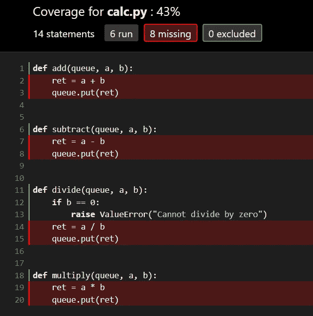
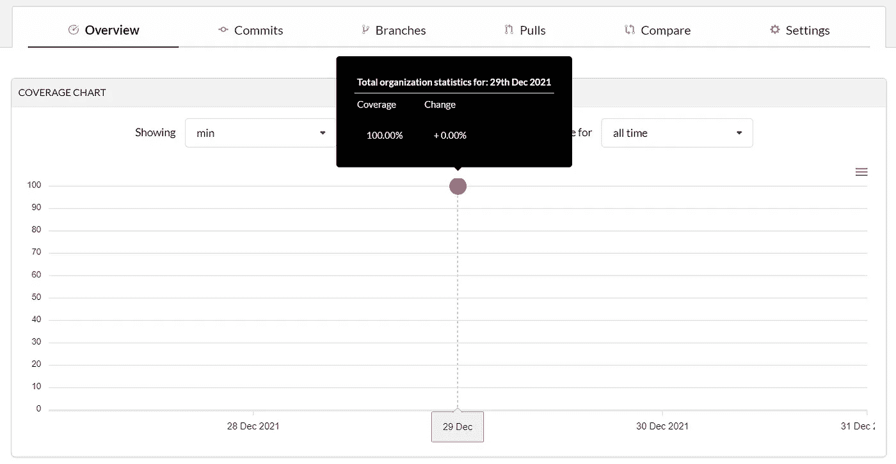
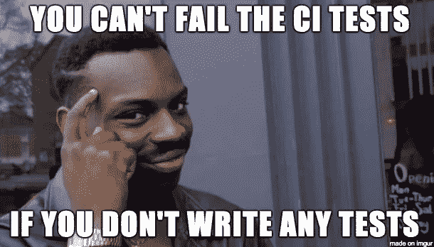

# 使用 coverage.py 覆盖在 GitHub 动作的子进程/线程中运行的单元测试

> 原文：<https://blog.devgenius.io/covering-unit-tests-running-in-sub-processes-threads-on-github-actions-using-coverage-py-825c3c4e08c1?source=collection_archive---------5----------------------->

代码库的“代码覆盖率”值描述了运行的单元测试覆盖了多少生产/开发代码。在开源的世界里，所有的维护者都尽最大努力保持这个高百分比，这个过程通常是通过像 GitHub Actions 和 Codecov 这样的工具自动完成的。因此，代码覆盖率成为检查特定代码库是否经过良好测试和可靠的一个很好的度量(并不总是如此)。

单元测试通常在衍生的子进程或线程中运行。子进程或多线程允许它们并行运行。如果测试花费了太多时间，它们也使得中途停止测试变得更加容易(概率测试)。

然而，在子流程中运行单元测试会在本地存储库中以及远程存储库中产生问题。正如`coverage.py`的文档所说——“测量那些子流程中的覆盖率可能会很棘手，因为您必须修改生成流程的代码来调用 coverage.py。”

在下面的博客中，我们将首先尝试在默认模式下使用`coverage.py`来覆盖通过在子流程中运行的单元测试所测试的代码。在检查完结果之后，我们将构建一个解决方案来覆盖本地存储库中“未覆盖”的代码。最后一步，我们还将配置 GitHub 动作，在我们的远程存储库中执行这项任务。

# 创建虚拟项目

让我们创建一个名为`Calculator`的新文件夹和一个新的 python 文件`calc.py`。我将在同一个文件中创建 4 个简单的函数，然后进行测试-

计算器. py

现在让我们在一个名为`test_calc.py`的新文件中为用`calc.py`编写的函数创建一些单元测试

*   我们将使用`unittest`库来编写测试。
*   我们需要在一个类中有 4 个独立的测试方法来测试我们的代码。
*   我们会在测试的时候尽量照顾到边缘情况。
*   在测试`divide`功能时，我们需要测试`ValueError`是否被正确升起。

# 使用 coverage.py 运行单元测试

我们现在可以使用命令运行我们的测试了(`-v`是为了更好的输出)—

```
python -m unittest -v
```

输出—

```
test_add (test_calc.TestCalc) ... ok     
test_divide (test_calc.TestCalc) ... ok  
test_multiply (test_calc.TestCalc) ... ok
test_subtract (test_calc.TestCalc) ... ok----------------------------------------------------------------------
Ran 4 tests in 0.001sOK
```

测试工作正常！现在我们已经准备好测量我们测试的覆盖率，但是首先，让我们创建一个`.coveragerc`文件来从覆盖率报告中省略`test_calc`文件中的代码。文件的内容应该是—

```
[run]
omit=*/test*
```

根目录现在应该有 3 个文件— `calc.py`、`test_cal.py`和`.coveragerc`文件。

执行下面的命令应该会运行测试，并在您的根文件夹中创建一个新的`.coverage`文件(`-v`是为了更好的输出)—

```
coverage run -m unittest -v
```

`.coverage`文件可以用来检查我们的代码覆盖率，使用命令—

```
coverage report
```

覆盖范围—

```
Name      Stmts   Miss  Cover
-----------------------------
calc.py      10      0   100%
-----------------------------
TOTAL        10      0   100%
```

万岁！代码覆盖率是 100%的！

# 使用 coverage.py 的默认设置在子流程中运行单元测试

我们真的不需要在子流程中运行这些测试，因为它们非常简单，但是为了本教程，让我们使用`multiprocessing`在子流程中运行它们。首先，让我们编辑我们的函数来捕获队列中的返回值，而不是简单地返回它们—

*   我们不能简单地通过`multiprocessing.Process()`调用返回值。
*   我们可以使用共享变量在进程间进行通信。
*   这里我们使用一个`Queue`来完成这个任务(好了，现在你知道如何在开发中使用数据结构了)。
*   另一个可以用来完成这个任务的数据结构是`Dictionary`或`multiprocessing.Manager().dict()`(好了，现在你知道如何在开发中使用 2 个数据结构了)。

为了保持例子的简单，我将为每个函数只创建一个测试—

*   我们创建一个新的`Queue`并将其作为函数的参数传递，然后将其填充到函数中，并在测试中使用该值。

这是一个很大的挑战，但是现在让我们启动我们的测试，看看`multiprocessing`调用是否会给覆盖率带来任何变化——

```
coverage run -m unittest -v
```

输出—

```
test_add (test_calc.TestCalc) ... ok
test_divide (test_calc.TestCalc) ... ok
test_multiply (test_calc.TestCalc) ... ok
test_subtract (test_calc.TestCalc) ... ok----------------------------------------------------------------------
Ran 4 tests in 0.986sOK
```

测试仍然有效！现在是报道的时间了—

```
coverage report
```

输出—

```
Name      Stmts   Miss  Cover
-----------------------------
calc.py      14      8    43%
-----------------------------
TOTAL        14      8    43%
```

正如预期的那样，覆盖率下降了，即使使用测试覆盖了整个代码。以下命令将帮助我们更好地可视化覆盖范围-

```
coverage html
```

这个命令将在我们的根目录下创建一个名为`htmlcov`的文件夹。这个目录中的 HTML 文件可以在我们常规的 web 浏览器中打开，正如所料，子进程中执行的代码行没有使用`coverage.py` —



代码覆盖率的可视化

# 使用 coverage.py 在子流程中运行单元测试(这次是正确的方式)

这一次，我们将明确地告诉`coverage.py`我们正在子流程中运行测试。下面描述的步骤是用户在使用子进程或多线程时应该经历的一般步骤。然而，将`coverage.py`与`multiprocessing`一起使用有一个捷径，我们将在前面讨论。现在，可以在我们的`.coveragerc`文件中指定在子流程中“激活”覆盖所需的命令。这些文件接受两个命令——`concurrency`和`parallel`——在`[run]`参数下。根据文献记载—

1.  并发

> concurrency(多字符串，默认“线程”):产品代码使用的名称并发库。如果您的程序使用多处理、gevent、greenlet 或 eventlet，您必须在这个选项中命名该库，否则 coverage.py 将产生非常错误的结果。

2.平行的

> parallel (boolean，默认为 False):将机器名、进程 id 和随机数附加到数据文件名，以简化从多个进程收集数据的过程

所以现在我们的`.coveragerc`看起来会像这样-

```
[run]
concurrency=multiprocessing
parallel=True
omit=*/test*
```

此外，我们还需要在根目录中添加一个`sitecustomize.py`文件，代码如下

```
import coverage
coverage.process_startup()
```

最后一步是设置一个环境变量—

```
export COVERAGE_PROCESS_START=$PWD/.coveragerc
```

但是！由于我们使用的是`multiprocessing`，我们不必指定所有这些，相反，我们可以在终端命令中直接传递`concurrency`。我们仍将保留`parallel`命令，以简化从许多进程中收集数据。

现在我们的`.coveragerc`应该是这样的—

```
[run]
parallel=True
omit=*/test*
```

我们可以使用下面的命令来运行我们的测试，并向`coverage.py`指定我们正在使用`multiprocessing`在子流程中运行测试

```
coverage run --concurrency=multiprocessing -m unittest -v
```

一旦该命令被执行，`coverage.py`将在我们的根目录中为每个子流程创建一个单独的覆盖文件。要合并文件，我们可以执行-

```
coverage combine
```

最后，对于覆盖率报告，我们可以执行—

```
coverage report
```

输出—

```
Name      Stmts   Miss  Cover
-----------------------------
calc.py      14      0   100%
-----------------------------
TOTAL        14      0   100%
```

有用！！！！即使在子流程中运行测试之后，我们的覆盖率也回到了 100%。

# 在 GitHub Actions 上使用 coverage.py 在子流程中运行单元测试

[](https://www.seifbassem.com/blogs/posts/bicep-and-github-actions/)

最后，我们现在可以将代码推送到 GitHub，并使用 GitHub Actions、coverage.py 和 Codecov 运行单元测试。

我们首先在 GitHub 上创建一个新的存储库，并推送我们现有的代码(如果您没有 Codecov 帐户，请创建一个新的 Codecov 帐户)。接下来，我们导航到存储库中的`Actions`选项卡，并为`Python Application`创建一个新动作(我们也可以在本地完成)。`yaml`代码应该是这样的

一旦这个文件被提交，测试应该会自动运行，并且覆盖率应该可以在 Codecov 上获得。



覆盖率 100%！！

完整的代码可以在这里找到—[https://github . com/saran sh-CPP/Covering-unit-tests-running-in-subprocesses](https://github.com/Saransh-cpp/Covering-unit-tests-running-in-subprocesses)

此外，您还可以使用`README`徽章(可以从 Codecov 生成)来跟踪覆盖率


以迷因结束这篇博客(我喜欢迷因)—



感谢阅读！