# 用“SEIRD”模型进行疾病传播建模。

> 原文：<https://blog.devgenius.io/covid-19-modeling-using-the-sierd-model-and-visualization-using-plotly-and-ipywidgets-e6d5fbfc07aa?source=collection_archive---------3----------------------->

## ⚠️Disclaimer:这个帖子只是为了教育目的，它不是新冠肺炎的有效信息来源，这是一个潜在的威胁，你应该咨询合法的来源以获得准确的信息，例如谁…

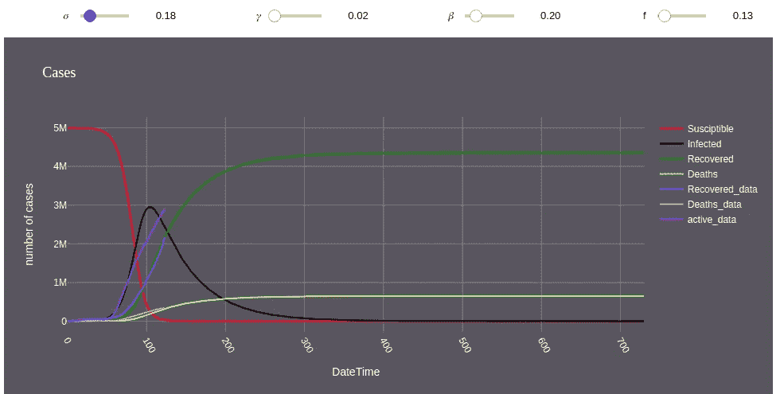

塞德模型([来源](https://github.com/Harmouch101/Modeling-Covid-19-SEIRD-))

# **简介**

C 冠状病毒感染 [**新冠肺炎**](https://en.wikipedia.org/wiki/Coronavirus_disease_2019) (简称**CO**Rona**VI**RUS**D**isease 20**19**)，此前冠状病毒感染 **2019-nCoV** ，是由**新型冠状病毒**病毒引起的一种潜在的严重急性呼吸道感染。

> 这是一种危险的疾病，可能同时发生:轻微的急性呼吸道病毒感染和严重的特定并发症，包括病毒性肺炎和急性呼吸窘迫综合征或呼吸衰竭，有死亡的风险。

在撰写本文时，**死亡**率已经达到 6.2%(简单地用全球死亡总人数除以确诊总人数，这不是估算 [CFR](https://ourworldindata.org/mortality-risk-covid) 的正确方法)。这个数字并不准确，因为它会随着时间不断变化。例如，截至 2020 年 3 月 3 日，这一比率为 3.4%(世卫组织[](https://www.who.int/dg/speeches/detail/who-director-general-s-opening-remarks-at-the-media-briefing-on-covid-19---3-march-2020)**)。**

**据**世界卫生组织**报道，新冠肺炎**疫苗**目前并不存在。另一方面，科学家们正致力于开发治疗其症状的药物。但是我们可以通过社会距离和一些预防措施来减缓它的传播( [**世卫组织**](https://www.who.int/emergencies/diseases/novel-coronavirus-2019/advice-for-public) )**

# ****数学模型****

**疾病的数学模型可以被认为是研究疾病机制和行为的最有力的工具之一。 [**流行病学**](https://en.wikipedia.org/wiki/Epidemiology) 模型作为理解疾病传播的**动力学**的基础。重要的是要考虑流行病的数学模型的质量及其对真实情景的处理方法。**

> **为了建立**数学模型，**有必要考虑一些有用的参数。例如，**潜伏期**，即从发病到出现第一次症状的时间，是从 5-6 天([](https://www.who.int/docs/default-source/coronaviruse/situation-reports/20200402-sitrep-73-covid-19.pdf?sfvrsn=5ae25bc7_4)**)到[](https://www.worldometers.info/coronavirus/coronavirus-incubation-period/)**的 14 天******

******在此期间，一个人是没有传染性的，而不是他被认为是暴露在中，并且可以在不知道自己已经感染病毒的情况下感染他人([在开始出现症状之前的 48 到 72 小时内可能会传染)](https://www.health.harvard.edu/diseases-and-conditions/coronavirus-resource-center)。过了这段时间，这个人就会变得有传染性。******

******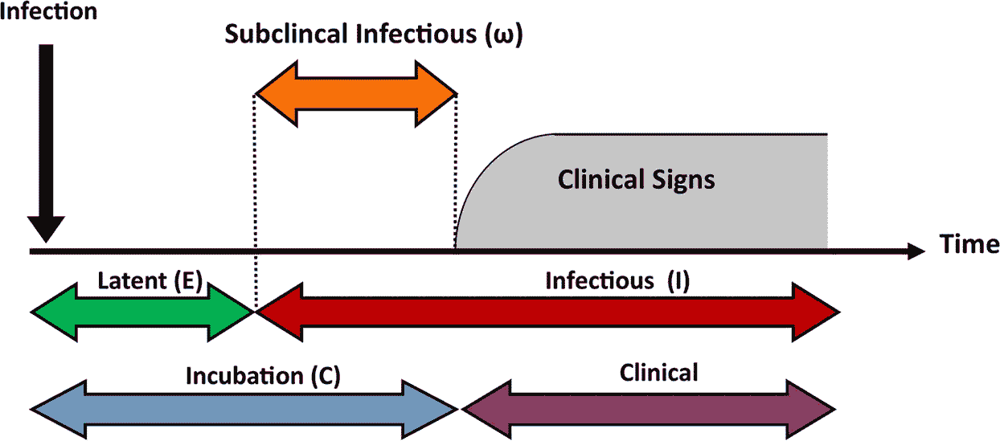******

******[来源](https://media.springernature.com/full/springer-static/image/art%3A10.1038%2Fs41598-019-39029-0/MediaObjects/41598_2019_39029_Fig1_HTML.png)******

******有很多流行病的数学模型。SEIRD 将出现在下一部分，因为它没有被很好地记录下来(在我写这篇文章的时候)。我从乍得·琼斯的文章中得到灵感。******

# ********赛德模型********

********SEIRD**(**S**uscept ible-**E**Exposed-**I**nfectious-**R**ecovered-**D**eceed)模型，是对 **SIR - model** 的一种修改，考虑了一个人已经被感染，但疾病处于潜伏期( [**潜伏期**](https://www.ncbi.nlm.nih.gov/pmc/articles/PMC2465549/) 类:【T18 在该模型中，需要额外引入状态 **E** 和 **I** 之间的**关系**。******

****在 **SEIRD** 模型中，个体被分为**五类**:****

*   ******S** 在给定时间 t 内，尚未感染的**易感者**的人数。****
*   ******E****暴露于**感染的人数，已患病但无症状。****
*   ******I** 在给定时间 t 内**感染**个体的数量，即能够将病毒传播给非感染者的人数。****
*   ******R** 是**康复**人的数量，这些人不能将病毒传染给他人，假设在康复时对病毒有免疫力。****
*   ******D** 是 t 时刻**死亡人数******
*   ******N** 为**人口总数。******

****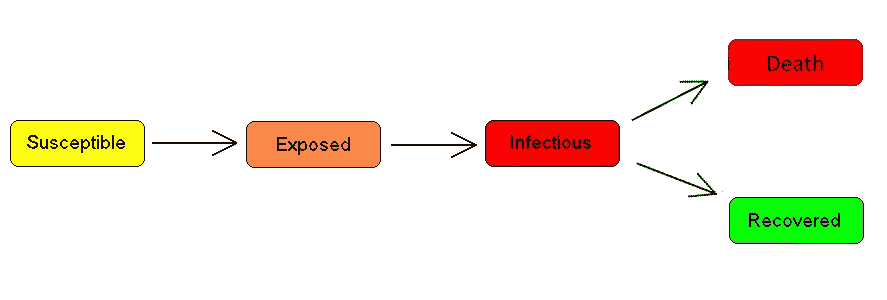****

****由我创造****

****我根据 SIERD 模型对这些进行了建模:(5 个阶数为 1 的微分方程):****

****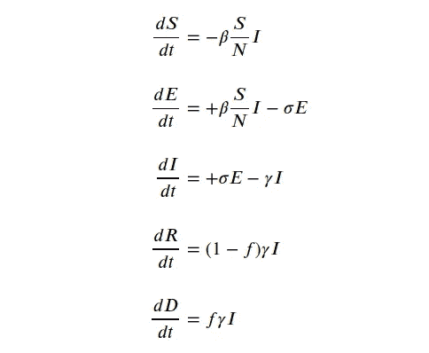****

****写在我的[木星 notbook](https://github.com/Harmouch101/Modeling-Covid-19-SEIRD-/blob/master/NoteBook/covid_19_notebook.ipynb)****

****你们中的一些人可能会问:如何阅读这些方程？请不要惊慌，一切都比看起来的**简单**。等式的左边是我们想要描述的**过程**。在第一个等式中，这是易受影响的数量随时间的变化。第二，暴露的**的数量**如何随时间变化，等等。为了让**更清晰的说明**，只要想想**系数**就像**斜率**，或者**方向**的变化:减少或增加(-表示减少，+表示增加)。这是有道理的，因为在第一个等式中**，系数**为负**。毕竟，随着时间的推移，**易感者**的数量会**减少**。同样的类比将适用于其余的方程。******

**我们之所以在前两个方程中把**除以 N** ，是因为我们在研究 [**依赖频率的疾病传播**](https://parasiteecology.wordpress.com/2013/10/17/density-dependent-vs-frequency-dependent-disease-transmission/) **。****

> ****β:**(**发作**率或社区**接触**比率)是一个常数(概率)，它决定了一个**易感**者与患者**感染**接触并患病的可能性。(此参数与社交距离有关)**
> 
> ****𝜎:** 与**传染性**接触后成为**暴露者的概率( **1/𝜎** :潜伏期**的平均持续时间**)****
> 
> **f:死亡率。**
> 
> ****(1-𝛾)*f** :恢复**的概率****
> 
> ****f*𝛾:** 死亡概率**死亡概率****

****注意**感染者 **(1-𝛾)*f** 将**痊愈**其余 **f*𝛾** 将**死亡**，很不幸…**

**正如你所注意到的，所有方程之间都有某种依赖关系。例如，在给定时间 **t** 内**痊愈**人数，将被描述为**感染人数 **( 𝛾*I )** 与**死亡人数** **( f*𝛾*I).)之差******

# ****Python 实现****

**为了获得由微分方程系统给出的数学模型的数值解，需要以下模块:**

> **1-数字**
> 
> **2-科学**

**允许我们求解这些方程的最**重要的**方法是[**scipy . integrate . odeint**](https://docs.scipy.org/doc/scipy/reference/generated/scipy.integrate.odeint.html)**()**方法。**

**odeint()函数有三个必需的参数和许多选项。它具有以下格式:**

```
**odeint** (**func**, **y0**, **t** ,**args** = (), …):
```

> ****第一个**自变量 **func** 是**两个变量**的函数的 Python 名称，第一个是链表 **y** = [ **y1** ， **y2** ，…， **yn** ，第二个是自变量的名称。**

****func** 函数应为参数 t 的给定值返回 n 个函数值的列表。换句话说，函数 func (y，t)实现了我们的方程组右侧的计算。**

**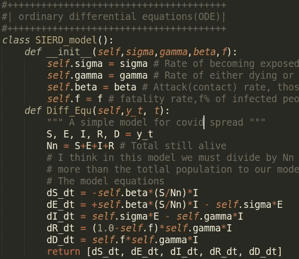**

**我在 [github](https://github.com/Harmouch101/Modeling-Covid-19-SEIRD-/blob/master/NoteBook/covid_19_notebook.ipynb) 上的代码**

> ****第二个**自变量 **y0** 是一个在 **t = t0** 的初始值数组(或列表)。( **y_initial** )。由于我们有 5 个变量，所以我们需要 5 个初始条件 **(S0 E0 I0 R0 D0)****

**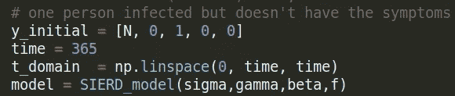**

**我在 [github](https://github.com/Harmouch101/Modeling-Covid-19-SEIRD-/blob/master/NoteBook/covid_19_notebook.ipynb) 上的代码**

> ****第三个**参数是一个**数组**中的时间点，您希望在这些时间点上获得问题的解决方案。在这种情况下，该数组的第一个元素被视为 t0。( **t_domain** )**

****odeint ()** 函数返回一个大小为( **size(t)** x **size(y0)** )的**数组** ( **矩阵**)。在我们的例子中，我们的矩阵有 **5 列(S E I R D)** 和 365 行(t_domain 中每个时间点的每个变量的值)**

**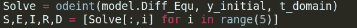**

**[github](https://github.com/Harmouch101/Modeling-Covid-19-SEIRD-/blob/master/NoteBook/covid_19_notebook.ipynb)**

# ****新冠肺炎数据集****

**我在谷歌上找了一个数据集，找到了以下列表:**

> **[**世卫组织**](https://www.who.int/tb/country/data/download/en/)**
> 
> **[](https://www.kaggle.com/account/login?returnUrl=%2Fsudalairajkumar%2Fnovel-corona-virus-2019-dataset%2Fdata)****t******
> 
> ****[ourworldindata](https://ourworldindata.org/coronavirus-source-data)****
> 
> ****[**JHU**CSSE](https://github.com/CSSEGISandData/COVID-19)****

****我**决定**选择**JHU·CSSE**提供的数据集，因为它是目前为止使用最广泛的。
数据集分为**三个**主要**类别**:****

> ******感染**(已确认)****
> 
> ******恢复******
> 
> ******死亡******

# ****使用 Plotly 的交互式绘图****

******精心制作**一个现代**开源**平台，用于构建**可视化**数据。对于各种站点的制作非常有用，特别是对于数据科学来说， **Plotly** 作为库可用于 [**Python**](https://plotly.com/python/) **，** [**R**](https://plotly.com/r/) **和**[**JavaScript**](https://plotly.com/javascript/)**。**也可以用这些语言作为 **web 应用**。****

****使用 **plotly** 中的**graph _ objs**(**go**)包，我们可以生成不同种类的图(线条、条形图、散点图……)****

********

****[github](https://github.com/Harmouch101/Modeling-Covid-19-SEIRD-/blob/master/NoteBook/covid_19_notebook.ipynb)****

****请参考 [**图 Widget**](https://plotly.com/python/figurewidget/) 更好的理解这个功能。我使用这种方法与为估计 sigma、beta、gamma、f 而创建的 **ipywidget** 滑块进行交互。****

****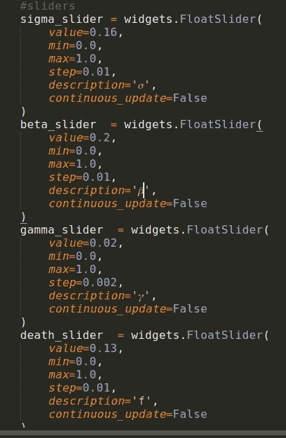****

****[github](https://github.com/Harmouch101/Modeling-Covid-19-SEIRD-/blob/master/NoteBook/covid_19_notebook.ipynb)****

****每次**改变**一个**滑块**的值，程序将**求解**方程并为这些参数生成一个**新图**。在某些**国家**运行该模型将产生以下结果:****

****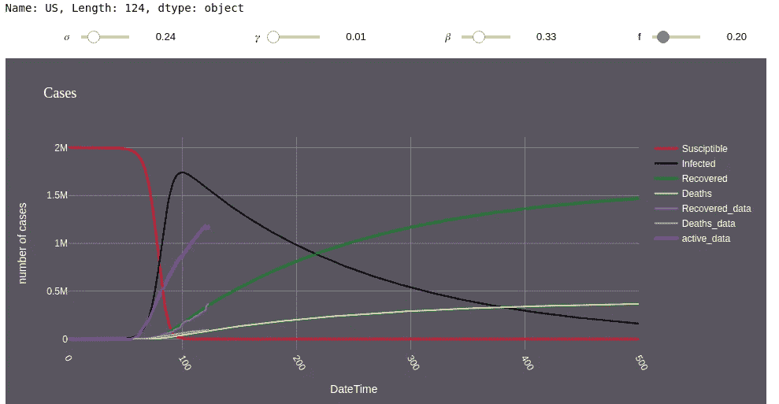****

****美国****

****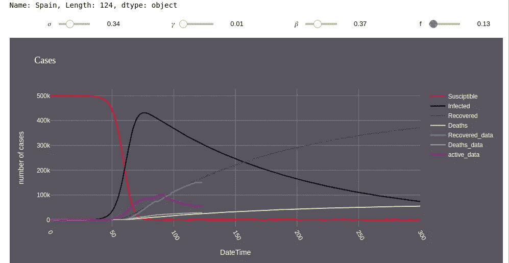****

****西班牙****

****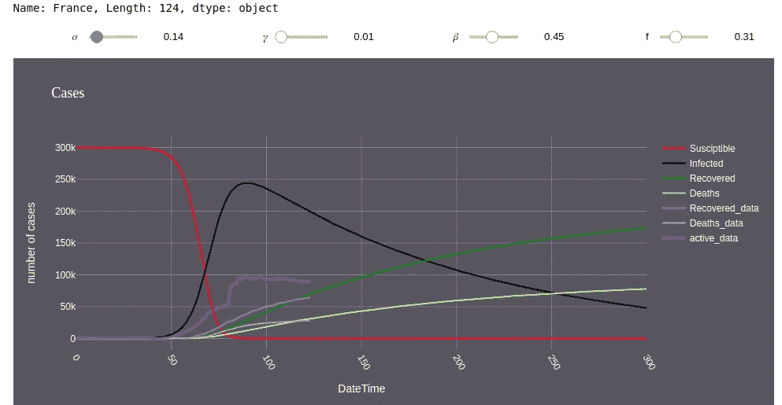****

****法国****

****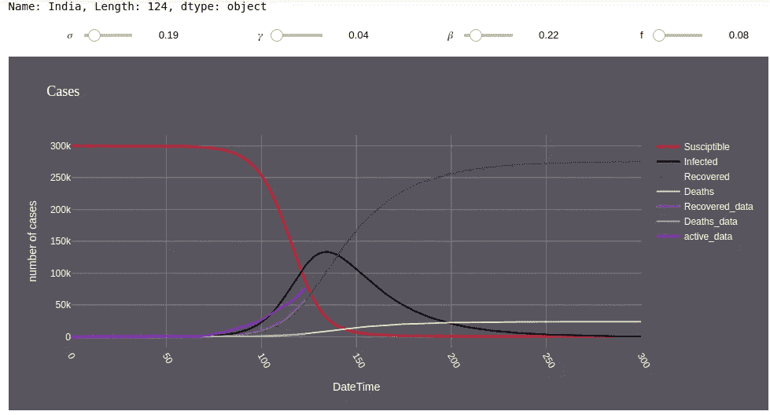****

****印度****

****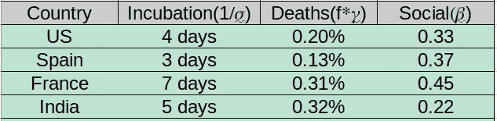****

> ****我**不确定**的死亡率/致死率，但是**潜伏期**和**社交距离**指标似乎是合理的(因为潜伏期在 2 到 14 天之间)****

# ******结论:******

******感谢**与我分享你的时间**阅读**这篇文章，对某些人来说可能是**有用的**，对另一些人来说可能**不是**，但我觉得总体来说没那么糟糕。 **最后一个**和**同样重要的是**，我**不是**专业的数据科学家，但是我想扩展我在每个领域的知识，包括编程****

******如果**你对这个项目**感兴趣**，请看看我的回购，并随时分叉/克隆它，并对它进行你的**修改**。****

****[](https://github.com/Harmouch101/Corona-virus-data-analysis-modeling-and-visualization) [## harmouch 101/Corona-病毒-数据分析-建模和可视化

### 此时您不能执行该操作。您已使用另一个标签页或窗口登录。您已在另一个选项卡中注销，或者…

github.com](https://github.com/Harmouch101/Corona-virus-data-analysis-modeling-and-visualization) 

**有用的资源/链接:**

1.  [估算法国新型冠状病毒的负担](https://science.sciencemag.org/content/early/2020/05/12/science.abc3517)。
2.  [潜伏期。](https://www.acpjournals.org/doi/10.7326/M20-0504)
3.  [世卫组织新冠肺炎](https://www.who.int/emergencies/diseases/novel-coronavirus-2019/)
4.  [回答问题](https://www.who.int/emergencies/diseases/novel-coronavirus-2019/question-and-answers-hub)
5.  [公众意见](https://www.who.int/emergencies/diseases/novel-coronavirus-2019/advice-for-public)
6.  [疾控中心](https://www.cdc.gov/coronavirus/2019-ncov/global-covid-19/index.html)****