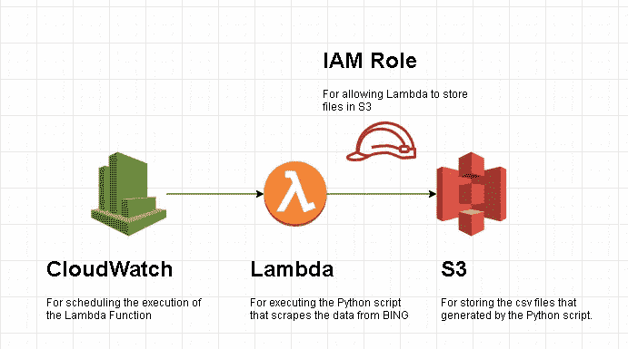
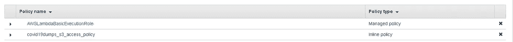
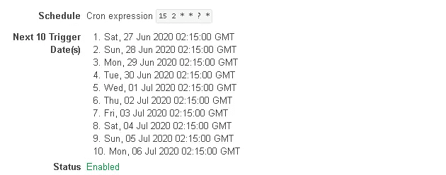
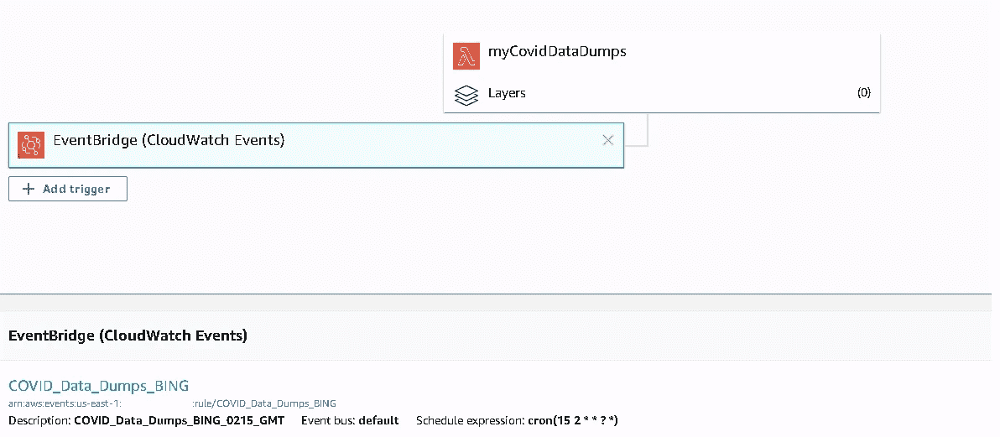
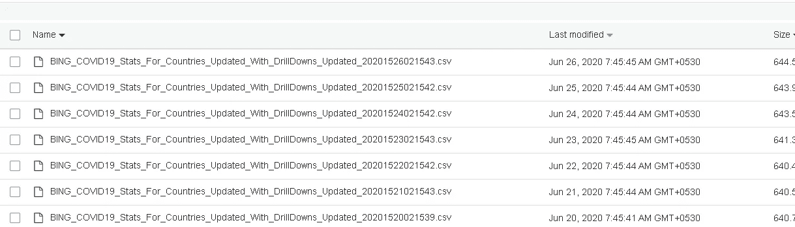
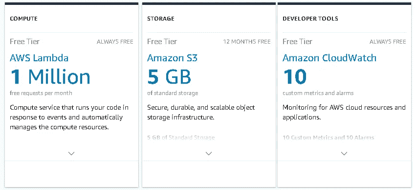

# 新冠肺炎统计收集与 AWS 一个无服务器的食谱，成本为 0.00 美元

> 原文：<https://blog.devgenius.io/covid-19-stats-collection-with-aws-a-serverless-recipe-that-costs-0-00-df0af9b8229c?source=collection_archive---------19----------------------->

克里斯蒂安·威迪格在 [Unsplash](https://unsplash.com?utm_source=medium&utm_medium=referral) 上拍摄的照片

新冠肺炎疫情无疑破坏了经济、正常生活等等。但是有些事情正在蓬勃发展。尤其是那些以疫情为中心的。

追踪疫情号码不是一件容易的工作。政府机构、医疗保健部门、学术界、基层工作者都参与其中。这些数据大多是开源的。在这些艰难的时刻，我们必须保持这种状态，因为“我们知道得越多，我们就能更好地反击”。

在所有这些过程中，最关键的要求之一是合理、及时地归档这些数据。通过这样做，您可以跟踪时间序列中的数字，这些数字可用于预测未来趋势。凭借 AWS 提供的大量免费层(向 AWS 团队致敬),我为 BING 托管的新冠肺炎数据建立了一个每日存档系统。

 [## 微软必应新冠肺炎追踪

### 跟踪新冠肺炎本地和全球冠状病毒的活跃，复苏和死亡率在地图上，每日新闻…

bing.com](https://bing.com/covid/local/india) 

**注意:我这里提到的数据是公开的，任何人都可以访问。**

**在“无服务器”上未发起的发起。**

无服务器计算是一种云服务产品，通过它您可以开发和部署代码，而不必担心基础设施需求。

**制作这个食谱需要的东西:**

1.  内置自由层的 AWS 帐户。就是这样。

在继续之前，我假设您对 AWS 有一些基本的概念。如果你没有，我建议你做一个我保存的播放列表。这是 freecodecamp.org 教授的 10 小时课程。但是你可以通过选择时间(*来浏览你喜欢的组件，这是 freecodecamp 的人在评论区很友好地放在一起的。向你致敬。你很牛逼*)。

我的无服务器应用程序由 3 个关键组件组成。IAM 角色是一个启用程序，允许 Lambda 函数的安全权限访问 S3 以存储文件。

AWS 组件

**让我们看看我构建的解决方案。**

1.  创建一个 S3 存储桶，并将其命名为*covid 19 stats dump-<your AWS account id>*。因为 S3 桶需要是唯一的。因此添加您的 AWS 帐户 ID 是一个好主意。请注意，我包含了一个“连字符”,因为在 bucket 名称中不允许使用其他特殊字符
2.  使用 AWSLambdaBasicExecutionRole 创建 IAM 角色。将此角色命名为“covid 19 stats dump _ lambda _ execution _ role”。附加一个内联策略，以允许访问您在步骤 1 中创建的 s3 存储桶。

内联策略应该如下所示。确保适当地更改存储桶名称。

3.lambda 函数代码很容易实现 3 个目标。

a.向 Bing URL 发出 http 请求并接收响应

b.使用 Beautifulsoup 来通读 http 响应

c.使用熊猫创建一个简单的数据框。

我用熊猫是为了简单，但如果你觉得有创意，请随意。

4.现在这段代码需要托管到 Lambda 中。这里的事情变得更加棘手。部署有两种方式。

*手动设置环境，然后自己创建 zip 包并上传到 Lambda。*

如果您创建的包在大小上是可管理的，并且依赖关系都很好，那么这是可行的。但是由于特定于平台的依赖性，这在某些情况下会变得非常麻烦。请记住，AWS Lambda 运行的是 linux，如果您运行的是 Windows，并且使用的软件包有 linux 版本，那么您可能会遇到麻烦。

*简单的方法，扎帕方法。让我们走简单的路。*

这里有一篇关于用 Zappa 部署一个简单应用的文章。

 [## 使用 Zappa 在 AWS Lambda 上部署一个无服务器的 Web 应用程序

### Zappa 是一种在 AWS Lambda 上部署无服务器 web 应用的方式。在这篇文章中，我们将构建一个简单的 Flask web 应用程序，使用…

pythonforundergradengineers.com](https://pythonforundergradengineers.com/deploy-serverless-web-app-aws-lambda-zappa.html) 

快速浏览如何处理 Zappa。

安装 Zappa。

创建一个虚拟环境，并安装 lambda 函数所需的所有必需的包。

写你的代码。

使用 Zappa init 来配置您的 lambda 凭证。

使用 Zappa deploy 来部署应用程序。

**真的就这么简单**。

Zappa 是一个很棒的 python 包，它有一个命令行界面，可以帮助你部署 lambda 函数，一切都很好。

**注意:当使用 Zappa 时，你的 Lambda 函数将有一个 http 触发器，因为 Zappa 默认创建一个 API 网关 url。但是你可以通过访问 lambda 函数和改变触发器来编辑这个功能。**

在我的例子中，我设置了一个 CloudWatch rul，它运行在 cron-expression 上，在 IST 时间每天早上 7 点 45 分运行，因为我对印度的数据感兴趣。

这是我建立 Lambda 函数后的样子。

每天早上 7:45 存储文件的 S3 存储区的快照

**现在来看一下成本因素:**

正如我在文章中承诺的，我将解释这是一个 0.00 美元的零成本设置。

我使用的免费层服务的快速快照。

AWS 自由层使用的详细概述

 [## AWS 自由层

### 获得免费的 AWS 平台、产品和服务实践经验探索 60 多种产品并开始…

aws.amazon.com](https://aws.amazon.com/free/?all-free-tier.sort-by=item.additionalFields.SortRank&all-free-tier.sort-order=asc&awsf.Free%20Tier%20Types=*all&all-free-tier.q=CloudWatch&all-free-tier.q_operator=AND) 

原来如此。

离别的思绪:

1.  无服务器应用程序提供了一种经济的、可扩展的方式来在云上做一些有趣的事情。
2.  所有云服务 AWS、Azure 和 GCP 都提供免费层。更好的是，如果你来自学术界，你可能会得到更多的基于用例。
3.  如果这个自由层可以在这个疫情时代很好地用来支持决策，那为什么不呢？

我也写关于 Azure 和 GCP 的文章，并且刚刚开始了一个关于 Azure 函数的系列。如果你有兴趣，请查看以下系列。

 [## Azure 虚拟函数—第 1 部分— http 触发器

### 这是我计划撰写的关于 Azure 函数的系列文章的第 1 部分。从标题来看，这是一本傻瓜指南。而我…

medium.com](https://medium.com/analytics-vidhya/azure-functions-for-dummies-part-1-http-trigger-a95cd000bc62)