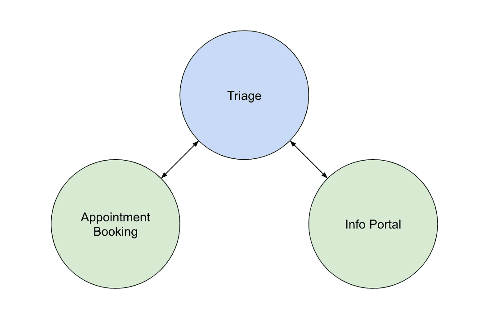
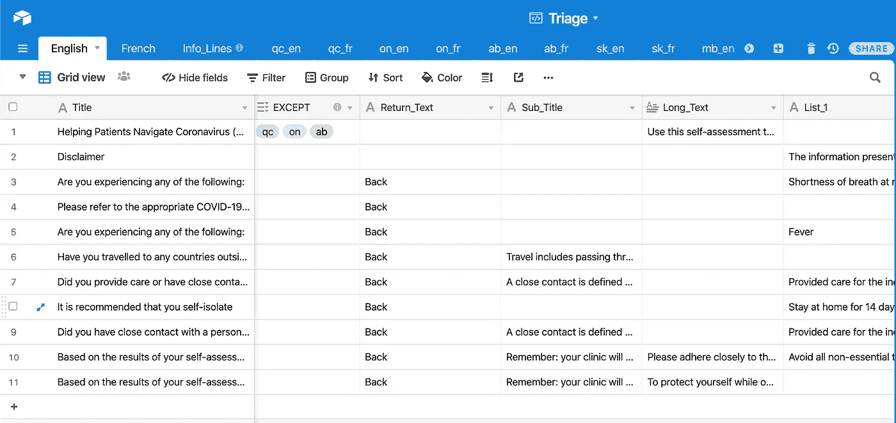
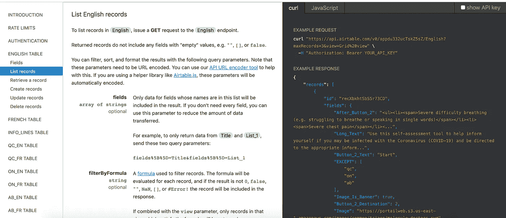
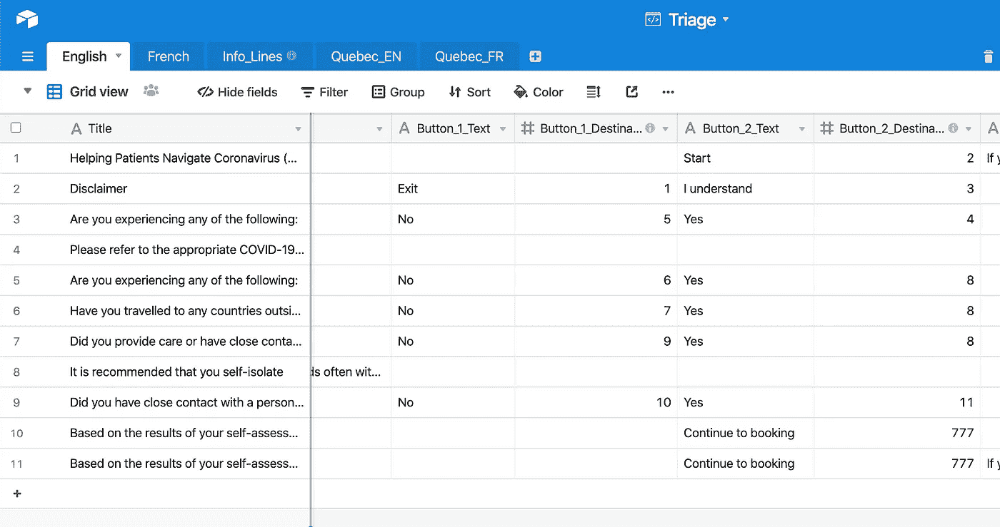
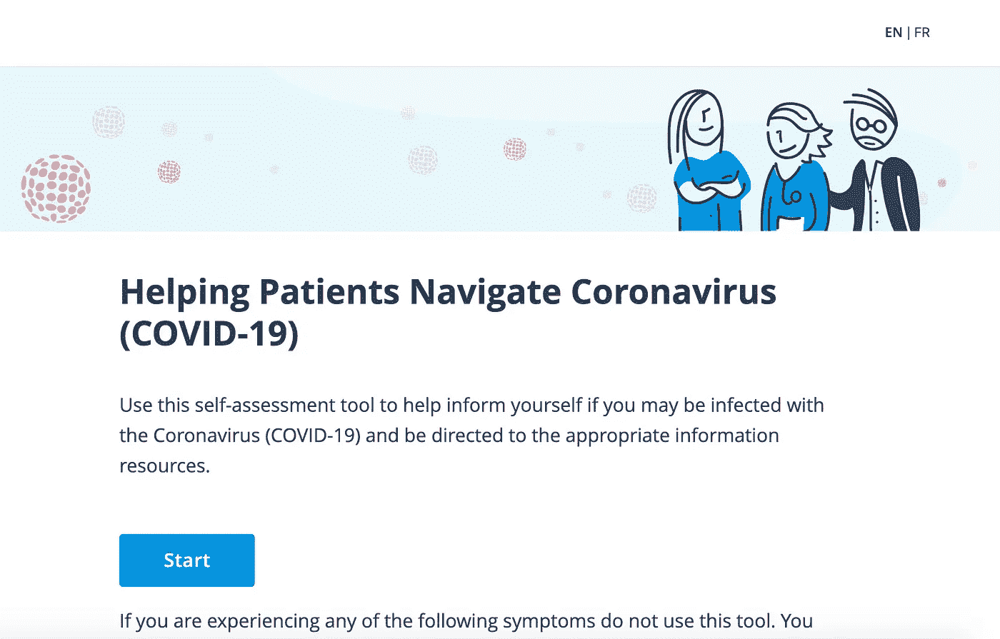

# 新冠肺炎分流——专为不确定性打造的网络应用

> 原文：<https://blog.devgenius.io/covid-19-triage-app-built-for-uncertainty-51254c9cf7a4?source=collection_archive---------27----------------------->

[国家癌症研究所](https://unsplash.com/@nci?utm_source=medium&utm_medium=referral)在 [Unsplash](https://unsplash.com?utm_source=medium&utm_medium=referral) 上拍摄的照片

这是新工作的第一周，但也恰好是 2020 年 3 月 16 日，隔离开始生效。由于 [Chronometriq](https://chronometriq.com/en/) 在医疗技术领域，帮助人们预约诊所，我们也有责任解决我们这个时代的决定性问题。

产品设计来得非常快，我们需要制作一份分流问卷，指引人们找到适当的信息来源，告诉他们呆在家里隔离，或者让他们在诊所预约。没时间问问题了，我们必须尽快把产品推出去。第一步是绘制[决策树](https://docs.google.com/drawings/d/1I3qz63mT5l1NQvsRe1mqFe69C65zscX1Qs8_rLSD1Sk/edit?usp=sharing)以使团队之间的交流更容易，然后我们继续前往 V1。

# V1——又快又脏

我们首先将分流问卷集成到我们现有的应用程序中，因为在现有的应用程序上部署/测试工作要少得多。每个问题添加一个页面，每个页面都有自己的 HTML/CSS/JS 文件，然后聪明地选择路径，在决策树的不同点重用我们的一些页面。我们发货相对较快，在 2 天之内。但是我们意识到，由于新冠肺炎周围的信息每小时都在变化，我们目前的方法远远超出了我们的能力。决策树在各个方向上生长和收缩，页面上的信息经常变化，从使用哪个电话号码到何时建议呆在家里。大约一天后，我们意识到我们最大的问题是我们需要多频繁地更新应用程序。这就是 V2 的灵感来源。

# V2——跳出框框思考

我们需要找到一种方法来快速更新我们的应用程序，而不必通过通常的开发和部署方法。换句话说，如果我们是自己最大的问题，我们如何将自己从等式中移除？

我们的答案是双重的:我们构建一个独立的应用程序，并使用 Airtable 编辑问卷。

独立应用程序

## 独立

我们将该解决方案构建为一个独立的应用程序，托管在自己的 URL 上。这样做的好处是不会阻碍其他应用程序的开发。它还可以更容易地将用户从不同的服务发送到同一个 triage 应用程序，无论用户第一次接触 Chronometriq 是在哪里。

## 充气台

你可以把 Airtable 看作是一种 google sheets，它对开发者来说更加友好。

Airtable 网格视图

除了历史记录、版本控制、提供图像以及电子表格编辑器中常见的功能之外，该工具最重要的部分是忠实于其文档。这就是如今你能从一个网络应用程序中真正要求的。

自动生成的文档

我们获取每页的信息，并将其映射到电子表格中的公共变量。它背后真正的魔力是我们如何组织决策树。

按钮目的地

每行代表决策树中的一个不同步骤。应用程序中的不同视图。每个按钮都以一个数字作为目的地。该数字代表您在下一页的最后一行。

这使我们能够部署一个独立的 Airtable 应用程序，该应用程序从电子表格中提取 JSON，并将其转换为适应性很强的 triage 问卷。

应用程序的第一页

这个解决方案最优雅的部分可能不是它有多容易修改，而是我们在几个小时内从想法到原型。

# 部署障碍

正如 Airtable 在其关于费率限制的文档中明确指出的:

> " API 被限制为每个 base 每秒 5 个请求。如果超过此速率，您将收到 429 状态代码，并且需要等待 30 秒，后续请求才会成功。

这意味着如果我们要将 JSON 用于生产目的，我们需要缓存它。我们首先编写一个小的节点脚本，将 JSON 作为文件写入。/src/assets 运行构建脚本时的目录。这允许我们在开发环境中使用 Airtable，并且在生产环境中拥有静态的不可变信息。

将信息保存到应用程序中的 JSON 文件会导致用户必须清除缓存才能获得最新版本的问题。这也意味着开发团队必须在每次表更新时进行构建。

这就是为什么我们最终构建了一种从 AWS S3 桶中存储和检索 JSON 的方法。这允许大规模检索信息，并允许我们为产品团队制作按钮，以将 Airtable 中的更改发布到生产中。

# 结论

该团队现在有了一个独立的应用程序，可以重新用于任何其他问卷需求，而不会使我们现有的任何应用程序变得混乱。