# 使用 SQL 进行 Covid 数据分析

> 原文：<https://blog.devgenius.io/covid-data-analysis-using-sql-b7215fa3d766?source=collection_archive---------6----------------------->


[斯科特·格雷厄姆](https://unsplash.com/@homajob?utm_source=medium&utm_medium=referral)在 [Unsplash](https://unsplash.com?utm_source=medium&utm_medium=referral) 上拍照

*还记得 covid 对我们来说完全陌生的时候吗？但后来成了生活的一部分。*

## 概观

本文将使用 SQL 分析从 2020 年 1 月 1 日*到 2021 年 4 月 31 日*来自世界各地的 covid 数据，以挖掘一些有意义的见解。

## 数据收集

用于分析的数据已经从 [OurWorldInData，](https://ourworldindata.org/covid-deaths)下载，但是由于现在是 2022 年，数据将与我在本文中使用的数据大不相同。你可以从[这里](https://github.com/ushnak-tech/Covid_Data_Analysis)下载这个项目中使用的数据。

## 导入数据

我使用 MySQL Workbench 导入数据。数据需要转换成 CSV 格式(如果还没有的话),以便能够导入 MySQL Workbench。以下是如何导入数据以开始处理数据:


转到您的数据库，然后右键单击*表格*，然后选择*表格数据导入向导*，浏览您的文件，然后单击下一步。

## 数据探索

开始分析时，让我们先了解我们的表: *coviddeaths* 和*covidnevaccines。*

```
desc coviddeaths;
desc covidvaccinations;
```

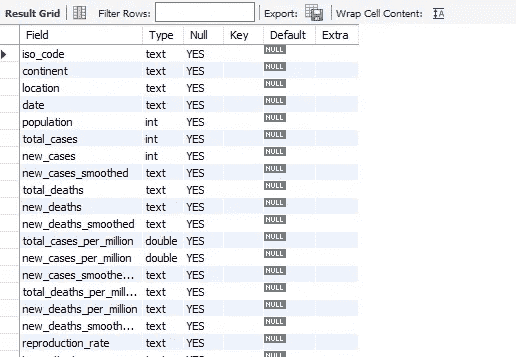

coviddeaths


coviddeaths

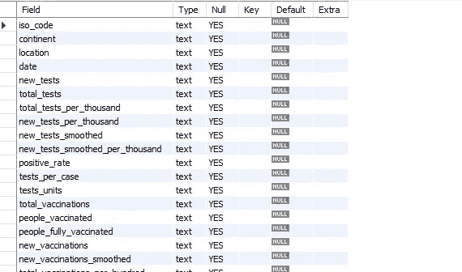

协同疫苗接种

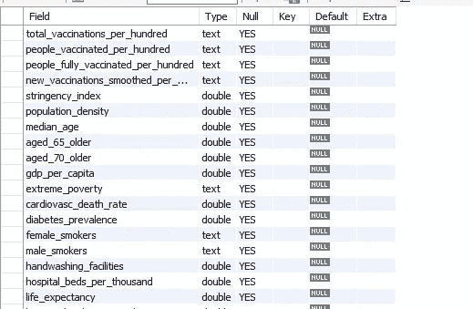

协同疫苗接种

这些数据中有很多需要分析，但我们将只分析几列。

1.  总行数:

```
select count(*) from coviddeaths;  -- total rows 
select count(*) from covidvaccinations;
```

我们的数据集中总共有 84241 行。

我意识到的一件事是，日期列是文本数据类型，其他列如 total_deaths 和 new_deaths 也有同样的问题，所以我们需要将这些列转换为它们各自的数据类型，如将日期列转换为日期类型，其他列必须为 int 类型。

下面是我如何解决日期列的问题:

```
-- adding another column of date with date as a datatype cuz the previous date column was in text datatype 
alter table coviddeaths 
add column date_2 date; 
update coviddeaths 
set date_2= STR_TO_DATE(date, "%m/%d/%Y")alter table covidvaccinations 
add column date_2 date;  
update covidvaccinations 
set date_2= STR_TO_DATE(date, "%m/%d/%Y");
```

对于其他列，我在运行包含这些列的查询时转换了数据类型。

2.总死亡人数与总病例数之比:

```
select location, sum(new_cases) Total_cases , sum(new_deaths) Total_Deaths,concat(round(sum(new_deaths)/sum(new_cases)*100,2),'%') Death_Ratio
from coviddeaths
where continent!=''
group by location
order by Death_Ratio desc;
```

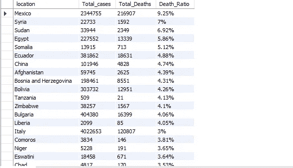

墨西哥的死亡率最高，其次是叙利亚和苏丹。中国也是总病例死亡率最高的国家之一。

3.印度及其邻国的死亡率

```
select location,population, sum(new_cases) Total_cases , sum(new_deaths) Total_Deaths, concat(round(sum(new_deaths)/sum(new_cases)*100,2),'%') Death_Ratio
from coviddeaths
where location='India' or location='Pakistan'or location='Bangladesh'or location='China'or location='Afghanistan'or location='Sri Lanka'or location='Nepal'
group by location
order by Death_Ratio desc;
```

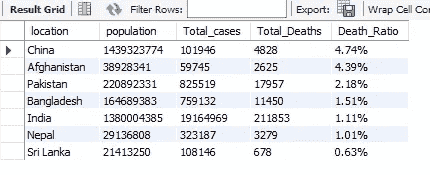

中国的死亡率最高，其次是阿富汗和巴基斯坦。印度的死亡率为 1.11%，这意味着受感染的人有 1.11%的机会死于 covid。

4.病例总数与人口

```
select location, population, sum(new_cases),round((sum(new_cases)/population)*100,2) Infection_Ratio
from coviddeaths
where continent!=''
group by location
order by Infection_Ratio desc;
```

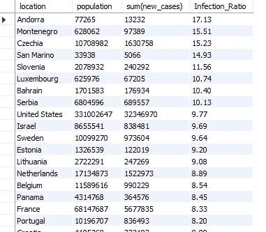

安道尔的感染率最高，为 17%。美国、以色列、法国和瑞典是感染率最高的前 20 个国家。

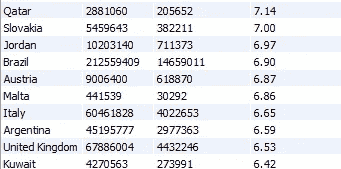

英国、奥地利、卡塔尔、约旦和科威特等国家的感染率为 6-7%。

5 .人均死亡率最高的国家

```
select location, population, sum(new_deaths),round((sum(new_deaths)/population)*100,2) Death_percentage
from coviddeaths
where continent!=''
group by location
order by Death_percentage desc;
```

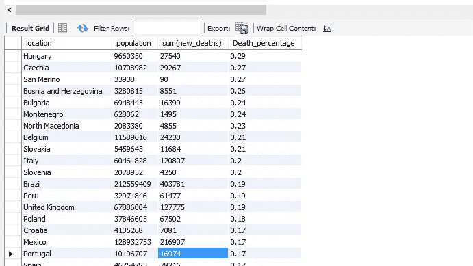

6.按大洲细分

```
select continent, sum(population), sum(new_deaths)
from coviddeaths
where continent!=''
group by continent;
```

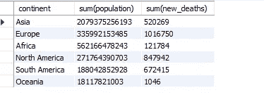

7.人均死亡人数最多的大陆

```
select continent, sum(population) Total_Population, sum(new_deaths) Total_Deaths, sum(new_deaths)/sum(population) Death_Percentage
from coviddeaths
where continent!=''
group by continent;
```

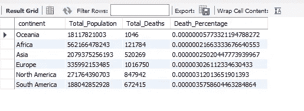

大洋洲的死亡率最高。大洋洲包括澳大利亚、巴布亚新几内亚、新西兰、斐济、密克罗尼西亚、瑙鲁、萨摩亚、所罗门群岛、汤加、瓦努阿图和马绍尔群岛。

8.全球数字

```
select date_2, sum(new_cases) Total_case, sum(new_deaths) Total_Deaths, (sum(new_deaths)/ sum(new_cases))*100 DeathPercentage
from coviddeath
swhere continent!=''
group by date_2
order by date_2;
```

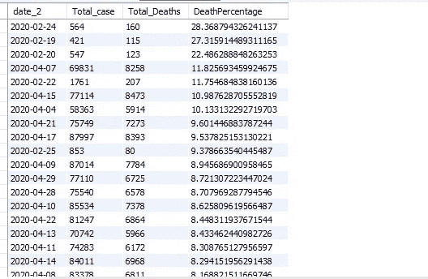

2020 年 2 月 24 日，记录的最高死亡率为 28%。

9.截至 2021 年 4 月 30 日各地接种疫苗总数

```
-- creating a view  
create or replace view covid_data as 
select d.iso_code,d.continent,d.location,d.population,d.date_2,d.new_cases,d.total_cases,d.new_deaths,d.total_deaths, v.new_tests,v.total_tests,v.total_vaccinations,v.people_vaccinated,v.people_fully_vaccinated, v.new_vaccinations,v.gdp_per_capita,v.extreme_poverty,v.human_development_index,v.female_smokers,v.male_smokers,v.cardiovasc_death_rate from coviddeaths d 
join covidvaccinations v on
d.location=v.location
and d.date_2=v.date_2
where d.continent!='';-- total vaccinations achieved by the end of 30th april 2021 by location
select location, population, date_2, new_vaccinations, sum(new_vaccinations) over (partition by location) Total_vaccinations
from covid_data;
```

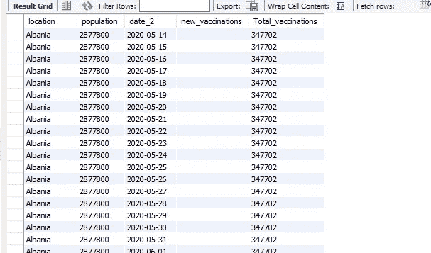

10.到 2021 年 4 月底接种疫苗的人口比例

```
select location,population, sum(new_vaccinations) Total_vaccinations,(sum(new_vaccinations)/population*100) Vaccination_rate
from covid_data
group by location
order by vaccination_rate desc;
```

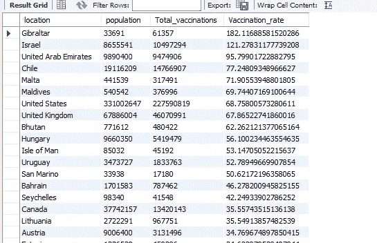

有些国家的总疫苗接种数为零，但我认为这是一个数据问题，因为有些国家，如阿富汗，我们没有任何新疫苗接种的记录，但截至 2021 年 4 月底，共有 20 万人接种了疫苗。

接种总数实际上是接种人数+完全接种人数的总和。

有些国家，比如以色列，其疫苗接种总数高于人口总数。

调查结果:

1.  墨西哥的死亡率最高，接近 10%。叙利亚、苏丹、埃及和中国是总病例死亡率最高的 10 个国家之一。
2.  印度的死亡率为 1.1%，低于中国、巴基斯坦、阿富汗和孟加拉国等几个邻国。
3.  美国、以色列、法国和瑞典是感染率最高的前 20 个国家。
4.  2020 年 2 月 24 日，记录的最高死亡率为 28%。
5.  美国，英国，匈牙利，智利，阿联酋，不丹和马尔代夫有超过 50%人口接种疫苗。
6.  在像以色列这样的国家，接种疫苗的总人数高于全国总人口。

> *参考:*
> 
> [Youtube](https://www.youtube.com/watch?v=qfyynHBFOsM&list=PLUaB-1hjhk8H48Pj32z4GZgGWyylqv85f&index=1)

完整的代码可以在[这里](https://github.com/ushnak-tech/Covid_Data_Analysis)获得。

谢谢大家！！！