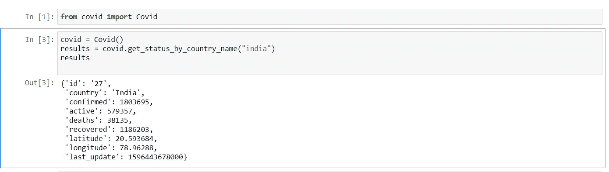
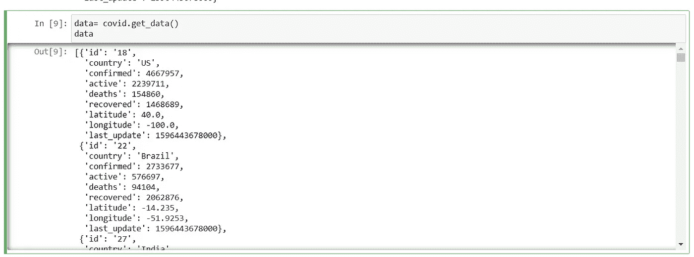

# COVID:不是病毒，是神奇 Python 中的库。

> 原文：<https://blog.devgenius.io/covid-not-a-virus-a-library-in-magical-python-7d73dcb6e381?source=collection_archive---------13----------------------->

Python 以其库而闻名。所以，让我们来看看这个神奇的 Covid 库。


你好勇士们，希望你们在世界疫情期间都平安到家。本文不是关于 covid 病毒的，是关于 covid 库的。

[约翰霍普金斯大学](https://www.jhu.edu/)和 [worldometers.info](http://worldometers.info) 提供了这个 python 包来获得新的 corona 病毒更新。使用 matplotlib、numpy、requests、table、beautiful soup 库，在 python 中还有其他获得 covid 相关信息的方法。但是，这个库可以帮助你用最少的行数获得信息。

要安装 covid 库，请参见下面的代码片段

```
 pip install covid
```

让我们看看模块的基本功能:

```
covid = Covid()results = covid.get_status_by_country_name(“india”)
#Here we get the status of Covid pandemic only for India. You can get the results of the country you want by replacing India with country nameresults
```

您可以在控制台中看到以下输出



输出

如果您想要所有国家的数据，您可以使用下面的代码片段

```
data= covid.get_data()#this "get_data" will give you the status of all the countries.print(data)
```



输出

您也可以通过使用以下代码片段使用国家 Id 来获取数据。

```
cases = covid.get_status_by_country_id(18)
cases
```

> **试试这个包的不同模块，如果你觉得这篇文章有用，请鼓掌表示感谢**。


照片由[联合国新冠肺炎回应](https://unsplash.com/@unitednations?utm_source=medium&utm_medium=referral)在 [Unsplash](https://unsplash.com?utm_source=medium&utm_medium=referral)