# CPU 调度过程

> 原文：<https://blog.devgenius.io/cpu-scheduling-process-d1d83fdd3fe8?source=collection_archive---------6----------------------->

CPU 调度是从就绪队列中选择要执行的进程。CPU 调度是多道程序设计的一个概念，其中 CPU 可互换地用于不同的进程。一个进程由两个周期组成，即突发 I/O 和突发 CPU，它们交替进行，直到进程完成。CPU 调度有 4 种方案，即:

*   从运行状态更改为就绪状态
*   从等待状态变为就绪状态
*   从运行状态更改为等待状态
*   结束的

在模式 1 和 2 中，它可以说是抢占式的，这意味着它可以被另一个进程替换，或者另一种语言可以被中断。方案 3 和方案 4 被称为非抢占式，这意味着它们不能被其他进程替代，必须执行到完成，换句话说，它们不能被中断。

当 CPU 空闲时，操作系统必须选择主存(就绪队列)中的进程来执行，并将 CPU 分配给其中一个进程。这种选择叫做**短期调度器** (CPU 调度器)。

CPU 调度中的另一个组件是调度程序，**调度程序**是一个模块，它将在短期调度期间对 CPU 执行的进程选择进行控制。调度程序停止一个进程并启动另一个进程所花费的时间称为**调度延迟**。

如果在一个进程中，CPU 突发远远大于 I/O 突发，则称为 **CPU 受限**。反之亦然称为 **I/O 绑定**。

# 抢先调度

抢先调度意味着操作系统能够暂停正在运行的进程，为更高优先级的进程腾出空间。这种调度可能包括进程或 I/O 调度。抢占式调度允许系统更好地保证每个进程获得一片运行时间。并且还使系统更快地响应要求一个或多个进程快速反应的外部事件(例如输入数据)。进行抢占式调度的优点是系统比使用非抢占式调度的系统响应更快。

在任何给定的时间，流程可以分为两类:

1.  具有很长 I/O 突发的进程称为 I/O 绑定。
2.  具有很长 CPU 突发的进程称为 CPU 受限。

有时，系统也会经历一种称为 busywait 的情况，即系统等待输入请求(如磁盘、键盘或网络)。当 busywait 时，进程不做任何有成效的事情，但是仍然消耗 CPU 的资源。使用抢先调度，这是可以避免的。

换句话说，抢占式调度涉及一种中断机制，它中断当前正在运行的进程，并迫使系统决定下一步执行哪个进程。

在抢占式调度中，一个进程被允许执行的时间长度称为时间片/时间片。调度每隔一个时间片单元运行一次，以选择下一个要运行的进程。如果时间片太短，那么调度程序将占用太多的处理时间，但是如果时间片太长，那么进程将无法像预期的那样快速响应外部事件。

# **非抢占式调度**

非抢占式调度是一种调度类型，其中操作系统从不从当前运行的进程切换到另一个进程。换句话说，正在运行的进程不能被中断。非抢占式调度仅发生在进程:

1.  从运行状态运行到等待状态。
2.  停产。

这意味着 CPU 保持该进程，直到它进入等待状态或被终止(该进程没有被中断)。Microsoft Windows 3.1 和 Macintosh 使用这种方法。这是一种可以用于某些硬件平台的方法，因为它不需要特殊的硬件(例如用于中断抢占式调度方法的定时器)。

# 调度标准

不同的 CPU 调度算法会有不同的属性。所以选择这个算法，首先要考虑算法的性质。有几个标准用于比较 CPU 调度算法，包括:

1.  CPU 利用率。预计 CPU 总是处于繁忙状态。CPU 利用率以百分比表示，即 0–100%。但实际上，它的范围只有 40-90%。
2.  吞吐量。是单位时间内完成的过程的数量。
3.  周转时间。执行一个进程所花费的时间，从开始等待请求主存中的一个位置，在就绪队列中等待，由 CPU 执行，以及进行输入输出。
4.  等待时间。进程在就绪队列中等待的时间。这个等待时间不会影响进程的执行和 I/O 的使用。
5.  等待时间。进程在就绪队列中等待的时间。这个等待时间不会影响进程的执行和 I/O 的使用。
6.  公平。确保每个进程将获得公平份额的 CPU 使用时间。

# 调度算法

CPU 调度包括确定就绪队列中将要分配给 CPU 的进程。有几种 CPU 调度算法，即:

1.  先来先服务调度
2.  最短任务优先计划程序(SJF)
3.  优先级调度
4.  循环调度

# 先来先服务调度

先到先得。爆裂时间长短无所谓。FCFS 算法是非抢占式调度，正在处理的进程必须先完成，然后才能为其他进程提供服务。

FCFS 的缺点:

*   平均等待时间相当长。
*   护航效应的发生，即等待很长时间的进程等待 1 个正在被 CPU 执行的大进程。

例如，将由 CPU 执行的过程如下:

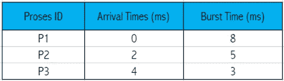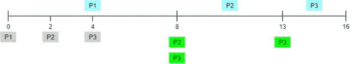

ST =中央处理器服务的进程开始时间

CT = CPU 执行的进程完成时间(ST + BT)

WT =队列中的等待时间(ST-AT)

TAT=处理系统所用时间(CT-AT)

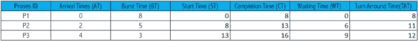

平均等待时间为:

(0 + 6 + 9 ) = 15 / 3 = 5 ms

周转时间是:

(8 + 11 + 12 ) = 10.33 ms

# 最短作业优先调度程序(SJF)

一种调度算法，其中之一是最短作业优先调度算法。在该算法中，**就绪队列中的每个进程都将根据最小的突发时间**执行。这导致每个进程的等待时间都很短，正因为如此，平均等待时间也很短，所以可以说**这个算法是最优算法。**

该算法可以是**优先**或非优先。如果先占，如果任何进程到达时的突发时间比当前正在执行的进程短，那么该进程将替换当前正在执行的进程。在非抢先模式下，正在进行的进程不能被替换，必须等待直到突发完成

## 最短作业优先算法的计算步骤

等待时间:作业等待执行的时间

周转时间:作业到达，直到被 CPU 完成所花费的时间

平均等待时间:平均等待时间

*   制作甘特图

## **优势与劣势**

优势:

*   为排队进程集合提供最小等待时间。
*   SJF 调度效率高，周转时间短。

弱点:

*   无法预测接下来将执行的进程的突发时间。
*   突发时间更多的进程会有更长的等待时间，因为最先执行的进程是突发时间更少的进程。

# 抢先算法

抢先调度意味着**操作系统能够暂停正在运行的进程，为优先级更高的进程**腾出空间。如果 CPU 正在执行一个进程，并且就绪队列中有一个进程的突发时间比正在执行的进程短，则 CPU 当前正在执行的进程将被就绪队列中的进程替换。抢先 SJF 也被称为最短剩余时间优先调度。

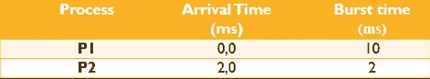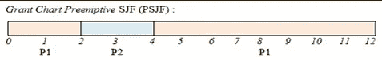

解决方案表:

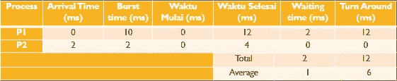

# 非抢占算法

非抢占式调度是一种操作系统从不从当前运行的进程切换到另一个进程的调度。换句话说，正在运行的进程不能被中断。即使新进程的突发时间更短，CPU 也不允许就绪队列中的进程转移 CPU 当前正在执行的进程。

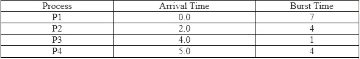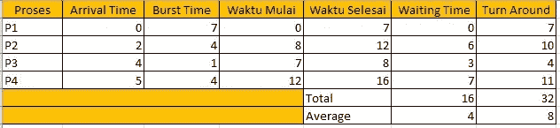

# 优先级调度

优先级调度是一种对优先级最高的进程进行优先级排序的调度算法。每个过程都有自己的优先级。

这些优先级可以通过几个特征来确定，包括:

*   限期
*   内存要求
*   文件存取
*   I/O 突发与 CPU 突发的比较
*   过程重要性
*   优先级调度抢占式

在抢占式优先级调度中，如果一个新进程的优先级高于当前正在运行的进程，那么正在运行的进程将被停止，然后 CPU 将被重定向到新到达的进程。

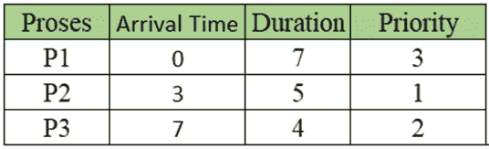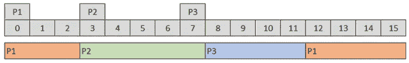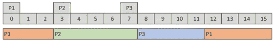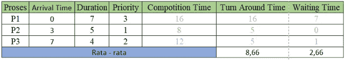

*   优先级调度非抢占式

另一方面，在非抢占式优先级调度中，当具有比当前进程更高优先级的新进程到达时，具有更高优先级的新进程不会干扰正在运行的进程，而只会进入队列。

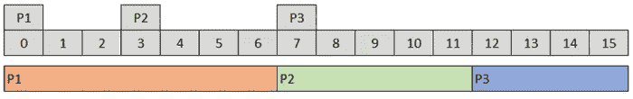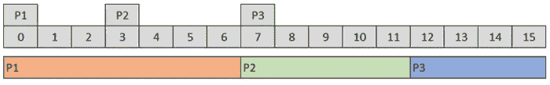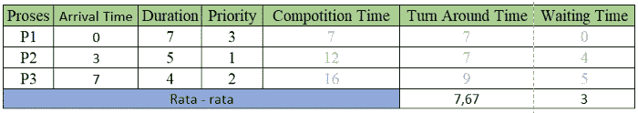

# 循环调度

循环调度是一种进程调度，该算法循环队列中的进程。该进程将获得一个时间配额。如果时间段用完或者进程已经完成，CPU 将被分配给下一个进程。在这个进程调度中，没有进程被区分优先级，所有进程从 CPU 获得相同的时间份额。分时是这个算法的基本概念。基本上，这个算法和 FCFS 是一样的，只是它是抢占式的。

优势:

1.  最简单的算法。
2.  如果进程的大小小于它的时间槽，开销会很小
3.  防止死锁或 starvision 情况的发生

缺点:

1.  大流程的等待时间非常长
2.  频繁护航效应
3.  如果时隙太小，那么有些流程是无法用一个时隙完成的。

## 循环调度术语

1.  如果量程用完并且进程没有完成，那么正在运行的进程变得就绪，并且处理被转移到另一个进程，
2.  如果量程没有用完，并且进程正在等待一个事件(例如等待 I/O 操作的完成)，那么正在运行的进程将被阻塞，该进程将被转移到另一个进程。
3.  并且如果量程尚未耗尽但是进程已经完成，则正在运行的进程被终止，并且处理被转移到另一个进程。

例如，将由 CPU 执行的过程如下:

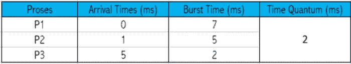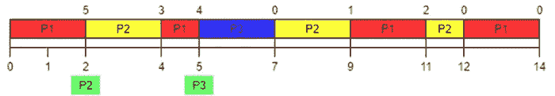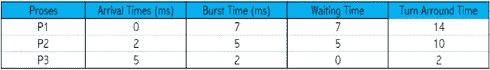

平均等待时间为:

(7 + 5 + 0 ) / 3 = 4 毫秒

周转时间是:

(14 + 10 + 2 ) / 3 = 8.66 毫秒