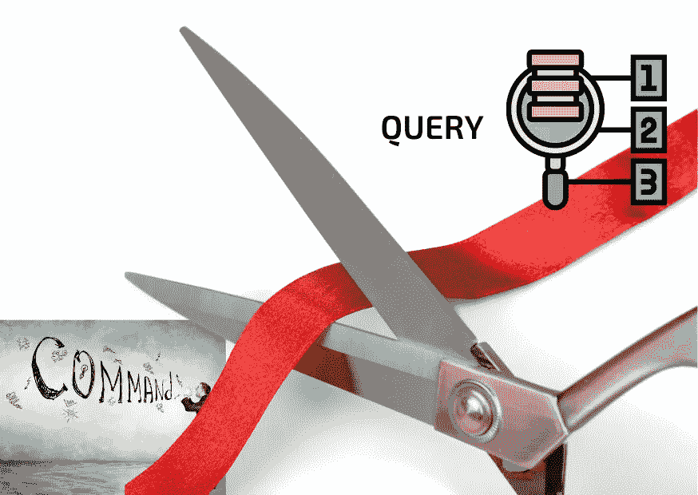

# CQS(命令-查询分离)

> 原文：<https://blog.devgenius.io/cqs-command-query-separation-5c94a0c0d9e1?source=collection_archive---------5----------------------->

# 知识在实践中就是力量

受 DbC(契约式设计)的启发，我开始从实现几个契约的过程中体验这个概念，以明确是客户(调用方)还是供应商(被调用方)负责功能正确性。我已经发表了几篇文章，记录了我在这方面的学习历程。

 [## 通过合同进行内部设计

### 可靠性的本质

uragilecoach.medium.com](https://uragilecoach.medium.com/step-inside-design-by-contract-a06a7a49271f) 

[在 Rust 中实施合同设计](/implement-design-by-contract-in-rust-3842ec9ba3c4)

[合同与继承](https://uragilecoach.medium.com/contract-and-inheritance-dee312b9d066)

[3 合同设计的好处](/3-benefits-of-design-by-contract-d5752f3c7468)

有趣的是，我偶然发现了某个想法: [CQS](https://en.wikipedia.org/wiki/Command%E2%80%93query_separation) ，它也被收录在 [Eiffel 编程语言](https://en.wikipedia.org/wiki/Eiffel_(programming_language))中。它为我提供了另一个角度来审视我们如何与数据互动。一般来说，我们必须对前置条件和后置条件进行编码，它们本质上是“断言”，以确保契约不被违反。在这个过程中，我们在执行前检查状态，执行一个函数，并在执行后检查状态。

所有这三个动作都只获取状态或执行一个动作，不会相互混合以避免数据污染。这种方式我们在软件工程中称之为 **CQS** 。

# 什么是 CQS？

CQS 是“命令-查询分离”的缩写。大多数读者可以从外观上猜出它的含义，这是由[埃菲尔编程语言](https://en.wikipedia.org/wiki/Bertrand_Meyer)[之父](https://en.wikipedia.org/wiki/Eiffel_(programming_language))伯特兰·梅耶提出的。

> **每个方法要么执行一个动作(命令)，要么返回一个状态(查询)给调用者**。

当我第一次了解这个概念时，它让我想起我以前是否曾经将动作和查询混合在一起。我开始思考是否应该在我的编程工作中贯彻这一原则，因为这在当代软件工程中似乎不是一个新的想法，但在数据操作方面却是一个重要的规则。

事实上，当我们在数据库上执行一些查询工作或与对象交互时，我们不喜欢修改任何状态，这可能会导致此后的同步问题。因此，该原则旨在将“改变状态的动作”与“返回数据的查询”分开；它让开发人员专注于识别他们现在正在做的操作。

我正在做一个[项目](https://github.com/tsunghsiang/pokemon-trading-platform)制作一个后端交易平台，有一个数据库模块同时采用了 [DbC](https://www.eiffel.com/values/design-by-contract/introduction/) 和 [CQS](https://en.wikipedia.org/wiki/Command%E2%80%93query_separation) 的技术。例如，当客户向我们的后端系统发送请求时，我们必须将其记录在我们的数据库(命令)中，并确保数据确实存在(查询)。

上面的代码只是将一个请求插入到相应的数据库中，并将检查责任留给另一个查询函数，如下所示:

关于 [CQS](https://en.wikipedia.org/wiki/Command%E2%80%93query_separation) 有两个优点值得一提。首先，它极大地简化了操作逻辑，因为它将操作从返回数据中分离出来。其次，该概念进一步推动了 [DbC](https://www.eiffel.com/values/design-by-contract/introduction/) 技术的发展，因为开发人员只需要通过编写前置条件和后置条件来检查合同是否被违反，这两者本质上都是“查询”。最后，它减少了测试的复杂性，因为我们只需要执行一个动作，然后检查我们计划的状态是否改变。

# CQS 的局限性

然而，并不是所有的条件都可以采用 [CQS](https://en.wikipedia.org/wiki/Command%E2%80%93query_separation) 。有时我们必须在同一个操作中执行动作和数据返回。例如，你可能在数学图书馆里天生就有如下的东西。

`pub fn add(a: int, b: int) -> i32`

该函数执行两件事:一件是对两个参数求和；另一个用于返回最终结果。但是这个不适合 CQS，因为它只做纯计算并返回结果。

有些人可能认为没有必要采用 [CQS](https://en.wikipedia.org/wiki/Command%E2%80%93query_separation) ，因为他们可以在相同的代码段执行操作和查询。在大多数情况下，他们是对的。我真正关心的是什么时候在我们的编程工作中采用这种技术。在我看来，如果你的模块与状态变化或者持久性需求相关联，这个概念可能适合你的工作，再加上 [DbC](https://www.eiffel.com/values/design-by-contract/introduction/) 技术。

# 蔻驰杂音

我很乐意写关于[贝特朗·迈耶](https://en.wikipedia.org/wiki/Bertrand_Meyer)开创性工作的文章。虽然 CQS 在外观上很简单，但它确实帮助我重新思考了我应该如何操作一个对象，以保证某些状态不会被偶然改变。最重要的是，我开始专注于使操作更加可信:无论是命令还是查询，这似乎会产生冗余代码，但会降低测试复杂性的风险。

仍然有许多书籍上的敏捷方法没有被我们的工作所采用，即使它们已经出版很久了。试着把它们挖掘出来，并整合到 Scrum 框架中，以产生生产力。

—

如果你认可我与你分享的价值，请做如下:
1。**拍**条
2。**订阅**我最新内容
3。**在其他平台关注**我了解更多信息
-IG:[@ ur _ Agile _ coach](https://www.instagram.com/ur_agile_coach/)
-播客(中文):[敏捷火箭](https://player.soundon.fm/p/7f7dc3df-d738-405c-8cf9-02157a92ec61)
- Youtube: [你的敏捷蔻驰](https://www.youtube.com/channel/UCzD0wQmD1n4MuTKk-JocACA)
- LinkedIn: [吴宗祥](https://www.linkedin.com/in/tsung-hsiang-wu-8542409b/)

如果您需要咨询或其他形式的合作，请发送邮件至:**urscrummaster@gmail.com**