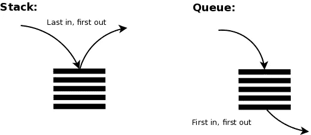

# 破解数据结构面试

> 原文：<https://blog.devgenius.io/cracking-the-data-structure-interview-c94394dc68b7?source=collection_archive---------7----------------------->

这里是你可以从编码面试开始的地方。


[万花筒](https://unsplash.com/@kaleidico?utm_source=medium&utm_medium=referral)在 [Unsplash](https://unsplash.com?utm_source=medium&utm_medium=referral) 上拍摄的照片

而在编码面试中，我们总是有不同类型的算法问题。在我们开始考虑解决方案之前，我们了解基本的数据结构吗？这里我分享一下编码面试的基础:数据结构。

在我们深入研究数据结构之前，让我解释一下什么是时间复杂度/大 O。大 O 允许我们表达运行时间如何伸缩。基本上，它描述了数据增长的速率。下面是比较速率差异的典型图像。


来源:[randers 112358](https://medium.com/@randerson112358)

图像反映了处理结果的时间，而数据输入随着您设计的算法而增长。

只有学会了数据结构和时间复杂度，才能开始思考算法题的解法。在本文中，我将解释 Java 中的 8 种典型数据结构，以及它们在搜索、添加、删除和更新时的时间复杂度。

# 排列

```
**public** **static** **void** main(String args[]){ArrayList<String> al = **new** ArrayList<>();al.add("value1");al.add("value2");al.add(1, "value3");System.out.println("Initial ArrayList " + al);al.set(1, "To");System.out.println("Updated ArrayList " + al);}// output
Initial ArrayList [value1, value3, value2]
Updated ArrayList [value1, To, value2]
```


来源: [GeeksForGeeks](https://www.geeksforgeeks.org/)

有两种类型的数组:固定大小的数组和动态数组。在 java 中，Array 是固定大小的，ArrayList 是动态的。这两者的区别在于它们是否能自动缩放。

*   在 ArrayList 中，当元素的数量达到某个因子时，它会使自己的大小翻倍
*   在数组中，大小从初始化时就固定了
*   在数组中，原始值存储在连续的内存位置。如果数组列表存储对象。
*   引用存储在堆中的连续内存中，而对象的内存不是连续的。

## **时间复杂度:**

按索引搜索:O(1)

按值搜索:O(n)

删除:O(n)

添加:O(1)

插入:O(n)

# 链接列表

```
**public** **static** **void** main(String args[]){LinkedList<String> linkedList= **new** LinkedList<>();linkedList.add("value1");linkedList.add("value2");linkedList.add(1, "value3");System.out.println("Initial LinkedList " + ll);linkedList.set(1, "To");System.out.println("Updated LinkedList " + ll);}// output
Initial LinkedList [value1, value3, value2]
Updated LinkedList [value1, To, value2]
```


来源: [GeeksForGeeks](https://www.geeksforgeeks.org/)

LinkedList 是一种线性数据结构。这些元素没有存储在连续的位置。每个节点都是一个独立的对象，具有数据部分和引用部分。节点通过引用进行链接。

与 Array 相比，LinkedList 插入和删除一个节点需要花费**常量**的时间。它也有一些缺点，如节点不能直接访问。我们需要从头开始，遍历列表到达目标节点。

LinkedList 的一个优点是，在某个因子上不需要把容量翻倍。它可以在需要时将节点添加到踪迹中。因此，当数据量增长时，LinkedList 的容量也呈线性增长。

数组内存的增长有点跳跃，因为它有时必须加倍。


*作者图片*

## 面试小贴士:

*   永远记住如何向前移动指针:

```
current = current.next
```

*   更新 LinkedNode 中的指针:

```
current.next = prev
```

*   对于大多数问题，我们总是需要遍历链表。最好使用带有适当退出场景的 *while 循环*，例如 *currentNode！= null。*
*   我们可能需要一个假头来完成这个过程

## 时间复杂度分析:

*   按值搜索:O(n)。
*   添加、插入、删除:O(1)，在此之前，我们可能必须先搜索目标节点，这需要 O(n)时间。

# HashSet 和 HashMap

```
**public** **static** **void** main(String[] args){// Create an empty hash mapHashMap<String, Integer> map = **new** HashMap<>(); // Add elements to the mapmap.put("apple", 3);map.put("pear", 5);map.put("cucumber", 78); // Print size and contentSystem.out.println(map);// Check if a key is present and if present, print value**if** (map.containsKey("cucumber")) {Integer quantity= map.get("cucumber");System.out.println("value for key" + " \"cucumber\" is:- " + quantity); }}
```

HashMap 以(键，值)对的形式存储数据。哈希是 Hashmap 使用的一种技术，它将长字符串转换成短字符串来表示同一个字符串。如果知道密钥(短字符串)，可以在常数时间内求值。

HashSet 由 HashMap 支持。它具有相同的键和值。因此，这个键在 HashMap 中应该是唯一的。该值在 HashSet 中应该是唯一的。

此外，HashMap 中的键值对和 HashSet 中的值的顺序没有保证。

让我们深入研究 HashMap 的内部结构:


来源: [*科技大师教程*](https://techmastertutorial.in/java-collection-internal-hashmap.html)

对于每个键对，底层类包含哈希值、键、值和下一个节点。

如果我们按关键字搜索，系统会将关键字转换为哈希值。

然后使用该值在恒定时间内找到节点。

当将值存储在桶中时，总是会发生冲突，这意味着哈希函数从不同的键生成相同的值。在这种情况下，我们有下一个节点将碰撞节点连接到 LinkedList 的末尾。

在 python 中，我们使用 OrderedDict 来保持 Hashmap 中元素的顺序。

## 时间复杂度:

按关键字搜索:O(1)

按键删除:O(1)

添加/插入:O(1)

# 堆栈，队列



来源:[伊萨韦弗](https://medium.com/@shahisa?source=post_page-----60f365963552----------------------)

堆栈和队列是线性数据结构。堆栈中的值遵循特定的顺序:先入后出。队列中的值遵循先入先出的顺序。

操作是常见的，堆栈和队列都需要推送/添加值和弹出/轮询值。此外，它们总是可以通过调用 peek()来检查 head 值。

面试的时候，很少直接向栈和队列提问。在其他复杂的问题中，如 BFS 和 DFS，它总是包含这些概念。但是，可能会要求您使用 Array 或 LinkedList 创建堆栈或队列。

## 时间复杂度:

按值搜索:O(n)

民意调查/民意测验:O(1)

推送/添加:O(1)

peek: O(1)

# 二叉树


来源: [GeeksForGeeks](https://www.geeksforgeeks.org/)

二叉树是一种最多有两个子树(左右子树)的数据结构。这里有一种表示树的方法:

```
**class** Node { **int** value; Node left, right; **public** Node(**int** item) { value = item; left = right = **null**; } }
```

在采访中，我们会问一些问题，例如:

*   前序，按序，后序，层次遍历树。
*   倒置二叉树
*   找出二叉树是相同的还是对称的。

二叉树的一个实际应用是 T2 二叉查找树(BST)。 BST 是左值小于父值，右值大于父值的数据结构。

在这种情况下，如果我们将数据存储在 BST 中，那么搜索某个值将会非常快。搜索时间复杂度为 O(h ),其中 h 是树的高度。如果我们想在 1000 万个节点中找到某个值，我们最多只需要比较 30 次。同样，最小值在左下方，最大值在右下方。如果我们在 BST 上应用有序搜索，我们将得到一个有序的数组。

**HEAP** 是一种特殊的基于树的数据结构，其中的树是一棵完整的二叉树。通常，有两种类型的树:

1.  Max-Heap :在 Max-Heap 中，根节点必须是所有子节点中最大的。对于该二叉树中的所有子树，相同的属性必须递归地为真。
2.  **最小堆**:在一个最小堆中，根节点必须是所有子节点中最小的。对于该二叉树中的所有子树，相同的属性必须递归地为真。

Heap 常见的面试问题是找出一个数组中的第 k 个最大/最小值。显然，我们可以对数组进行排序并找到结果。但是排序的代价是昂贵的— O(nlogn)。如果我们使用堆，我们可以把值推到一个 K 大小的堆。每当有新的值添加到堆中时，它会对堆重新排序，以确保它以“堆”的方式排序。

在这种情况下，我们的数组中有 n 个值，这需要 O (n)来扫描，对于每个值，我们可能需要重新排列我们的堆，这平均需要 O(logk)。所以，时间复杂度为 O(nlogk)。下面是一个示例问题:

[](https://www.geeksforgeeks.org/k-largestor-smallest-elements-in-an-array/) [## 数组中 k 个最大(或最小)的元素|增加了最小堆方法- GeeksforGeeks

### 问题:写一个有效的程序来打印一个数组中 k 个最大的元素。数组中的元素可以在任何…

www.geeksforgeeks.org](https://www.geeksforgeeks.org/k-largestor-smallest-elements-in-an-array/) 

# 图表

Graph 是一个升级的树，而不是只有两个孩子，它有更多的相互连接的节点。这是图表:


*作者图片*

我们有不同的方式来表示地图和 BFS，DFS 是流行的在图中搜索。欢迎您查看我的文章了解更多详情:

[](https://medium.com/dev-genius/cracking-the-dfs-and-bfs-in-faang-interview-5589127c3f76) [## 在 FAANG 访谈中破解 DFS 和 BFS

### 深度优先搜索和广度优先搜索。

medium.com](https://medium.com/dev-genius/cracking-the-dfs-and-bfs-in-faang-interview-5589127c3f76) 

# 最后的话:

本文涵盖了数据结构的基础知识。相信大家在深入挖掘编码面试之前都要了解这一点。然而，掌握数据结构还远远不足以破解编码问题。我们必须不断练习。

希望你能从这篇文章中学到一些东西。如果你有兴趣阅读我的其他文章，欢迎查看我的个人资料。你也可以通过媒体或邮件联系我。