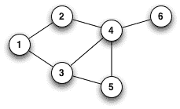
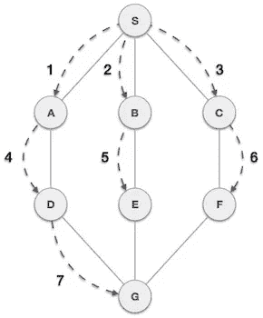

# 在 FAANG 访谈中破解 DFS 和 BFS

> 原文：<https://blog.devgenius.io/cracking-the-dfs-and-bfs-in-faang-interview-5589127c3f76?source=collection_archive---------1----------------------->


克里斯·莱佩尔特在 [Unsplash](https://unsplash.com?utm_source=medium&utm_medium=referral) 上的照片

在大多数 [FAANG](https://en.wikipedia.org/wiki/Big_Tech) 公司的编码测试中。考生总是会遇到图形问题。与此同时，随着我们生活在一个没有孤立信息的互联世界，图表的使用变得越来越普遍。如果 Linkedin 想推荐你可能感兴趣的人，它必须通过你的朋友图表找到最有可能的人。如果系统想要推荐停车场中的最短位置，它必须尝试所有不同的路径来找到正确的路径。

> 图形无处不在。

# 什么是图形？


照片由 [Unsplash](https://unsplash.com?utm_source=medium&utm_medium=referral) 上的[刻痕](https://unsplash.com/@jannerboy62?utm_source=medium&utm_medium=referral)拍摄

因为我们生活在构成世界的图表中。我们的高速公路，地铁是相互交叉的。我们从一个地点出发，驾车穿过高速公路，到达目标地点。与此同时，成千上万的人开车通过不同的方式前往不同的地点。有了这些，我们就有了高速公路的图表。在这种情况下，位置是一个顶点，公路是一条边。

正常的图表如下所示:



单向图

# 表示图形的三种方式

**顶点和边:**

在下面的二维数组中，数组中的每个数组都是由两个顶点组合而成的边。

例如:[0，1]表示从顶点 0 到顶点 1 的单向边

```
[ [0,1], [0,6], [0,8], [1,4], [1,6], [1,9], [2,4], [2,6], [3,4], [3,5],[3,8], [4,5], [4,9], [7,8], [7,9] ]
```

**邻接矩阵:**

*   邻接矩阵是一种顺序表示。
*   它表示彼此相邻的节点。
*   在这个表示中，我们要构造一个 n*n 的矩阵 A，如果从一个顶点 I 到顶点 j 有一条边，则 A 的对应元素 Ai，j = 1，否则 Ai，j= 0。

```
[  A  B  C  D  E  F  G  H  I  J
 A[0, 1, 0, 0, 0, 0, 1, 0, 1, 0],
 B[1, 0, 0, 0, 1, 0, 1, 0, 0, 1],
 C[0, 0, 0, 0, 1, 0, 1, 0, 0, 0],
 D[0, 0, 0, 0, 1, 1, 0, 0, 1, 0],
 E[0, 1, 1, 1, 0, 1, 0, 0, 0, 1],
 F[0, 0, 0, 1, 1, 0, 0, 0, 0, 0],
 G[1, 1, 1, 0, 0, 0, 0, 0, 0, 0],
 H[0, 0, 0, 0, 0, 0, 0, 0, 1, 1],
 I[1, 0, 0, 1, 0, 0, 0, 1, 0, 0],
 J[0, 1, 0, 0, 1, 0, 0, 1, 0, 0] ]
```

**邻接表:**

*   邻接表是一种链接的表示。
*   在这种表示中，对于图中的每个顶点，我们维护其邻居的列表。这意味着，图的每个顶点都包含其相邻顶点的列表。
*   HashMap 是维护这种结构的好选择。我们可以把顶点作为关键字，邻居列表作为值。

```
 vertice    Adjacency array
{  
     1    :  [1, 6, 8],
     2    :  [0, 4, 6, 9],
     3    :  [4, 6],
     4    :  [4, 5, 8],
     5    :  [1, 2, 3, 5, 9],
     6    :  [3, 4],
     7    :  [0, 1, 2],
     8    :  [8, 9],
     9    :  [0, 3, 7],
     0    :  [1, 4, 7] 
}
```

# 在图表中搜索

**深度优先搜索:**

顾名思义，我们选择一个起始顶点，然后一个接一个地遍历，直到找到目标顶点。

如果我们发现一个死胡同，这意味着这不是正确的道路。我们返回原路。然后，我们检查已访问顶点中的未访问邻居，并从那里开始探索其他路径。

图形-dfs

基本上我们只是尝试所有可能的方法来找到目标。为了提高效率，我们不重复访问过的顶点。因此我们需要一个*访问过的*数组。

在迷宫游戏中，我们必须找到目标。此外，在不同的路径上有一些块。所以我们可能需要设计一个不同的函数来寻找邻居。

DFS 的用途包括:

*   在大型图中搜索连通区域的数量
*   搜索图形中的任何圆
*   检查并获得图中两个顶点之间的路径

深度优先搜索访问每个顶点一次，检查图中的每个边一次。因此，DFS 的时间复杂度为 O(|V| + |E|)。但是，在递归搜索时，它占用 O(|V|)空间。

**远大第一搜索:**

对于 BFS，除了访问过的数组，我们需要一个*队列*来管理顶点。

> 队列是一种线性结构，它遵循操作执行的特定顺序。顺序是先进先出(FIFO)。

基本上，我们一层一层地遍历顶点，如下所示:



bfs

*   从第一个顶点开始，我们将顶点的邻居添加到队列中。
*   如果队列不为空，我们从队列中弹出元素。这个时候，我们可以做一些工作。
*   我们将 poped vertice 的未访问邻居推入队列。此外，我们将顶点标记为已访问。

代码如下:

BFS 的用法:

*   在图中寻找最短路径
*   在社交网络中，我们可以使用广度优先搜索直到“k”级来找到与一个人相距给定距离“k”以内的人。
*   在像 [BitTorrent](https://www.geeksforgeeks.org/how-bittorrent-works/) 这样的对等网络中，广度优先搜索用于查找所有邻居节点。

BFS 的复杂性:

广度优先搜索的时间复杂度是 O(|V| + |E|)，因为我们只检查每个顶点和边一次。因为我们可以遍历顶点，所以不需要额外的空间。

# BFS 和 DFS 的比较:

*   BFS 首先检查所有邻居，这不适合游戏或谜题中使用的路径搜索规则。DFS 是解决游戏或难题的一个很好的选择。它探索所有可能的路径，如果它到达目标时停止，否则它就继续尝试。
*   BFS 适合搜索离给定源更近的顶点。当目标远离源时，DFS 是合适的。
*   在 BFS 中，我们从一个源顶点到达一个边数最少的顶点。在 DFS 中，我们可能会遍历并重复许多顶点，从一个源到达一个目的地。

# 最后的话

如果你知道树数据结构和学习图形。你会看到树是一个只有两个孩子的特殊图形。因此，BFS 和 DFS 可以应用于树和图。大型科技公司确实喜欢问图表类型的问题，因为他们的数据和关系更加复杂。

希望你能从这篇文章中学到一些东西。如果你有兴趣阅读我的其他文章，欢迎查看我的个人资料。你也可以通过媒体或邮件联系我。