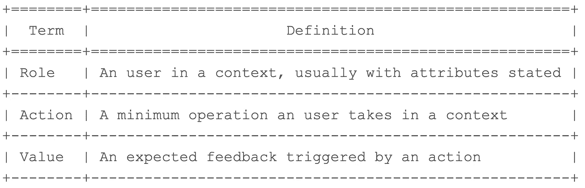
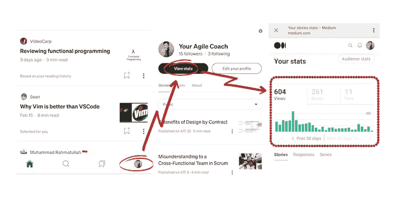
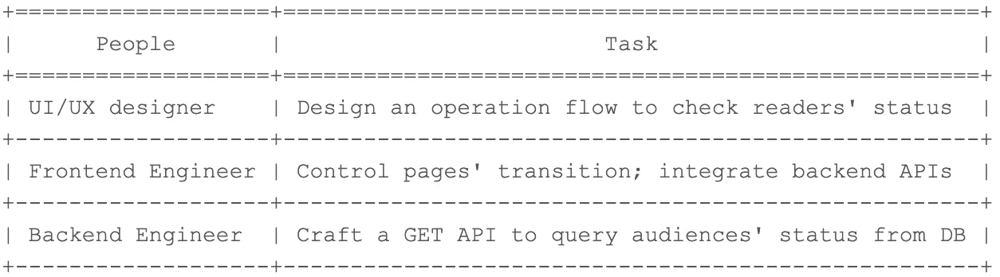
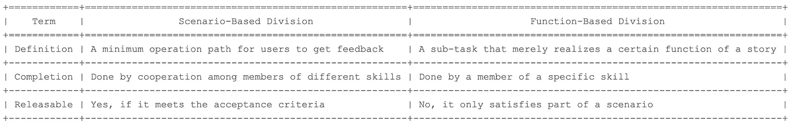
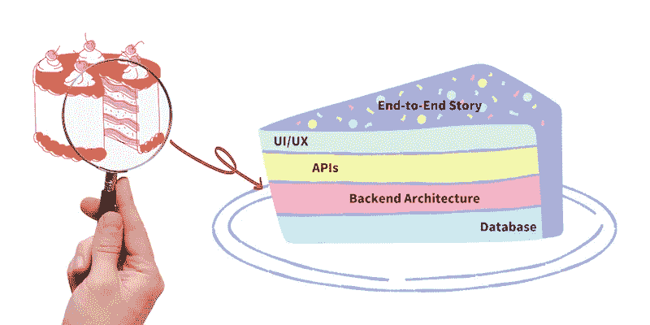

# 破解端到端的故事:以可理解的方式编写积压工作

> 原文：<https://blog.devgenius.io/cracking-the-end-to-end-stories-writing-backlogs-in-a-comprehensible-manner-ccbb48e1c973?source=collection_archive---------8----------------------->

# 目录

[补遗](#cb8f)
[定义一个端到端的故事](#7881)
[基于场景的划分 v.s .基于功能的划分](#c16f)
[结构化故事的细节](#9235)
[蔻驰的低语](#aeb6)

# 对过去帖子的补充

去年我写了一篇类似的文章，从场景依赖和功能依赖两个角度来阐述你写用户故事时应该是什么样子。遗憾的是，当时我用中文写了这个帖子，所以有些人可能不理解它的内容。虽然我打了一个比喻:切一块蛋糕，让读者在定义端到端的故事时感觉到它应该是什么，但这仍然不足以让成员理解用户故事中的具体成分。

例如，我写了一个如下的用户故事:

> 作为一名参与者，我想查询注册状态，以便知道我是否被选为候选人。

显然，任何人都可以猜到这个故事是为某个注册系统而写的。尽管如此，从开发者的角度来看，他们可能仍然不知道如何仅仅从描述中向客户传递价值，因为**他们需要了解故事的细节，以帮助他们自己分解场景以及组装完整的部分**。因此，我决定写这篇文章，以结构化的方式破解端到端的故事。

甚至，一个定义良好的用户故事可以帮助相关成员相互合作，向客户交付所需的价值。它还隐含地声明了他们需要什么样的候选人来构思有价值的场景。我的开发团队和产品负责人在编写一个可理解的故事时提出了这个问题，这真的令人钦佩，这样我就可以进一步反省自己，如果我清楚地将我所知道的传递给他们的话。

# 定义一个端到端的故事

好吧，在进入如何写一个可理解的故事之前，让我们回到端到端故事的最初定义。

> 从客户的角度来看，一个端到端的故事表明了一个产生所需反馈的最小操作路径。

以上一节中的例子为例，我们知道有一个**角色**:参与者，采取**动作**:查询注册状态，以便**值**:知道我是否被选为候选人。这是一个透明的结构，陈述了用户故事中的 3 个必要组成部分:**角色、动作、**和**值。**因此，我们可以从示例中提取抽象如下:

> 作为一个{ **角色** }，我想{行动}，这样我就可以{值}

这是 Scrum 中用户故事的一个常见描述结构。为了更清楚，我想为括号中的每个部分提供一个精确的定义。

以上三个部分构成了一个完整的故事。然而，当大多数人试图写他们自己的故事时，有 3 个主要的偏见领域可能会介入，这导致成员之间的沟通差距。

*   **无效描述**

首先，是无效的描述导致了无价的故事。我们举个例子来感应一下。

> 作为一个用户，我想给我的朋友转账，这样我就可以偿还他我借的钱。

嗯，从表面上看，这个描述似乎是合理的。然而，如果你把故事分配给你的成员，他们可能会被这个场景弄糊涂。围绕这个故事会有很多疑问。比如用户如何转账？用信用卡？使用自动取款机？或者别的什么？

显而易见，这种情况会引发很多疑问，受让人会咨询管理人以进一步澄清要求。如果很多故事都是用类似的方式写的呢？对于那些将要实现这种场景的人来说，这肯定是一场灾难，因为最初的需求是不明确的。

*   **验收标准不明确**

其次，验收标准决定了一个产品是否可以发布给最终用户。一般来说，我们可能会关注如何快速完成需求，而忽略了如何评估已完成的工作是否真的“完成”了？在 Scrum 框架中，我们会有一个 DoD(Done 的定义)来检查一个项目是否满足发布的标准。

例如，在开发工作中，我们经常提倡自动测试，这可以防止意外异常的发生，预先消除风险。对于前面的场景，我们将获得一个基本的自动测试来检查“转账”动作对双方是否成功。**因此，DoD 验收标准将扩展到其他积压订单，以获得足够的交付资格**。

*   **基于功能的故事写作**

完成一个故事取决于由不同技能的人组成的团队的合作。因此，如何写一个故事，把人们联系起来，为同一个目标而共同努力是很重要的。大多数人犯的最明显的错误是，他们从他们对技能的观点出发来形成一个故事，这是一个典型的基于功能的故事。

再拿前面的例子来说，如果我从一个软件工程师的角度重写这个故事，他可能会这样写这个故事:

> 创建一个 POST api: /v1/money 在 2 个用户之间转账；更新双方的余额。

这是一个典型的例子，一个工程师可能会从这个场景中写出来。但这个故事引发的问题是，当它完成时，用户无法从中获得结果，因为他不会使用 API，而是使用他在 ATM 上操作的 UI 流。

让我们再举一个例子，从一个 UI/UX 设计师的角度来回顾这个故事，他可能会这样写这个故事:

> 设计 4 个组件:一个接收者的账号，一个要转账的货币字段，一个发送请求的按钮，在屏幕上显示相应的处理结果。如果操作处理成功，显示成功消息，否则弹出失败消息并说明原因。

UI/UX 设计师知道外观上的资金转移过程。然而，描述主要集中在操作流程上，而忽略了流程背后的内部工作。因此即使故事完成了，任何人都不会从一个空壳中受益。

# 基于情景的划分与基于职能的划分

从上一节，我们已经看到了一些基于函数的故事。事实上，即使我不教你如何写一个基于功能的故事，你也可以凭直觉做到，因为我们生来就是从自己的技能中分割任务，而不是从整个场景中分割。

相反，我将向你展示如何从史诗的角度分割一个基于场景的故事，在最低可行水平上尽可能地包含各种任务。为了帮助您理解基于场景的故事应该是什么样子，我决定以 Medium 应用程序为例。

作为平台上的日常用户，作者必须经常打开仪表板，观察有多少隐藏的受众在阅读/查看以及评论文章，我也是如此。因此，我会形成以下最小场景:

> 作为 Medium 应用程序的每日活跃用户，我想查看一个月内的受众状态，这样我就可以知道许多读者已经阅读了我的帖子。

**基于场景的故事表示用户获得反馈的最小操作路径，而基于功能的故事本质上是一个子任务，执行某个不能给用户带来全部价值的动作**。

为了强调这两者之间的区别，我将从功能的角度来划分这个故事，如下表所示。从表中，我们可以清楚地更深入地了解如何通过子任务的集成来实现完整的场景。

请从上表中想象一下，如果我们基于基于功能的思维模式来编写一个故事，那么每个子任务都可以发布给最终用户吗？肯定是不可能的，不是吗？缺少任何任务都会产生一个不完整的场景。为了说明这两个概念之间的区别，我想拿另一个表来进行比较。

# 结构化故事的细节

我举了几个例子让你知道基于场景的划分和基于功能的划分的区别。然而，有些人可能会问，如果他们只收到一个清晰的描述，他们如何从外表掩饰一个故事。这个问题曾经困扰了我一段时间，因为在开始时，即使我知道如何形成一个最小的可行的故事，我也无法想象我是如何实现的。

幸运的是，随着我和我的团队长期合作将史诗分成故事，我终于理清了我脑海中的画面。画面随着团队的变化而演变。至于我在工作中经常遇到的故事，我可以把它们想象成小菜一碟。

正如你所看到的，一个完整的故事通常包括 4 个部分:UI/UX、API、后端架构和数据库。每一个都依赖于各种有才华的人的合作来完成一个完整的故事。与你以前经历的不同，这个故事将被维持在一个最低可行的水平，让最终用户达到预期的效果。

# 蔻驰杂音

一个定义良好的故事可以帮助团队一步一步地创建可发布的软件，而一个糟糕的故事会引发成员之间的沟通障碍，从而导致无效的消息传递。在本文中，我试图阐明基于场景的划分和基于功能的需求划分之间的区别。

以我的拙见，我希望那些阅读这篇文章的人能够从另一个角度改变你对需求分解的心态。通常，我们应该以一种全面的、可理解的方式来划分需求，而不是从一个特定的功能来划分。通过这种方式，我们能够进一步提高讨论质量。

—

如果你认可我与你分享的价值，请做如下:
1。**鼓掌**文章
2。**订阅**我最新内容
3。**在其他平台关注**我了解更多信息
-IG:[@ ur _ Agile _ coach](https://www.instagram.com/ur_agile_coach/)
-播客(中文):[敏捷火箭](https://player.soundon.fm/p/7f7dc3df-d738-405c-8cf9-02157a92ec61)
- Youtube: [你的敏捷蔻驰](https://www.youtube.com/channel/UCzD0wQmD1n4MuTKk-JocACA)
- LinkedIn: [吴宗祥](https://www.linkedin.com/in/tsung-hsiang-wu-8542409b/)

如果您需要咨询或其他形式的合作，请发送邮件至:【urscrummaster@gmail.com】