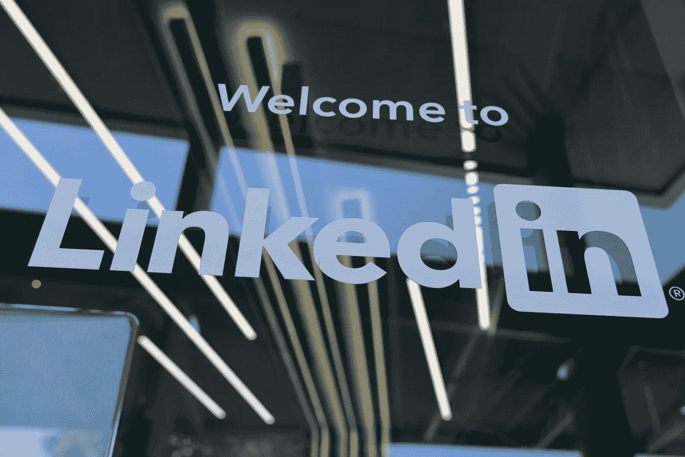

# 破解工程管理面试:第四部分

> 原文：<https://blog.devgenius.io/cracking-the-engineering-management-interview-part-4-a7e25128abbc?source=collection_archive---------9----------------------->

## 如何使用 Linkedin 获得下一份工程领导工作的权威指南

Linkedin 是你求职过程中使用的强大而有效的工具。

格雷格·布拉在 [Unsplash](https://unsplash.com/s/photos/linkedin?utm_source=unsplash&utm_medium=referral&utm_content=creditCopyText) 上的照片

## 介绍

只有当我们把成功和目标联系在一起时，成功才有意义。弄清楚什么样的成就给了我们满足感是有益的——那些值得我们为之努力的成就*。一旦我们找到了我们有兴趣解决的问题，就该投入工作了。 ***工具*** 的重要性在这个过程中至关重要。在这里，我谈谈我是如何在求职和面试过程中使用 Linkedin 作为一个赋权工具的。*

从我个人的经验来看，你在找工作时越积极，结果就越好。

我希望你采纳这些想法，将它们综合成适合你的东西，使它们成为你自己的。

## 您的个人资料

> 做你最大的拥护者。在您的个人资料中讲述您想要的故事。

1.  随时更新您的个人资料。选择你认为在你为自己设想的下一份工作中最有用的技能。
2.  通过过往经历列表突出*成长*。如果你能表明你对自己的职业生涯有所打算，那就太好了。
3.  整合任何能代表你的演讲、论文、博客。在你的角色之外为自己开拓一片天地并不容易。因此，看到你的工作如何与你的社区联系起来真的很有帮助，尤其是作为一名领导者。
4.  如果有同事可以写你的优点，通过 Linkedin 请求。*一个好的>许多好的*(因为每一个被接受的 Linkedin 推荐都是“好的”)。

## 你的网络

> 在你需要之前建立你的关系网。不要带着功利的心态去建立关系网。超越，建立一个真正丰富的社交圈。简洁和具体是你的朋友。

1.  参与你的 Linkedin 网络——祝贺，同情，有个性的交流。
2.  保持真实。没有理由假装友好。当人们需要你的时候，就在那里，尽你所能。让你的行动为你说话，建立你的信誉。
3.  人脉的基座是*人*。庆祝和职业挫折——都需要人。在你的人际网络中拥有“有影响力的人”可以说明你是谁，你吸引了什么样的人。

## Linkedin 工作

> 学习如何导航和找到与你相关的工作。要有自知之明，主动寻找合适的人选。尤其是在寻求领导职位时，要注意你的选择。

1.  明确自己想要什么。使用正确的过滤器，尽可能提高求职效率。在这里，时间是至关重要的。
2.  在一家价值观与你相符的公司工作，会有一种独特的快乐，我敦促你去寻找这种快乐。阅读公司的核心价值观，看看你是否认为它可以转化为他们的产品，以及他们是否与你一致。
3.  始终如一地申请工作。这种奉献是有帮助的，因为在这个等式中有一些你可能意识不到也无法控制的变量。重复消除了矛盾。

## 联系招聘人员

> 招聘人员会提供帮助，这取决于你能在这些联系中看到多少意义。从长远考虑。

1.  联系招聘人员，对他们好一点。他们会是你最好的盟友。与他们建立正确的关系，让他们支持你，这符合你的最大利益。
2.  当我联系招聘人员时，我使用了一个模板消息，并在发送之前添加了一些个性化内容(招聘人员的姓名、公司)。
3.  我会主动联系我想申请的公司的两到三名招聘人员。有时工作会列出发布工作的招聘人员，这就更容易了。

## 研究公司和团队

> 没有理由对公司一无所知。在与招聘经理交谈之前，请仔细阅读公司的产品、核心价值观和使命。这充分表明了你对这个角色的热情。

1.  访问他们的网站。浏览产品、投资者、客户、合作伙伴和创始人。查看[玻璃门](https://www.glassdoor.com/member/home/index.htm)查看公司评论。
2.  看看核心价值观是否对你有吸引力，是否能转化为产品策略。
3.  如果是一家初创公司，请访问 [Crunchbase](https://www.crunchbase.com/) 。看看谁在资助公司。试着粗略计算一下他们的财务状况。在整个面试过程中，你会有很多机会问一些好问题。精心制作一些能让你对公司的未来有更多了解的好简历。

## Linkedin 高级版

获得 Linkedin Premium 是我在跳槽过程中给自己的最好的东西之一。这里有几个你应该考虑的理由。

1.  我能够向与我没有联系的人(关键影响者、经理)发送电子邮件，邮件的长度不受限制。
2.  我使用了 Linkedin Learning，它极大地帮助我磨练了技能，拓宽了我的视野，用正确的词语打磨了我的面试风格。
3.  了解谁访问了我的个人资料有时很有帮助，尤其是如果他们在我喜欢的地方工作。这是一个很好的数据点，可以从增强信心到建立关键联系。
4.  在谈判竞争性的工作机会时，对薪资的了解就派上了用场。

## Linkedin 学习

对于 Linkedin Learning 上的材料质量，我怎么说都不为过。我直接受益于学习平台上的许多领导力课程，尤其是在我刚开始担任经理的时候。以下是它如何帮助我的面试过程变得精确。

1.  我开始使用正确的词语，例如，我以前使用“行动计划”或“实施计划”。我开始使用像执行、战略、战术或过程这样的词。我听起来更专业。
2.  我获得了对一名优秀经理至关重要的微妙技能:谈判技巧、管理社会资本、说服力、思想领导力。我还通过学习如何应用它们的机制来扩展我的视野。
3.  它帮助我找到了很棒的书，我最喜欢的演讲者和教练的播客。例如，我在 Linkedin Learning 上找到了 [Dorie Clark](https://medium.com/u/61232a3f3741?source=post_page-----a7e25128abbc--------------------------------) 的课程，并与她的内容建立了联系。这让我从她的[作品](https://dorieclark.com/)中学到了更多。

## 结论

Linkedin 对我来说是一个很好的工具。它帮助我进入了一个节奏，建立了一个面试管道，并制定了我的搜索策略。这是我获得多份工作机会的最大原因。

如果你真的对为自己寻找下一件大事感到兴奋，这一切都不会觉得太多。

如果你有远大的梦想，你需要合适的工具来帮助你按时实现。

你的目标越远大，你就越能得到更多的帮助。由于自然时间的限制，你无法独自完成这件事，至少效率不高，而且会让你筋疲力尽。

学会寻找和使用好的工具。不要用力。保持正念。