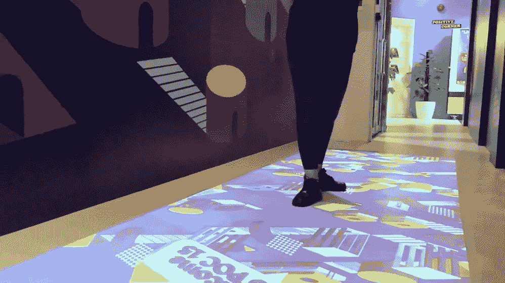

# 用数据、代码和实时图形精心制作引人入胜的叙述和体验

> 原文：<https://blog.devgenius.io/crafting-compelling-narratives-and-experiences-with-data-code-and-real-time-graphics-2686323da9ee?source=collection_archive---------20----------------------->

## 与创造性技术专家 Kapilan 讨论创造性地使用数据、公共设施、生成和实时艺术以及创造性编码

几周前，我有幸与非常健谈、友好的 [Kapilan Naidu](https://www.behance.net/kapilan-naidu) 交谈，并讨论了他的一些项目，涉及 AR 开发、处理和 web UI/UX、公共交通数据 API 等许多其他主题。这是一次特别令人兴奋的聊天，因为 Kapilan 从传统平面设计背景开始，并在几年内开始了他在新媒体领域的非常成功的潜水，他非常友好地分享了他的学习旅程，并为希望进入该领域的初学者分享了技巧和建议。

***Motif 杂志*** 是一份独立的艺术和文化出版物，每期都专注于不同的、鼓舞人心的主题。每个主题都通过文章、插图和设计来探索，为现代艺术家创造一个折衷的灵感组合。

卡皮兰新媒体公共装置作品精选——宗教拨号(上)、宏观通量、魔镜、有趣的形状

你可以在这里观看我们的 IGTV 会议，下面的时间戳可以快速体验 Kapilan 的见解—

[https://www.instagram.com/tv/CDDnSARHlHU/](https://www.instagram.com/tv/CDDnSARHlHU/)

**时间戳**

00:15:00 — Kapilan 介绍了自己和他的背景

01:59:00 —他第一次接触到新媒体这种艺术形式是什么？

03:34:00——深入了解“拨打宗教电话”,这是新加坡著名的公共装置作品

06:55:00 —洞察装置的创意过程和概念设计

10:38:00——Kapilan 最近参与了一个公共装置作品的项目，该作品将于今年在一家博物馆展出

13:12:00 — Kapilan 谈论面向初学者的处理和创造性编码

14:00:00 —处理和 p5.js 之间的区别

14:30:00——我们深入到 Kapilan 的另一个著名的公共装置作品中，这个作品使用了被称为“宏观通量”的处理方法

16:57:00 —使用数据集和 SMRT 旅游 API

18:42:00—Kapilan 在接触新项目时的创作流程是怎样的？

20:00:00 —他有哪些创作灵感？平面设计、Refik Anadol、建筑、灯光等

22:00:00——进入他的基于网络的应用程序——来自 twitter 的“情绪”。

23:36:00 — Kapilan 作为初学者的学习之旅

25:44:00 —传统的网页设计思维与处理和其他实时应用程序(如 Unity)的思维和工作有什么主要区别？

28:19:00 —深入了解创意过程，为新加坡 GIF 节创作 AR 装置，由 Unity 打造

32:33:00 — Kapilan 对新媒体和创造性编码初学者的建议和提示

35:48:00—Kapilan 最喜欢在哪个系统中创作和工作？潜入统一，虚幻引擎，影院 4d，五月，搅拌机

38:11:00 —在处理实时和动态图形项目时，如何面对挑战和解决问题？

40:17:00 — Kapilan 介绍了一些他想尝试的其他实时和运动设计应用程序— Touchdesigner 和 armacy。

41:45:00 —他对未来 10 年新媒体的未来有什么想法？+深入 AR 技术发展

45:57:00 — Kapilan 创造迷人故事和体验的“魔术”

46:36:00 — Kapilan 对新媒体初学者和创意者的最终看法

*谢谢！*