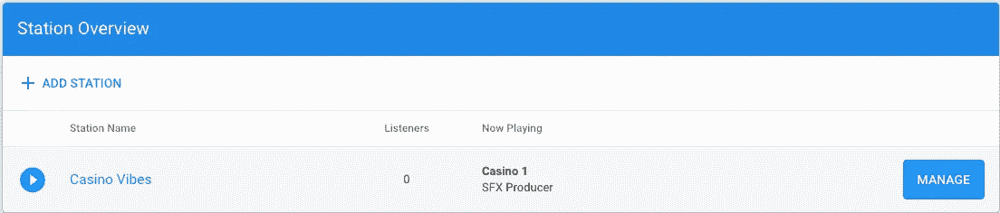

# 使用 FFmpeg 创建全天候 YouTube 在线广播

> 原文：<https://blog.devgenius.io/create-24-7-youtube-online-radio-with-ffmpeg-bbe2b3cfdcfb?source=collection_archive---------1----------------------->

## 快速简单，即使您的计算机关闭


# 介绍

我最近受到启发，想制作一台 24/7 的收音机，所以我头也不回地走了过去。我掉进了这个兔子洞，这个洞让我花了无数的时间在我不知道的 bug 和各种术语上。如果你想开始这段旅程，我在这里是为了让你更容易。看看 Dan Okhlopkov 的这篇[媒体文章](https://medium.com/@okhlopkov/how-to-create-your-24-7-youtube-online-radio-ca9e6834c192)，他给了我创作这篇文章的灵感。

# 先决条件

*   VPS 服务器:[数字海洋](https://m.do.co/c/d383f906edb6)(使用我的[推荐](https://m.do.co/c/d383f906edb6)获得 100 美元信用点数)
*   基本 linux 术语
*   [FFmpeg](https://m.do.co/c/d383f906edb6) 的基础知识

## 演示

*   [24/7 电台直播流](https://www.youtube.com/watch?v=2jmmEXVgfnw)

## 目标

让一个 24/7 的电台直播到 Youtube。

# 为什么需要 VPS？

实际上并不需要，你可以使用你的个人工作站，但是你的工作站需要 24/7 全天候工作。另一种选择是[树莓酱](https://www.raspberrypi.org/)，我认为这很酷，但我没有采用这种方法，因为我不想点，而且必须等待树莓酱。

VPS 运行自己的操作系统(OS)副本。您获得了对该操作系统实例的根访问权限，这允许您安装在该操作系统上运行的几乎任何软件。这样我们就可以把我们 24/7 的广播流传到 YouTube 上，然后关掉我们的个人电脑。

## 设置和安装

前往[数字海洋](https://m.do.co/c/d383f906edb6)并注册。还有其他可行的选择。

## AzuraCast

如果您使用 [Digital Ocean](https://m.do.co/c/d383f906edb6) 作为您的 VPS 提供商，有一个安装了 [Azuracast](https://www.azuracast.com/) 的[预付费服务器配置](https://marketplace.digitalocean.com/apps/azuracast)。这是一个一键式安装程序，它设置和配置了一个 droplet，并配置了 AzuraCast 推荐的 Docker 安装，准备就绪。我推荐走这条路，因为它使事情简单得多。如果你没有使用 Digital Ocean，你可以按照这个[指南](https://www.azuracast.com/install/)手动安装 Azuracast。

AzuraCast 会在几分钟内安装您需要的一切，让网络电台开始运行。

您应该会看到此屏幕，并确保单击“ ***创建 AzuraCast Droplet”***:


Ubuntu 18.04 是一个足够的操作系统，基本计划是你开始的全部需要。现在来说说有趣的事情… ***CPU 性能。***

## CPU 性能


我花了一段时间试图弄清楚我需要什么。我一开始有点偏执，我需要多大的 CPU 性能。这是很有争议的。随着您的流越来越受欢迎，或者您开始向您的访问者传送大量数据，您可以升级到更大的端口，以避免网站“交通堵塞”，如缓冲、站点延迟、数据包丢失和其他不愉快的症状。在我们使用 FFmpeg 传输基本的. mp4 文件的情况下，我在上图中突出显示的 **4GB/2CPUs** 应该没问题。

下一个选项我选择从旧金山流式传输。我会选择您附近的数据中心区域。


在下一步中创建你的密码，并确保保存好这个密码，因为我们**需要这个密码来登录我们的 VPS 服务器**


最后，我们可以点击绿色的 ***【创建液滴】*** 按钮。


# 安装 Azuracast

导航回您的数字海洋仪表板，获取安装了 Azuracast 的 droplet 的 IP 地址。应该在' ***水滴*** 下面，在' ***入门*** '的左边。复制 IP 地址，并将其粘贴到您的互联网浏览器中。我们将用它来创建一个帐户，并为我们的收音机设置播放列表。

步骤 1)创建帐户

步骤 2)创建一个新的广播电台

步骤 3)系统设置

# 创建您的广播电台

填写您的电台详细信息，这一步不言自明，因此我将继续向您的播放列表添加音乐。

# 将音乐添加到播放列表

我推荐使用[流行音乐](https://www.epidemicsound.com/referral/z8xk3r/)来获得免版税的音乐。这将防止我们的流被禁止版权。大约是每月 15 美元，包括 YouTube、脸书、Instagram、Twitch 和播客。

回到你的阿祖拉演员仪表板。在' ***站概述下的*** 段点击' ***管理***



现在在仪表盘上，点击 ***音乐文件- >选择文件*** 。将您的 mp3 文件上传到您的播放列表。[流行音](https://www.epidemicsound.com/referral/z8xk3r/)可以让你下载 mp3 文件，你可以在这里上传。


# 获取承载您的广播流的 IP 地址。

现在我们有了播放列表，是时候复制我们将用于 FFmpeg 脚本的 IP 地址了。在工具条上点击 ***简介*** 。从这里的“ ***Streams*** ”部分你应该会看到一个 URL。保存这个，因为我们以后会用到它。

# 安装 FFmpeg

FFmpeg 是一个免费的开源跨平台解决方案，用于录制、转换和流式传输音频和视频。查看[文档](https://ffmpeg.org/)了解更多信息。

## 末端的

打开您选择的终端，确保安装了 ssh 并运行这个命令:
`ssh root@ENTER IP ADDRESS HERE`

粘贴上一步复制的 IP 地址。密码将是您在设置我们的 VPS 时创建的密码。

现在安装 FFmpeg，运行这个命令:
`sudo apt install ffmpeg`

# 运行 FFmpeg

在你的终端里输入`vim yt_radio.sh`。将下面的脚本复制到这个文件中。我们只需要修改 ***键*** ， ***视频 _ 源*** ， ***音频 _ 源*** 。我使用 ***scp*** 命令将 gif 和 mp3 从我的个人电脑下载到我们的 VPS linux 机器上。查看此[社区问题](https://www.digitalocean.com/community/questions/how-to-copy-files-from-one-server-to-another-droplet)了解更多关于 scp 的信息。

这个剧本的灵感来自这篇[文章](https://medium.com/@okhlopkov/how-to-create-your-24-7-youtube-online-radio-ca9e6834c192)。所以请务必也去看看。

***YOUTUBE_URL*** :这个会和图中一模一样。如果你想使用 Twitch 进行流媒体播放，你需要获取 Twitch 的 rtmp URL

***密钥*** :请勿共享此密钥。如果此密钥暴露，它将允许任何人从您的 Youtube 帐户流。我发现这个[指南](https://www.streamerstartup.com/how-to-find-your-youtube-stream-key/)有助于获得你特定的 Youtube 密钥。请注意，需要 24 小时才能获得 YouTube 的批准，从而被允许播放视频。

***VIDEO_SOURCE*** :这是你的 YouTube 视频带封面的路径。注意路径。确保将您的文件放在这个确切的位置。这个过程我用了一个 gif。

***AUDIO_STREAM*** :你的音频流的 URL。这是我们在前面的步骤中向播放列表添加音乐时复制的内容。

# 传输到 YouTube

我们都准备好了。在`yt_radio.sh`脚本所在的同一个目录中，运行下面的命令:
`sh ./yt_radio.sh`

## Youtube 实时仪表板

现在让我们检查一下我们的流是否在运行。前往您的 [YouTube 直播仪表盘](https://www.youtube.com/live_dashboard)。点击 ***进入现场控制室***


现在等待您的流加载，在右上角，您应该会看到一个“*”按钮。点击那个。*

# *关闭计算机时，保持 VPS 运行*

*结账屏幕。点击[此处](https://www.digitalocean.com/community/questions/how-keep-my-app-running-after-close-putty-f82aab17-ca84-46a0-8a39-3e25f1dd2d45)了解更多详情。`ctrl+c`从你当前的水流中断开。别担心，我们会重新连接的。*

```
*sudo apt-get install screen
screen
sh ./yt_radio.sh
Hit Ctrl + A and then Ctrl + D in immediate succession. You will see the message [detached]*
```

# *结论*

*你有它，一个简单的 24/7 直播电台。*

*如果你觉得这篇文章有用，请分享并鼓掌。谢谢你*