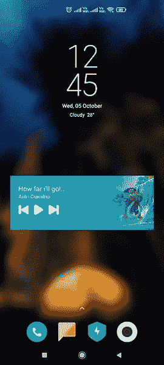
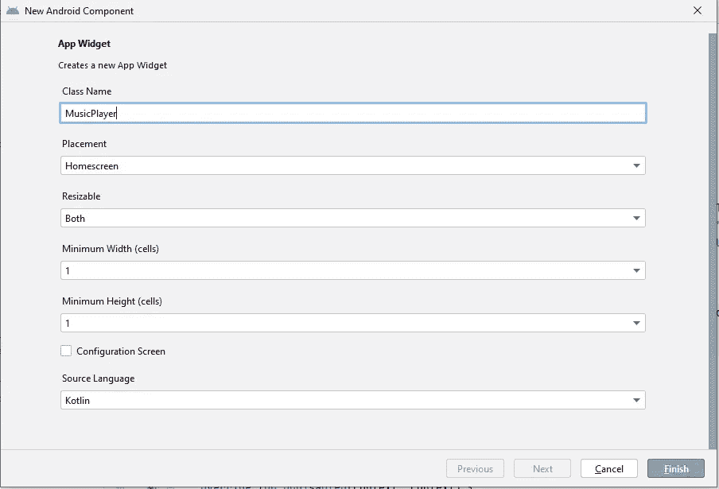

# 创建应用程序小部件。

> 原文：<https://blog.devgenius.io/create-a-app-widget-31ce96196e54?source=collection_archive---------3----------------------->

*安卓|科特林*

## 什么是 app widget？

应用程序小部件是一个简单的应用程序可视化用户界面，可以在 android 设备的主屏幕上看到。用户可以在设备的主页上看到或访问一些与应用相关或不相关的数据。例如:时间、天气、音乐播放器等。



小部件示例

因此，在上面的图片中，时间和日期是一个小部件，音乐播放器是另一个小部件。音乐播放器是我创建的小工具。在这篇博客中，我将向你展示如何创建一个具有相同用户界面的小工具，播放和暂停一首歌曲，来回切换歌曲。

> 那么，让我们开始吧。

## 1.创建应用程序小部件类

从创建应用程序小部件类开始。转到应用->(右击)->新建->应用小部件。在创建时，您将获得两个文件:一个保存小部件布局和功能的 kotlin 文件，以及一个包含小部件信息的 xml info 文件。



**清单:-** 一个接收器将在清单文件中自动生成，我们可以在其中添加意图过滤器，你可以处理文本更改和按钮点击等。

```
<receiver
    android:name=".MusicWidget"
    android:exported="false">

    <meta-data
        android:name="android.appwidget.provider"
        android:resource="@xml/music_widget_info" />
</receiver>
```

## xml 文件(音乐 _ 小部件 _ 信息. XML)

```
*<?*xml version="1.0" encoding="utf-8"*?>* <appwidget-provider xmlns:android="http://schemas.android.com/apk/res/android"
    android:description="@string/app_widget_description"
    android:initialKeyguardLayout="@layout/music_widget"
    android:initialLayout="@layout/music_widget"
    android:minWidth="110dp"
    android:minHeight="110dp"
    android:previewImage="@drawable/example_appwidget_preview"
    android:previewLayout="@layout/music_widget"
    android:resizeMode="horizontal|vertical"
    android:targetCellWidth="3"
    android:targetCellHeight="2"
    android:updatePeriodMillis="86400000"
    android:widgetCategory="home_screen"/>
```

## 初始小部件类设置

```
class MusicWidget : AppWidgetProvider() {override fun onUpdate(context: Context, appWidgetManager: AppWidgetManager, appWidgetIds: IntArray) {
    for (appWidgetId in appWidgetIds) {
        updateAppWidget(context, appWidgetManager, appWidgetId)
    }
}override fun onEnabled(context: Context) {
    *// Enter relevant functionality for when the first widget is created* }

override fun onDisabled(context: Context) {
    *// Enter relevant functionality for when the last widget is disabled* }fun updateAppWidget(context: Context, appWidgetManager: AppWidgetManager, appWidgetId: Int) {

    val widgetText = context.getString(R.string.*appwidget_text*)
    *// Construct the RemoteViews object* val views = RemoteViews(context.*packageName*, R.layout.*music_widget*)
 appWidgetManager.updateAppWidget(appWidgetId, views)
}
}
```

## 2.设计小部件

我有一个简单的设计，有一个正在播放的音乐专辑的海报，暂停和播放按钮，下一个按钮，上一个按钮。

```
<FrameLayout xmlns:android="http://schemas.android.com/apk/res/android"
    xmlns:app="http://schemas.android.com/apk/res-auto"
    style="@style/Widget.WidgetsApp.AppWidget.Container"
    android:layout_width="match_parent"
    android:layout_height="130dp"
    android:background="#1797b4"
    android:theme="@style/Theme.WidgetsApp.AppWidgetContainer">

    <ImageView
        android:layout_width="130dp"
        android:layout_height="match_parent"
        android:layout_gravity="right"
        android:id="@+id/songImage"
        android:background="@drawable/drawable_layout_background"/>

    <ImageView
        android:layout_width="match_parent"
        android:layout_height="match_parent"
        android:layout_marginLeft="100dp"
        android:background="@drawable/drawable_background"/>

    <LinearLayout
        android:layout_width="match_parent"
        android:layout_height="wrap_content"
        android:orientation="vertical">

        <TextView
            android:layout_width="wrap_content"
            android:layout_height="wrap_content"
            android:text="How far i'll go!.."
            android:textSize="16sp"
            android:id="@+id/title"
            android:textColor="@color/white"
            android:layout_marginTop="20dp"
            android:layout_marginLeft="20dp"/>

        <TextView
            android:layout_width="wrap_content"
            android:layout_height="wrap_content"
            android:text="Auli'i Cravalho"
            android:id="@+id/description"
            android:textSize="12sp"
            android:textColor="@color/white"
            android:layout_marginLeft="20dp"/>

        <LinearLayout
            android:layout_width="wrap_content"
            android:layout_height="wrap_content"
            android:orientation="horizontal"
            android:layout_marginTop="10dp"
            android:layout_marginLeft="20dp">

            <ImageView
                android:id="@+id/previousBtn"
                android:layout_width="24dp"
                android:layout_height="24dp"
                android:layout_gravity="center"
                android:background="@drawable/back"/><ImageView
                android:layout_width="28dp"
                android:layout_height="28dp"
                android:id="@+id/play"
                android:layout_gravity="center"
                android:layout_marginLeft="10dp"/><ImageView
                android:id="@+id/nextBtn"
                android:layout_width="24dp"
                android:layout_height="24dp"
                android:layout_gravity="center"
                android:background="@drawable/next"
                android:layout_marginLeft="10dp"/>

        </LinearLayout>

    </LinearLayout>

</FrameLayout>
```

## 3.音乐播放器

这个小工具是基于一个音乐播放器，例如，我已经添加了 2 首歌曲到应用程序来操作暂停，播放，下一首歌曲和上一首歌曲。非常简单的功能，例如，如果你正在创建一个实时小工具，请确保你添加了一些背景功能，以便音乐将在背景中播放。现在我已经添加了应用程序，如果应用程序关闭，音乐将不会播放。
播放音乐是非常简单的代码，我正在使用媒体播放器，我把它添加到下面供你参考。

```
musicPlayer = MediaPlayer.create(*applicationContext*, songList[0])
musicPlayer.start()
```

## 4.小工具上的 OnClicks

对于 onClick 1st，我们需要创建一个变量，该变量包含一个包名，后跟 action 关键字和一个表示要执行的操作的常量。

```
private val ACTION_PLAYPAUSE =  "com.app.widgetsapp.action.ACTION_WIDGET_CLICK"
```

这个小部件中有 3 个动作

```
private val ACTION_PLAYPAUSE =  "com.app.widgetsapp.action.ACTION_WIDGET_CLICK"private val ACTION_NEXT =  "com.app.widgetsapp.action.ACTION_NEXT_CLICK"private val ACTION_PREVIOUS =  "com.app.widgetsapp.action.ACTION_PREVIOUS_CLICK"
```

这些操作名称必须与清单文件中添加的意图过滤器名称相同。因此，当触发来自小部件的动作时，接收者接收它并将其发送到 AppWidgetProvider 文件。

```
**Manifest File:**<receiver
    android:name=".MusicWidget"
    android:exported="false">
    <intent-filter>
        <action android:name="android.appwidget.action.APPWIDGET_UPDATE"/>
        <action android:name="com.app.widgetsapp.action.ACTION_WIDGET_CLICK"/>
        <action android:name="com.app.widgetsapp.action.ACTION_NEXT_CLICK"/>
        <action android:name="com.app.widgetsapp.action.ACTION_PREVIOUS_CLICK"/>
    </intent-filter>

    <meta-data
        android:name="android.appwidget.provider"
        android:resource="@xml/music_widget_info" />
</receiver>
```

***为视图定义 onClick:***

```
views.setOnClickPendingIntent(R.id.*play*, getPendingSelfIntent(context, ACTION_PLAYPAUSE))views.setOnClickPendingIntent(R.id.*nextBtn*, getPendingSelfIntent(context, ACTION_NEXT))views.setOnClickPendingIntent(R.id.*previousBtn*, getPendingSelfIntent(context, ACTION_PREVIOUS))
```

需要有一个 onReceive 函数来接收触发器，您可以处理意图动作，我们可以根据点击执行适当的动作。

```
override fun onReceive(context: Context?, intent: Intent?) {
    super.onReceive(context, intent)
    if (intent!!.*action*.*equals*(ACTION_PLAYPAUSE)) {
        playSong(context!!)
    } else if(intent.*action*.*equals*(ACTION_NEXT)) {
        playNextSong(context!!)
    } else if(intent.*action*.*equals*(ACTION_PREVIOUS)) {
        playPreviousSong(context!!)
    }
}
```

## 5.播放歌曲 onClick

```
private fun playSong(context: Context) {
    val views = RemoteViews(context.*packageName*, R.layout.*music_widget*)
    val localComponentName = ComponentName(context, MusicWidget::class.*java*)
    if(!isPlaying) {
    //Change to pause button when song plays
    views.setImageViewResource(R.id.*play*, R.drawable.*pause*)
        isPlaying = true
      //handle play action
       MainActivity.musicPlayer.start()
    } else {
        views.setImageViewResource(R.id.*play*, R.drawable.*play*)
        isPlaying = false
        MainActivity.musicPlayer.pause()
    }

    //Updating all the views
AppWidgetManager.getInstance(context).updateAppWidget(localComponentName, views)
}
```

## 您可以在下面的 github 链接中找到该应用程序

[](https://github.com/Sha489/MusicPlayerWidget) [## GitHub-sha 489/MusicPlayerWidget

### 此时您不能执行该操作。您已使用另一个标签页或窗口登录。您已在另一个选项卡中注销，或者…

github.com](https://github.com/Sha489/MusicPlayerWidget) 

## 谢谢大家！