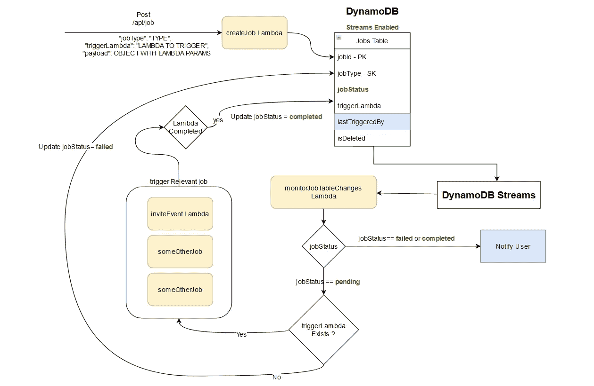

# 用 DynamoDB 流和 Lambda 函数创建一个后台作业服务，使用“无服务器”框架。*第一部分

> 原文：<https://blog.devgenius.io/create-a-background-job-service-with-dynamodb-streams-and-lambda-functions-with-serverless-60b7bc49fd48?source=collection_archive---------9----------------------->

DynamoDB 流允许我们创建事件驱动的架构。更具体地说，创建数据“插入”、“修改”或“删除”的事件驱动功能。该事件名称取自 DynamoDB [记录](https://docs.aws.amazon.com/amazondynamodb/latest/APIReference/API_streams_Record.html)。

# 为什么我们需要后台工作服务？

当我们处理 AWS Lambda 函数时，它们的最大超时是 300 秒。但是触发这些 Lambdas 最常见的方式是通过 API 网关请求。这为请求添加了最长 30 秒的超时限制。如果 Lambda 包含复杂或耗时的逻辑(发送电子邮件、创建用户认知等)。)，在这种情况下可能需要 30 秒以上。

# 为什么不使用 AWS 事件桥？

事件桥用于将 Lambdas 作为预定事件触发。不作为后台作业:)

# 设置作业服务

## *第 01 步*

*   创建一个启用了**流的 DynamoDB 表**。在本例中，它的名称是“Jobs”表。下面是一个云形成脚本，用于在 DynamoDB 中创建一个支持流的表

*   我已经将流视图类型添加为“新图像和旧图像”。新图像是添加到数据库中的新数据，旧图像是其以前的条目值。在这个实现中，我们需要这两者。

> " **INSERT** 事件只会给你一个新的图像，因为在条目被创建之前没有先前的值。
> 
> "**修改**"事件会给你新图像和旧图像:)
> 
> “**删除**事件只会给你旧的图像

## 步骤 02

*   您可以将 2 个 Lambda 函数与 DynamoDB 流集成在一起。我们只会用一个。因此，让我们创建一个 Lambda 函数，并添加“**流 ARN** ”作为它的事件。我的 Lambda 叫“monitorJobTableChanges”。

*   可以从 AWS 控制台找到 ARN 流。在您的“作业”表设置中，有一个名为“**导出和流**的选项卡。ARN 河就在那里。
*   我们还需要一个 POST 端点，它将触发 lambda 在 jobs 表中创建一个“作业”。在我的例子中，lambda 被称为“createJob”。

这就是 it 人员为我们的工作服务设置的无服务器后端。阅读第 2 部分的实现:)

[***用“无服务器”框架，用 DynamoDB 流和 Lambda 函数创建后台作业服务。第 02 部分***](https://medium.com/@iwiick/create-a-background-job-service-with-dynamodb-streams-and-lambda-functions-with-serverless-dc8e0eac4a1c)

*由* ***和*** 组成