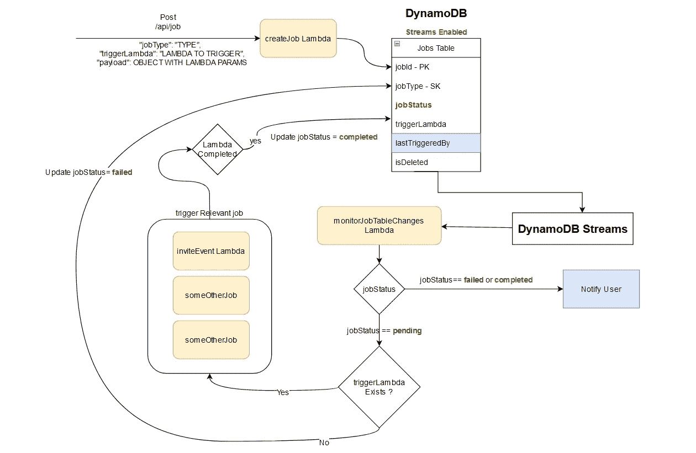

# 用 DynamoDB 流和 Lambda 函数创建一个后台作业服务，使用“无服务器”框架。*第二部分

> 原文：<https://blog.devgenius.io/create-a-background-job-service-with-dynamodb-streams-and-lambda-functions-with-serverless-dc8e0eac4a1c?source=collection_archive---------8----------------------->



在[之前的文章](https://medium.com/@iwiick/create-a-background-job-service-with-dynamodb-streams-and-lambda-functions-with-serverless-60b7bc49fd48)中，我们讨论了如何为这个服务设置后端。所以现在让我们来看看后端实现:)

## " monitorJobTableChanges "λ

*   我知道代码乍一看很复杂，但实际上并不复杂。
*   在第 19 行，我从**事件中提取**记录**。**正如我前面提到的，这可以是一个“插入”、“修改”或“删除”事件。
*   然后，我调用**getmodifiedbjob**助手函数(第 45 行)来获取“插入”和“修改”事件的新旧图像。
*   现在，如果我们有一个“任务”，在第 26 行，我们对它采取行动。让我们看看 **takeActionsOnJob** 函数；

*   我们在第 4 行向作业添加了一个“动作”。该函数位于第 53 行。我们比较新旧图像，添加动作“触发λ”、“通知成功”、“通知失败”或“什么都不做”，并返回新图像。
*   在 switch 语句中，第 10 行是我们如何触发 lambda 的。Lambda 是指我们如何触发一个任务。
*   在第 4 行，我们有**一个有效载荷**和**一个触发器λ**。当我们使用“**create job**”lambda 创建一个作业时，这些都是从“job”表中获取的，正如我前面提到的，这是通过 POST 请求触发的。
*   在我的例子中， **payload 是一个包含执行作业**所需的所有数据的对象。例如:如果我们有一个名为"**invite ventparticipants job**"的 lambda(作业)，那么它的有效负载可能是这样的…

```
payload = {
    eventId: <SOME_ID_HERE>
}
```

*   " **triggerLambda** "是要执行的 Lambda 函数的名称。
*   所以在第 12 行，我所做的是使用 **AWS-SDK** 从"**monitorJobTableChanges**" Lambda 中触发另一个 Lambda(在这个上下文中的一个作业)

基本上就是这样。这里的其余代码是将作业状态更改为“已完成”或“失败”,这样，如果您有所需的参数，就可以使用这些更改的流通过电子邮件或推送通知来通知用户。这部分完全由你自己定制:)以防你好奇，我所做的是使用 **Web Sockets** 发送推送通知。这完全是另外一个话题:)

## 从前端触发作业

这真的很简单。我们所要做的就是用相关的**有效负载**对象向“createJob”端点发送一个 POST 请求，并将 lambda(job)的名称传递给 trigger ( **triggerLambda** )，在我的例子中。后端实现将处理剩下的部分:)

> 这里要记住的重要一点是，对“createJob”端点的 POST 请求启动了“Job”服务。

一旦您开始使用作业服务，您的“作业”表将如下所示。


“**作业状态**也可用于重新运行失败的作业

就这样，干杯…您现在可以将 lambda 作为作业触发，这消除了 API 网关的 30 秒超时，允许我们利用 Lambda 的全部 300 秒超时。

*经* **经*合山*经**