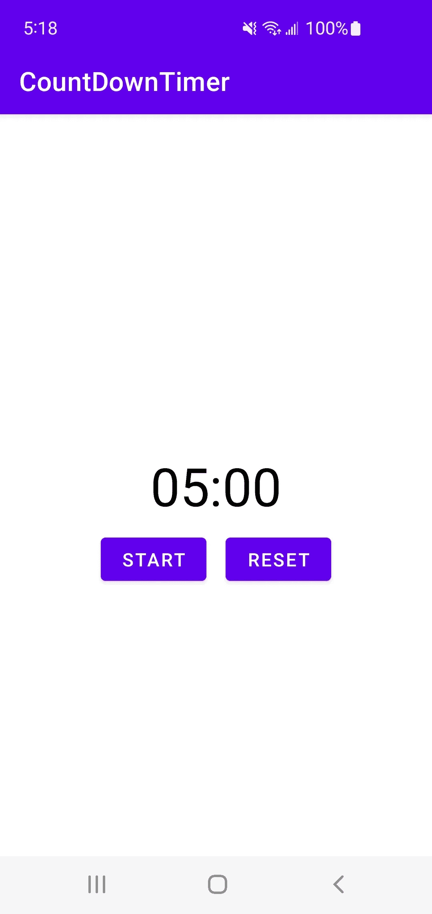

# 创建一个倒计时定时器，即使应用程序关闭也能运行

> 原文：<https://blog.devgenius.io/create-a-countdown-timer-that-runs-if-the-app-is-closed-e5501598e16d?source=collection_archive---------6----------------------->

我将演示如何创建一个倒计时定时器，如果你退出应用程序，并在一段时间后回来工作。您将能够启动、停止和重置计时器。我们将使用共享首选项来实现这一点。向下滚动到末尾，观看该应用程序的视频演示。这个项目的 GitHub 库的链接也在最后。我们开始吧:)

1.  在 Android Studio 中创建一个空项目，并启用视图绑定。
2.  在 activity_main.xml 文件中添加一个 textview 和两个按钮。

```
<androidx.constraintlayout.widget.ConstraintLayout xmlns:android="http://schemas.android.com/apk/res/android"
    xmlns:app="http://schemas.android.com/apk/res-auto"
    xmlns:tools="http://schemas.android.com/tools"
    android:layout_width="match_parent"
    android:layout_height="match_parent"
    tools:context=".MainActivity">

    <TextView
        android:id="@+id/timerTV"
        android:layout_width="wrap_content"
        android:layout_height="wrap_content"
        android:textColor="@color/black"
        android:textSize="40sp"
        android:text="05:00"
        app:layout_constraintBottom_toBottomOf="parent"
        app:layout_constraintEnd_toEndOf="parent"
        app:layout_constraintStart_toStartOf="parent"
        app:layout_constraintTop_toTopOf="parent" />

    <Button
        android:id="@+id/startOrStopBtn"
        android:layout_width="wrap_content"
        android:layout_height="wrap_content"
        android:text="Start"
        android:layout_marginTop="8dp"
        android:layout_marginEnd="8dp"
        app:layout_constraintEnd_toStartOf="@+id/resetBtn"
        app:layout_constraintHorizontal_chainStyle="packed"
        app:layout_constraintStart_toStartOf="parent"
        app:layout_constraintTop_toBottomOf="@id/timerTV" />

    <Button
        android:id="@+id/resetBtn"
        android:layout_width="wrap_content"
        android:layout_height="wrap_content"
        android:layout_marginTop="8dp"
        android:text="Reset"
        android:layout_marginStart="8dp"
        app:layout_constraintEnd_toEndOf="parent"
        app:layout_constraintStart_toEndOf="@+id/startOrStopBtn"
        app:layout_constraintTop_toBottomOf="@id/timerTV" />

</androidx.constraintlayout.widget.ConstraintLayout>
```

运行应用程序，它应该看起来像这样。



**MainActivity.kt**

从现在开始，所有的事情都将在 MainActivity.kt 上完成。我将尽力解释每个函数的作用，最后，我将把所有代码粘贴到 MainActivity.kt 中。

首先，在 MainActivity 中创建这些变量。

```
private lateinit var binding: ActivityMainBinding
private var timeLeftInMillis = 0L
private var countDownTimer: CountDownTimer? = null
private var timerIsRunning = false
private var remainingTimeInMillis = 300000L
private var endTime = 0L
```

在 onCreate()内部，向 start 和 reset 按钮添加 onClickListeners。

```
override fun onCreate(savedInstanceState: Bundle?) {
    super.onCreate(savedInstanceState)
    binding = ActivityMainBinding.inflate(*layoutInflater*)
    setContentView(binding.*root*)

    binding.startOrStopBtn.setOnClickListener **{** startOrStopTimer()
    **}** binding.resetBtn.setOnClickListener **{** stopOrResetTimer()
    **}** }
```

**startOrStopTimer()**

```
private fun startOrStopTimer() {
    if (!timerIsRunning) {
        countDownTimer?.cancel()
        binding.startOrStopBtn.*text* = "Stop"
        countDownTimer = object : CountDownTimer(remainingTimeInMillis, 1000) {
            override fun onTick(millisUntilFinished: Long) {
                remainingTimeInMillis = millisUntilFinished
                timeLeftInMillis = millisUntilFinished
                timerIsRunning = true

                binding.timerTV.*text* = millisUntilFinished.*convertToTimeFormat*()
            }

            override fun onFinish() {
                timerIsRunning = false
                remainingTimeInMillis = 0L
                timeLeftInMillis = 0L
                binding.startOrStopBtn.*text* = "Start"
            }
        }.start()
    } else {
        countDownTimer?.cancel()
        timerIsRunning = false
        binding.startOrStopBtn.*text* = "Start"
    }
}
```

在这个函数中，我们检查定时器是否没有运行。如果不是，我们创建一个 CountDownTimer()，持续时间为“remainingTimeInMillis”。如果用户点击复位按钮，remainingTimeInMillis 的值将是 5 分钟，或者该值将是定时器先前停止的时间。每秒都会调用 onTick()函数，因为我们将 countDownInterval 设置为 1000 毫秒。因此，我们每秒都在更新剩余的 TimeInMillis、timeLeftInMillis 和 timerIsRunning。我稍后会谈到 converToTimeLeftFormat()函数的作用。当时间到时，onFinish()函数被调用。

**stopOrResetTimer()**

```
private fun stopOrResetTimer() {
    countDownTimer?.cancel()
    timerIsRunning = false
    timeLeftInMillis = 300000
    remainingTimeInMillis = 300000
    binding.timerTV.*text* = remainingTimeInMillis.*convertToTimeFormat*()
    binding.startOrStopBtn.*text* = "Start"
}
```

这个功能非常简单。我们基本上是把时间调回到 300000 毫秒，也就是 5 分钟。然后将 timerIsRunning 设置为 false，更新 textview，使其显示“05:00 ”,并将按钮文本从“停止”改为“开始”。

**long . converttotimeformat()**

```
private fun Long.convertToTimeFormat(): String {
    val minutes = (this / 1000).toInt() / 60
    val seconds = (this / 1000).toInt() % 60

    return java.lang.String.format(Locale.getDefault(), "%02d:%02d", minutes, seconds)
}
```

这个函数是一个扩展函数，它只是将毫秒转换成这种格式:“04:10”，其中 4 是分钟，10 是秒。

**onStart()**

```
override fun onStart() {
    super.onStart()
    val prefs = getSharedPreferences("COUNT_DOWN_TIMER", *MODE_PRIVATE*)
    timeLeftInMillis = prefs.getLong("millisecondsLeft", 0L)
    timerIsRunning = prefs.getBoolean("isTimerRunning", false)
    endTime = prefs.getLong("endTimeInMillis", 0L)

    if (endTime != 0L && timerIsRunning) {
        val timeSpentInBackground: Long = (System.currentTimeMillis() - endTime)
        remainingTimeInMillis = timeLeftInMillis - timeSpentInBackground
    } else {
        remainingTimeInMillis = timeLeftInMillis
    }
    binding.timerTV.*text* = remainingTimeInMillis.*convertToTimeFormat*()

    if (remainingTimeInMillis != 0L && timerIsRunning) {

        binding.startOrStopBtn.*text* = "Stop"
        countDownTimer = object : CountDownTimer (remainingTimeInMillis, 1000) {
            override fun onTick(millisUntilFinished: Long) {
                remainingTimeInMillis = millisUntilFinished
                timeLeftInMillis = millisUntilFinished
                timerIsRunning = true

                binding.timerTV.*text* = millisUntilFinished.*convertToTimeFormat*()
            }

            override fun onFinish() {
                timerIsRunning = false
                remainingTimeInMillis = 0L
                timeLeftInMillis = 0L
                binding.startOrStopBtn.*text* = "Start"
            }
        }.start()
    }
}
```

这个函数基本上是从共享首选项中获取变量，并检查用户在什么时候点击应用程序，如果计时器正在运行，则检索一个布尔值。如果用户点击离开应用程序时计时器正在运行，它会计算离开应用程序的时间。然后用剩余时间启动计时器。

**onStop()**

```
override fun onStop() {
    super.onStop()
    countDownTimer?.cancel()

    val prefs = getSharedPreferences("COUNT_DOWN_TIMER", *MODE_PRIVATE*)
    val editor = prefs.edit()
    editor.putLong("millisecondsLeft", timeLeftInMillis)
    editor.putBoolean("isTimerRunning", timerIsRunning)
    editor.putLong("endTimeInMillis", System.currentTimeMillis())
    editor.commit()
}
```

保存毫秒保留到保存的首选项。这是计时器中剩余的时间，以毫秒为单位。它还保存了“isTimerRunning”，这是一个布尔值，用于检查用户离开应用程序时计时器是否在运行。最后是“endTimeInMillis”，这是用户离开应用程序的准确时间。

MainActivity()中的最终代码应该如下所示。

```
class MainActivity : AppCompatActivity() {

    private lateinit var binding: ActivityMainBinding
    private var timeLeftInMillis = 0L
    private var countDownTimer: CountDownTimer? = null
    private var timerIsRunning = false
    private var remainingTimeInMillis = 300000L
    private var endTime = 0L

    override fun onCreate(savedInstanceState: Bundle?) {
        super.onCreate(savedInstanceState)
        binding = ActivityMainBinding.inflate(*layoutInflater*)
        setContentView(binding.*root*)

        binding.startOrStopBtn.setOnClickListener **{** startOrStopTimer()
        **}** binding.resetBtn.setOnClickListener **{** stopOrResetTimer()
        **}** }

    private fun startOrStopTimer() {
        if (!timerIsRunning) {
            countDownTimer?.cancel()
            binding.startOrStopBtn.*text* = "Stop"
            countDownTimer = object : CountDownTimer(remainingTimeInMillis, 1000) {
                override fun onTick(millisUntilFinished: Long) {
                    remainingTimeInMillis = millisUntilFinished
                    timeLeftInMillis = millisUntilFinished
                    timerIsRunning = true

                    binding.timerTV.*text* = millisUntilFinished.*convertToTimeFormat*()
                }

                override fun onFinish() {
                    timerIsRunning = false
                    remainingTimeInMillis = 0L
                    timeLeftInMillis = 0L
                    binding.startOrStopBtn.*text* = "Start"
                }
            }.start()
        } else {
            countDownTimer?.cancel()
            timerIsRunning = false
            binding.startOrStopBtn.*text* = "Start"
        }
    }

    private fun stopOrResetTimer() {
        countDownTimer?.cancel()
        timerIsRunning = false
        timeLeftInMillis = 300000
        remainingTimeInMillis = 300000
        binding.timerTV.*text* = remainingTimeInMillis.*convertToTimeFormat*()
        binding.startOrStopBtn.*text* = "Start"
    }

    private fun Long.convertToTimeFormat(): String {
        val minutes = (this / 1000).toInt() / 60
        val seconds = (this / 1000).toInt() % 60

        return java.lang.String.format(Locale.getDefault(), "%02d:%02d", minutes, seconds)
    }

    override fun onStart() {
        super.onStart()
        val prefs = getSharedPreferences("COUNT_DOWN_TIMER", *MODE_PRIVATE*)
        timeLeftInMillis = prefs.getLong("millisecondsLeft", 0L)
        timerIsRunning = prefs.getBoolean("isTimerRunning", false)
        endTime = prefs.getLong("endTimeInMillis", 0L)

        if (endTime != 0L && timerIsRunning) {
            val timeSpentInBackground: Long = (System.currentTimeMillis() - endTime)
            remainingTimeInMillis = timeLeftInMillis - timeSpentInBackground
        } else {
            remainingTimeInMillis = timeLeftInMillis
        }
        binding.timerTV.*text* = remainingTimeInMillis.*convertToTimeFormat*()

        if (remainingTimeInMillis != 0L && timerIsRunning) {

            binding.startOrStopBtn.*text* = "Stop"
            countDownTimer = object : CountDownTimer (remainingTimeInMillis, 1000) {
                override fun onTick(millisUntilFinished: Long) {
                    remainingTimeInMillis = millisUntilFinished
                    timeLeftInMillis = millisUntilFinished
                    timerIsRunning = true

                    binding.timerTV.*text* = millisUntilFinished.*convertToTimeFormat*()
                }

                override fun onFinish() {
                    timerIsRunning = false
                    remainingTimeInMillis = 0L
                    timeLeftInMillis = 0L
                    binding.startOrStopBtn.*text* = "Start"
                }
            }.start()
        }
    }

    override fun onStop() {
        super.onStop()
        countDownTimer?.cancel()

        val prefs = getSharedPreferences("COUNT_DOWN_TIMER", *MODE_PRIVATE*)
        val editor = prefs.edit()
        editor.putLong("millisecondsLeft", timeLeftInMillis)
        editor.putBoolean("isTimerRunning", timerIsRunning)
        editor.putLong("endTimeInMillis", System.currentTimeMillis())
        editor.commit()
    }
}
```

**视频演示**

【https://vimeo.com/739134591 号

**GitHub 资源库**

[https://github.com/alexportillo519/CountDownTimer](https://github.com/alexportillo519/CountDownTimer)

希望这有所帮助。如果你有任何问题让我知道。编码快乐！