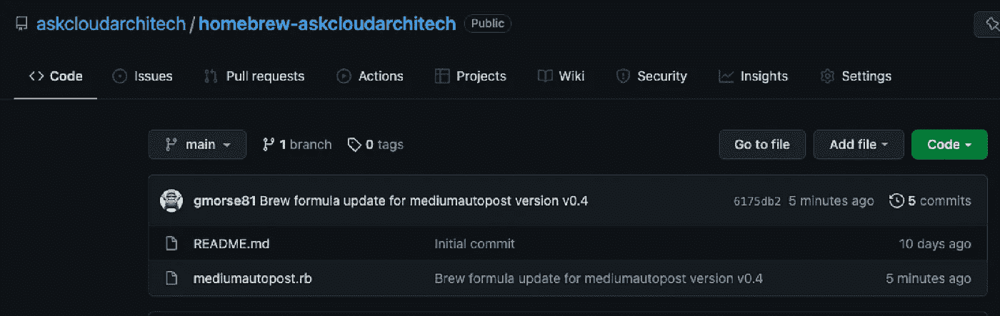

# 使用 Goreleaser 和 Github 操作创建自定义 CLI 工具并与 HomeBrew 一起分发

> 原文：<https://blog.devgenius.io/create-a-custom-cli-tool-and-distribute-with-homebrew-using-goreleaser-and-github-actions-4c92cdeb9dfb?source=collection_archive---------20----------------------->


之前，[我写过关于安装和使用家酿](https://medium.com/@askcloudarchitech/everything-you-need-to-know-about-homebrew-e91d1e82959a)的文章。在那篇文章中，我简要地提到你可以很容易地使用自制软件创建和发布你自己的应用程序。今天，我将逐步讲述如何做到这一点。在本文中，我将介绍使用优秀的 Go 软件包 Cobra 创建命令行应用程序的基础知识，然后向您展示如何轻松、自动地将您的工具发布到家酿 Tap，以便其他人可以通过几个简单的命令安装它。让我们开始吧。

## 第一部分。使用 Go Cobra 创建 CLI 工具

由于本文的主要目的是展示如何用 Homebrew 发布一个 CLI 工具，我们显然需要有一个 CLI 工具来发布！为此，我将使用我已经编写的 CLI 工具。我不打算深入研究我创建的工具的功能，而是在以后的另一篇文章中讨论。这里我们需要的重要部分只是创建 CLI 工具和文件布局的基础。显然，你将创建自己的工具，所以我的细节并不重要。

我写了一个叫 mediumautopost 的工具，用来给 medium.com 发文章。这个工具是用 Go 编程语言编写的，使用的是 go-cobra 包。根据 go-cobra Github 页面，“cobra 既是一个创建强大的现代 CLI 应用程序的库，也是一个生成应用程序和命令文件的程序”。

[](https://github.com/spf13/cobra) [## GitHub - spf13/cobra:现代围棋 CLI 交互的指挥官

### Cobra 既是一个用于创建强大的现代 CLI 应用程序的库，也是一个用于生成应用程序和

github.com](https://github.com/spf13/cobra) 

要开始使用 go-cobra 创建新的 CLI 工具，您应该首先安装 cobra 工具。顺便说一句，go-cobra 是用 go 写的，我们将会用 Go 写这个 CLI，所以如果你没有的话也安装它。

`brew install go`
`go get -u github.com/spf13/cobra`

既然已经装好了。为 CLI 工具的 git repo 创建一个新目录。你真的可以把它放在任何地方。

`mkdir myCLItool && cd myCLItool`

然后将其初始化为 Git repo

`git init`

此时，您应该有一个初始化了 git 的空目录。现在是时候创建你的 Github repo 来匹配这个项目了。创建 Github repo 超出了这个项目的范围，但是请到 github.com 创建您的项目(可能与您上面创建的文件夹同名)。如果您愿意，可以在这一点上推进您的初始提交，但这不是必需的。

接下来，将您的项目初始化为 go 模块

再次用您创建的 Github repo 的名称替换您的 MODULENAME。

下一步是使用`cobra`命令行工具来构建新 CLI 工具的框架。这非常简单，您只需运行以下命令:

`cobra init`

在您的项目中，应该有一组文件和一个目录，如下所示:


Go Cobra CLI 文件结构

从这一点上，我将开始分享我已经创建的回购代码。你可以在这里看到完整的源代码:[https://github.com/askcloudarchitech/mediumautopost](https://github.com/askcloudarchitech/mediumautopost)。在创建这个项目时，我使用了上面列出的完全相同的步骤，我将分享下面显示 CLI 重要部分的文件内容。

首先是`main.go`文件。

没什么大不了的，对吧？那是故意的。当使用 cobra 创建 CLI 时，main.go 文件只需导入`cmd`包。`func main()`只是调用了`cmd/root.go`文件中的`cmd.Execute()`函数。这个文件包含了 CLI 功能的核心，所以让我们来看看。

让我们按照行号分块回顾一下上面的文件。

第 1 行:只有包声明。这通常与包含文件的文件夹同名。

第 3–8 行:导入所有必需的包以使其工作。`os`用于在命令完成时返回退出代码。`mediumautopost`是运行该命令时的实际逻辑。最佳实践是将命令细节与命令逻辑分开。这允许您以后在该命令以外的地方使用该逻辑。这遵循了“不重复自己”的编码原则。最后的导入是`cobra`包本身，它使所有这些工作。

第 10 行:声明一个变量来存储。环境文件。此 CLI 使用环境变量进行配置，您可以提供一个包含您的配置的文件。下面我们将读入一个填充这个变量的标志。

第 13–26 行:这些是 CLI 命令本身的说明。完成后，运行`mediumautopost`或`mediumautopost -h`(用于帮助列表)将遵循您在这些行中输入的指令。如你所见，这非常简单。有命令的名称、简短描述、详细描述和被执行的函数的属性`RunE`。为`RunE`声明的函数非常简单。它在`mediumautopost`包中调用一个名为`Do`的函数。同样，我不打算深入我的特定 CLI 工具的细节，而只是知道这个工具实际上做的所有其他事情都是由对`Do`的调用开始的。如果您想让某些东西正常工作，您可以很容易地用`fmt.PrintLn("Hello World!")`替换第 23 行，然后命令会显示“Hello World！”到你的终端。

第 30–35 行:这是由`main.go`调用的`Execute()`函数。您可以看到，它调用了上面声明的 rootCmd，如果出现问题，它将返回一个退出代码`1`，如果一切顺利，它将默认返回一个退出代码`0`。

第 37–39 行:对于那些不熟悉 Golang 的人来说，这是`init`函数，它在这个包初始化时被自动调用。在这个函数中，我们创建了一个标志，它允许您传递。环境文件。`rootCmd.Flags().StringVarP`是一个函数，允许您声明一个标志、它的描述(用于帮助文本)、它的长名称(–env file path)、它的短名称(-e)以及它的缺省值(如果标志未被使用的话)。在这种情况下只是一个空字符串。

所以…这个文件中的所有内容会自动构建 CLI 及其可用命令。这些是它的不同用法。

`mediumautopost -h`打印帮助文本
`mediumautopost`用 no 运行程序。提供的环境位置
`mediumautopost -e .myenv`用. env 文件运行程序。myenv
`mediumautopost --envfilepath=.myenv`同上，但为全长标志名

帮助文本如下所示:

```
For details on how to set up your site to use this program please visit 
https://askcloudarchitech.com/posts/tutorials/auto-generate-post-payload-medium-com/
Ensure you have set up your env file as shown in the .env.example
Example command: mediumautopost --envfilepath=.env

Usage:
  mediumautopost [flags]

Flags:
  -e, --envfilepath string   Path to your environment file. if left empty, the program will only use system environment variables.
  -h, --help                 help for medium-auto-post
```

至此，您应该能够测试您的程序了。使用您的终端，运行`go run main.go -h`，它应该会打印出您的 CLI 的帮助文本。虽然这很棒(耶，工作代码！)，最终也不完全是我们想要的。如果你想容易地安装这个工具并分发它，你实际上需要编译它并把它公开地放在某个地方。接下来的步骤将概述如何自动构建您的工具，在 Github 上创建有良好文档记录的版本，并最终使用 HomeBrew 安装该工具。

## 第二部分。为您的自制 tap 创建 Github 存储库

当我第一次试图理解它的时候，下一部分对我来说有点困惑，所以我认为在进入下一步之前，它值得一些解释。要分发带有自制软件的工具，你需要一个所谓的自制软件 Tap。Tap 是一个单独的 Github repo，只包含家酿的指令(所以它知道如何安装你的东西)。当您创建一个 Tap 时，您不需要为您希望分发的每个工具创建一个新的 Tap。您可以简单地点击一次，然后通过这一次点击分发任意多的工具。所以最好的做法是为你所有的东西做一个 Github repo，并用你的 Github 用户名(或者组织名)来命名。在我的例子中，我已经创建了这个回购协议，它将成为我现在和未来制作的任何东西的自制水龙头:[https://github . com/askcloudarchitech/home brew-askcloudarchitech](https://github.com/askcloudarchitech/homebrew-askcloudarchitech)。

如果你点击了上面的链接，你会看到这个 Tap 中只有两个文件:一个 README.md 文件(显然)和一个`mediumautopost.rb`文件。我手动创建了自述文件，并将其推送到此 repo。`mediumautopost.rb`是自动生成的，下面概述的步骤将解释如何让所有这些神奇的事情发生。

现在，只需进入你的 Github 账户，创建一个新的回购。确保您的回购名称以`homebrew-`开头，然后是您想要的 Tap 名称。如果你想了解更多关于命名惯例的信息，家酿网站在这里有解释:[https://docs . brew . sh/How-to-Create-and-Maintain-a-Tap # creating-a-Tap](https://docs.brew.sh/How-to-Create-and-Maintain-a-Tap#creating-a-tap)

## 第三部分。创建一个 Github 个人访问令牌，并将其设置为 Actions Secret

快速的理智检查。此时，您应该有两个 Github 存储库:第一个包含您的 CLI 工具的代码，第二个包含您的自制 Tap。明白了吗？很好。从现在开始，我将解释的所有内容都将在第一次回购中完成(带有您的 CLI 代码的回购)。你实际上不需要对 Tap 回购做任何事情，因为这一切都是自动化的。

因为第一个回购需要向第二个回购发布安装说明，所以您需要一个 Github 个人令牌。前往[https://github.com/settings/tokens](https://github.com/settings/tokens)点击“生成新令牌”按钮。在备注字段中提供名称，选择到期日期并选中回购旁边的框，然后点击底部的“生成令牌”。复制令牌并暂时将其放在安全的地方。注意:请将此令牌保密。


Github 个人访问令牌屏幕

既然您已经拥有了令牌，并且我们已经在 Github 上了，让我们快速将这个令牌设置为一个秘密，我们将在后面的步骤中使用。继续并导航到 CLI 工具的 repo。从那里点击设置。在左侧的设置页面上，单击机密->操作。接下来，单击“新建存储库机密”按钮。


Github 机密屏幕

在“新秘密”屏幕上，添加您的个人访问令牌。你可以给它取任何你喜欢的名字，但是如果你正在跟随代码示例，给它取名字`PUBLISHER_TOKEN`因为那将是我们以后引用的秘密名字。


创建新的秘密

## 第四部分。创建. goreleaser.yml 文件

现在开始真正的自动化！我们将使用 G [或租赁者](https://goreleaser.com/)来完成所有的重物搬运。下面是它将通过一个简单的配置文件为我们做的事情:

1.  将您的 CLI 工具编译为适用于多种操作系统和体系结构的二进制文件
2.  将二进制文件和发行说明一起发布到项目的 Github 版本选项卡上
3.  为您的项目创建自制公式(安装说明)，并将其发布到您的自制 Tap 存储库中。

这是我的。goreleaser 文件。您通常可以复制并粘贴它。只需创建一个名为。goreleaser 是您项目的基础。

该文件的内容有些不言自明，但是让我们回顾一下这些部分，以便它们都有意义。

*   **构建** —文件的构建部分指示 Goreleaser 将您的代码编译成您提供的名称的二进制文件。您可以指定操作系统和体系结构，以及任何需要的附加标志。对于我的设置，我正在编译这个程序，以便在 ARM 和 AMD64 架构的 Mac 和 Linux 上运行。我还选择了出售我的依赖项，所以我在编译时传递了使用 vendored 文件的标志。这本身就是一个话题，但是如果你不想讨论这个话题，就把它去掉吧。[在这里查看完整的构建配置选项](https://goreleaser.com/customization/build/?h=builds)
*   **release** —除了将`prerelease`属性设置为 auto 之外，我几乎使用了这里所有的默认值。这告诉 Goreleaser 不要发布被格式化为预发布版本的标签。[点击此处查看完整发布选项](https://goreleaser.com/customization/release/?h=release)
*   **universal_binaries** —这个特性告诉 Goreleaser 为 macOS 构建通用二进制文件。`replace`选项指示工具用通用的替换单个 ARM 和 AMD64 二进制文件。
*   **brews** —最后，brews 部分告诉 Goreleaser 将这个项目发布到一个家酿 Tap 上。将我的详细信息替换为您的 Tap 信息以及您项目的详细信息。[在此查看所有酿造选项](https://goreleaser.com/customization/homebrew/?h=brews)。注意，我没有在这里提供令牌。这将发生在下一步。

## 第五部分。创建您的 Github 操作工作流程

完成这个项目所需的最后一个文件是 Github actions 配置文件。在`.github/workflows`目录下创建一个名为`release.yml`的文件。

这是我的:

这个文件实际上是从 Goreleaser 文档复制/粘贴而来的。Goreleaser 专门为 Github actions 创建了一个动作，你可以在这里看到完整的说明:[https://goreleaser.com/ci/actions/?h=github+ac](https://goreleaser.com/ci/actions/?h=github+ac)。我根据自己的需要对此做了一些修改。首先，我修改了文件顶部的`on`部分，它告诉 Github actions 当一个标签被推送到这个项目时激活这个动作。第二，我修改了`version`的值，因此它将版本号设置为我创建的标签。最后，我将`GITHUB_TOKEN`环境变量值改为`${{ secrets.PUBLISHER_TOKEN }}`，它将使用我们在步骤 3 中创建的秘密。

## 第六部分。发布并试用它

咻！这就是全部的设置。最后一步是推动一个变化，并观察它的工作。我将首先提交一个更改，然后标记它并推送标记。以下是这些步骤的命令和完整输出:

```
➜  mediumAutoPost git:(main) ✗ git add .
➜  mediumAutoPost git:(main) ✗ git commit -m "update readme"
[main 94a760e] update readme
 1 file changed, 1 insertion(+), 1 deletion(-)
➜  mediumAutoPost git:(main) git push
Enumerating objects: 5, done.
Counting objects: 100% (5/5), done.
Delta compression using up to 8 threads
Compressing objects: 100% (3/3), done.
Writing objects: 100% (3/3), 286 bytes | 286.00 KiB/s, done.
Total 3 (delta 2), reused 0 (delta 0), pack-reused 0
remote: Resolving deltas: 100% (2/2), completed with 2 local objects.
To github.com:askcloudarchitech/mediumautopost.git
   dcf2695..94a760e  main -> main
➜  mediumAutoPost git:(main) git tag -a v0.4 -m "README bump for demo"
➜  mediumAutoPost git:(main) git push origin v0.4                     
Enumerating objects: 1, done.
Counting objects: 100% (1/1), done.
Writing objects: 100% (1/1), 171 bytes | 171.00 KiB/s, done.
Total 1 (delta 0), reused 0 (delta 0), pack-reused 0
To github.com:askcloudarchitech/mediumautopost.git
 * [new tag]         v0.4 -> v0.4
```

为了简化，这里只列出了没有 git 输出的命令

```
git add .
git commit -m "update readme"
git push
git tag -a v0.4 -m "README bump for demo"
git push origin v0.4
```

按下标签后，前往 Github，看看是否有效。你应该看到一些预示成功的东西。

在 CLI repo 的主屏幕上，您应该会看到最近提交旁边有一个绿色复选标记


绿色支票显示成功

如果您单击绿色复选标记，您应该会看到您的操作的详细信息，表明所有步骤都已成功运行。


Github 操作屏幕

如果您转到您的 *other* repo(家酿 Tap ),您现在应该会看到一个新的 commit 和一个. rb 文件，其中包含安装 CLI 所必需的指令。



家酿 Tap 回购

最后(也是最重要的)，你应该能够用自制软件安装你的工具！您点击的细节会有所不同，但这是我运行安装我的程序:

```
brew tap askcloudarchitech/askcloudarchitech
brew install mediumautopost
```

安装好之后，试一试！

```
mediumautopost -h

For details on how to set up your site to use this program please visit 
https://askcloudarchitech.com/posts/tutorials/auto-generate-post-payload-medium-com/
Ensure you have set up your env file as shown in the .env.example
Example command: mediumautopost --envfilepath=.env

Usage:
  mediumautopost [flags]

Flags:
  -e, --envfilepath string   Path to your environment file. if left empty, the program will only use system environment variables.
  -h, --help                 help for mediumautopost
```

如果你已经走了这么远，你可能从这篇文章中有所收获。如果你有，如果你能在 medium.com 和 youtube 上订阅，我会非常感激。

[](https://medium.com/@askcloudarchitech) [## 加里 M -中等

medium.com](https://medium.com/@askcloudarchitech) 

https://www.youtube.com/channel/UClSv7tWDA4wkCTLhZl1YBlw