# 用 React+Flask+PostgreSQL+Bootstrap 为韩国流行电视节目“Queendom2”创建一个数据可视化应用程序

> 原文：<https://blog.devgenius.io/create-a-data-visualization-web-page-with-react-flask-postgresql-bootstrap-4ec4f080309e?source=collection_archive---------10----------------------->

**Web App 链接:**【https://queendom2.herokuapp.com/】
**GitHub 回购:**[https://github.com/monkeyapple/queendom2data](https://github.com/monkeyapple/queendom2data)

# **简介**

这个数据可视化应用程序显示了正在进行的韩国流行真人秀《女王 2》的 YouTube 浏览量。

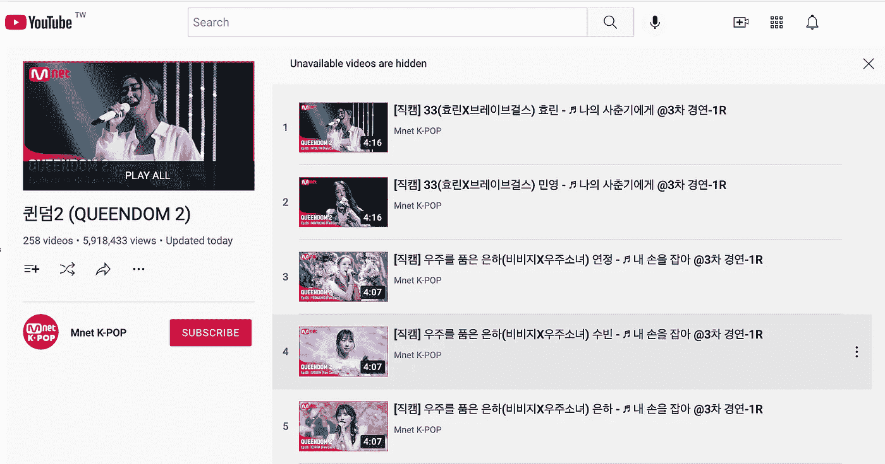

# 应用堆栈和工作流

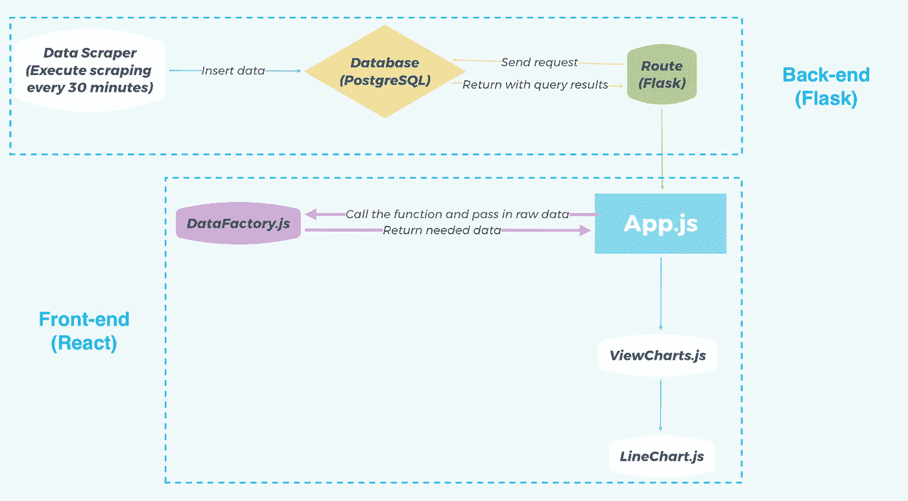

# 技术堆栈

*   **编程语言:** Python，Javascript，SQL，CSS，HTML
*   **框架:** React(前端)、Flask(后端)、Bootstrap(CSS)
*   **数据库:** PostgreSQL

# 我们应用程序的预览

*   这是一个单页 web 应用程序:

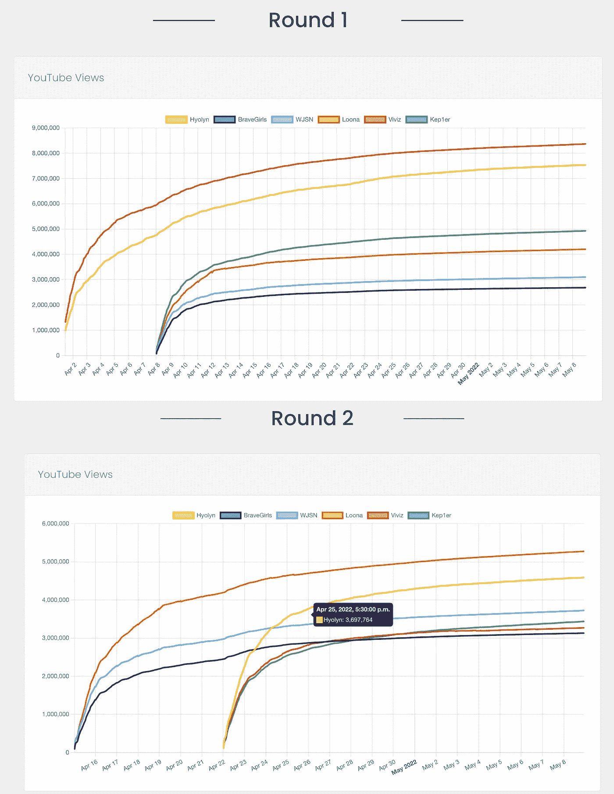

# 项目目录结构预览

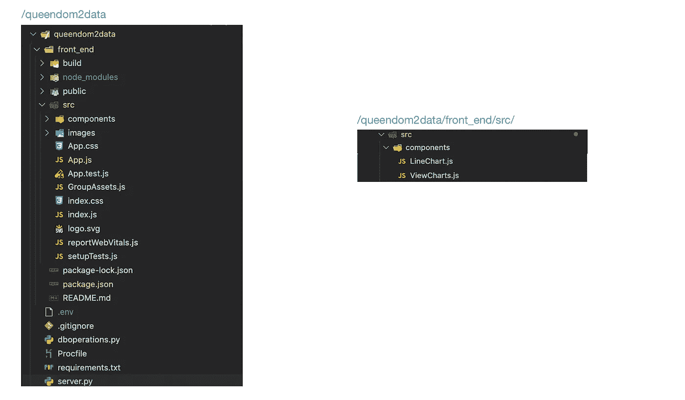

# 准备

1.  首先，关于这个项目使用的**数据刮刀**，请看我写的另一篇文章:[用 Python+YouTube 数据 API+PostgreSQL+HerokuScheduler](https://medium.com/@effylh/create-a-data-scraper-for-the-ongoing-k-pop-tv-program-queendom2-with-python-youtube-data-d74103a3d074)创建一个数据刮刀
2.  (在 Mac 上)创建并激活虚拟环境 ***queendom*** 并激活它:

```
python3 -m venv ***queendom***
```

然后，激活我们刚刚创建的虚拟环境:

```
source ***queendom***/bin/activate
```

2.安装所需的软件包:

```
pip install Flask,Flask-Cors,flask-talisman,gunicorn,psycopg2,python-dotenv
```

3.创建一个名为 **queendom2data** 的项目文件夹，然后将 ***cd*** 放到根目录下:

```
(queendom) effylh@192 **queendom2data** %
```

4.在名为 ***【前端】*** :(参考:[https://github.com/facebook/create-react-app](https://github.com/facebook/create-react-app))的文件夹中初始化一个新的 React app

```
(queendom) effylh@192 **queendom2data** % npx create-react-app front-end
```

# 我们开始吧

在本文中本地设置了我们的数据库(包含两个表)之后([链接](https://medium.com/@effylh/create-a-data-scraper-for-the-ongoing-k-pop-tv-program-queendom2-with-python-youtube-data-d74103a3d074)，我们现在可以开始构建后端框架了。

## 创建用于执行数据库操作的类

1.  创建一个名为 **dboperations.py** 的文件
2.  定义一个名为 **DatabaseOperate** 的类，然后定义实例方法 **query_table1()** 和 **query_table2()** ，这两个方法用于从数据库已有的两个表(**qdscraper _ 1**&**qdscraper _ 2**中取出所有数据。

## 建立一条烧瓶路线

1.  创建一个名为 **server.py** 的文件
2.  定义一个路由告诉 Flask 使用 URL ***'/fetch'*** 来触发函数***fetch _ all _ groups()***
3.  在***fetch _ all _ groups():***内部首先导入 ***dboperations*** 模块，初始化***database operate***类。然后我们使用两个变量***table 1 rows&table 2 rows***来保存从表 ***qdscraper_1*** 和 ***qdscraper_2*** 中获取的所有行数据。
4.  **jsonify()** 方法以*application/JSON*mime type 的格式返回一个 **Response** 对象。
5.  最后，因为我们想在 React app 中调用 Flask route，我们需要导入扩展 **flask-cors，**，然后用默认参数 **' *app '，cors(app)，*** 初始化该扩展，这允许所有路由上的所有域使用 CORS。

## 在 React 应用程序中调用 Flask 路线

*   导入并使用 **axios** 发送 GET 请求到 Flask route***“http://localhost:5000/fetch”，*** 我们添加一行***console . log(rawdata)***来检查我们是否成功检索到我们需要的数据。

输出:我们成功地从数据库的两个表中获取了所有数据！

> 注意:因为在我写这篇文章的时候，我的项目的 scraper 一直在通过 YouTube API 向数据库中插入新数据，所以在本文的其余部分，我们在截图中获得的数据长度可能会有所不同。

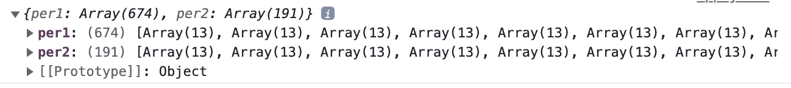

## 原始数据处理

1.  创建一个名为 **DataFactory.js、**的文件，然后定义一个名为 **DataFactory 的函数。**

**数据工厂**返回一个包含已清理数据集的对象:

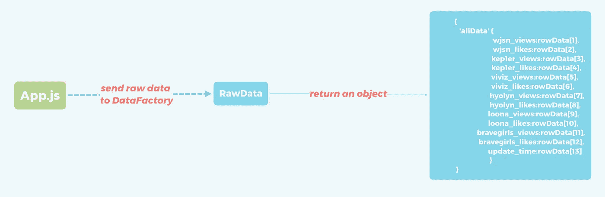

2.调用 **App.js** 中的 **DataFactory** 函数，然后(***line 18&19***)我们设置状态并(***line 28&29)***调用***console . log()***函数进行检查

**输出:**

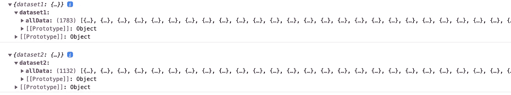

## 用 Chart.js 创建折线图

*   创建名为 **LineChart.js** 的文件
*   安装模块**“react-chart js-2”**:(官方文件:【https://react-chartjs-2.js.org/】T2

```
npm install --save chart.js react-chartjs-2
```

*   因为我们需要一个折线图，所以从" react-chartjs-2 "中导入**【折线图】**模块，
*   自定义 x 轴刻度的想法是:

(当数据点数> 100 时:次要刻度以***12 小时制【上午/下午】*** 的格式显示时间)，主要刻度显示日期

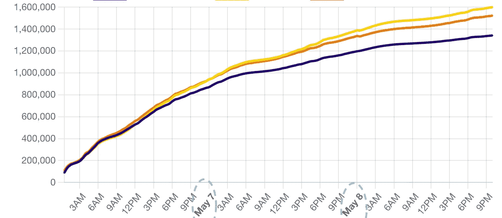

(当数据点数> 1000 时:x 轴仅显示日期)

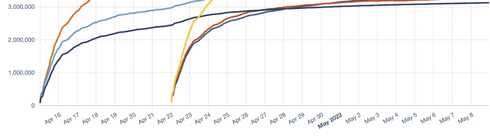

为了实现这个目标，我们需要使用适配器(我们在这个项目中使用的是[***【chart js】-adapter-date-fns***](https://github.com/chartjs/chartjs-adapter-date-fns)*):*

> *时间刻度需要一个日期库和一个相应的适配器。请从[可用的适配器](https://github.com/chartjs/awesome#adapters)中选择。*

*现在，让我们解释一下 **LineCharts.js:** 中的脚本*

*   *箭头功能 ***线图包含 2 个对象:****

1.  ***选项**:自定义图表属性，如样式、字体、图例等。(如果你不知道如何选择那些属性，请查看官方文档:[链接](https://www.chartjs.org/docs/latest/))*
2.  ***数据:**定义折线图的数据结构*

## *为 LineChart.js 创建父组件*

1.  *创建一个名为 **ViewCharts.js** 的文件*
2.  **因为* ***点赞数*** *要到电视剧结束才会公布，所以我们只提取* ***点击数*** *数据*作为图表的源数据集*
3.  *为数据库中的每一列定义数组。然后我们使用***array . foreach()***函数迭代我们从 scaper 获得的所有数据:将时间值追加到 ***标签*** 数组中，然后将 ***视图计数*** 值追加到数组中。*
4.  *返回并在屏幕上呈现这两个图表*

***结果:***

*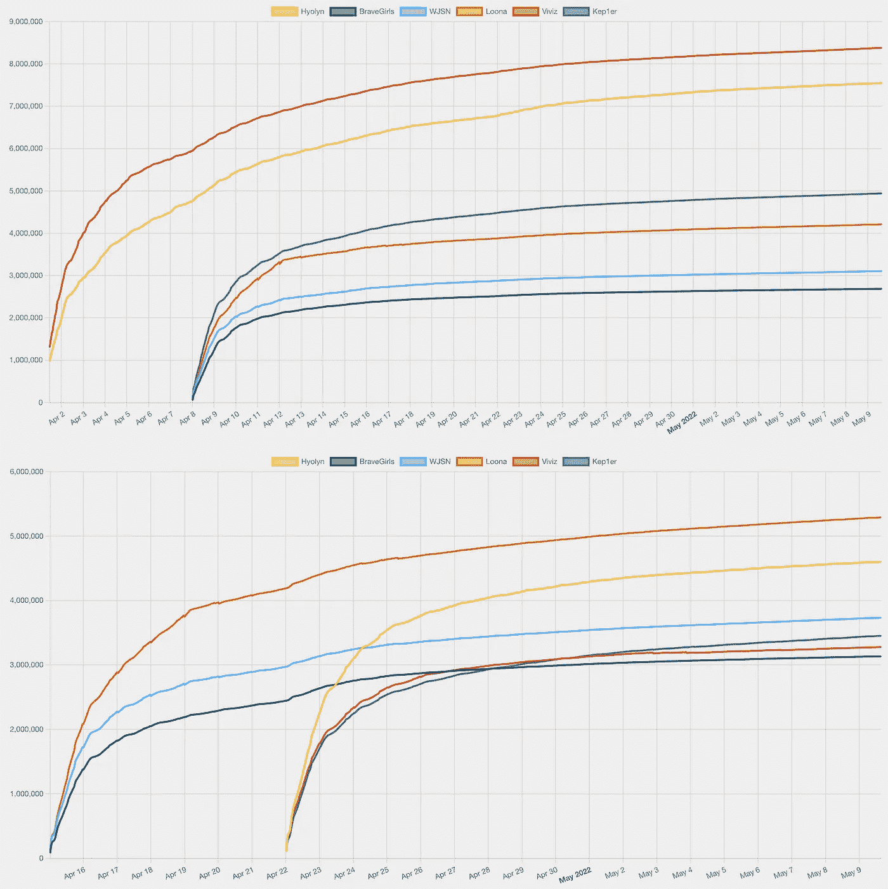*

## *用 Bootstrap 设计页面样式*

1.  *将 ***Bootstrap*** 安装在 React app 文件夹内:*

```
*npm i -save bootstrap@latest*
```

*2.将 ***Bootstrap*** 导入到 **index.js** 文件中:*

*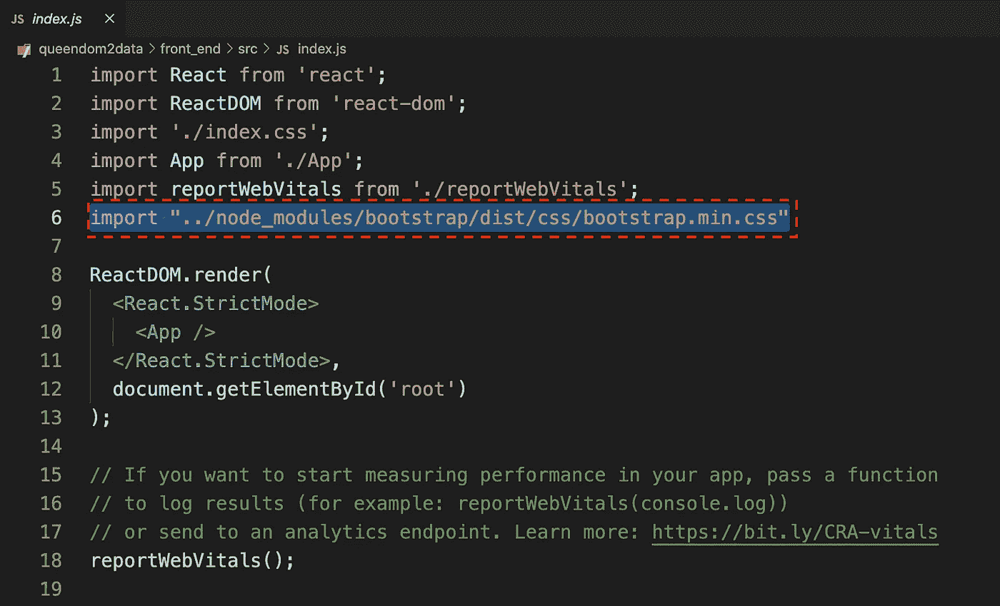*

*3.让我们更新 **ViewChart.js** 中的脚本*

***结果:***

**

# *部署*

*1.准备*

*   *确保您的计算机上已经安装了 git。*
*   *安装 Heroku CLI:【https://devcenter.heroku.com/articles/heroku-cli *
*   *(终端)激活项目的虚拟环境。*
*   *(终端)登录 Heroku:*

```
*heroku login -i*
```

*   *(终端)自动生成**需求。** **txt，**这是一个文件，用来存储项目所有依赖关系的信息:*

```
*pip freeze > requirements.txt*
```

*   *为了让 Heroku 知道如何启动我们的应用程序，我们需要创建一个名为“Profile”的文件，然后在其中添加一行:*

```
*web: gunicorn server:app*
```

****server*** :表示运行我们的应用程序的 python 文件( **server.py** )的名称*

****app*** :代表 app 名称，可以在 **server.py** 中找到:*

*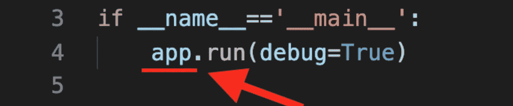*

*2.在 **server.py:** 中设置 ***静态 _ 文件夹*** 路径*

*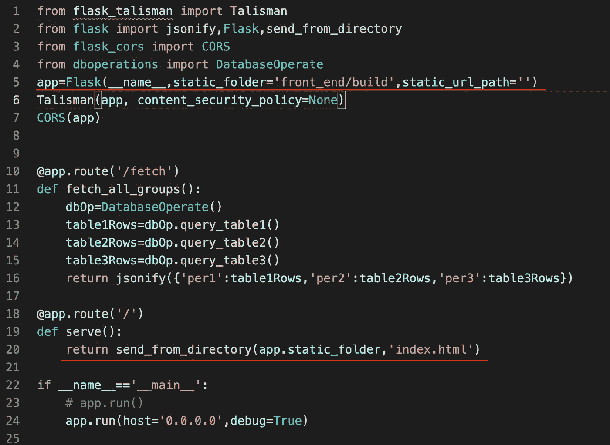*

*3.不要忘记在 **App.js** 中将 get 请求 URL 从本地地址改为 Heroku app 地址:*

*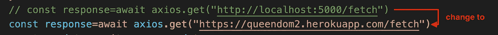*

*4.另外，不要忘记在 **package.json** 中添加一个属性*

*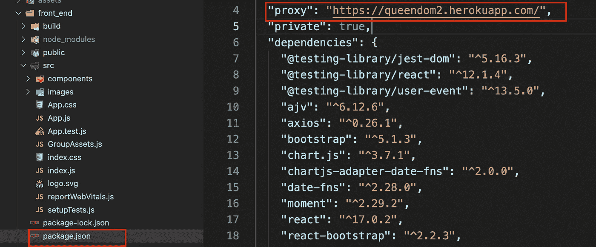*

*5.创建应用程序的生产版本**，运行:***

```
*npm run **build***
```

*6.将更改提交到本地存储库，并将更改部署到 Heroku*

```
*git push Heroku main*
```

***添加:**如果你想强制 Flask 为 App 使用自己的域而不是 Heroku 生成的域，你需要安装名为 **Talisman 的模块，**我们需要在 **server.py** 中添加一行:*

```
*Talisman(app, content_security_policy=None)*
```

***本教程到此为止。谢谢！***

*如果你有任何问题，请随时评论。*