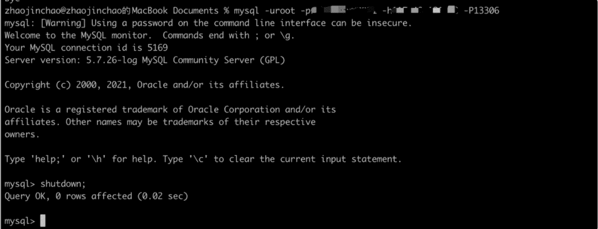
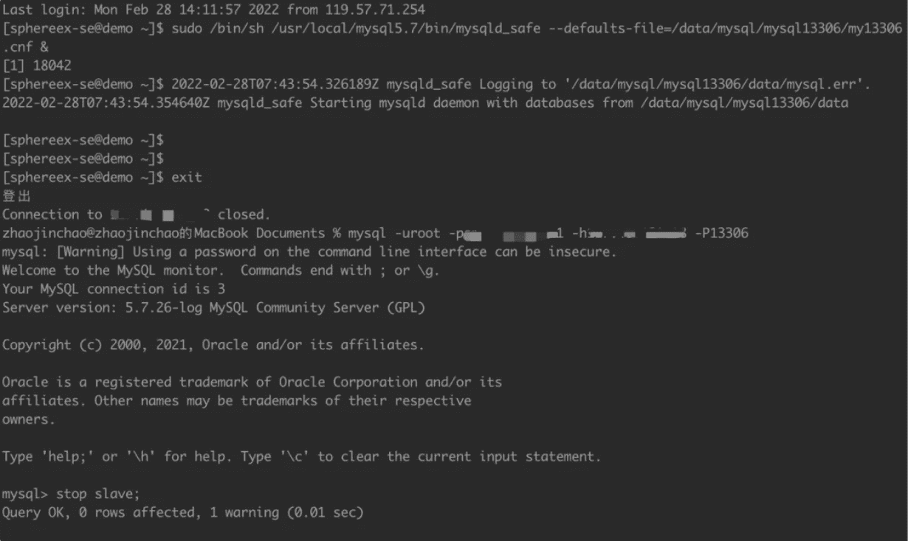
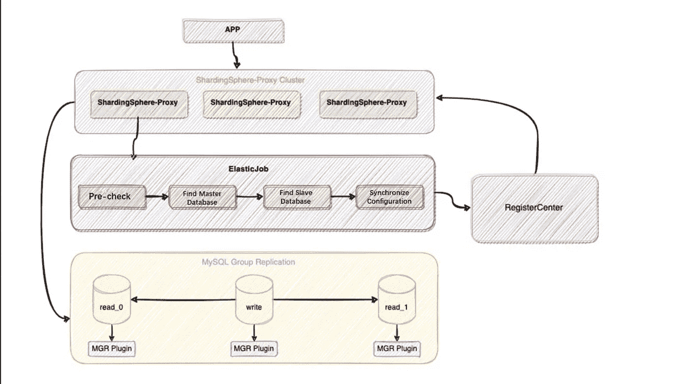
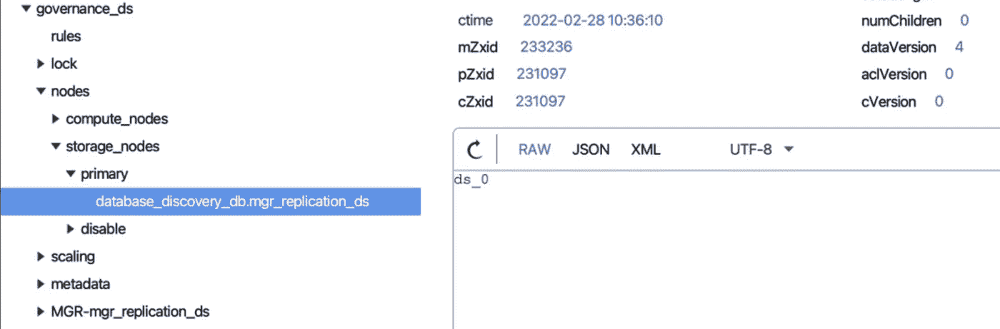
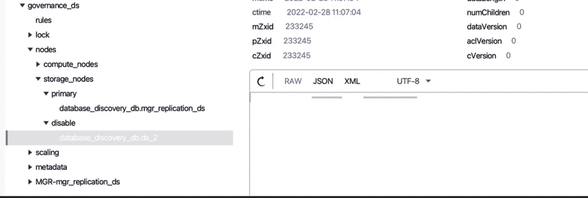

# 使用 Apache ShardingSphere 创建高可用性的分布式数据库

> 原文：<https://blog.devgenius.io/create-a-distributed-database-with-high-availability-with-apache-shardingsphere-b73bf776592?source=collection_archive---------5----------------------->

# 什么是数据库高可用性(HA)？

在数字时代，现代商业系统必须高度可用、可靠和稳定。作为现代商业系统的基石，数据库应该具有高可用性。

HA 允许数据库在主数据库和辅助数据库之间切换服务，并自动选择`Master`，因此它可以在前一个节点崩溃时选择最佳节点作为主节点。

# MySQL 高可用性

有很多 [MySQL 高可用性](https://www.mysql.com/products/enterprise/high_availability.html)选项，但是每一个都有其优缺点。以下是几种常见的高可用性选项:

*   [Orchestrator](https://github.com/openark/orchestrator) 是一个用 Go 编写的 MySQL HA 和复制拓扑管理工具。其优势在于支持手动调整主从拓扑、自动故障转移、通过 Web 可视化控制台自动或手动恢复主节点。然而，该程序需要单独部署，并且由于复杂的配置而具有陡峭的学习曲线。
*   MHA 是另一个成熟的解决方案。它提供主/辅助交换和故障转移功能。它的好处是，它可以确保交换过程中的数据丢失最少，同时它可以与半同步和异步复制框架一起工作。然而，在 MHA 启动后，只有`Master`被监控，MHA 没有为 read 数据库提供负载平衡特性。
*   [MGR](https://dev.mysql.com/doc/refman/8.0/en/group-replication.html) 基于分布式 Paxos 协议实现组复制，保证数据一致性。它是 MySQL 提供的官方 HA 组件，不需要额外的部署程序。相反，用户只需要在每个数据源节点安装 MGR 插件。该工具具有高一致性、高容错性、高可扩展性和高灵活性的特点。

# Apache ShardingSphere 高可用性

Apache ShardingSphere 的架构实际上将存储与计算分开。存储节点代表底层数据库，如 MySQL、PostgreSQL、openGauss 等。，而计算节点指的是 [ShardingSphere-JDBC](https://shardingsphere.apache.org/document/current/en/quick-start/shardingsphere-jdbc-quick-start/) 或 [ShardingSphere-Proxy](https://shardingsphere.apache.org/document/current/en/quick-start/shardingsphere-proxy-quick-start/) 。

相应地，针对存储节点和计算节点的[高可用性解决方案](https://shardingsphere.apache.org/document/current/en/features/ha/)也有所不同。对于无状态计算节点，虽然它们需要感知存储节点的变化，但它们也需要设置单独的负载平衡器，并具有服务发现和请求分发的能力。有状态存储节点需要具备数据同步、连接测试、选举主节点等功能。

虽然 ShardingSphere 没有提供高可用性的数据库，但它可以帮助用户在数据库高可用性的帮助下，通过其数据库发现和动态感知能力，集成数据库高可用性解决方案，如主从切换、故障发现、流量切换治理等。

当与分布式场景中的主次流控制特性相结合时，ShardingSphere 可以提供更好的高可用性读/写拆分解决方案。如果我们使用[**DistSQL**](https://opensource.com/article/21/9/distsql)**的动态高可用性调整规则来获取主/从节点的信息，将会更容易操作和管理 ShardingSphere 集群。**

# 最佳实践

Apache ShardingSphere 采用了面向插件的架构，因此其所有增强的功能都可以独立使用或一起使用。其高可用性功能通常与读/写拆分一起使用，根据负载平衡算法将查询请求分发到从数据库，以确保系统高可用性，缓解主数据库压力，提高业务系统吞吐量。

这里，我们以带有 sharding sphere[dist SQL RAL](https://shardingsphere.apache.org/document/current/cn/user-manual/shardingsphere-proxy/distsql/syntax/ral/)语句的 HA+读/写拆分配置为例。

**这里需要指出的一点是，ShardingSphere HA 实现依赖于它的分布式治理能力。**因此暂时只能在集群模式下使用。同时，ShardingSphere 5.1.0 中修订了读/写拆分规则。有关详细信息，请参考关于[读写拆分](https://shardingsphere.apache.org/document/current/cn/user-manual/shardingsphere-jdbc/yaml-config/rules/readwrite-splitting/)的官方文档。

> **配置*配置*配置**

```
schemaName: database_discovery_dbdataSources:ds_0:url: jdbc:mysql://127.0.0.1:1231/demo_primary_ds?serverTimezone=UTC&useSSL=falseusername: rootpassword: 123456connectionTimeoutMilliseconds: 3000idleTimeoutMilliseconds: 60000maxLifetimeMilliseconds: 1800000maxPoolSize: 50minPoolSize: 1ds_1:url: jdbc:mysql://127.0.0.1:1232/demo_primary_ds?serverTimezone=UTC&useSSL=falseusername: rootpassword: 123456connectionTimeoutMilliseconds: 3000idleTimeoutMilliseconds: 60000maxLifetimeMilliseconds: 1800000maxPoolSize: 50minPoolSize: 1ds_2:url: jdbc:mysql://127.0.0.1:1233/demo_primary_ds?serverTimezone=UTC&useSSL=falseusername: rootpassword: 123456connectionTimeoutMilliseconds: 3000idleTimeoutMilliseconds: 50000maxLifetimeMilliseconds: 1300000maxPoolSize: 50minPoolSize: 1rules:- !READWRITE_SPLITTINGdataSources:replication_ds:type: Dynamicprops:auto-aware-data-source-name: mgr_replication_ds- !DB_DISCOVERYdataSources:mgr_replication_ds:dataSourceNames:- ds_0- ds_1- ds_2discoveryHeartbeatName: mgr-heartbeatdiscoveryTypeName: mgrdiscoveryHeartbeats:mgr-heartbeat:props:keep-alive-cron: '0/5 * * * * ?'discoveryTypes:mgr:type: MGRprops:group-name: b13df29e-90b6-11e8-8d1b-525400fc3996
```

> ***要求***

*   ShardingSphere-Proxy 5.1.0(集群模式+ HA +动态读/写拆分规则)
*   动物园管理员
*   MySQL 管理器集群

> ***SQL 脚本***

```
CREATE TABLE `t_user` (`id` int(8) NOT NULL,`mobile` char(20) NOT NULL,`idcard` varchar(18) NOT NULL,PRIMARY KEY (`id`)) ENGINE=InnoDB DEFAULT CHARSET=utf8mb4;
```

> ***查看主次关系***

```
mysql> SHOW READWRITE_SPLITTING RULES;+----------------+-----------------------------+------------------------+------------------------+--------------------+---------------------+| name           | auto_aware_data_source_name | write_data_source_name | read_data_source_names | load_balancer_type | load_balancer_props |+----------------+-----------------------------+------------------------+------------------------+--------------------+---------------------+| replication_ds | mgr_replication_ds          | ds_0                   | ds_1,ds_2              | NULL               |                     |+----------------+-----------------------------+------------------------+------------------------+--------------------+---------------------+1 row in set (0.09 sec)
```

> ***查看二级数据库状态***

```
mysql> SHOW READWRITE_SPLITTING READ RESOURCES;+----------+---------+| resource | status  |+----------+---------+| ds_1     | enabled || ds_2     | enabled |+----------+---------+
```

从上面的结果我们可以了解到，目前一级数据库是`ds_0`，二级数据库是`ds_1`和`ds_2`。

来测试一下`INSERT`:

```
mysql> INSERT INTO t_user(id, mobile, idcard) value (10000, '13718687777', '141121xxxxx');Query OK, 1 row affected (0.10 sec)
```

查看 ShardingSphere-Proxy 日志，查看路由节点是否是主数据库`ds_0`。

```
[INFO ] 2022-02-28 15:28:21.495 [ShardingSphere-Command-2] ShardingSphere-SQL - Logic SQL: INSERT INTO t_user(id, mobile, idcard) value (10000, '13718687777', '141121xxxxx')[INFO ] 2022-02-28 15:28:21.495 [ShardingSphere-Command-2] ShardingSphere-SQL - SQLStatement: MySQLInsertStatement(setAssignment=Optional.empty, onDuplicateKeyColumns=Optional.empty)[INFO ] 2022-02-28 15:28:21.495 [ShardingSphere-Command-2] ShardingSphere-SQL - Actual SQL: ds_0 ::: INSERT INTO t_user(id, mobile, idcard) value (10000, '13718687777', '141121xxxxx')
```

来测试一下`SELECT`(重复两遍):

```
mysql> SELECT id, mobile, idcard FROM t_user WHERE id = 10000;
```

查看 ShardingSphere-Proxy 日志，查看路由节点是`ds_1`还是`ds_2`。

```
[INFO ] 2022-02-28 15:34:07.912 [ShardingSphere-Command-4] ShardingSphere-SQL - Logic SQL: SELECT id, mobile, idcard FROM t_user WHERE id = 10000[INFO ] 2022-02-28 15:34:07.913 [ShardingSphere-Command-4] ShardingSphere-SQL - SQLStatement: MySQLSelectStatement(table=Optional.empty, limit=Optional.empty, lock=Optional.empty, window=Optional.empty)[INFO ] 2022-02-28 15:34:07.913 [ShardingSphere-Command-4] ShardingSphere-SQL - Actual SQL: ds_1 ::: SELECT id, mobile, idcard FROM t_user WHERE id = 10000[INFO ] 2022-02-28 15:34:21.501 [ShardingSphere-Command-4] ShardingSphere-SQL - Logic SQL: SELECT id, mobile, idcard FROM t_user WHERE id = 10000[INFO ] 2022-02-28 15:34:21.502 [ShardingSphere-Command-4] ShardingSphere-SQL - SQLStatement: MySQLSelectStatement(table=Optional.empty, limit=Optional.empty, lock=Optional.empty, window=Optional.empty)[INFO ] 2022-02-28 15:34:21.502 [ShardingSphere-Command-4] ShardingSphere-SQL - Actual SQL: ds_2 ::: SELECT id, mobile, idcard FROM t_user WHERE id = 10000
```

> ***切换到主数据库***

关闭主数据库`ds_0`:



通过`DistSQL`查看主数据库是否发生变化，以及辅助数据库状态是否正确。

```
mysql> SHOW READWRITE_SPLITTING RULES;+----------------+-----------------------------+------------------------+------------------------+--------------------+---------------------+| name           | auto_aware_data_source_name | write_data_source_name | read_data_source_names | load_balancer_type | load_balancer_props |+----------------+-----------------------------+------------------------+------------------------+--------------------+---------------------+| replication_ds | mgr_replication_ds          | ds_1                   | ds_2                   | NULL               |                     |+----------------+-----------------------------+------------------------+------------------------+--------------------+---------------------+1 row in set (0.01 sec)mysql> SHOW READWRITE_SPLITTING READ RESOURCES;+----------+----------+| resource | status   |+----------+----------+| ds_2     | enabled  || ds_0     | disabled |+----------+----------+2 rows in set (0.01 sec)
```

现在，让我们插入另一行数据:

```
mysql> INSERT INTO t_user(id, mobile, idcard) value (10001, '13521207777', '110xxxxx');Query OK, 1 row affected (0.04 sec)
```

查看 ShardingSphere-Proxy 日志，查看路由节点是否是主数据库`ds_1`。

```
[INFO ] 2022-02-28 15:40:26.784 [ShardingSphere-Command-6] ShardingSphere-SQL - Logic SQL: INSERT INTO t_user(id, mobile, idcard) value (10001, '13521207777', '110xxxxx')[INFO ] 2022-02-28 15:40:26.784 [ShardingSphere-Command-6] ShardingSphere-SQL - SQLStatement: MySQLInsertStatement(setAssignment=Optional.empty, onDuplicateKeyColumns=Optional.empty)[INFO ] 2022-02-28 15:40:26.784 [ShardingSphere-Command-6] ShardingSphere-SQL - Actual SQL: ds_1 ::: INSERT INTO t_user(id, mobile, idcard) value (10001, '13521207777', '110xxxxx')
```

最后，让我们测试一下`SELECT`(重复两次):

```
mysql> SELECT id, mobile, idcard FROM t_user WHERE id = 10001;
```

查看 ShardingSphere-Proxy 日志，查看路由节点是否为`ds_2`。

```
[INFO ] 2022-02-28 15:40:26.784 [ShardingSphere-Command-6] ShardingSphere-SQL - Logic SQL: INSERT INTO t_user(id, mobile, idcard) value (10001, '13521207777', '110xxxxx')[INFO ] 2022-02-28 15:40:26.784 [ShardingSphere-Command-6] ShardingSphere-SQL - SQLStatement: MySQLInsertStatement(setAssignment=Optional.empty, onDuplicateKeyColumns=Optional.empty)[INFO ] 2022-02-28 15:40:26.784 [ShardingSphere-Command-6] ShardingSphere-SQL - Actual SQL: ds_1 ::: INSERT INTO t_user(id, mobile, idcard) value (10001, '13521207777', '110xxxxx')
```

> ***释放二级数据库***



通过`DistSQL`查看最新的主从关系变化。`ds_0`节点的状态恢复为使能，而`ds_0`集成到`read_data_source_names`:

```
mysql> SHOW READWRITE_SPLITTING RULES;+----------------+-----------------------------+------------------------+------------------------+--------------------+---------------------+| name           | auto_aware_data_source_name | write_data_source_name | read_data_source_names | load_balancer_type | load_balancer_props |+----------------+-----------------------------+------------------------+------------------------+--------------------+---------------------+| replication_ds | mgr_replication_ds          | ds_1                   | ds_0,ds_2              | NULL               |                     |+----------------+-----------------------------+------------------------+------------------------+--------------------+---------------------+1 row in set (0.01 sec)mysql> SHOW READWRITE_SPLITTING READ RESOURCES;+----------+---------+| resource | status  |+----------+---------+| ds_0     | enabled || ds_2     | enabled |+----------+---------+2 rows in set (0.00 sec)
```

基于上面提到的例子，您现在对 ShardingSphere 的高可用性和动态读/写拆分有了更多的了解。

接下来，我们将介绍有关底层数据库(也称为存储节点)的 HA 计划背后的原则。

# 原则

ShardingSphere 的高可用性解决方案允许用户进一步定制它并进行扩展。目前，我们已经完成了两个 HA 计划:一个是基于 MGR 的 MySQL 高可用性解决方案，另一个是由一些社区成员贡献的 openGauss 数据库高可用性解决方案。这两种解决方案的原理基本相同。

下面以 MySQL 为例说明 ShardingSphere 为什么以及如何实现数据库高可用性。



## 先决条件

ShardingSphere 通过执行以下 SQL 语句来检查底层 MySQL 集群环境是否准备就绪。如果任何测试失败，ShardingSphere 都无法启动。

*   检查是否安装了 MGR:

```
SELECT * FROM information_schema.PLUGINS WHERE PLUGIN_NAME='group_replication'
```

*   查看经理组成员编号:

底层 MGR 集群应该至少包含三个节点:

```
SELECT count(*) FROM performance_schema.replication_group_members
```

*   检查 MGR 集群的组名是否与配置中的一致:

组名是一个 MGR 组的标记，一个 MGR 集群的每个组只有一个组名。

```
SELECT * FROM performance_schema.global_variables WHERE VARIABLE_NAME='group_replication_group_name'
```

*   检查当前管理器是否设置为单主模式:

目前，ShardingSphere 不支持双写或多写场景。它仅支持单次写入模式:

```
SELECT * FROM performance_schema.global_variables WHERE VARIABLE_NAME='group_replication_single_primary_mode'
```

*   查询 MGR 组集群中的所有节点主机、端口和状态，以检查我们配置的数据源是否正确:

```
SELECT MEMBER_HOST, MEMBER_PORT, MEMBER_STATE FROM performance_schema.replication_group_members
```

> ***动态主数据库发现***

*   ShardingSphere 根据 MySQL 提供的查询主数据库 SQL 命令找到主数据库 URL。

```
private String findPrimaryDataSourceURL(final Map<String, DataSource> dataSourceMap) {String result = "";String sql = "SELECT MEMBER_HOST, MEMBER_PORT FROM performance_schema.replication_group_members WHERE MEMBER_ID = "+ "(SELECT VARIABLE_VALUE FROM performance_schema.global_status WHERE VARIABLE_NAME = 'group_replication_primary_member')";for (DataSource each : dataSourceMap.values()) {try (Connection connection = each.getConnection();Statement statement = connection.createStatement();ResultSet resultSet = statement.executeQuery(sql)) {if (resultSet.next()) {return String.format("%s:%s", resultSet.getString("MEMBER_HOST"), resultSet.getString("MEMBER_PORT"));}} catch (final SQLException ex) {log.error("An exception occurred while find primary data source url", ex);}}return result;}
```

*   将上面找到的主数据库 URL 逐一与我们配置的`dataSources`URL 进行比较。匹配的数据源是主数据库，它将被更新到当前的 ShardingSphere 内存，并永久保存到注册中心，通过注册中心，它将被分发到集群中的其他计算节点。



> ***动态辅助数据库发现***

ShardingSpherez 中有两种类型的辅助数据库状态:enable 和 disable。辅助数据库状态将与 ShardingSphere 内存同步，以确保读取流量可以正确路由。

*   获取管理器组中的所有节点:

```
SELECT MEMBER_HOST, MEMBER_PORT, MEMBER_STATE FROM performance_schema.replication_group_members
```

*   禁用辅助数据库:

```
private void determineDisabledDataSource(final String schemaName, final Map<String, DataSource> activeDataSourceMap,final List<String> memberDataSourceURLs, final Map<String, String> dataSourceURLs) {for (Entry<String, DataSource> entry : activeDataSourceMap.entrySet()) {boolean disable = true;String url = null;try (Connection connection = entry.getValue().getConnection()) {url = connection.getMetaData().getURL();for (String each : memberDataSourceURLs) {if (null != url && url.contains(each)) {disable = false;break;}}} catch (final SQLException ex) {log.error("An exception occurred while find data source urls", ex);}if (disable) {ShardingSphereEventBus.getInstance().post(new DataSourceDisabledEvent(schemaName, entry.getKey(), true));} else if (!url.isEmpty()) {dataSourceURLs.put(entry.getKey(), url);}}}
```

辅助数据库是否被禁用取决于我们配置的数据源和 MGR 组中的所有节点。

ShardingSphere 可以逐个检查我们配置的数据源是否可以正常获取`Connection`，验证数据源 URL 是否包含 MGR 组的节点。

如果无法获得`Connection`或者验证失败，ShardingSphere 将通过一个事件触发器禁用数据源，并将其同步到注册中心。



*   启用辅助数据库:

```
private void determineDisabledDataSource(final String schemaName, final Map<String, DataSource> activeDataSourceMap,final List<String> memberDataSourceURLs, final Map<String, String> dataSourceURLs) {for (Entry<String, DataSource> entry : activeDataSourceMap.entrySet()) {boolean disable = true;String url = null;try (Connection connection = entry.getValue().getConnection()) {url = connection.getMetaData().getURL();for (String each : memberDataSourceURLs) {if (null != url && url.contains(each)) {disable = false;break;}}} catch (final SQLException ex) {log.error("An exception occurred while find data source urls", ex);}if (disable) {ShardingSphereEventBus.getInstance().post(new DataSourceDisabledEvent(schemaName, entry.getKey(), true));} else if (!url.isEmpty()) {dataSourceURLs.put(entry.getKey(), url);}}}
```

在崩溃的辅助数据库被恢复并添加到 MGR 组之后，将检查我们的配置以查看是否使用了恢复的数据源。如果是，事件触发器将告诉 ShardingSphere 需要启用数据源。

> ***心跳机制***

为了确保主从状态实时同步，HA 模块引入了心跳机制。

通过集成 ShardingSphere 子项目 [ElasticJob](https://shardingsphere.apache.org/elasticjob/) ，上述流程在 HA 模块初始化时由 ElasticJob 调度器框架以作业的形式执行，实现了功能开发和作业调度的分离。

即使开发者需要扩展 HA 功能，也不需要关心作业是如何开发和操作的。

```
private void initHeartBeatJobs(final String schemaName, final Map<String, DataSource> dataSourceMap) {Optional<ModeScheduleContext> modeScheduleContext = ModeScheduleContextFactory.getInstance().get();if (modeScheduleContext.isPresent()) {for (Entry<String, DatabaseDiscoveryDataSourceRule> entry : dataSourceRules.entrySet()) {Map<String, DataSource> dataSources = dataSourceMap.entrySet().stream().filter(dataSource -> !entry.getValue().getDisabledDataSourceNames().contains(dataSource.getKey())).collect(Collectors.toMap(Entry::getKey, Entry::getValue));CronJob job = new CronJob(entry.getValue().getDatabaseDiscoveryType().getType() + "-" + entry.getValue().getGroupName(),each -> new HeartbeatJob(schemaName, dataSources, entry.getValue().getGroupName(), entry.getValue().getDatabaseDiscoveryType(), entry.getValue().getDisabledDataSourceNames()).execute(null), entry.getValue().getHeartbeatProps().getProperty("keep-alive-cron"));modeScheduleContext.get().startCronJob(job);}}}
```

# 结论

到目前为止，Apache ShardingSphere 的 HA 特性已经被证明适用于 MySQL 和 openGauss HA 解决方案。

展望未来，它将集成更多的 MySQL HA 产品，并支持更多的数据库 HA 解决方案。

一如既往，如果您感兴趣，非常欢迎您加入我们，为 Apache ShardingSphere 项目做出贡献。

# Apache ShardingSphere 开源项目链接:

[ShardingSphere Github](https://github.com/apache/shardingsphere/issues?page=1&q=is%3Aopen+is%3Aissue+label%3A%22project%3A+OpenForce+2022%22)

[ShardingSphere Twitter](https://twitter.com/ShardingSphere)

[切割球松弛度](https://join.slack.com/t/apacheshardingsphere/shared_invite/zt-sbdde7ie-SjDqo9~I4rYcR18bq0SYTg)

[投稿指南](https://shardingsphere.apache.org/community/cn/contribute/)

# 作者

**赵金超**

> SphereEx 中间件工程师& Apache ShardingSphere 提交者
> 
> 目前，赵正致力于开发 Apache ShardingSphere 的高可用性特性。

