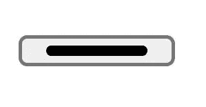
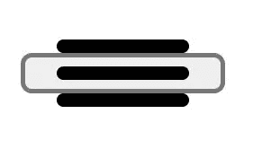

# 使用 CSS 创建一个汉堡菜单图标

> 原文：<https://blog.devgenius.io/create-a-hamburger-menu-using-css-5b3d776e7a96?source=collection_archive---------0----------------------->

汉堡菜单用于在移动设备中切换导航

[Danial Igdery](https://unsplash.com/@ricaros) 在 [Unsplash](https://unsplash.com/?utm_source=medium&utm_medium=referral) 上拍摄的照片

当我在开发响应性导航条时，我很难创建一个汉堡按钮来切换移动设备中的导航链接。所以我读博客，也看视频教程，但没有一个解释如何创建汉堡包按钮，大多数网站使用它来切换移动设备中的导航。
所以在这个博客中，我们将看到如何在 CSS 中以最简单的方式创建一个汉堡按钮。我不会解释所有的 HTML 标签或 CSS 类，相反，我会写下步骤，并建议你们在阅读这些步骤的同时进行编码，这些步骤将帮助你们自己创建自己的汉堡包按钮！如果您卡在任何一个步骤中，您可以根据步骤在这里参考代码。
现在让我们开始创建汉堡按钮，💻打开您最喜欢的代码编辑器，为您的汉堡包项目创建一个文件夹📁并在其中创建一个 HTML 文件，然后开始为按钮的结构编写代码。

**第 1 步**:按钮的 HTML 结构
创建一个带有一个跨度标签的“导航切换”类的按钮。在 span 标签上添加一类“汉堡”。
**第 2 步**:向按钮
添加 CSS，创建一个 styles.css 文件📋并开始向按钮添加样式。
打造汉堡档次。因为默认情况下跨度标记是内嵌的，所以将其作为一个块元素。根据您的喜好添加宽度、高度和颜色，给它一个相对位置，这将有助于创建它的伪元素。
造型后，应该是这样的:

添加 CSS 后的汉堡按钮

所以到目前为止，我们已经创建了一个按钮，并设计了它，但它现在只有一条水平线，而大多数网站使用三条或两条水平线来创建汉堡按钮，那么如何创建一个多条线的按钮呢？
答案是使用伪元素。
伪元素，顾名思义，就是在不编写任何额外的 HTML 标签的情况下创建伪元素。有许多伪元素，如首字母、前、后、第一行、后放、标记等。
如何使用伪元素？🤔
选择需要修改或需要额外元素的元素，然后用双冒号(::)引用伪元素名称，例如，如果我想给段落的第一个字母(< p >)添加不同的颜色，我将使用下面的 CSS 代码来实现，

> p::第一个字母{
> 颜色:黄色；
> }

为了创建汉堡包按钮，我们将使用::before 和::after 伪元素。这些用于创建所选元素的子元素，这里唯一的条件是它应该包含 content 属性。你可以写任何内容，如果你不想要任何内容，你可以放一个空字符串。内容的用途在于它允许屏幕阅读器阅读它。可以如下所示创建::before 和::after 元素，

伪元素

现在使用这些伪元素来创建汉堡包类的额外水平线。

**第三步**:创建汉堡
的伪元素::before 和::after，添加绝对位置，并将其左右位置赋为零，以便将其与汉堡对齐，并赋予其类似于汉堡的风格。
造型后应该是这样的，

添加伪元素后的汉堡菜单

**第四步:**添加 CSS 到 nav-toggle 类，使其适合汉堡包，使其透明，根据你的要求给它填充和定位。

完成 CSS 后，汉堡菜单就准备好了，应该如下所示，

汉堡菜单

如果你想了解更多关于伪元素或 CSS 的知识，你可以参考这个[站点](https://web.dev/learn/css/pseudo-elements/)，如果你想学习并创建你自己的响应导航栏，你也可以参考我的文章。

 [## 用 HTML、CSS 和 JS 创建一个响应式导航条！

### 在这篇文章中，我们将创建一个在桌面和移动设备上都可以完全响应的导航栏…

blog.devgenius.io](/create-a-responsive-navigation-bar-in-html-css-and-js-4648ce90fd6c) 

**下一步怎么办:**
1。使用不同的风格和设计练习制作汉堡纽扣
2。将按钮添加到导航栏
3。了解关于伪元素和伪类的更多信息
4。练习伪元素和类及其属性。