# 在 Unity 中创建一个战利品系统

> 原文：<https://blog.devgenius.io/create-a-loot-system-in-unity-2576f7eb10d5?source=collection_archive---------2----------------------->

## 使用脚本对象和预设

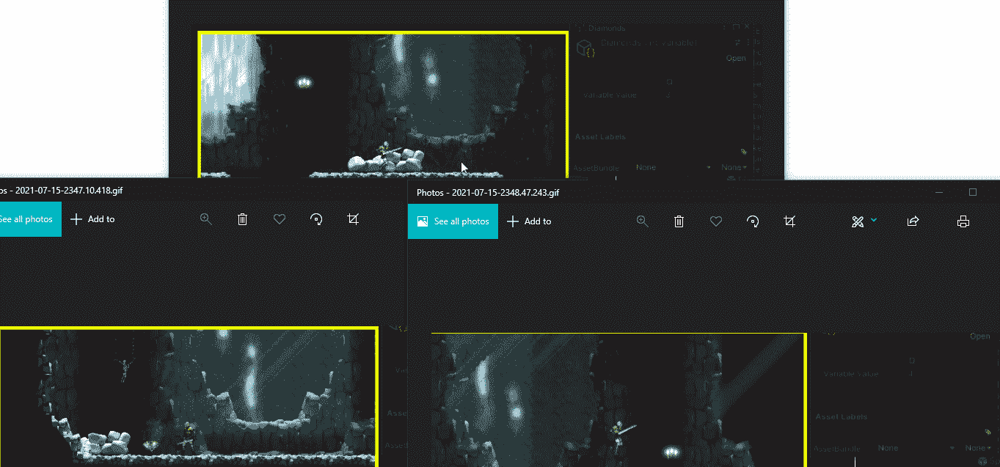

我创建了一个 Gem ScriptableObject 来跟踪我的玩家有多少宝石。关于 ScriptableObject 变量的更多信息，请参见 GIT hub 上我的 [**核心框架**](https://github.com/JamesLaFritz/CoreFrameWork) 。

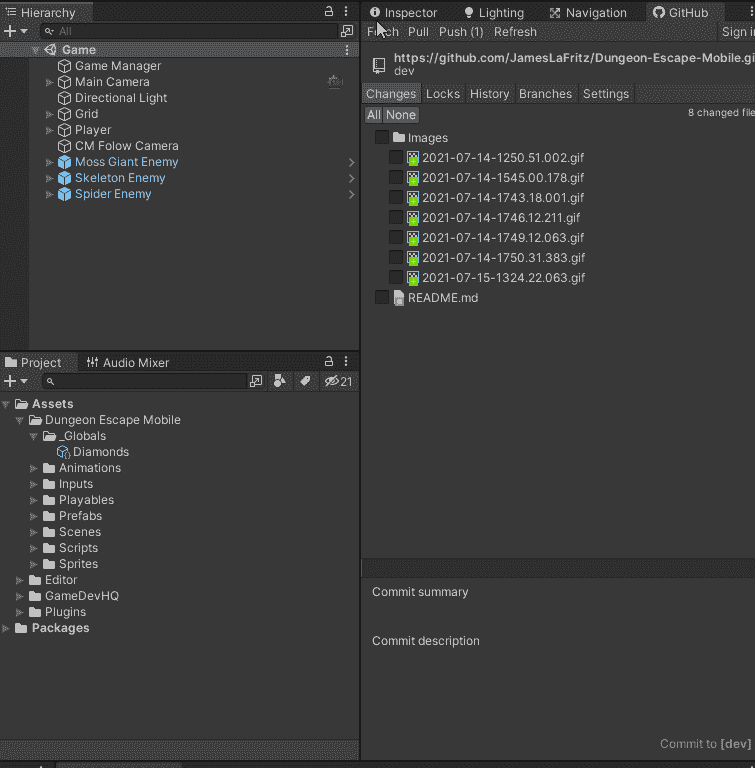

我为我的敌人创造了一个预置，一旦他们被杀死，我就可以把它丢进游戏。

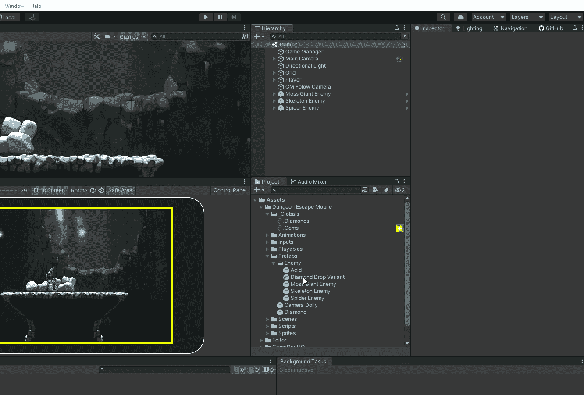

菱形有一个行为，当玩家与它碰撞时，它会将菱形的值添加到 ScriptableObject 中。然后它会自我毁灭。

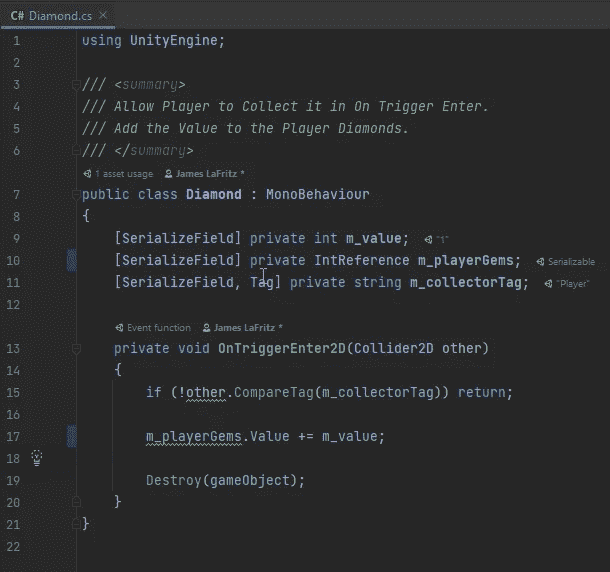

我确保我的钻石和钻石掉落预设使用我之前创建的这个 ScriptableObject。两个预设之间的区别是钻石掉落预设有一个额外的碰撞器来防止它从地面掉落，并使用重力。

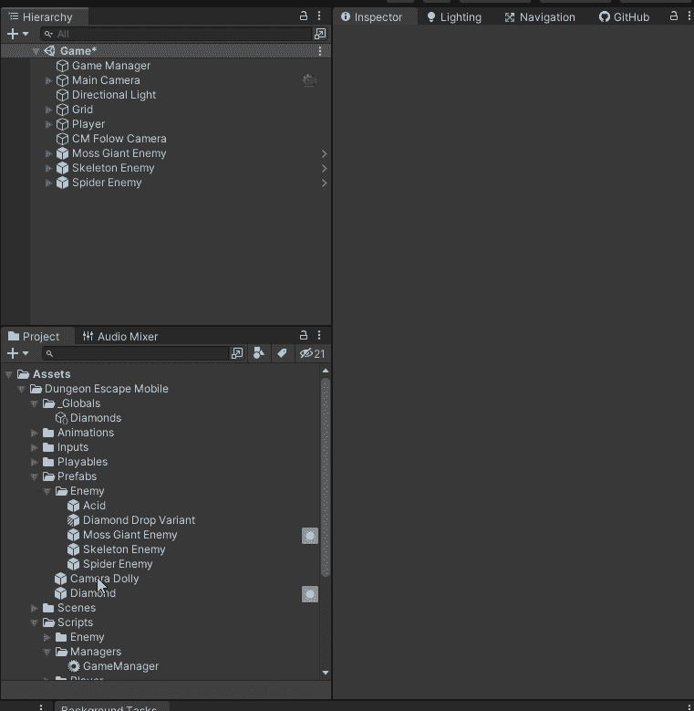

我的敌人有一个生命值属性，当它被设置时，如果它没有死，它会设置敌人的生命值。如果敌人的生命值小于 1，那么它会设置死亡属性为真。

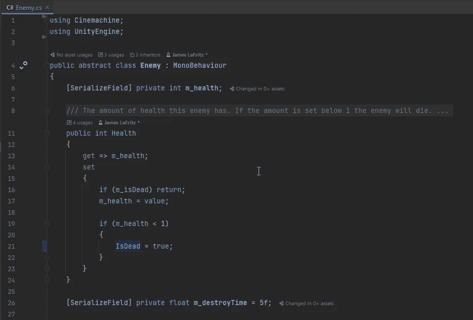

当敌人死亡时，我有几种不同的方法可以给玩家宝石或战利品。因为我的游戏中唯一的战利品是钻石，所以我将为敌人的每个宝石生成一个钻石预置(如果有的话),为此我使用了一个 for 循环，我可以引用生成的游戏对象，并将值改为宝石的数量。然后我在设定的时间后消灭敌人，这样死亡动画就有足够的时间播放了。

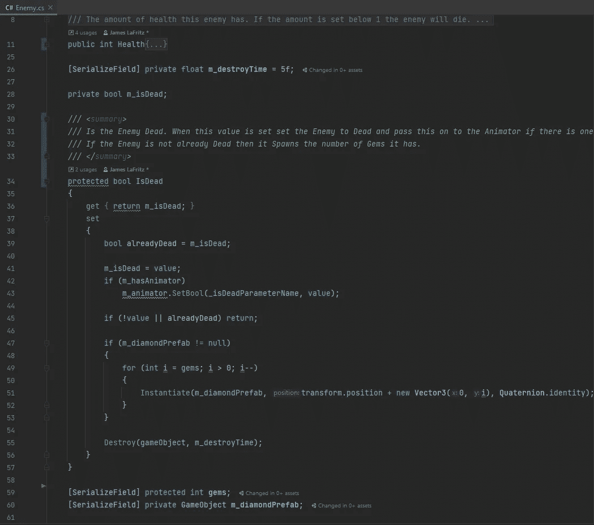

我编辑我所有的敌人预设，用新的参数更新它们。

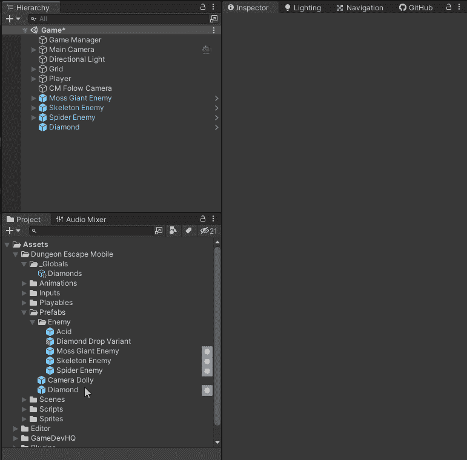

现在我可以拿回我的战利品了。不管它是被其中一个敌人弄掉的还是来自其他地方的。这些系统是完全独立和模块化的。

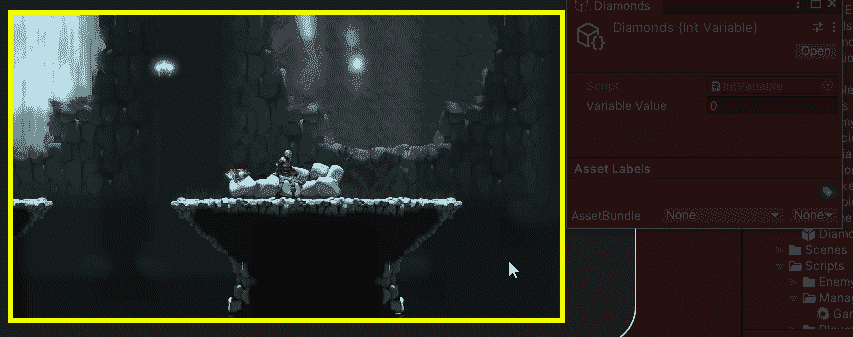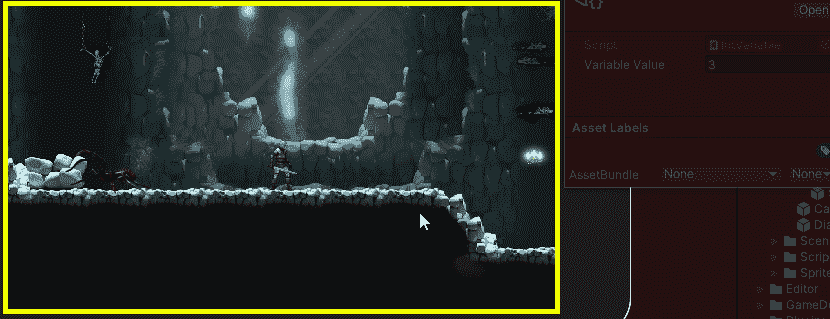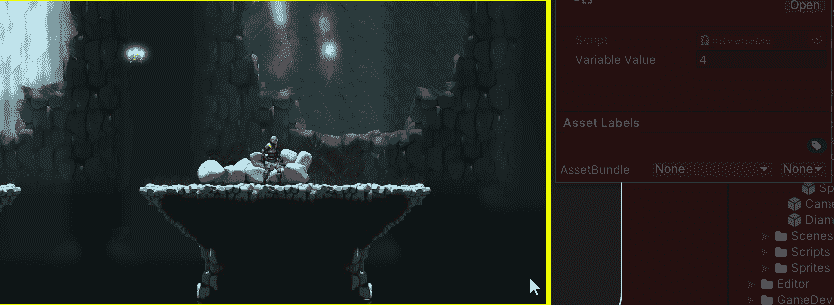