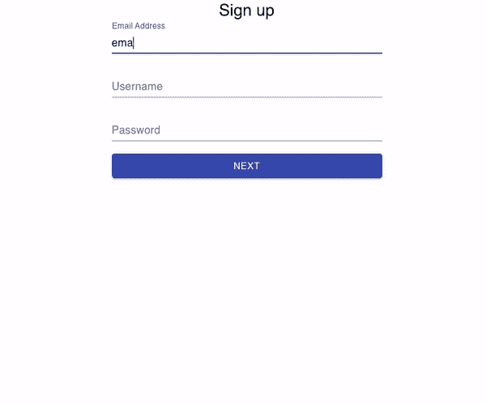

# 用反应堆创建多步表单

> 原文：<https://blog.devgenius.io/create-a-multi-step-form-with-reactjs-322aa97a2968?source=collection_archive---------0----------------------->

## 如何构建多步表单的分步指南

(声明:本指南仅针对前端开发，不涉及后端。我们将使用 ES6 语法来析构大多数部分。为了避免这篇文章太长，我将只介绍使多步表单成为可能所必需的任何内容。)

作为一个刚开始开发不到一年的 web 开发人员，我学会了构建一个只有一个页面的表单。我最近加入的黑客马拉松促使我学习构建一个多步表单，你猜怎么着？实际上并没有我们想象的那么难。🤔


照片由 [Unsplash](https://unsplash.com?utm_source=medium&utm_medium=referral) 上的 [inlytics | LinkedIn 分析工具](https://unsplash.com/@inlytics?utm_source=medium&utm_medium=referral)拍摄

## 为什么是多步式？

这个真的要看用户的喜好了。有些人可能不喜欢一页一页地填写表单，但是多步骤表单的优势对于取代需要填写大量信息的冗长表单特别有用。具有来回滚动的功能可以帮助缓解从第一印象开始上下滚动的压力。根据《风险港湾》[的一篇文章](https://www.ventureharbour.com/multi-step-lead-forms-get-300-conversions/),多步形式可以获得高达 300%的转化率，其中一个好处是它有助于减少心理摩擦。

这里有一篇[更详细的文章](https://wpmanageninja.com/single-step-form-vs-multi-step-form-which-one-is-the-best-and-why/)解释了单步和多步表单的利与弊。

在本文中，我将**介绍如何创建注册表单**(这是我们最常看到多步表单的地方)。

事不宜迟，让我们开始我们的多步形式！

## 目录

*   [**代码设置(如果您已经设置了 React 应用程序，则为可选)**](#de56)
*   [**第一步:组织好你要多少个步骤，每个步骤要包含哪些信息**](#0779)
*   [**第二步:设置我们的组件**](#653f)
*   [**第三步:在 Signup.js 中定义状态**](#5a34)
*   [**第四步:在 Signup.js**](#58b3) 中定义方法
*   [**第五步:将表单组件的状态导入并传递到 Signup.js**](#367e)
*   [**第六步:给子组件添加信息**](#7406)
*   [**步骤 7a:创建“下一步”按钮继续**](#1575)
*   [**步骤 7b:创建“上一步”按钮返回到上一步**](#7ecd)
*   [**演示**](#d22e)

# 游戏攻略

(本教程的 Github repo 在 demo 之后的页面底部。)

## **🔍代码设置(如果您已经设置了 React 应用程序，则可选)🔍**

如果您已经设置好，请点击此处的[按钮](#0779)

在开始之前，让我们先创建一个 React 应用程序。

为了信息的准确性，我在写这篇文章时使用了一个新的 React 应用程序。所以你和我一起在这个旅程中！

```
npx create-react-app multi-step-form-tutorial
```

React 应用程序安装后，运行

```
cd multi-step-form-tutorial
```

首先访问文件夹。那就跑

```
code .
```

在您首选的代码编辑器中打开文件夹。然后跑

```
yarn start 
```

或`npm start`启动服务器。

这就是你看到的，对吗？


让我们保持这一页，回到我们的代码。以下是你可以删除的一些东西:

```
App.test.jslogo.svgsetupTests.js
```

然后转到`App.js`，删除第 7 行到第 20 行的所有内容，删除第 1 行的`import logo from ‘./logo.svg’;`，替换为`import React from 'react';`。

删除`App.css`中的所有内容，除了第 1-3 行。


当前 App.js

这部分其实是可选的:你可以去`public`文件夹👉🏻`'index.html’`转到第 27 行，将`<title>React App</title>`改为`<title>Multi-Step Form</title>`。

好了，这就是我们真正开始的地方！

## **🥁第一步:组织你想要多少步骤，以及你想在每个步骤中包含哪些信息🥁**

在本指南中，我们将表单分为 4 个步骤。

*   **用户详细信息**:电子邮件、用户名、密码
*   个人详细信息:名、姓、居住国、教育水平
*   **确认(可选——不包括在本文中)**
*   **成功(可选——本文不涉及)**

✨ **注意:**在多步表单中，每一步都有自己的组件，同时有一个父元素将所有必要的细节传递给这些步骤。✨

```
App.js
└───Signup.js
    ├───UserDetails
    ├───PersonalDetails
    ├───Confirmation
    └───Success
```

## **🥁第二步:建立我们的 components🥁**

让我们在`src`中创建一个名为`components`的文件夹。在`components`文件夹中，创建 5 个文件:

*   `Signup.js`(父)
*   `UserDetails.js`
*   `PersonalDetails.js`
*   `Confirmation.js`
*   `Success.js`

在每个文件中，除了`Signup.js`，在第一行输入`**rafce**`(如果你在 VS 代码中安装了 ES7 React 扩展)。对于`Signup.js`，输入`**rcc**`，这将显示类组件。

对于所有文件，在`<div>`中键入您想要的任何内容，这样当您稍后想要在服务器中测试它时就不会出现错误。


注册. js


用户详细信息. js

最后但同样重要的是，让我们将父组件`Signup.js`插入到`App.js`文件中，不要忘记导入文件——如果您有扩展名的话，它会自动为您导入。


App.js

让我们用`npm start`(或`yarn start`)运行服务器，您应该会看到


你在`Signup.js`中的`<div>`中输入的 hello 或任何内容将显示在屏幕中间。如果你看到这个，你设置你的代码是正确的！

## **🥁步骤 3:在 Signup.js 🥁中定义状态**

因为我们将来回移动表单，所以我们将创建一个名为`step`的状态，它将计算表单步骤并引导我们找到正确的表单。我们还将在`state`中创建一系列字段，这样它将接受我们在方法`handleChange()`中输入的任何输入。

换句话说，我们的状态会有:`step`，默认会是`1`，默认空字符串有`email`、`username`、`password`、`firstName`、`lastName`、`country`、`levelOfEducation`。


state-sign up . js

我希望这就是你屏幕上显示的内容！

## **🥁步骤 4:在 Signup.js 🥁中定义方法**

既然已经设置了`state`，就该设置方法了！

我们的方法将是:`prevStep()`、`nextStep()`、`handleChange()`。我希望这些方法是不言自明的。

`prevStep()`将用户带到上一步(如果点击)；

```
// *go back to previous step* prevStep = () => {
  const { step } = this**.**state;
  this**.**setState({ step: step - 1 });
}
```

`nextStep()`将带用户进入下一步(如果点击)；

```
// *proceed to the next step* nextStep = () => {
  const { step } = this**.**state;
  this**.**setState({ step: step + 1 });
}
```

`handleChange()`每当用户输入或选择某物时改变

```
// handle field change
handleChange = input => e => {
  this.setState({ [input]: e.target.value });
}
```

当然，你可以使用钩子来实现，但是由于钩子在类组件中不起作用，我们必须使用常规的 React 方式来处理状态变化。


方法— Signup.js

## **🥁步骤 5:将状态导入并传递到🥁的 Signup.js 表单组件中**

在这里，我们将我们的子节点导入到父节点，这样我们的父节点可以将状态传递给它的子节点，我们将利用我们的状态`step`来控制流程。

因为有这么多的值(或状态)，我们将析构它。👇🏻

```
const { step } = this**.**state;const { email, username, password, firstName, lastName, country, levelOfEducation } = this**.**state;const values = { email, username, password, firstName, lastName, country }
```

然后，我们将使用`switch`条件语句根据步数切换到不同的形式，我们还将把状态传递给我们的孩子。(别忘了删除`return (<div></div>)`)

```
switch (step) {
  case 1: 
    return (
      <UserDetails />
    )
  case 2: 
    return (
      <PersonalDetails />
    )
  case 3: 
    return (
      <Confirmation />
    )
  case 4:
    return (
      <Success />
  // never forget the default case, otherwise VS code would be mad!
  default: 
     // do nothing
}
```

下面是我们传递给每个表单的状态和方法:

通过的状态/方法:

*   `UserDetails` : `nextStep()`，`handleChange()`，`values`
*   `PersonalDetails` : `prevStep()`，`nextStep()`，`handleChange()`，`values`
*   `Confirmation` : `prevStep()`，`nextStep()`，`values`


开关盒— Signup.js

好了，这就是`Signup.js`的设置！


Signup.js 的后半部分

如果你按照步骤来做，它应该是这样的！

现在检查您的服务器，它应该继续显示您在`UserDetails.js`中键入的任何内容，因为我们的步骤现在设置在`1`。

**✨注:**为避免重复，以下所有步骤对每张表格都是一样的，除非另有说明。✨

## **🥁步骤 6:向 UserDetails/PersonalDetails🥁添加信息**

先来解构一下道具(已经`Signup.js`传到的)。这个过程对其他孩子来说是一样的，所以我在这里只展示一次析构。


destruct-user details . js

你可以做`this.props`等等。，但这些代码非常重复，我们希望展示更清晰的代码。

因为我们没有做任何样式，为了这个指南，我将把`[@material-ui](https://material-ui.com/)`导入到应用程序中，为我们的表单创建一个动态样式。如何设计你的表单取决于你自己。

```
// with npm
npm install @material-ui/core// with yarn
yarn add @material-ui/core
```

我不打算在这里解释 material-ui 是如何工作的，但是如果你想要我所拥有的精确样式格式，请随意查看我的 repo。

需要提醒✨Please 的是，在本文中，我们并不关注表单的样式。✨

我假设您之前已经创建了一个表单，所以我将跳过逻辑部分。我们的输入标签将由`placeholder`、`type`、`value`、`onChange`组成。

```
<label>Email
  <input 
    type="text" 
    placeholder="email address" 
    value={values**.**email} 
    onChange={handleChange('email')}
  />
</label>
```

或者，如果您使用的是材质界面方式:

```
<TextField
  placeholder="Email Address"
  label="Email Address"
  onChange={handleChange('email')}
  defaultValue={values**.**email}
/>
```

`value` / `defaultValue`将接受我们从`Signup.js`析构的值，而`onChange`事件监听器将监听用户输入的任何内容，并更改值的状态，在本例中为`“email”`。

在所有文本字段之后，让我们为`previous`和`next`步骤创建一个按钮。

除了第一页和最后一页之外，每张表格的格式都相同，因为分别没有`Previous`和`Next`按钮。

在步骤 7a 中，我们学习了如何继续翻页。

在步骤 7b 中，我们将做相反的事情，让页面返回到之前的表单。

## **🥁步骤 7a:创建“下一步”按钮继续🥁**

然后让我们创建一个`Continue`函数，这样当用户点击“下一步”按钮时(稍后我们将创建事件监听器)，它将把用户带到下一步。

```
const Continue = e => {
  e.preventDefault();
  nextStep();
}
```

在我们的`<form>`标签中，让我们插入一个按钮。

```
<button onClick={ Continue }>Next</button>
```

使用事件监听器`onClick`，无论何时点击这个按钮，服务器都会监听事件监听器并发送给我们的父节点，并给我们的`step`状态加 1，即表单会移动到下一步。

## **🥁步骤 7b:创建“上一个”按钮，返回到上一个 step🥁**

我们将使用`prevStep()`而不是`nextStep()`——别忘了在你的析构函数中也加入这一点。我们的函数将如下所示:

```
const Previous = e => {
  e.preventDefault();
  prevStep();
}
```

对于我们的`Previous`按钮，我们也将它添加到我们的`onClick`事件监听器:

```
<button onClick={ Previous }>Previous</button>
```


个人详细信息

最后但同样重要的是，我们还有确认页面和成功页面。由于在这篇文章中，我将只涵盖必要的部分，所以如果你有兴趣看到代码(这只是普通的 JSX)，这里的 Github [回购](https://github.com/mehmehmehlol/multi-step-form-tutorial)供参考！

# 演示



我为白色背景道歉😅

# 在你走之前…

这是一篇相当长的文章，我希望你能从你的项目中学到些什么！我还从这两个视频中获取了大量参考资料和一些格式，这两个视频是我在学习制作多步表单时观看的:

上面视频的 Github [回购](https://github.com/bradtraversy/react_step_form)

除了 Material UI 之外，他还使用了一种叫做 Formik 和 Yup 的东西。在写这篇文章之前，我从未听说过这两个库，但我喜欢他展示如何制作进度条——这也是我正在努力学习的东西！！

## 更多资源:

[](https://material-ui.com/) [## Material-UI:一个流行的 React UI 框架

### React 组件使 web 开发更快更容易。建立自己的设计体系，或者从材料设计开始。

material-ui.com](https://material-ui.com/) 

本教程的 Github Repo:

[](https://github.com/mehmehmehlol/multi-step-form-tutorial) [## mehmehmehlol/多步表单教程

### 创建一个多步注册表单的快速演示

github.com](https://github.com/mehmehmehlol/multi-step-form-tutorial)