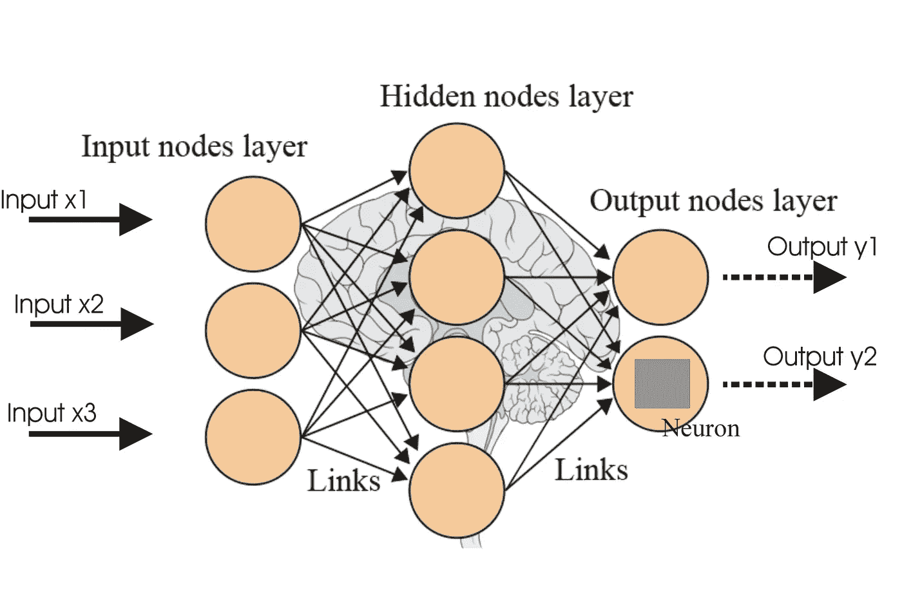
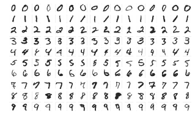
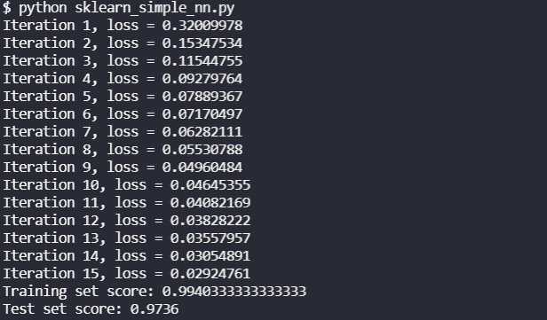
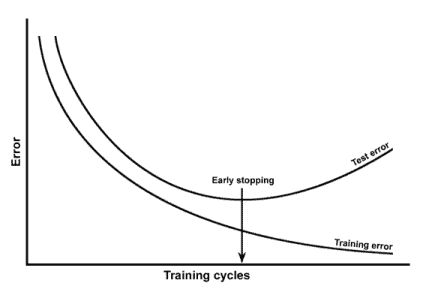

# 在 Sci-Kit 学习中创建神经网络

> 原文：<https://blog.devgenius.io/create-a-neural-network-in-sci-kit-learn-943c928a306d?source=collection_archive---------3----------------------->

## 使用 sklearn 的 MLPClassifier 在不到 40 行 Python 代码中轻松创建一个神经网络



[来自堆栈溢出的图像](http://stackoverflow.com/questions/34725495/can-i-use-a-neural-network-for-regression-when-input-has-multiple-output-values)

神经网络是 21 世纪应用机器学习兴起的支柱。虽然它们是在 20 世纪后期发明的，但当时的计算能力不足以发挥神经网络的全部能力。神经网络的基本技术是梯度下降、反向传播和激活函数。梯度下降和反向传播都需要对多元微积分有所了解。谢天谢地，像`sklearn`这样的机器学习库已经为我们抽象出了这一点。在本帖中，我们将讲述如何使用`sklearn`构建自己的神经网络，而无需深入多变量微积分。

我们将使用 SKLearn 的“多层感知器分类器”的`MLPClassifier`。多层感知器只是神经网络的一个花哨词，反之亦然。神经网络由许多感知器组成，这些感知器也可以称为“节点”或“神经元”。感知器是一个简单的函数表示，它对一些输入进行数学运算并返回结果。感知器也是典型的“二元分类器”,这意味着它们返回 0 或 1。经典的数学是某种分类函数，如 sigmoid 函数。

# 如何使用 SKLearn 构建神经网络的概述

1.  导入正确的`sklearn`库
2.  获取和转换 MNIST 数据集
3.  对数据执行训练/测试分割
4.  通过 MLP 分类器建立我们的神经网络
5.  训练神经网络
6.  在 MNIST 数据集上检验我们的神经网络的性能

# 导入正确的`sklearn`库

用`sklearn`构建神经网络很简单。我们真正需要的唯一函数是来自`sklearn.neural_network`的`MLPClassifier`函数。然而，对我们来说，我们将导入多个助手函数。我们将从`sklearn.exceptions`导入`warnings`库和`ConvergenceWarning`，因为我们不能确定模型会收敛。对于这个例子，我们将只运行 15 次迭代，所以我们不应该期望模型收敛。我们还将从`sklearn.datasets`导入`fetch_openml`，以导入 MNIST 数据集来训练和测试我们的神经网络。

```
import warningsfrom sklearn.datasets import fetch_openmlfrom sklearn.exceptions import ConvergenceWarningfrom sklearn.neural_network import MLPClassifier
```

# 获取和转换 MNIST 数据集



[图片来自维基百科](https://en.wikipedia.org/wiki/MNIST_database)

为了训练神经网络，我们需要数据。重要的是，我们不只是获得任何数据，而是获得合适的数据来进行训练和测试。数据必须被清理并缩放到正确的尺寸。由于我们自己收集、清理和缩放数据进行训练会非常困难，所以我们将使用 OpenML 中现有的数据集。

处理完导入后，我们将下载并转换 MNIST 数据集。要获取数据集，我们需要做的就是调用我们导入的库之一`fetch_openml`，并向它传递正确的参数。第一个参数是 MNIST 数据集的名称，指定我们想要 28x28 像素的图像(因此是 784)。我们还指定我们需要第一个版本，并且我们希望它以`X, y`格式返回。然后，我们将 X 数据除以 255，缩放到`[0,1]`范围。

```
# load MNIST data from fetch_openmlX, y = fetch_openml("mnist_784", *version*=1, *return_X_y*=True)X = X/255.0
```

# 对数据执行训练/测试分割

对数据进行训练/测试分割是常见的做法。由于我们使用已经清理过的现有数据，这有助于我们确保我们的训练和测试数据是相同的格式。这对于有效测量我们神经网络的准确性是很重要的。

来自 [OpenML](https://www.openml.org/d/554) 的`mnist_784`数据集中有 70，000 张图片。为了测试我们的神经网络，我们要把它分成两组。一组用于训练神经网络，另一组用于测试神经网络。对于本例，我们将使用前 60，000 个数据点进行训练，其余的(另外 10，000)进行测试。

```
# get train/test splitX_train, X_test = X[:60000], X[60000:]y_train, y_test = y[:60000], y[60000:]
```

# 通过 MLP 分类器建立我们的神经网络

现在我们已经得到了数据，是时候为我们的神经网络设置超参数了。我们将为`MLPClassifier`设置七个参数。我们将设置的第一个参数是`hidden_layer_sizes`。此参数控制层的数量和层的大小。对于这个例子，我们将只使用一个大小为 50 的隐藏层。我们要设置的下一个参数是`max_iter`参数。这是我们想要训练神经网络的最大迭代次数或时期数。在这个例子中，我们将它设置为 15。

接下来，我们将设置`alpha`，L2 惩罚或正则项。这个术语有助于减少过度拟合。α越大，神经网络的最佳权重越接近 0。这里我们只使用默认值 0.0001。请注意，从技术上讲，我们不必设置这个值，因为我们使用的是默认值，这只是为了清楚和详细起见。选择`alpha`后，我们将设置`solver`，这是我们正在使用的梯度下降。对于这个例子，我们将使用`sgd`或随机梯度下降解算器。我们只设置了`random_state` 参数来使我们的结果可重复，这与状态设置成什么无关。在这里，我们将它设置为 1。

最后，我们将设置我们的`learning_rate_init`，这是初始学习率。如果将`learning_rate`设置为自适应，一旦损失增加，`MLPClassifier`将自动改变学习率。我们在这里没有这样做。我们将初始学习率设置为 0.1，较大的学习率允许更快的收敛，但是太大了，模型将不会收敛。`learning_rate`参数仅用于`sgd`解算器。

```
# set up MLP Classifiermlp = MLPClassifier( *hidden_layer_sizes*=(50,), *max_iter*=15, *alpha*=1e-4, *solver*="sgd", *verbose*=True, *random_state*=1, *learning_rate_init*=0.1)
```

# 训练神经网络


[图片来自 TechSavvyEd](http://www.techsavvyed.net/archives/4155)

训练基于`sklearn` 的神经网络相当容易。我们所做的就是使用我们的`MLPClassifier`来调用训练数据上的`fit`函数。我们将它包装在一个`warnings.catch_warnings()`中，然后调用`warnings.filterwarnings`函数来忽略来自`sklearn`模块的收敛警告，这样我们就不会在网络不收敛时被责骂。就是这样，在这之后，神经网络就完成了训练。

```
# We probably won't converge so we'll catch the warningswith warnings.catch_warnings(): warnings.filterwarnings("ignore", *category*=ConvergenceWarning, *module*="sklearn") mlp.fit(X_train, y_train)
```

# 在 MNIST 数据集上检验我们的神经网络的性能

现在我们的神经网络已经训练好了，我们可以测试它了。我们将使用 MNIST 数据集中没有训练过的其余数据来测试我们的神经网络。`score`函数返回一个介于 0 和 1 之间的值，表示被正确分类的数据点的比例。

```
# print out the model scoresprint(f"Training set score: {mlp.score(X_train, y_train)}")print(f"Test set score: {mlp.score(X_test, y_test)}")
```

当我们运行我们的函数时，我们应该看到下面的输出。每次都应该是一样的，因为我们在`MLPClassifier`中使用了`random_state`参数。我们可以看到，在 15 次迭代之后，我们在测试集上看到了大约 99.4%的分类率和 97.36%的分类率。这很好。



# 我们如何提高神经网络的分数？

97.36%的准确率已经相当不错了，但是我们实际上可以让我们的神经网络变得更好。怎么会？我们可以调整超参数或者训练更多的迭代。当然，总是存在过度拟合的可能性，我们可能需要对超参数进行相当多的调整。在这一点上，你必须通过检查你的用例来问你自己这是否值得。以数字识别为例？很可能不值得。



[来自堆栈交换的图像](http://stats.stackexchange.com/questions/131233/neural-network-over-fitting/131234)

为了让我们的神经网络停止在一个特定的精度，我们需要一个验证集。验证数据集就是我们在训练之后和测试之前运行“验证”的一组数据。这让我们对神经网络的表现有所了解。我们还使用验证分数来确定何时停止训练。我们使用验证分数而不是训练分数，因为只要误差变小，神经网络就会持续训练。这是有问题的，因为它可能导致过度拟合。

# 回顾:用 SKLearn 的 MLP 分类器构建一个神经网络

在这篇文章中，我们回顾了如何使用`MLPClassifier`来训练一个完全连接的 3 层深度神经网络。我们的示例使用 MNIST 数据集进行训练和测试。MNIST 数据集是由 70，000 幅 28x28 图像组成的数据集。我们讨论了如何设置神经网络每层的数量和大小，如何设置学习率和 L2 惩罚，如何选择求解器和最大迭代次数，以及如何使用`random_state`参数来确保每次都得到相同的结果。

# 进一步阅读

要了解更多关于神经网络的信息，请阅读 Python 3 中关于如何[从头开始构建自己的神经网络的内容。为了进一步探索机器学习，请查看关于 NLP 的](https://pythonalgos.com/2021/12/06/create-a-neural-network-from-scratch-in-python-3/)[介绍:核心概念](https://pythonalgos.com/2021/12/10/introduction-to-nlp-core-concepts/)和用于计算机视觉的[深度学习](https://link.medium.com/fm2XSFOj4lb)。

如果你喜欢这个或者它对你有帮助，请在 Twitter 或 LinkedIn 上分享它！要无限制地访问媒体的信息宝库，今天就成为[媒体会员](https://medium.com/subscribe/@ytang07)！更多关于机器学习、软件、成长的帖子，记得关注我，[唐](https://www.medium.com/@ytang07)！