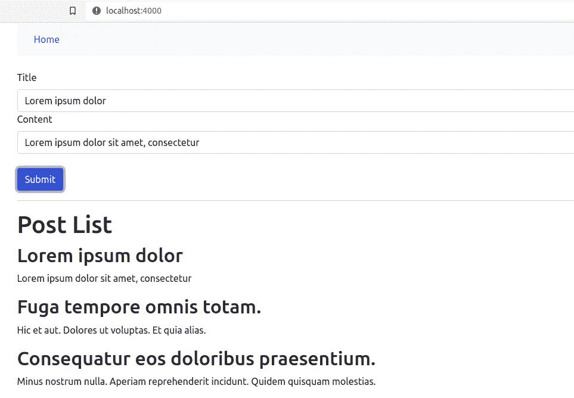

# 使用钩子和类型脚本创建带有 React 前端的 Rails API

> 原文：<https://blog.devgenius.io/create-a-rails-api-with-react-frontend-using-hooks-and-typescript-dcb4e84c3dbf?source=collection_archive---------1----------------------->


[杰弗逊·桑托斯](https://unsplash.com/@jefflssantos?utm_source=medium&utm_medium=referral)在 [Unsplash](https://unsplash.com?utm_source=medium&utm_medium=referral) 上拍摄的照片

在本教程中，我将构建一个 [Rails API 专用应用程序](https://guides.rubyonrails.org/api_app.html)作为后端，React 应用程序作为前端。

此外，为了做出反应，我将应用:

*   [钩子](https://reactjs.org/docs/hooks-intro.html) —允许你使用状态和其他 React 特性，而不用写类。
*   T [ypeScript](https://www.typescriptlang.org/) —有助于通过类型系统及早发现错误，并使 JavaScript 开发更加高效。
*   [反应自举](https://react-bootstrap.github.io/) —为了不要太难过:)

和

*   Axios——一个轻量级的 HTTP 客户端
*   [React Router V6](https://reactrouter.com/)—React JavaScript 库的全功能路由库。
*   [React Hook Form](https://react-hook-form.com/)**—**有助于创建带有易用验证的灵活表单。

我们开始吧！

# 第一步。创建 Rails API

```
rails new back-app --api -T
cd back-app
```

标志`--api`从`ActionController::API`继承`ApplicationController`而不是`ActionController::Base`，提供浏览器应用程序使用的动作控制器模块，并跳过生成我们不需要的视图、助手和资产。

我们将使用 *RSpec* 而不是 *MiniTest* 。命令`-T`是跳过`Minitest::Unit`文件和文件夹的生成。

## 设置 CORS

[CORS](https://en.wikipedia.org/wiki/Cross-origin_resource_sharing) 是一种基于 HTTP 头的安全机制，它定义了谁可以与你的 API 交互。在这篇文章中，为了简单起见，我将允许所有的起源。

将`rack-cors`添加到 Gemfile。

```
gem 'rack-cors'
```

然后捆起来。

```
bundle
```

更新`config/initializers/cors.rb`以允许所有源(*)发出请求。

```
*Rails*.application.config.middleware.insert_before 0, *Rack*::*Cors* do
  allow do
    origins '*'*resource* '*',
      headers: :any,
      methods: [:get, :post, :put, :patch, :delete, :options, :head]
  end
end
```

## 生成帖子的脚手架

为了获得更多的可见性，让我们生成一个框架，迁移数据库，并启动服务器。

```
rails g scaffold Post title:string content:text
rails db:create db:migrate
```

## 更改 REST API 版本

我将使用 [REST API 版本控制](https://www.freecodecamp.org/news/how-to-version-a-rest-api/#:~:text=so%20let's%20recap%3A-,API%20versioning%20is%20the%20practice%20of%20transparently%20managing%20changes%20to,effective%20API%20change%20management%20principles.)。版本控制**帮助我们在 API**中识别出需要的变更时更快地迭代。

*   将`posts_controller.rb`移动到`app/controllers/api/v1/posts_controller.rb`。
*   将`class PostsController < ApplicationController`改为`class Api::V1::PostsController < ApplicationController`。
*   由此改变`create`行动中的帖子位置

```
render json: @post, status: :created, location: @post
```

对此

```
render json: @post, status: :created, location: api_v1_post_path(@post)
```

*   并更新路线。

```
Rails.application.routes.draw do
  namespace :api do
    namespace :v1 do
      resources :posts
    end
  end
  # ...
end
```

要显示路线，输入命令`rails routes --expanded`。

## 数据库播种

为了给帖子生成假数据，我将使用 *faker* gem。

```
gem 'faker'
```

捆起来。

```
bundle
```

将一些伪造数据插入`seeds.rb`。

```
require 'faker'10.times do
  Post.create(
    title: Faker::Lorem.sentence,
    content: Faker::Lorem.paragraph)
end
```

运行命令。

```
rails db:seed
```

并启动服务器

```
rails s
```

# 第二步。创建 React 应用程序

我将使用 TypeScript 模板[创建 React 应用程序](https://create-react-app.dev/)。您可以在 Rails 应用程序的根目录或任何其他地方创建 React 应用程序。

```
npx create-react-app front-app --template typescript
cd front-app
npm install
```

在项目的根目录下创建一个`.env`文件，并在那里输入服务器端口。

```
PORT=4000
```

## **安装 React 引导程序**

运行安装程序。

```
npm i react-bootstrap bootstrap@5.1.3
```

并在`index.tsx`中添加导入库。

```
import 'bootstrap/dist/css/bootstrap.min.css';
```

# 第三步。**配置路由**

路由允许您导航到其他页面。

## 页

首先，在`src/Pages/HomePage.tsx`中创建一个带有`.tsx`扩展的 *Homapage* 组件。

```
export const HomePage = () => {
  return (
    <>
      <h1>Hello World!</h1>
    </>
  )
}
```

创建一些附加页面`src/Pages/NotFoundPage.tsx`。

```
export const NotFoundPage = () => (
  <>
    <h1>Not Found 404</h1>
  </>
)
```

和`src/Pages/AboutPage.tsx`。

```
export const AboutPage = () => (
  <>
    <h1>About me</h1>
    <p>Lorem ipsum dolor sit amet, consectetur adipiscing elit, sed do eiusmod tempor incididunt ut labore et dolore magna aliqua. Ut enim ad minim veniam, quis nostrud exercitation ullamco laboris nisi ut aliquip ex ea commodo consequat. </p>
  </>
)
```

## 反应路由器

现在安装一个 *React 路由器*库。

```
npm i react-router-dom
```

更新`index.tsx`。

```
import React from 'react';
import ReactDOM from 'react-dom';
import { BrowserRouter } from 'react-router-dom'
import './index.css';
import 'bootstrap/dist/css/bootstrap.min.css';
import App from './App';
import reportWebVitals from './reportWebVitals';ReactDOM.render(
  <React.StrictMode>
    <BrowserRouter>
      <App />
    </BrowserRouter>
  </React.StrictMode>,
  document.getElementById('root')
);reportWebVitals();
```

然后更新`App.tsx`。

```
import { Routes, Route, Link } from 'react-router-dom'
import { HomePage } from './Pages/HomePage';
import { AboutPage } from './Pages/AboutPage';
import { NotFoundPage } from './Pages/NotFoundPage';
import { Container, Navbar } from 'react-bootstrap';function App() {
  return (
    <>
      <Container>
        <Navbar expand="lg" variant="light" bg="light">
          <Container>
            <Link className="nav-link" to="/">Home</Link>
            <Link className="nav-link" to="/about">About Me</Link>
          </Container>
        </Navbar><br />

        <Routes>
          <Route path="/" element={<HomePage />} />
          <Route path="/about" element={<AboutPage />} />
          <Route path="*" element={<NotFoundPage />} />
        </Routes>
      </Container>
    </>
  );
}export default App;
```

# 第四步。创建组件

TypeScript 有助于使用接口实现更好的类型检查。

接口是在我们的应用程序中充当契约的结构。它定义了类要遵循的语法，这意味着实现接口的类必然会实现它的所有成员。

## 发布接口

所以，首先我们需要在`src/types/data.tsx`中创建一个 *Post* 接口。

```
export interface IPost {
  id?: number;
  title: string;
  content: string;
}
```

## **岗位组件**

在`src/Posts/Post.tsx`中创建 *Post* 组件。

```
import { IPost } from '../types/data';export const Post = (props: IPost) => (
  <>
    <h2>{props.title}</h2>
    <p>{props.content}</p>
  </>
)
```

## **后列表组件**

为了从服务器输出帖子，我将使用 *PostList* 组件，该组件将在每次迭代中调用 *Post* 组件。

为了向服务器发出请求，我使用了 Axios 库。让我们安装它。

```
npm i axios
```

在`src/Posts/PostList.tsx`中创建*后列表*组件。

这里我应用 [*useState*](https://reactjs.org/docs/hooks-state.html) 来跟踪满足 *IPost* [接口](https://www.typescriptlang.org/docs/handbook/interfaces.html)的帖子的状态，应用 [*useEffect*](https://reactjs.org/docs/hooks-effect.html) 使用 async arrow 函数 *getPosts 从服务器获取帖子。*

函数 *updatePostList* 用于更新包含新帖子的帖子列表。

*后置格式*是我将在下面创建的一个组件。

最后我迭代 Post，用 props 调用子 *Post* 组件。

## 更新主页

将`Homepage.tsx`改为输出岗位。

```
import {PostList} from '../Posts/PostList'export const HomePage = () => (
  <>
    <PostList />
  </>
)
```

## 后置成分

为了便于验证，我将使用 *React 钩子形式*。

首先，安装它。

```
npm i react-hook-form
```

创建`src/posts/PostForm.tsx`。

这里我应用 useState 来保存文章数据:*标题*和*内容。*接下来，我从 React 钩子表单中应用一个 *useForm* 钩子来验证标题和内容表单。然后我创建一个带有输入字段的表单，如果提交后有任何错误，错误将输出到屏幕上。

# 第五步。测试

让我们启动服务器。

```
npm start
```

提交表单后，帖子列表将如下所示。



其他页面。


恭喜你。🎉可以通过添加[*【Redux】*](https://react-redux.js.org/)、更新和删除操作、 [*与 JWT*](https://enlear.academy/how-to-create-a-rails-6-api-with-devise-jwt-46fa35085e85) 的认证等等来修改该应用程序。希望对你理解这些技术有一点帮助。