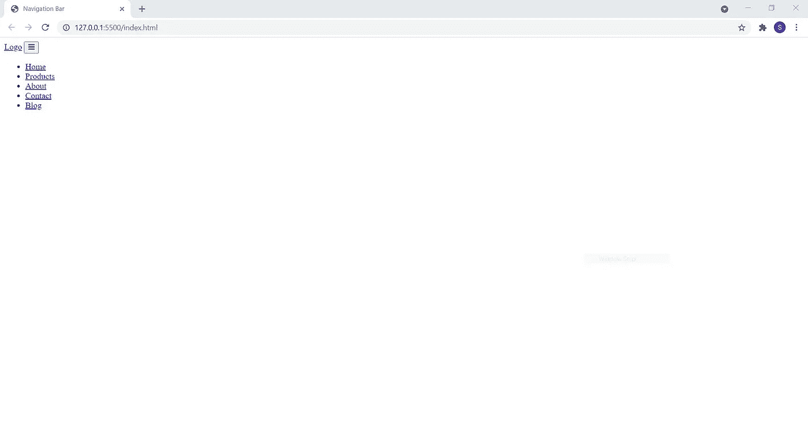
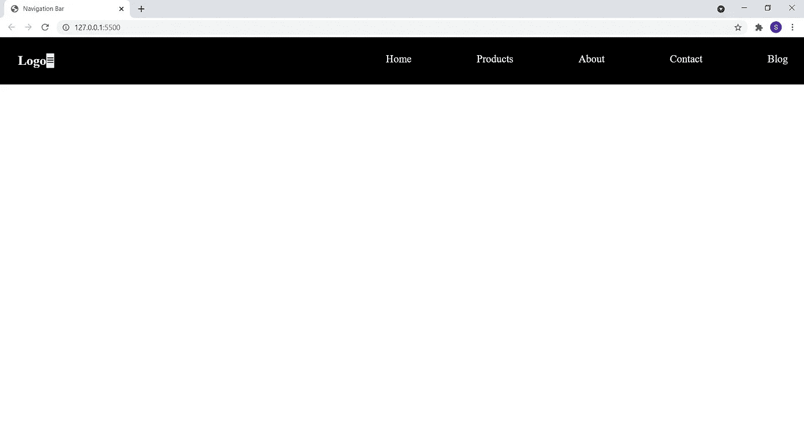

# 用 HTML、CSS 和 JS 创建一个响应式导航条！

> 原文：<https://blog.devgenius.io/create-a-responsive-navigation-bar-in-html-css-and-js-4648ce90fd6c?source=collection_archive---------0----------------------->

[https://unsplash.com/photos/ipARHaxETRk](https://unsplash.com/photos/ipARHaxETRk)

在本文中，我们将创建一个在桌面和移动设备上都可以完全响应的导航栏。

开始之前，让我们看看文件夹结构，

CSS
|——styles . CSS
index.html
app . js

所以现在让我们开始吧，

首先，让我们为导航栏创建一个布局，

因此，让我们首先创建一个 index.html 文件，并开始编写 HTML 代码。在这一点上，我将使用字体牛逼的汉堡菜单图标，我们必须添加它的链接，以包括脚本标签中的图标。

在这里，我还为标签添加了一些类，这样我们以后就可以为那个元素或标签添加 CSS 了。

使用上面的代码，我们的页面将如下所示，

我们的 HTML 页面的布局

现在，让我们添加 CSS 到我们惊人的导航栏！

要添加 CSS，我们首先必须在 HTML 文件中包含样式表，这样它就会反映在我们的网站上。
为此，我们将在 head 标签中包含以下代码行，

> <link rel="”stylesheet”" href="”css/styles.css”">

现在，在 styles.css 文件中，我们将最终设计我们的导航栏

样式后，我们的网站将看起来如下所示，

添加 CSS 后的导航栏

在这里，我们可以看到导航栏中的切换图标，这在更大的屏幕上是看不到的。要隐藏图标，我们可以使用 navbar_toggle 类的 display 属性，并将其设置为 none，如下所示。

> 。navbar_toggle {
> 显示:无；
> }

现在，我们必须让它在移动设备上做出响应。为此，我们将使用媒体查询。那么什么是媒体查询呢？
是 CSS 中使用的一种技术，只有在某些条件为真的情况下，才添加 CSS 属性。

添加媒体查询

> 这里我们将在，
> @media only 屏幕和(max-width : 992px){
> }中添加媒体查询
> 
> 这意味着只有当浏览器窗口小于等于 992 像素时，媒体块中提到的 CSS 属性才会被应用。

在这里，我们隐藏了 main_nav 类，并添加了 show_nav 类，我们将使用它来切换按钮，以使用 javascript 显示导航菜单。

在 show_nav 中，我们将对列进行 flex-direction 操作，这样菜单项就会一个接一个地堆叠起来。

因此，添加媒体查询后，我们的导航栏将如下所示:

移动视图中的导航栏

现在我们的工作差不多完成了，我们只需要添加 javascript 来显示导航菜单。

首先，让我们创建一个 app.js 文件，并将其添加到 index.html 文件的脚本标记中，如下所示，

现在，在 app.js 中，编写以下代码，在这里，我们选择 navbar_toggle 和 main_nav 类，并向其中添加事件侦听器，以便当单击切换图标时它将进行切换。

如果我们单击切换图标，我们的页面将如下所示，

移动设备中的导航栏

这就是我们如何通过添加媒体查询和小 Javascript 来创建一个响应式导航栏。
你可以在这里找到工作代码，[https://responsivenavigationbar.netlify.app/](https://responsivenavigationbar.netlify.app/)

你也可以在 https://github.com/SakshiSawant/NavigationBar 的[查看源代码](https://github.com/SakshiSawant/NavigationBar)