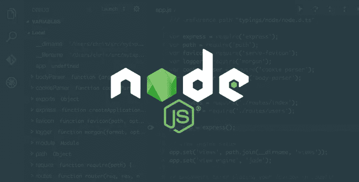

# 用 node.js 在 5 分钟内创建一个 REST API。邮递员测试。

> 原文：<https://blog.devgenius.io/create-a-rest-api-with-node-js-in-5-minutes-bad07591c0d0?source=collection_archive---------1----------------------->

## 这篇文章已被移到:

 [## devdad -编写博客和工作代码

### 嘿德夫斯。在之前的博客中，我解释了 HTTP 一般是如何工作的，以及 HTTPv2 如何优于 HTTPv1。今天我们…

www.devdad.org](https://www.devdad.org/Post?title=HTTPv2ServerImplementationinNodejs90FastServers-628fd1dd3c6e2300040c318c)