# 免费在 Cloudflare 上创建一个无服务器 REST API

> 原文：<https://blog.devgenius.io/create-a-serverless-rest-api-on-cloudflare-for-free-763169ac855b?source=collection_archive---------6----------------------->

## 在本文中，我将向您展示为什么您应该为您的下一个 REST API 项目使用无服务器框架，为什么您应该使用 Cloudflare 来部署您的后端，以及如何完全免费地完成它！

照片由 [NASA](https://unsplash.com/@nasa?utm_source=medium&utm_medium=referral) 在 [Unsplash](https://unsplash.com?utm_source=medium&utm_medium=referral) 上拍摄

# 本教程将涵盖的内容

我将向您展示使用 Cloudflare 的免费 Cloudflare workers 和 KV store 设置无服务器 REST API 的一步一步的过程，包括 CRUD 操作和数据库。

# 你需要什么

您只需创建一个 cloudflare 帐户(不需要信用卡)即可享受免费选项。

*   在这里创建你的账户:[https://dash.cloudflare.com/login](https://dash.cloudflare.com/login)

# 我们开始吧

## 1.创建服务

*   导航到左侧导航栏上的“工作人员”,然后单击“创建服务”
*   为您的服务取一个合适的名称，确保选择了 HTTP handler，然后单击“创建服务”

## 2.建立基础

*   点击“快速编辑”

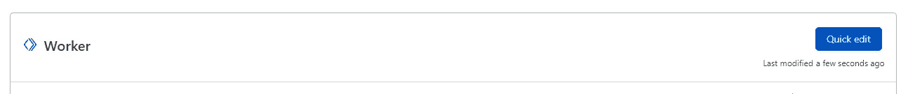

*   您应该会看到一个浏览器编辑器。左边是代码，右边是测试 API 的工具。

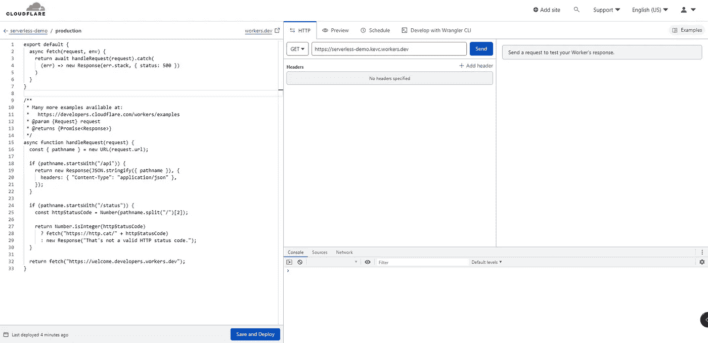

*   在代码的顶部，您应该会看到:

*   将`env`作为参数添加到`handleRequest`中。它现在应该看起来像这样

> 在本教程的后面部分，这是访问我们的数据库所必需的

*   接下来，`handleRequest`函数是我们将拥有 API 逻辑的地方。让我们从删除该函数中的所有内容开始，我们将从头开始。
*   为了创建我们的 CRUD REST API，我们需要区分 GET、POST、PUT 和 DELETE。我们将利用`request`参数中的`method`来确定我们的 API 调用是什么。

*   现在，如果我们单击右侧工具上的“发送”,我们应该会得到一个 200 OK 响应，其主体为“get”。

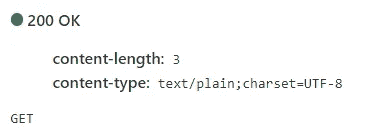

*   如果我们将方法改为 POST，如果我们再次尝试 API 调用，我们应该得到一个 POST 而不是 get。

> 如果 API 没有按预期工作，几秒钟后再试一次。有时更改需要几秒钟才能重新加载。

*   既然我们已经有了区分 4 种 HTTP 方法的方法，让我们将它们放在一个 switch 案例中，以便在调用 API 时执行不同的事情。

*   如果我们再次测试我们的 API 调用，我们应该得到相同的主体，但是响应状态现在应该根据被调用的方法而不同。

> 如果您想知道为什么我们对 GET 和 PUT 使用 200，对 POST 使用 201，对 DELETE 使用 204，这些是不同方法的典型响应代码。(200 表示 OK，201 表示已创建，204 表示无内容)

## 3.设置数据库

我们现在的下一步是创建一个数据库。我们可以利用 Cloudflare 的 KV(键值存储)来存储我们的数据。

*   保存并部署您当前的代码，因为我们稍后将回到它。
*   单击页面左上角的后退按钮，返回您的控制面板。
*   在您员工的仪表板左侧导航栏中，点击“员工”下拉按钮，然后点击 KV

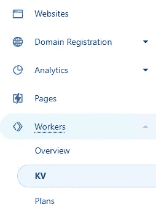

*   点击“创建名称空间”,给你的数据库取一个合适的名字

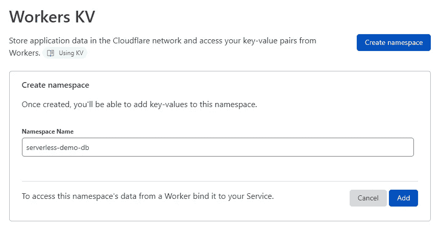

*   回到您员工的仪表板，导航到“设置”选项卡，点击“变量”部分
*   向下滚动到“KV 名称空间绑定”部分，并选择您新创建的 KV 名称空间
*   为您的命名空间提供一个变量名，您将使用它来访问数据。最好是像“DB”这样的缩写

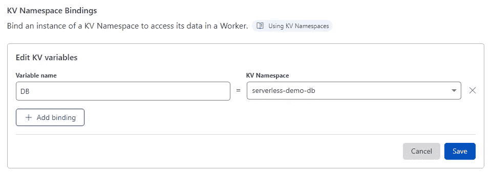

*   点击“保存”，让我们回到我们的代码(工人的仪表板>快速编辑)

## 4.创建 CRUD 操作

回到我们的代码，我们能够通过刚才设置的变量名来访问 KV 名称空间。对于本教程的其余部分，我将使用' DB '来访问我的 KV 名称空间，因为这是我定义的变量名，但它可以是您设置的任何名称。

由于 KV 是一个键值对存储，我们将使用键作为我们的表名(例如“todos”、“users”等)，值作为 JSON 数组(例如[“one”、“two”、“three”])。这意味着在我们的 KV 名称空间中，我们可以为更复杂的应用程序提供多个表。

让我们从让我们的 API 为一组用户执行 CRUD 操作开始。

## 4.1.发布请求

在我们的 POST 请求中，我们希望接收一个包含用户数据的有效 JSON 负载，并将其存储在“users”键值对中。

*   让我们创建一个新的函数来处理 post 请求:

*   为了在 POST 请求中获得 JSON 有效负载，我们可以使用`const payload = await request.json()`
*   接下来，我们将获取“users”键的值，将有效负载附加到“users”数据的末尾，并将数据保存回“users”键。我们可以使用`await env.DB.get(key)`和`await env.DB.put(key, value)`与我们的数据库交互。注意，由于“用户”数据存储为字符串，我们还必须执行一些`JSON.stringify / JSON.parse`操作
*   post 的最终代码如下:

> 注意，我已经添加了一个额外的检查，如果键“users”不存在，`dataStr`将为空，我们希望将它设置为一个空数组，以便可以推送和设置新的有效载荷，从而将数据初始化为一个数组。

*   现在，让我们更新开关的情况来调用这个函数

## 4.2 获取请求

在我们的 GET 请求中，让我们从“users”键中检索 JSON 数组并返回它。

*   让我们创建一个新函数来处理 GET 请求:

*   这个逻辑实际上已经在`handlePost`函数中实现了，所以让我们重用它们

*   让我们更新开关的情况

现在我们有了创建新用户并查看他们的方法。让我们测试一下

*   在右边，将 HTTP 方法改为 POST，让我们定义我们的有效负载`{"id": 1, "firstname": "John", "lastname": "Smith"}`
*   当我们发送请求时，我们应该看到:

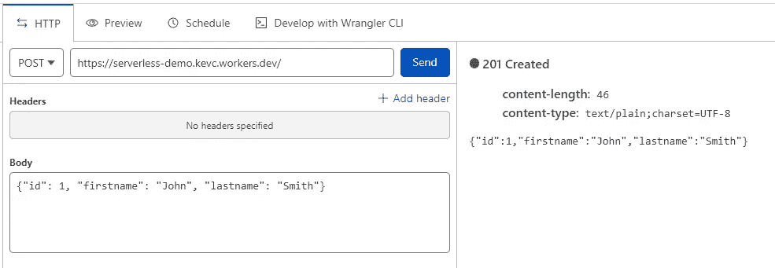

*   正如所料，我们的 POST api 返回了我们发送的有效载荷，并以 201 作为响应。
*   现在，让我们尝试 GET 请求，看看我们的新用户是否已被保存。
*   将 HTTP 方法更改为 GET，然后单击“Send ”,我们应该会看到以下内容:

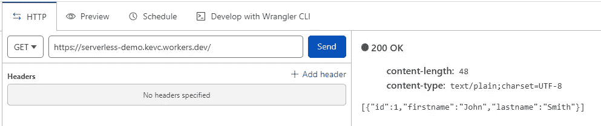

*   万岁！我们的 GET 方法在一个数组中返回我们新添加的用户。
*   现在尝试再添加一个用户，看看它是否被保存。

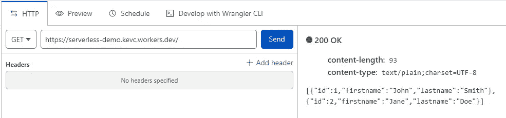

*   厉害！现在我们可以创建和读取我们的 API

在这个阶段，您的代码应该如下所示

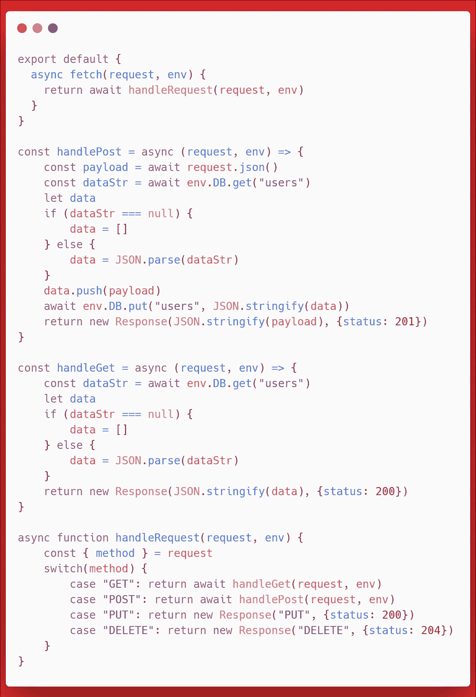

## 4.3.买一个

在继续上传和删除之前，我们需要首先找到一种方法来查询 DB 中的单个对象。这样我们就可以在数组中获取一个对象，更新和删除它。

为此，我们将向我们的 API 调用(例如`https://serverless-demo.kevc.workers.dev/?id=1`)添加一个查询，并使用它来查找我们的对象。

*   让我们修改我们的`handleRequest`函数来获得 id。
*   在`const { method } = request`中，添加`url`作为我们想从请求对象中获取的附加对象。(`const { method, url } = request`)
*   使用`url`，添加`const { searchParams } = new URL(url)`来获得 URL 的查询。
*   要获得 id，我们可以使用`const id = searchParams.get('id')`。
*   您的前 3 行`handleRequest`现在应该看起来像这样

*   有了这个`id`，让我们把它作为第三个参数传递给我们的`handleGet`函数。`case "GET": return await handleGet(request, env, id)`
*   在`handleGet`函数中，我们希望返回与 id 匹配的特定项目，如果没有提供 id，我们希望返回全部，如果找不到 id，我们希望返回 404 not found。

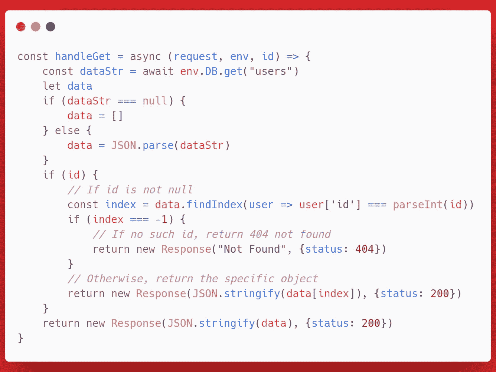

*   现在，如果您尝试 id 为(`https://serverless-demo.kevc.workers.dev/?id=1`)的 GET 请求，您应该得到单个对象。

## 4.4.上传请求

*   对于 PUT 请求，我们需要一个 ID 和一个有效负载，我们将使用它来覆盖数据库中的匹配对象。
*   所以我们需要来自`searchParams`的 ID，来自`request.json()`的 json 有效负载
*   我们获取“users”JSON 数组，找到与 ID 匹配的相应对象，用有效负载中的对象替换该对象，保存更改，并将有效负载返回给用户。
*   `handlePut`函数应该是这样的:

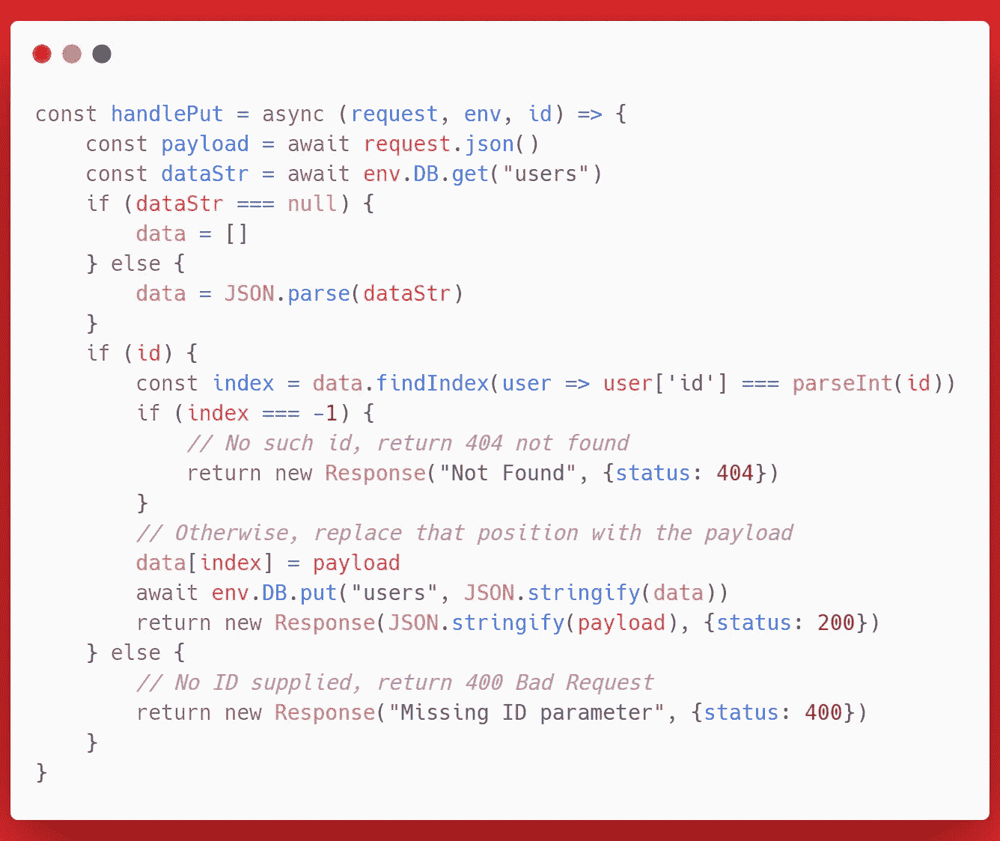

## 4.5.删除请求

*   对于 delete，它类似于 PUT，但是不是替换，而是使用`splice`方法从数组中删除该元素，并返回拼接的元素作为响应

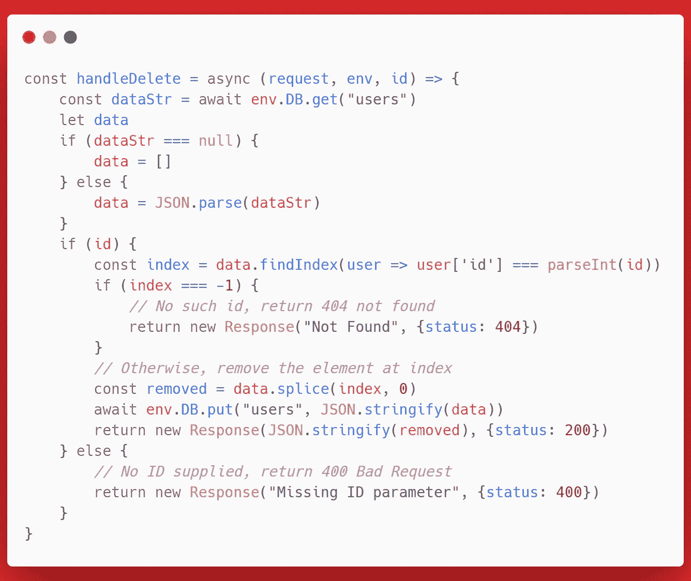

*   现在，您应该能够通过使用查询参数(`https://serverless-demo.kevc.workers.dev/?id=1`)来删除使用 ID 作为标识符的元素了

# 最终代码

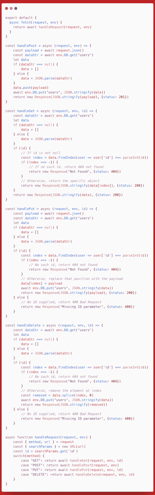

正如你所看到的，有很多地方代码是重复的，但是我特意把它留在这里，这样你就能理解函数的逻辑。下面是更优化的代码版本:

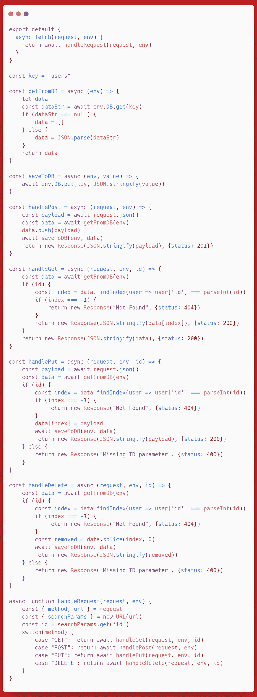

我希望你已经从本教程中学到了一些东西，如果你面临任何问题，请随时发表评论，并让我知道你下一步想学什么！