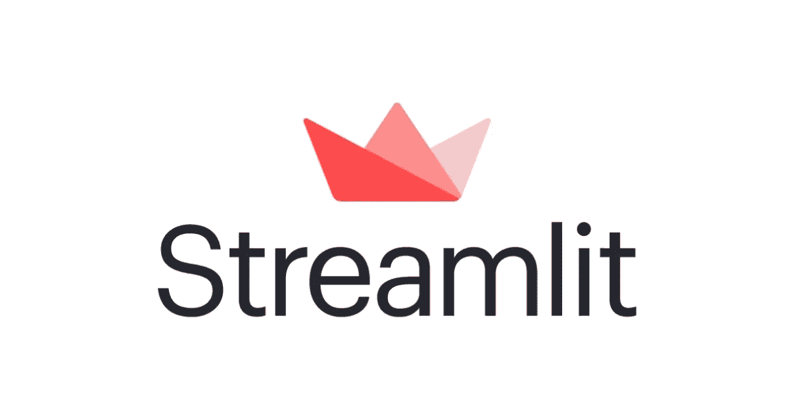
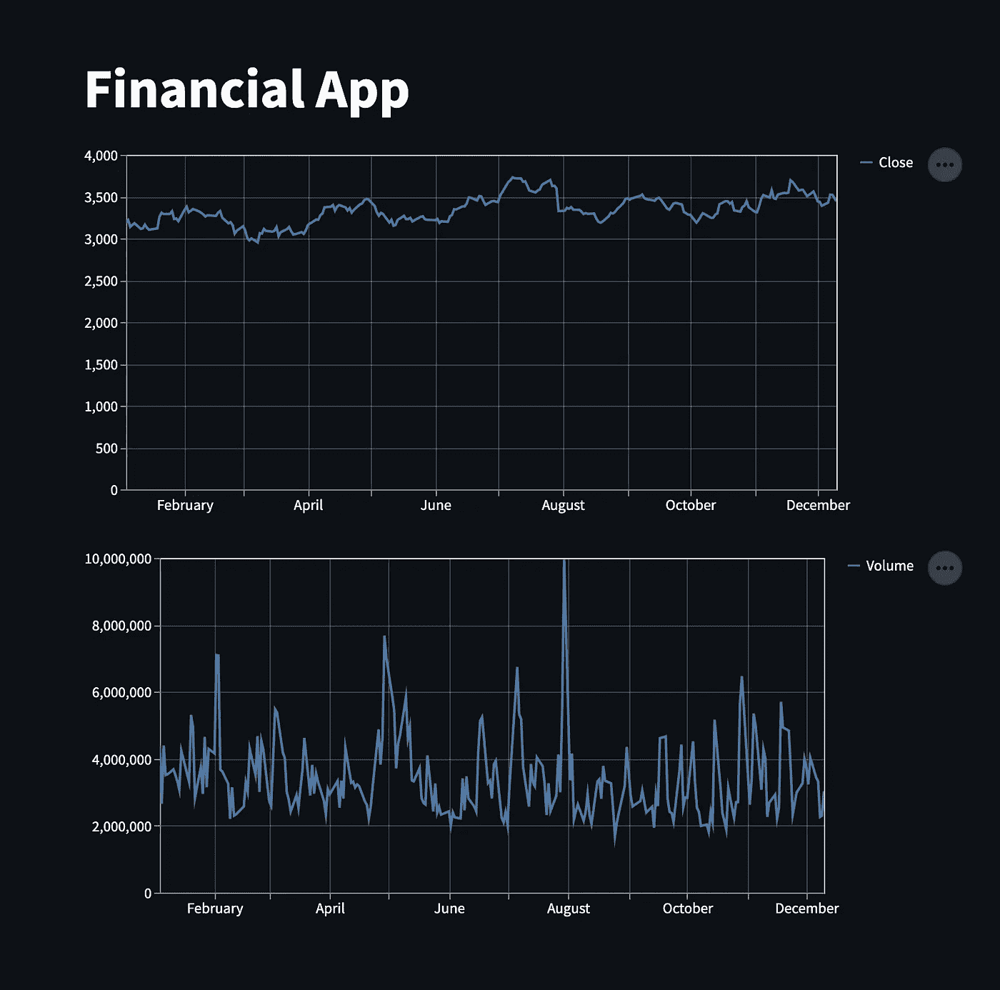

# 使用 Streamlit 创建简单的数据应用程序

> 原文：<https://blog.devgenius.io/create-a-simple-data-app-with-streamlit-3aebea86e1f9?source=collection_archive---------8----------------------->



你有没有想过用不到 15 分钟的时间创建一个数据 app？有了 Steamlit lib，一切皆有可能！

在这篇文章中，我将教你如何使用金融市场数据快速创建一个数据可视化应用程序，并且只用 9 行代码！🚀

我们需要什么才能如此快速地创建这个应用程序？我将列出我们的步骤:

*   创建新目录
*   创建一个`virtualenv`
*   安装我们的库
*   编码
*   快乐😍

# **创建新目录**

首先，让我们快速创建我们的存储库并创建我们的 python 脚本，如果您使用的是 Linux/macOS，只需复制并粘贴以下命令:

```
mkdir financial-app-streamlit touch financial-app-streamlit/financial_app.py
```

简单又容易，随着我们的资源库的创建，让我们进入教程中“最难”的部分！

# 创建一个`virtualenv`

这里我们将创建我们的`virtualen`来保存将要使用的库。为此，我们将使用下面的命令:

```
virtualenv -p python3 env
```

现在我们需要激活`virtualenv`:

```
source env/bin/activate
```

厉害！我们已经完成了两个步骤，相信我，你会花更多的时间阅读这篇文章，而不是查看你的数据。

# 安装我们的库

对于本教程，我们将只使用两个库，它们是:

*   Streamlit(支持数据可视化的库)
*   Yfinance(由 Yahoo 维护的 Lib，允许我们获得金融市场股票的历史数据)

为此，只需运行以下命令行:

```
pip install streamlit yfinance
```

最后，我们所有的环境都准备好了，让我们进入重要的部分！编码…

# 编码…

为此，让我们编写下面这段庞大的代码，看看会发生什么神奇的事情:

搞定了。你的 app 已经做好了，现在缺少最重要的部分，让我们来预览一下 app 吧！

为此，只需运行以下命令:

```
streamlit run financial_app.py
```

您的命令的输出将是:

```
You can now view your Streamlit app in your browser.    
   Local URL: http://localhost:8501   
   Network URL: http://***.***.*.**:***
```

好，我做了所有的步骤，我的应用程序看起来像什么？



# 开心点！😍

现在你已经快速而疯狂地完成了你的应用程序，请在评论中让我知道这个过程是如何进行的！给大家一个大大的拥抱，希望你们喜欢！

[github 上的回购](https://github.com/lucasfonmiranda/medium-article-steamlit)