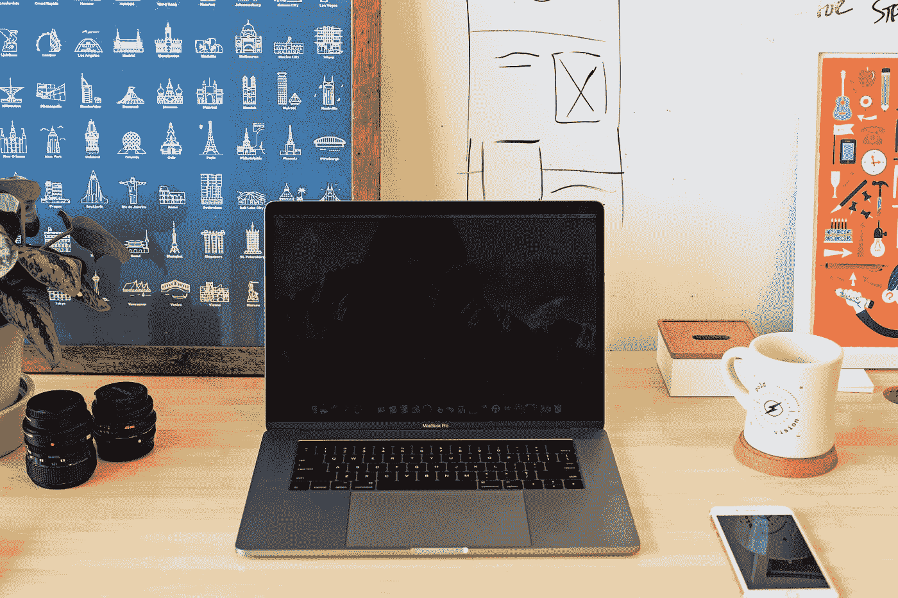

# 使用 Visx 库创建一个简单的 React 白板

> 原文：<https://blog.devgenius.io/create-a-simple-react-whiteboard-with-the-visx-library-b7b65c71c7d9?source=collection_archive---------1----------------------->



Mia Baker 在 [Unsplash](https://unsplash.com?utm_source=medium&utm_medium=referral) 拍摄的照片

Visx 是一个库，让我们可以轻松地将图形添加到 React 应用程序中。

在本文中，我们将了解如何使用它在 React 应用程序中添加一个简单的白板。

# 安装所需的软件包

我们必须安装一些模块。

首先，我们运行:

```
npm i @visx/curve @visx/drag @visx/gradient @visx/responsive @visx/shape
```

安装软件包。

# 创建白板

我们可以通过添加模块提供的项目来创建白板。

为此，我们写道:

```
import React, { useCallback, useState } from "react";
import { LinePath } from "@visx/shape";
import { useDrag } from "@visx/drag";
import { curveBasis } from "@visx/curve";
import { LinearGradient } from "@visx/gradient";function Example({ data = [], width, height }) {
  const [lines, setLines] = useState(data);
  const onDragStart = useCallback(
    (currDrag) => {
      setLines((currLines) => [
        ...currLines,
        [{ x: currDrag.x, y: currDrag.y }]
      ]);
    },
    [setLines]
  );
  const onDragMove = useCallback(
    (currDrag) => {
      setLines((currLines) => {
        const nextLines = [...currLines];
        const newPoint = {
          x: currDrag.x + currDrag.dx,
          y: currDrag.y + currDrag.dy
        };
        const lastIndex = nextLines.length - 1;
        nextLines[lastIndex] = [...(nextLines[lastIndex] || []), newPoint];
        return nextLines;
      });
    },
    [setLines]
  );
  const {
    x = 0,
    y = 0,
    dx,
    dy,
    isDragging,
    dragStart,
    dragEnd,
    dragMove
  } = useDrag({
    onDragStart,
    onDragMove,
    resetOnStart: true
  }); return width < 10 ? null : (
    <div className="DragII" style={{ touchAction: "none" }}>
      <svg width={width} height={height}>
        <LinearGradient id="stroke" from="#ff614e" to="#ffdc64" />
        <rect fill="#04002b" width={width} height={height} rx={14} />
        {lines.map((line, i) => (
          <LinePath
            key={`line-${i}`}
            fill="transparent"
            stroke="url(#stroke)"
            strokeWidth={3}
            data={line}
            curve={curveBasis}
            x={(d) => d.x}
            y={(d) => d.y}
          />
        ))} <g>
          {isDragging && (
            <rect
              width={width}
              height={height}
              onMouseMove={dragMove}
              onMouseUp={dragEnd}
              fill="transparent"
            />
          )}
          {isDragging && (
            <g>
              <rect
                fill="white"
                width={8}
                height={8}
                x={x + dx - 4}
                y={y + dy - 4}
                pointerEvents="none"
              />
              <circle
                cx={x}
                cy={y}
                r={4}
                fill="transparent"
                stroke="white"
                pointerEvents="none"
              />
            </g>
          )}
          <rect
            fill="transparent"
            width={width}
            height={height}
            onMouseDown={dragStart}
            onMouseUp={isDragging ? dragEnd : undefined}
            onMouseMove={isDragging ? dragMove : undefined}
            onTouchStart={dragStart}
            onTouchEnd={isDragging ? dragEnd : undefined}
            onTouchMove={isDragging ? dragMove : undefined}
          />
        </g>
      </svg>
      <style jsx>{`
        .DragII {
          display: flex;
          flex-direction: column;
          user-select: none;
        } svg {
          margin: 1rem 0;
          cursor: crosshair;
        } .deets {
          display: flex;
          flex-direction: row;
          font-size: 12px;
        }
        .deets > div {
          margin: 0.25rem;
        }
      `}</style>
    </div>
  );
}export default function App() {
  return (
    <div className="App">
      <Example width={500} height={300} />
    </div>
  );
}
```

在`Example`组件中，我们有白板。

我们有`lines`状态来跟踪这些行。

`lines`数组由`onDragStart`函数设置。

每当我们开始拖动鼠标，我们添加到`lines`数组。

这条线从鼠标的 x 和 y 坐标开始。

`onDragMove`事件处理函数让我们根据鼠标的坐标添加线条。

我们将这两个函数传递给`useDrag`钩子，让我们在拖动时画线。

在`return`语句中，我们通过调用`lines`数组上的`map`来呈现`LinePath`。

`data`被传入`line`函数来渲染该行。

当`isDragging`为`true`时，也就是我们拖动鼠标的时候，就会显示`circle`来渲染标记。

`rect`拖动时绘制一个透明矩形。

标签有我们想要为白板设置的样式。

# 结论

借助 Visx 库，我们可以在 React 应用中轻松创建一个简单的白板。