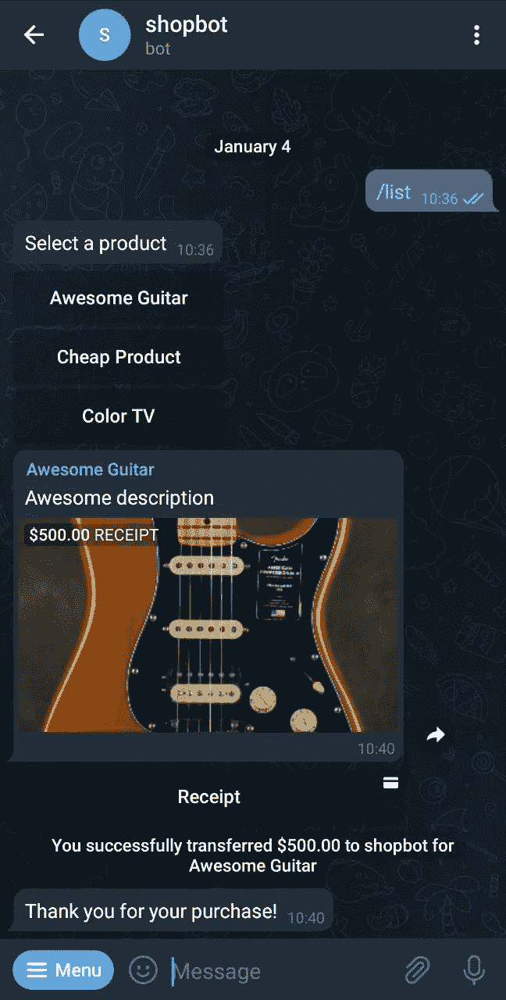

# 用 NodeJS 创建一个简单的电报电子商务

> 原文：<https://blog.devgenius.io/create-a-simple-telegram-e-commerce-with-nodejs-b43f5ac36dc4?source=collection_archive---------4----------------------->


学分:pexels.com

聊天机器人的兴起迅速让我们能够以创新的方式与用户互动。

事实证明，有了 Telegram，我们甚至可以在聊天中直接销售商品！

**是不是*爽*？**

那么，为什么不在 Telegram 上创建一个小店，让人们能够通过与机器人互动来购买我们的产品呢？

**注意:目前，电报支付仅在安卓系统上可用。希望 iOS 的情况会很快改变。**

我们开始吧！

# 1.创造我们的机器人

打开 Telegram 找到@BotFather bot，然后发出`/newbot`命令。


创建新机器人

选择你喜欢的名字和用户名并确认。BotFather 会给你一个访问令牌，我们用它来调用电报 API。

让我们也通过调用@BotFather 上的`/mybots`命令来启用支付，选择您刚刚创建的 bot 并单击**支付**。从列表中选择**条带**，然后**连接条带测试。**


此时，Telegram 将在您的浏览器上打开一个页面，允许您连接 Stripe。登录(如果您没有 Stripe 帐户，则注册)并确认操作。

现在我们有了一个连接到 Stripe 测试环境的电报机器人，我们将使用它来执行我们的测试。BotFather 会回复一个支付令牌，留着以后用。

# 2.准备数据库

我们将使用 SQLite 来保存我们想要销售的产品列表。所以让我们用一些虚拟产品初始化我们的数据库。创建一个文件夹`db`，在里面打开一个名为`schema.sql`的文件:

```
CREATE TABLE items (
  id INTEGER PRIMARY KEY AUTOINCREMENT,
  name TEXT NOT NULL,
  price INTEGER,
  created_at TIMESTAMP NOT NULL DEFAULT CURRENT_TIMESTAMP
);
```

现在，让我们用一些假冒产品播种它(文件`db/seed.sql`):

```
INSERT INTO items (name, price)
VALUES
('Awesome Guitar', '500'),
('Cheap Product', '12'),
('Color TV', '800')
```

最后，应用模式并播种数据库:

```
cd db
sqlite3 database.sqlite < schema.sql
sqlite3 database.sqlite < seed.sql
```

搞定了。

# 2.机器人

我们现在可以创建我们的机器人。我们将主要使用三个 NodeJS 包:

*   ExpressJS :创建我们的服务器来托管我们的机器人
*   节点-电报-机器人-应用编程接口:管理我们的机器人和响应购买
*   从我们的数据库中读取产品

因此，让我们首先初始化我们的项目并安装我们的依赖项:

```
yarn init
yarn add expressjs node-telegram-bot-api sqlite3
```

在项目的根目录下创建一个`index.js`文件，用您喜欢的 JS 编辑器打开它。

让我们启动并运行这些库:

```
const express = require('express')
const sqlite3 = require('sqlite3')
const TelegramBot = require('node-telegram-bot-api')const port = process.env.PORT || 3000// init express
const app = express()// init bot
const BOT_TOKEN = 'XXXXXXXXXX:XXXXXXXXXXXXXXXXXXXXXXXXXXXXXXXXXXX'
const PAYMENT_TOKEN = 'XXXXXXXXX:TEST:XXXXXXXXXXXXXXXX'
const telegramBot = new TelegramBot(BOT_TOKEN, { polling: true })// init db
const db = new sqlite3.Database('./db/database.sqlite')
```

这里很简单:我们简单地初始化了 express、我们的电报机器人(提供令牌)和我们的数据库。

让我们设置几个错误回调:

```
// set error callbacks
telegramBot.on('error', msg => console.log(`[bot] error:`, msg))
telegramBot.on('polling_error', msg => console.log(`[bot] polling_error:`, msg))
telegramBot.on('webhook_error', msg => console.log(`[bot] webhook_error:`, msg))
```

我们现在指示我们的机器人响应`/list`命令，以我们产品的完整列表作为响应:

```
// set command
telegramBot.setMyCommands([{ command: 'list', description: 'Show all products' }])// product list
telegramBot.onText(/\/list/, async (msg, match) => {
  db.all('SELECT * FROM items', [], (err, items) => {
    if (err) {
      console.log('[bot] list items error:', err)
      return
    } try {
      telegramBot.sendMessage(msg.chat.id, 'Select a product', {
        reply_markup: {
          inline_keyboard: [
            ...items.map(p => [{ text: p.name, callback_data: p.id }])
          ]
        }
      })
    } catch (err) {
      telegramBot.sendMessage(msg.chat.id, 'Ops, there was an error!')
    }
  })
})
```

让我们来分解一下:

*   我们首先调用`setMyCommands`，以便 Telegram 可以显示一个漂亮的菜单，让您的客户可以轻松地发出`/list`命令。
*   然后，我们指示我们的机器人对`/list`命令做出反应，首先从数据库中检索所有产品，并用购买它们的按钮列表做出响应

您的用户将会得到如下提示:


产品列表

我们现在必须在用户选择他想要的产品后给用户发送一张发票:

```
// product selection
telegramBot.on('callback_query', async (query) => {
  console.log('[bot] query', query) // retrieve product
  db.get(`SELECT * FROM items WHERE id = ${query.data}`, [], (err, item) => {
    if (err) {
      console.log('[bot] find item error:', err)
      return
    }telegramBot.sendInvoice(
      query.message.chat.id,   // Telegram chat ID
      item.name,               // item Name
      'Awesome description',   // item description
      'payload',               // payload (needed for internal processes, such as creating orders on our db)
      PAYMENT_TOKEN,           // the payment token provided by BotFather after connecting Stripe
      'purchase_deep_linking', // parameter for deep linking (not used in this tutorial)
      'USD',                   // currency
      [{ label: item.name, amount: item.price }], // label shown to the customer
      { photo_url: '[https://placekitten.com/200/300'](https://placekitten.com/200/300'), need_shipping_address: true }) // photo and require shipping info
  })
})
```

如图所示，我们拦截了由用户项目选择触发的`callback_query`函数(由我们的电报机器人调用)。我们只是通过`sendInvoice`传递所有需要的信息来做出反应。

为了清楚起见，我描述了每一个参数，但是应该很简单。

Telegram APIs 允许我们拦截预结帐阶段(万一我们需要在数据库中存储任何信息，或者我们需要检查产品的可用性)。在这种情况下，我们只需调用`answerPreCheckoutQuery`函数来完成支付:

```
// payment callbacks
telegramBot.on('pre_checkout_query', (query) => {
  console.log(`[bot] pre checkout`)
  console.log(query)telegramBot.answerPreCheckoutQuery(query.id, true)
})
```

我们现在可以通过感谢用户的购买来结束支付过程:

```
telegramBot.on('successful_payment', (msg) => {
  console.log(`[bot] successful payment`)
  console.log('Successful Payment', msg)telegramBot.sendMessage(msg.chat.id, 'Thank you for your purchase!')
})
```

最后但同样重要的是，让我们启动我们的 Express 服务器:

```
app.listen(port, () => console.log(`Telegram ShopBot listening at [http://localhost:${port}`](http://localhost:${port}`)))
```

# 4.测试！

1.  打开电报，通过搜索用户名找到你的机器人
2.  发出`/list`命令显示产品列表
3.  选择您想要的订单(虚拟！)购买
4.  提供 4242 4242 4242 4242 作为测试信用卡
5.  插入你的(假的！)运输详情
6.  确认(假的！)购买！

您应该会得到如下提示:



你可以在我的 [GitHub repo](https://github.com/Mikepicker/blog_telegram_shop) 上找到所有代码。

# 总结

创建一个电报机器人不仅有用，而且有趣，非常简单！

您可以通过添加受保护的命令(例如，只能从您的 Telegram 用户名调用)来更新您的产品，或将其用作您的电子商务的附加组件，从而扩展本简易指南。

可能性几乎是无限的！

**欢迎在评论区留下你的爱和反馈。**

# 谢谢大家！