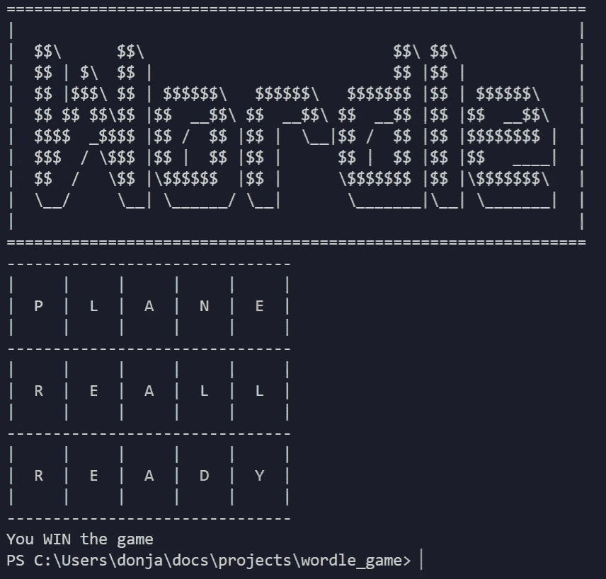

# 如何用 C++构建一个简单的 Wordle 游戏控制台应用程序:一步一步的指南

> 原文：<https://blog.devgenius.io/create-a-simple-wordle-console-game-using-c-9dfd3c3522b0?source=collection_archive---------4----------------------->

沃尔多是什么？

Wordle 是一款基于网络的文字游戏，由威尔士软件工程师 Josh Wardle 创建和开发，自 2022 年以来由纽约时报公司拥有和发布。来源[维基百科](https://en.wikipedia.org/wiki/Wordle)


照片由[尼尔斯·许内尔弗斯特](https://unsplash.com/@druemdach?utm_source=medium&utm_medium=referral)在 [Unsplash](https://unsplash.com?utm_source=medium&utm_medium=referral) 拍摄

首先，创建一个带有所有必要头文件的 c++框架文件。(main.cpp)

```
*#include* <iostream>
*#include* <vector>
*#include* <string>
*#include* <algorithm>
*#include* <cctype>
*#include* <Windows.h>int main(int, char **)
{
    *return* 0;
}
```

声明一些常量。

```
const int WORD_LENGTH = 5;
const int NOT_MATCH = 0;
const int PARTIAL_MATCH = 1;
const int MATCH = 2;
```

创建一个函数来生成目标单词。

```
std::string getRandomWord()
{
 *// TODO fetch random word from API (e.g. WordsAPI)
    return* "ready";
}
```

在`main()`函数中创建一个主游戏循环。并从 stdin 请求输入。将输入字符串推入一个向量。

```
int numberOfTries = 6;
std::vector<std::string> tries(numberOfTries);
std::vector<std::vector<int>> matches(numberOfTries, std::vector<int>(WORD_LENGTH));
std::string targetWord = getRandomWord();toUpperCase(targetWord);std::string input;
int currentTry = 0;*while* (currentTry < numberOfTries)
{
    *do* {
        std::cout << "Please enter your guess (word length must be " + std::to_string(WORD_LENGTH) + ") or type Q to quit: ";
        std::getline(std::cin, input);
        toUpperCase(input);
    } *while* (input != "Q" && !isValid(input)); *if* (input == "Q")
    {
        std::cout << "Quit game" << std::endl;
        *break*;
    } tries[currentTry] = input;
    currentTry++;
}
```

创建一个将输入转换成大写的方法，这样用户可以在任何情况下键入单词。

```
void toUpperCase(std::string &input)
{
    std::transform(input.begin(), input.end(), input.begin(), [](unsigned char c)
    { *return* std::toupper(c); });
}
```

将单词打印到控制台

```
void printWordle(std::vector<std::string> tries, std::vector<std::vector<int>> matches, int currentTry)
{
    system("cls");
    std::cout << "=================================================================" << std::endl;
    std::cout << "|                                                               |" << std::endl;
    std::cout << "|   $$\\      $$\\                           $$\\ $$\\   |" << std::endl;
    std::cout << "|   $$ | $\\  $$ |                          $$ |$$ |             |" << std::endl;
    std::cout << "|   $$ |$$$\\ $$ | $$$$$$\\   $$$$$$\\   $$$$$$$ |$$ | $$$$$$\\     |" << std::endl;
    std::cout << "|   $$ $$ $$\\$$ |$$  __$$\\ $$  __$$\\ $$  __$$ |$$ |$$  __$$\\    |" << std::endl;
    std::cout << "|   $$$$  _$$$$ |$$ /  $$ |$$ |  \\__|$$ /  $$ |$$ |$$$$$$$$ |   |" << std::endl;
    std::cout << "|   $$$  / \\$$$ |$$ |  $$ |$$ |      $$ |  $$ |$$ |$$   ____|   |" << std::endl;
    std::cout << "|   $$  /   \\$$ |\\$$$$$$  |$$ |      \\$$$$$$$ |$$ |\\$$$$$$$\\    |" << std::endl;
    std::cout << "|   \\__/     \\__| \\______/ \\__|       \\_______|\\__| \\_______|   |" << std::endl;
    std::cout << "|                                                               |" << std::endl;
    std::cout << "=================================================================" << std::endl; *for* (int i = 0; i <= currentTry && i < tries.size(); i++)
    {
        std::string separator = "-";
        std::string padding = "|";
        std::string text = "|"; *for* (int j = 0; j < tries[i].length(); j++)
        {
            separator += "------";
            padding += "     |";
            char value = std::toupper(tries[i][j]);
            text += "  "; *if* (matches[i][j] == PARTIAL_MATCH)
            {
                text += "\033[33m";
            }
            *else* *if* (matches[i][j] == MATCH)
            {
                text += "\033[32m";
            } text += value; *if* (matches[i][j] == PARTIAL_MATCH || matches[i][j] == MATCH)
            {
                text += "\033[0m";
            } text += "  |";
        } *if* (i == 0)
        { 
            std::cout << separator << std::endl;
        } std::cout << padding << std::endl;
        std::cout << text << std::endl;
        std::cout << padding << std::endl; 
        std::cout << separator << std::endl;
    }
}
```

验证用户输入

```
bool isValid(std::string word)
{
 *// TODO check word correctness from API (e.g. WordsAPI)
    return* word.length() == WORD_LENGTH && word.find_first_not_of("ABCDEFGHIJKLMNOPQRSTUVWXYZ") == std::string::npos;
}
```

用目标单词标记用户输入的匹配项

```
void markMatch(std::vector<std::vector<int>> &matches, int tryIndex, std::string target, std::string guess)
{
    *for* (int i = 0; i < guess.length(); i++)
    {
        matches[tryIndex][i] = NOT_MATCH;
    } *for* (int j = 0; j < guess.length(); j++)
    {
        *for* (int i = 0; i < target.length(); i++)
        {
            *if* (guess[j] == target[i])
            {
                *if* (i == j)
                {
                    matches[tryIndex][j] = MATCH;
                   *break*;
                }
                *else* {
                    matches[tryIndex][j] = PARTIAL_MATCH;
                }
            }
        }
    }
}
```

并添加方法来检查单词是否全部匹配

```
bool isAllMatch(std::string target, std::string guess)
{
    *for* (int i = 0; i < guess.length(); i++)
    {
        *if* (guess[i] != target[i])
 *return* false;
    } *return* true;
}
```

更新`main()`方法来标记匹配并打印 wordle。并检查游戏是否结束。

```
markMatch(matches, currentTry, targetWord, input);printWordle(tries, matches, currentTry);*if* (isAllMatch(targetWord, input))
{
    std::cout << "Found the word" << std::endl;
    *break*;
}
*else* *if* (currentTry == numberOfTries)
{
    std::cout << "You didn't find the word" << std::endl;
}
```

现在如果编译并运行 main.cpp 文件

```
g++ -o wordle main.cpp# if you on Windows
.\wordle.exe# if you on linux
./wordle.out
```



可以看看我的 YouTube 频道[***dondevlife***](https://www.youtube.com/channel/UCcsUlEkFvF8J3fIQPoxvwHg)，我在那里记录了整个编码过程。